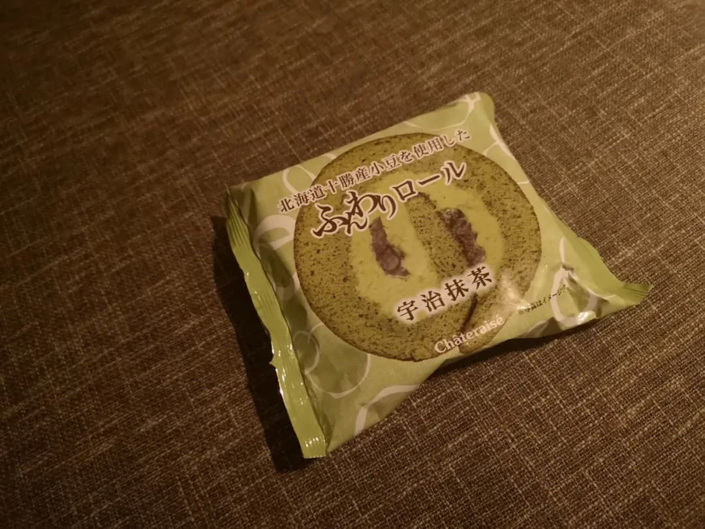
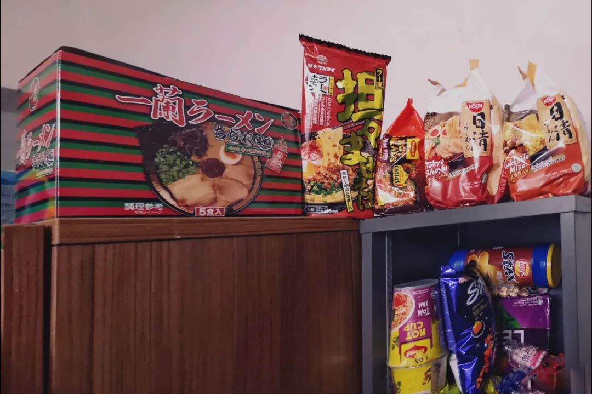
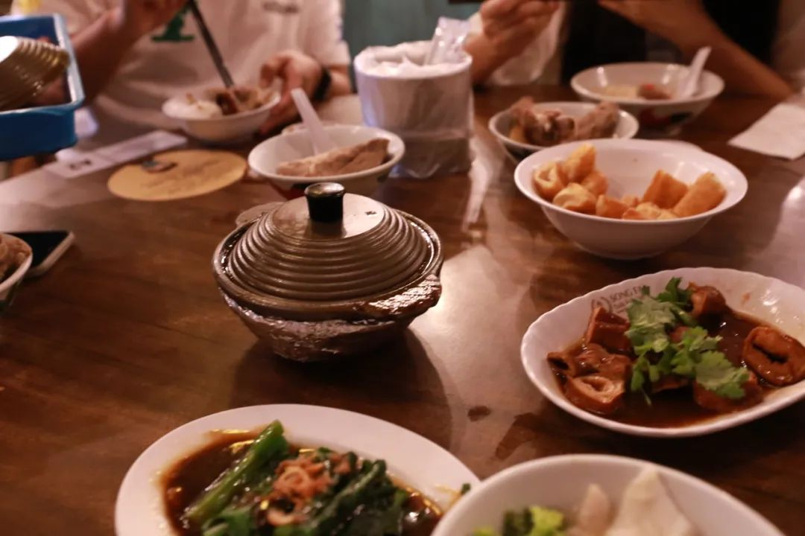
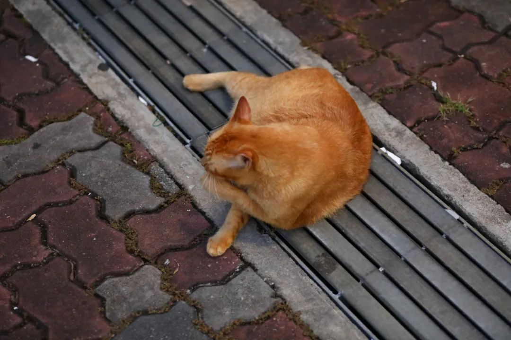
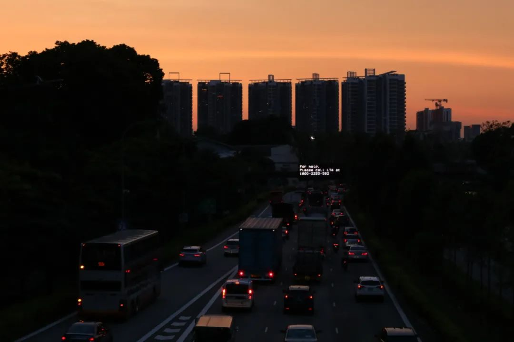

‍

> 本文是张衔瑜第 164 篇推文 共计 1036 个字， 42 张图

> 所有的人不管能力如何，都不得不在同一个筛子上过来过去，统统经过许许多多预备性的小小实习或训练，从而浪费了自己的青春，使自己的想象力消失。因此，他们不再认为自己有能力充分享用他们有望得到的好处了，而他们终于有能力做一番大事业时，则已经失去了兴致。 在人们不断忙于私人生活的琐碎小事当中，使奋进之心失去其推动作用和崇高目标；人们的激情既没有昂扬又没有低落，结果使社会一天一天地走向看来十分安宁但缺乏大志的状态。

下次换一个吐
