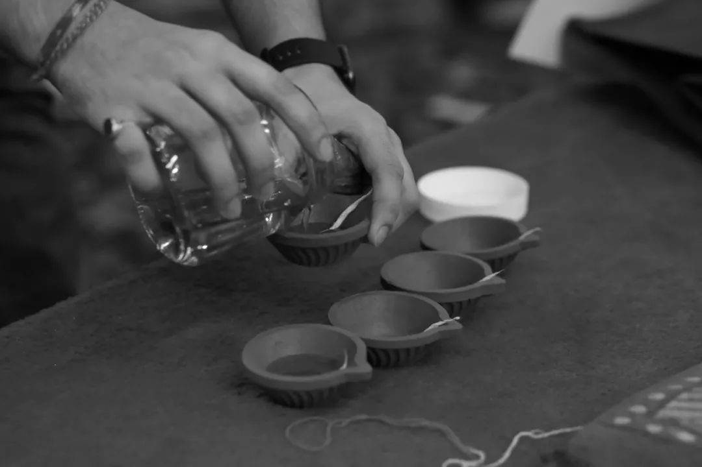

> 本文是张衔瑜第 170 篇推文 共计 4224 个字， 50 张图

本文是张衔瑜第 170 篇推文

共计 4224 个字， 50 张图

小印度 Little India ，是新加坡的一片印度人聚居区。下午六点，我们获准进入 Shree Lakshmi Narayan Temple 里进行拍摄，这是一座吠陀印度教的神庙，作为印度立法中屠妖节新年庆典时重要的礼拜场所。

牧师在教众的眉心之间，用手指蘸着朱砂向上一挑，留下一道像杨戬第三只眼的开合痕迹。来自印度北方的室友告诉我说，这被认为是印度教各种仪式中，可以帮助人进入冥想沉思Meditation状态的一种印记。少许，礼拜开始。颂诗牧师领诵着莫能名状的梵语诗文，教众们双手合十、垂头祷告。

我们是下午四点多到的这片印度裔聚居区。

之前有华裔和我说，去那边记得看好你的随身物品，那里的治安和卫生并不比新加坡的其他地方；

我现在住的隔壁，是一位印度北方过来的泰米尔人。他说，你去那边的话，随便怎么玩乐都没关系。

离开地铁站后，街道上的建筑明显地出现了南亚的风情。穿着盛装的印度人从我们旁边走过，三三两两的印度小青年站在屋檐底下遮阳抽烟，时不时起手摊个两下，像在舞空气飞饼。

屠妖节，又称排灯节、万灯节。我直接摘取维基百科的解释如下：

> 排灯节（ Dīpāvalī ；马拉地语 :दिवाळी 、 Diwali ；印地语： दिवाली 、 Diwali ；泰米尔语： தீபாவளி 、 Deepavali ），又译为万灯节、印度灯节，也称光明节，或者屠妖节，是一个五天的节日，于每年印度历八月（天蝎宫）里或八月前一周的第一个新月日（即公历 10 月下旬或 11 月上旬）举行。耆那教、印度教与锡克教庆祝「以光明驱走黑暗，以善良战胜邪恶」的节日。后来，印度光明节也被看作「内心之光」的庆典，一些佛教信徒也庆祝这个节日。瓦拉纳西是主要庆祝该节日的城市。

节日来历，看了看维基百科的介绍，似乎和室友告诉我的差不多。 内容大抵都是世界被妖魔所侵扰，天神下凡降魔。 天神赶走妖魔带来了光。 但是深夜的时候光一定会消失，于是人们纷纷点上灯烛，庆祝恶魔被驱逐、天神完全营救。

屠妖节现在被认为是印裔在一年中最重要的节日，其重要程度约合春节之于华人、圣诞节之于盎格鲁 - 萨克逊人。室友说不管你遇到了谁、或者冒犯了什么事，在这一天只要和对方说上一句 “ Happy Deepavali ” 或者 “ I wish you a happyDeepavali ” 别人就都会很开心地不再计较。

食阁吊着的风扇底下，一桌桌的印度人在划拳交谈。有时候会觉得他们不管说印地语、泰米尔语还是印度式的英语我们都很难听懂，但不管遇到了谁，随口说一句屠妖节快乐，对方都会做出那种要抬手劲舞的姿势，朝你也说一句屠妖节快乐。

我们一行人，举起三支相机在小印度走走拍拍。虽然都是华人的面孔，但不管哪个印度人看到我们举起相机对着他，都会开心地对我们比出大拇指或者胜利的模样。

朋友告诉我说，他们就是很喜欢拍照。换而言之，他们很喜欢在其他人面前表现自己。我在国内，或者新加坡的其他地方举起相机，人们最多的习惯是看到我的镜头对准哪个方向，就自然而然地觉得自己不应该入镜从而避开。要么就是看到我是个带相机的人，于是把自己的手机塞到我的手里，请求或者央求我帮他们拍张照片。

也就是说印度人并不在意，自己的相片是不是留在了其他人的相机里。他们更在意自己在表现，并且得到了一个结果，结果在哪无所谓；而我们的文化里会觉得，我的照片最好只保存在我自己的手机里，我发出来的都是我希望或者我觉得你们可以看到的。

国内修图工作室的行业道德是，绝对不得泄露明星们的原图。我的一些朋友也有他们的偶像包袱：“我修过了之后，再把图给你们修。”

我们穿行过一条狭窄的小道，我走最后。三台相机遇上两个印度人。一位印度人不知道是以为我听不懂英语，还是故意说给我听：“ Why don’t take a photo of me lah? ”

一位印裔的老哥走到我们面前：“ Could you take a photo of me? Should I wear mask or not? ”

看起来，他们的确是很喜欢拍照。以前只觉得，在看外国文化分析的时候，说印裔总是自己做一分的东西，然后吹捧上十分。真正到了印度区后，会感受更加深刻一些。

我在国内遇到过印象最深的街拍人物，是在 [襄阳](http://mp.weixin.qq.com/s?__biz=MzUzNjE3NzA3Mg==&mid=2247486203&idx=1&sn=fc03fe3dbd920ee884ad303d7a0e4eeb&chksm=fafb7a24cd8cf3327cfa034597f1a4bb31930968dc852122430f1de648c0996a2e307f77679a&scene=21#wechat_redirect) 一桥头拍的回民奶奶剔选牛内脏。那次是我举起相机，老奶奶说我们回民是得戴头巾的，转身回去拿了个头巾出来继续工作。而这次看到有印裔直接走到我们的相机面前来，说能不能帮他拍张照。

觉得这就是在不同地方读书、生活，一些很直接的文化实践。往往在自己的文化中意想不到，但是在另一个文化体系中又恰如其分。

好像说印度人敬牛如神，在这里谈襄阳牛肉面有点奇怪。不过我们作为辩证唯物主义熏陶下成长的一代国人，只能说对各种文化和风俗保有尊重，但并谈不上什么认同。我只是觉得了解和反思，是一件有趣的事情，于是写下了这篇。

街上溜达到五点多，我们决定进入一处印裔居住区的庙宇里看一看。和 Shree Lakshmi Narayan Temple 的主祭牧师 Ajay Kumar Dubey 报备了我的姓名、电话和所在单位之后，我们获准在庙宇里可以没有限制地完整拍摄一次新年晚祷。

祭祀牧师中也许有等级之分，接受我们报备的着玫红色，接收教众捐赠和布施圣果的牧师着橙红色，进行仪式布置如施法、泼水的牧师着明黄色。

绕过常常的祷告走廊，我们来到神像的左边，庙宇的东侧。

> 黄昏用晚霞的朱砂， 把她的发分线抹红； 黎明时分用晨星， 在她细嫩的眉心描出吉祥痣； 以海浪浑厚的音韵， 奏响暮曲。 ——泰戈尔〈太阳颂〉

黄昏用晚霞的朱砂，

把她的发分线抹红；

黎明时分用晨星，

在她细嫩的眉心描出吉祥痣；

以海浪浑厚的音韵，

奏响暮曲。

——泰戈尔〈太阳颂〉

准备妥帖油灯和杯盏之后，随着唱诵声起，教众们在殿内排列齐整。 牧师依序走过每一个神像面前，不停地摇镇魂铃，并用灯盏结下一个个繁复的法印。

牧师从神坛接下一钵盛好的圣水，左手扣住边缘，右手舀出少许向教众泼去。我们三个教外人士站在侧边，也在拍摄间隙微微颔首，领下印度教仪式当中的赐福。

唱诵结束后，一位位教众走到神像前，依次交付各人准备的贡品，然后接受牧师布施下的圣果，并在眉心处点上朱砂。

想起以前高三的时候，语文老师把《旧唐书》和《新唐书》里面的标点去掉，然后让我们练习断句。句子中间最重要的，莫过于动词。《旧唐书·李蔚传》：“懿宗奉佛太过常於禁中饭僧亲为赞呗”这里的“饭”就是这一句里边的动词，意为向（僧侣）布施斋饭。

仪式结束后，我们旋即离开庙宇。

回到 Serangoon Road 上，现在一条街已经满是来过节的印度人和各路老少摄影法师。

人们趁着红绿灯的间隙，在斑马线上兀自凹造型，又在 Green Man 离开的时候回到人行道。说斑马线是不太准确的，因为拍出来的只有人行道延伸的过街区，不非得由斑马线来限制。我好怕下一秒就有一辆轿车，上面驮了七八九十个印度人大包小包地冲锋陷阵。

一位身残志坚的摄影师，感动无数新加坡网友。

换而来到另一座小印度的神庙。 仍照抄维基百科——

> Sri Veeramakaliamman Temple ( 泰米尔语： ஸ்ரீவீரமாகாளியம்மன்கோவில்; 英文 : SriVeeramakaliamman Temple) 是一间位于新加坡小印度市中心实龙岗路的一间印度教庙，主要是拜祭时母（湿婆妻子雪山神女的其中一个化身）。此庙始建于 1881 年，百年来条葺不断。庙中主像时母旁之两侧，分别为时母的儿子象头神和室建陀。

我们也在庙外脱下鞋子，洗手洗脚之后和人群一起进入正殿。 祷告的人群在主神像前聚集，印裔群众在每一座神像前礼拜，一位教内人士正跪伏于神像前。

庙内的管理人员不停地重复着完成了礼拜的人和拍完了照的人请迅速离开，后边还有很多人想要进来。我们对其中的一位管理人员举起相机，他笑一下，然后不说话了。

排灯节的油灯放置在殿外。我们跟随教众一起离开，在殿后端详一处处的雕工细作。

我觉得印裔的文化基因里，就含有这种外向型的文化倾向。从修葺的庙宇，到他们在仪式上表现出的种种祭祀鬼神的浪漫主义追求。没有明确实际意涵内容之外，印裔附加以纷繁往复的形式，这反而比新加坡一些没有想象力的美术馆要来得艺术许多。

有朋友和印裔聊起了中印争端的事。一方面在弹幕平台上，除了“今日辱法”、“精苏狂喜”、“精德狂怒”之外，看得最多的就是“激光打印、 3D 打印、快速打印”之类的词语；另一方面在历史上看起来，中华民族在实现的叫做伟大复兴，因为我们祖上阔过。而印度从湿婆讲起的历史里，发展到现在是历史上从来没有见到过的最好时候。

所以在和教内牧师聊起中印争端的事情，他们表示出来的是不理解——不理解为什么会有争端发生。不管执哪一侧的说法，争端开始对他们而言是很奇怪的。这在我们历史唯物主义倒是没什么不能理解的。今天我努力在把这篇推文写成带有记者手记色彩的推文，政治性在此暂且按下不表。

我此前问印度室友，你们的庙宇里有什么禁忌吗，比如不能拍照之类的。他说没有，屠妖节就是一个给所有人带来光芒的节日，没有道理你们不能享受这种快乐。他说他在庙宇里也拿手机出来拍照，没有人拦他。我说我是华裔，我的外表看起来也是华裔，会不会你看起来是印度裔所以他们不拦着你，而且我拿相机你拿手机。他笑了笑，开始说屠妖节编的花多么多么好看。

我们在中学的历史课本上看到：印度分为四个种姓，婆罗门、刹帝利、吠舍和首陀罗，婆罗门的地位最高，其余种姓的社会地位依次降低。另外，还有一个都没有排位资格的被称为“不可接触者”的“贱民”群体。种姓制度先被官方取缔，而依旧广泛流传民间。这一点我还没有找人核实。

我没有广泛地去梳理印度的文化脉络，毕竟我接触到的只是印裔。

中国社科院亚太研究所的朱明忠 13 年发表过一篇论文，题为 《宗教文化与印度的国民性》 ，有以下四个小标题：一、对“永恒不变的精神”的追求 , 导致对物质的蔑视；二、对幻想世界的极度关注 , 导致对现实世界的忽视；三、“业报轮回”的理论 , 导致一种特殊的人生观和生死观；四、从古代的“戒杀”到今天的“非暴力”思想。

里面还有两段。一个是收录于 《哲学史演讲录》 中，黑格尔谈及印度：

> “感官的证明不足以反对此种信仰 , 因为在印度人看来 , 一般来说感官的知觉亦不存在。他们给予每一事物以空想的新形象 , 并且把任何梦想都视为真理及现实的。”

另一个是中村元在 《东方民族的思维方式》 里提到：

> “印度人想象力具有横溢的思维方法的特征 , 他们无视事物在时间和空间正常规定的实际可能性”

> “很少介意如此幻境般叙述中的时间和空间的相互矛盾。他们无视自然法则 , 不受干扰。在任何国家中 , 神话故事与时间和空间的自然法则相互矛盾 , 这是常见的想象。但是 , 印度的情况更是无以伦比。他们信口谈及如此庞大的数字 , 如亿、百亿 , ‘象恒河中的沙粒一样多’等等。这样 , 印度人的思想就越过空想的范围 , 压倒和麻痹了平常的表达能力。 ”

这合理吗？

这恒河里。

回到街巷后，印裔已经在街边开始拿起了小型的花炮开始欢乐起来。场面一度令人觉得很宝莱坞，像是下一秒他们就会开始跳舞。

街的尽头是一家卖小花炮手枪的店面。小手枪像左轮一样，按下之后，一圈转出来再击发下一颗子弹。子弹也并不是子弹，打出来之后，会碎成一团明亮的小纸片。

满碎一地的新年爆竹，以印度新年而完成的一次对印裔的文化实践。这才比较像出国留学，应该要去做的除了上课、科研之外的事。

