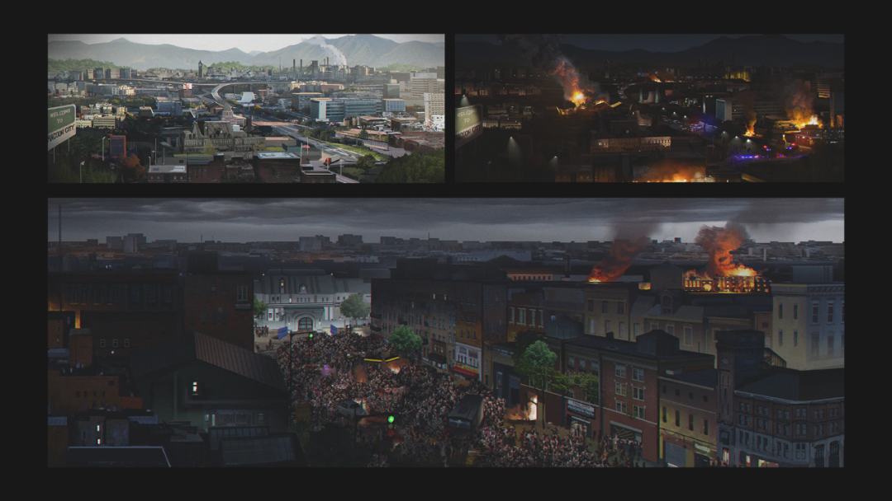
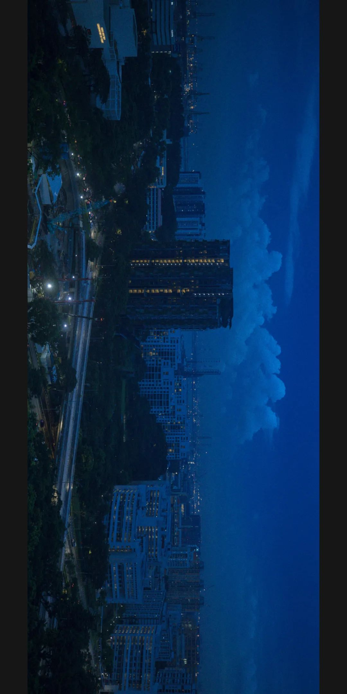
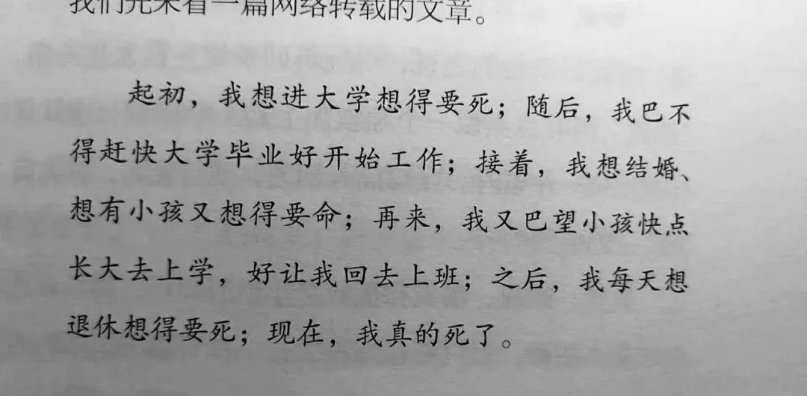
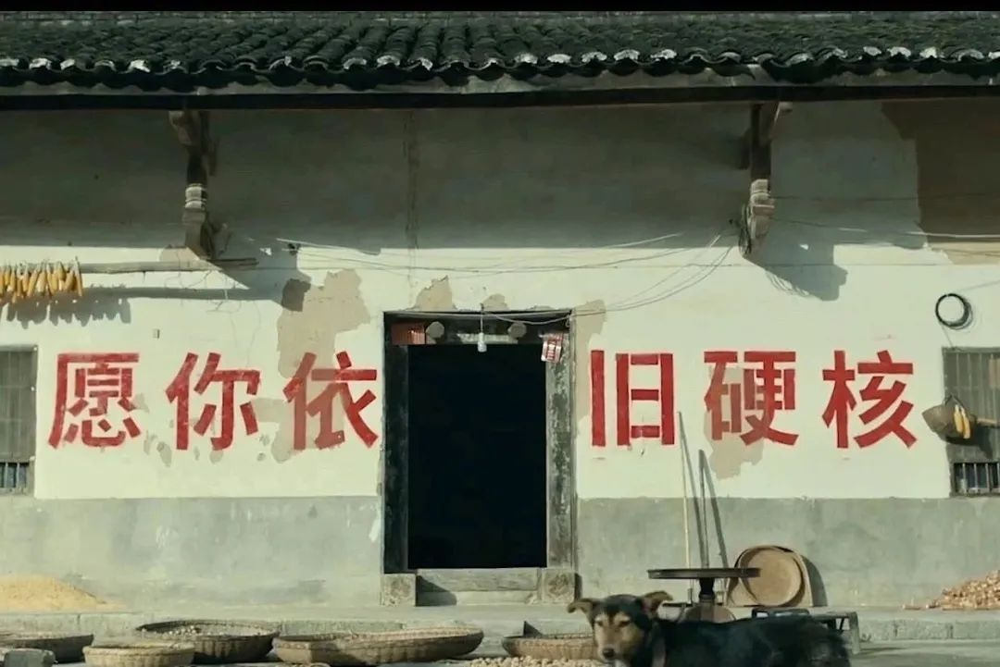
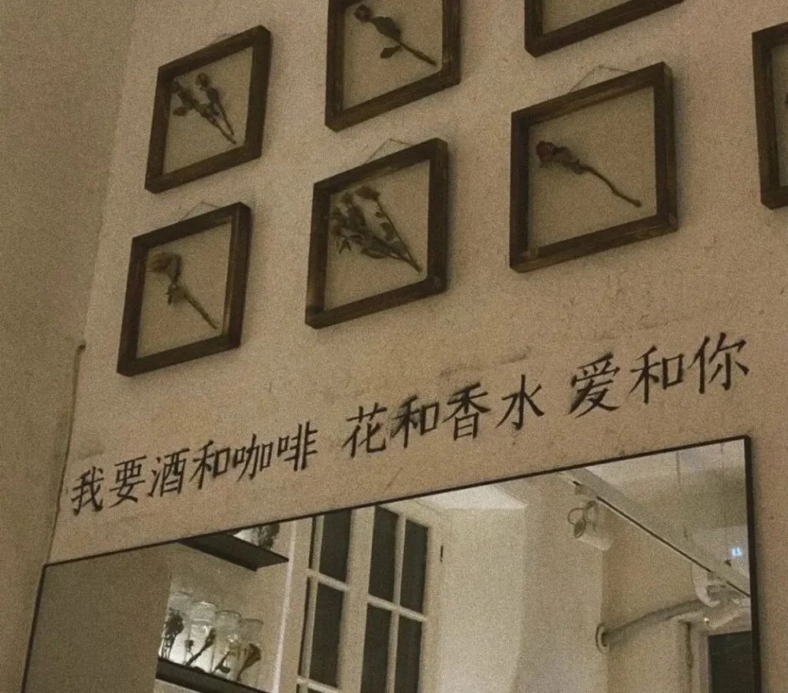
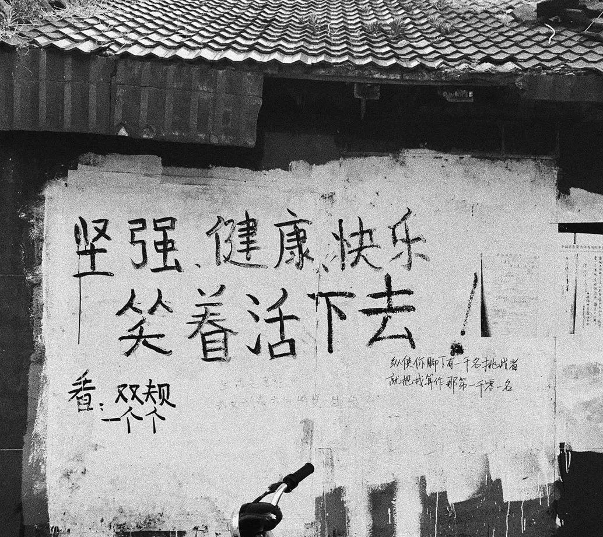
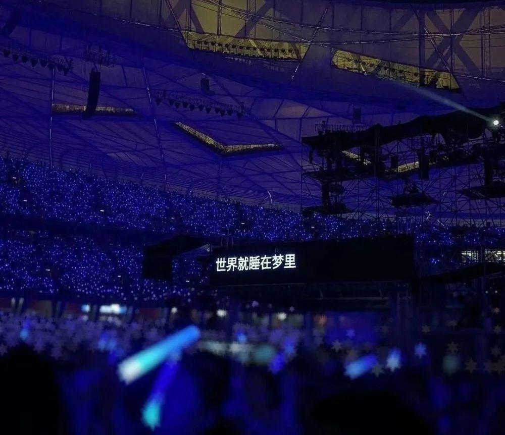
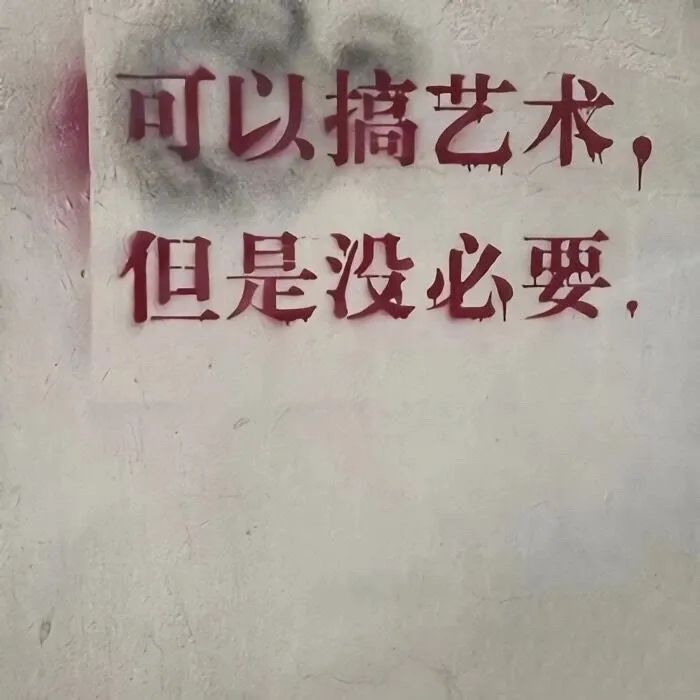

> 本文是张衔瑜第172篇推文 共计1407个字，12张图

> “也有一些比较大的困扰，比如说到底是拿诺贝尔化学奖还是拿物理学奖……现在终于可以每天都做实验了，但也没有当时那种新鲜感了。就像一本心心念念的书，买回家的时候就是它开始吃灰的时候。普通人一生不仅天赋平平，颜值普通，才华有限，连真正很大的困难都轮不到，大都是平平稳稳。”

> “无法测量的性质无需存在，测量是主动扰动系统的过程。”

