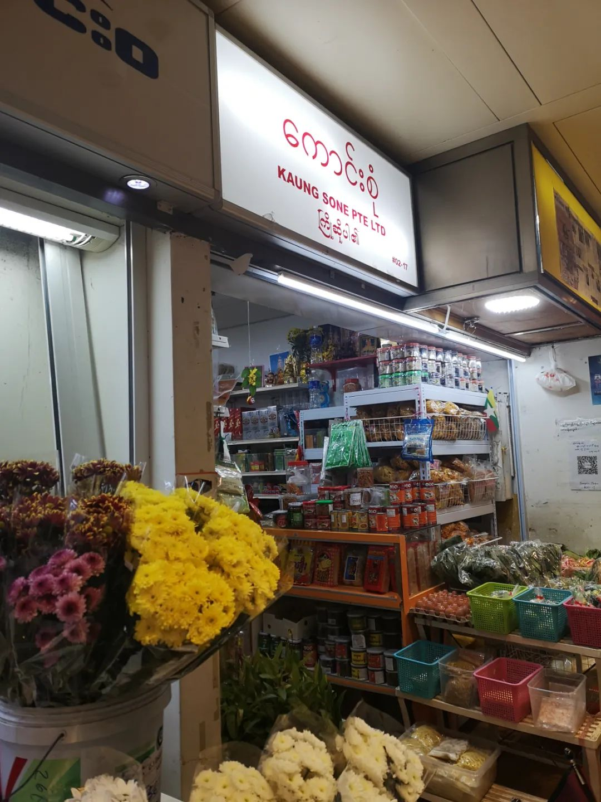
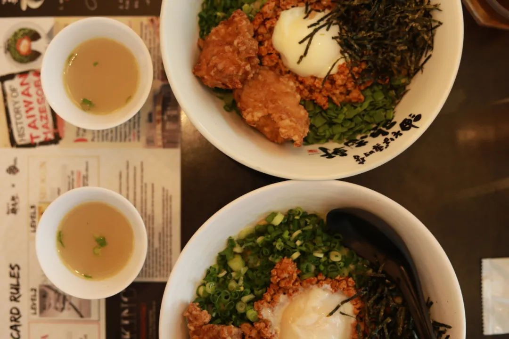
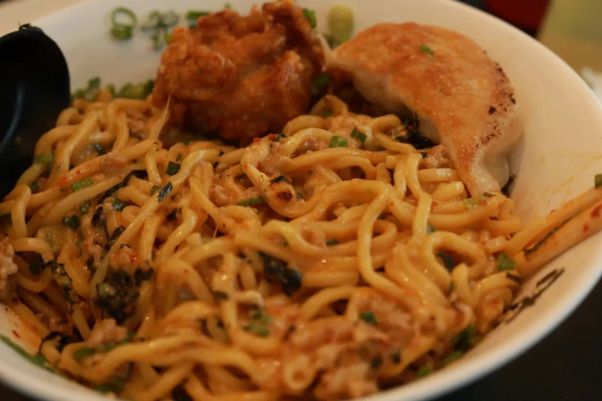
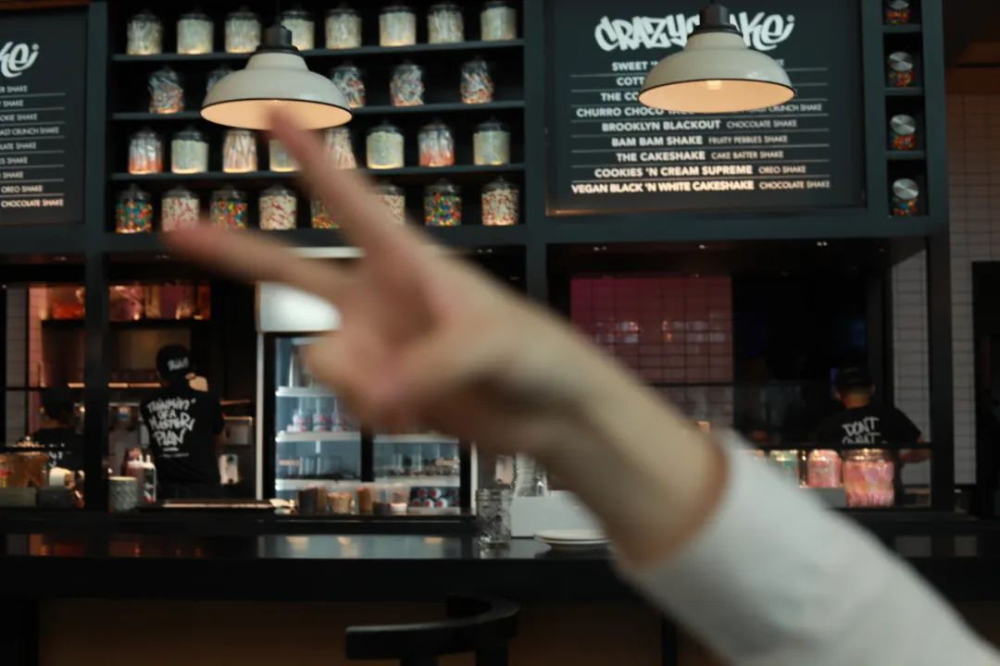
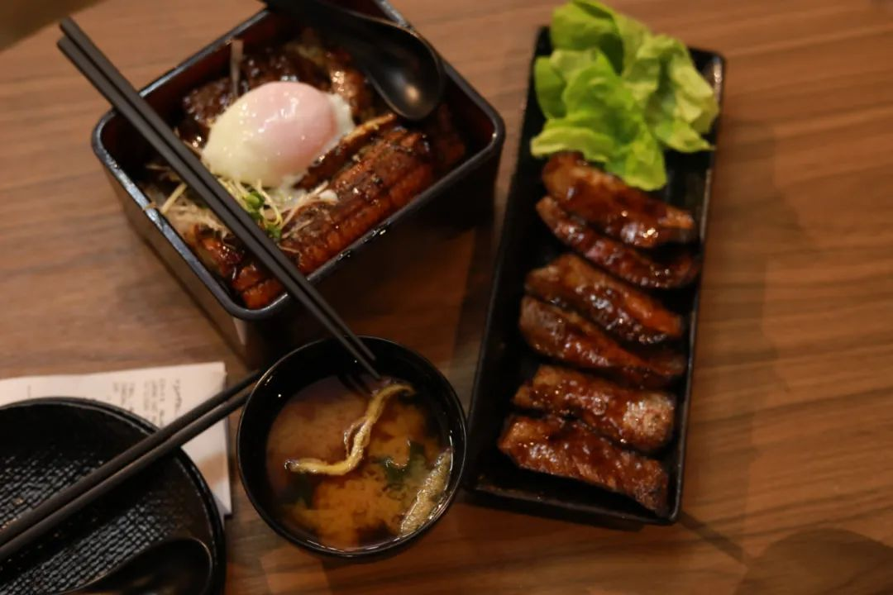

> 本文是张衔瑜第 177 篇推文 共计 1210 个字， 11 张图

本文是张衔瑜第 177 篇推文

共计 1210 个字， 11 张图

楼下食堂的面馆里，不管点什么面，做出来都是一个味道。炸酱面、番茄鸡蛋面或者牛肉面，只是看起来好像里边加的东西不一样，吃到嘴里就都好像是嚼不动的橡皮泥。

食物引起的憎恶是最可怕的，仿佛只要一想到对应的食物，就会五感全通地一并对此完全抵触。如果不是本来就有，我不会主动点葱；如果不是本来就有，我不会主动加蒜。但是即使螺蛳粉本来就有，我还是会把撞到正在吃粉的人拎着扔出去。

人们说吃多了会死，可是有些人根本就不怕死

一位有拖延症的人

以前的郁期：

Delay, put off, prolong as well as cancel appointment

现在的郁期：

Temporize, in terms of procrastination

井陉县的小市民在火车飞驰过铁路桥的时候大声喊：再见， I’m 外星人

你看什么书、听什么歌，吃什么饭、用哪个牌子的相机和衣妆，这些会改变你是谁吗？很好奇一些人的优越感来自于，看胡波的电影所以文艺、听窦唯的歌所以先锋、看朗西埃所以美学。这些都不算。人们不是因为这些而定义正如同教育经历外貌这些都只是在相对群体中更多出现有一些美好特质的人，但这既不充分也不必要。

不会因为今天吃意大利菜而说话西西里，不会因为在冰袋看到了光就变成迪迦。

汀罗翔课的时候，有说我们生来演出并非自己所选择的剧本。线挂的木偶上被戳开了许多大洞，许许多多的车辆从街道上驶过 终海平面下消失不见

人格残疾谈什么探索更远。山海经和淮南子里面的怪物都没这么怪

起初人们并不知道这个歪歪扭扭的是什么文字，想问店员又怕他们说了一串英文单词我也不懂 ( 你知道柬埔寨文莱尼泊尔缅甸老挝的英文是什么吗？ )

一种办法是拿手机去，拜托他们打字打下来，再翻译；另一种是回想传统的东亚东南亚作风，把精神偶像印在日历上 所以看到她就该知道对应的是缅甸。只不过也属于限制使用

鸡爪槭好吃吗？

如果缅甸这么多华人，东南亚这么多华人，而劳动力流出省份又总是广东、福建一带。我想知道劳动力流出时期的具体数据，毕竟人力资源上来说，现在也正是在人口红利渐进褪去的时期。那么一战二战的时候，谁出来了、谁贡献了、谁回去了，对现在启示如何

这些零零碎碎，都比不上吃鸡排的时候淋什么酱重要

一直以为入睡是需要摇号入睡、抽卡入睡。而我正是这个游戏里的非酋

做梦梦到在需要穿三件衣服的地方自习。朋友突然戳了一下我的背，问我去不去看电影，我说那去呗。然后一辆景区园区的那种小火车，直接破门而入冲到我们旁边停下来。上车之后又直接开到有如汉秀剧场的电影院里，像翻斗车倒垃圾一样把我们倒在电影院的座位上。

做梦梦到 MJ 死了，醒来之后还觉得有点难过。清醒之后想起来，他已经十多年前就找马克思去一起商讨反帝反封反种族斗争了，看来只是虚惊一场

做梦梦到和朋友出去玩，蹦蹦跳跳地走。水泥路面上飞架了一座立交桥，很多农民抢着桥的阴影外边，晒了好多花生在地上。我说，走那边太滑了吧。朋友走上去果然摔了一跤，但是又很馋地捡起了花生来吃。吃得我也馋了，我也走上去，结果也滑了一跤好远

醒来在想，这大概是我在长高的时候才会做的梦

干饭人 有精神，吃饱了都进不去门

