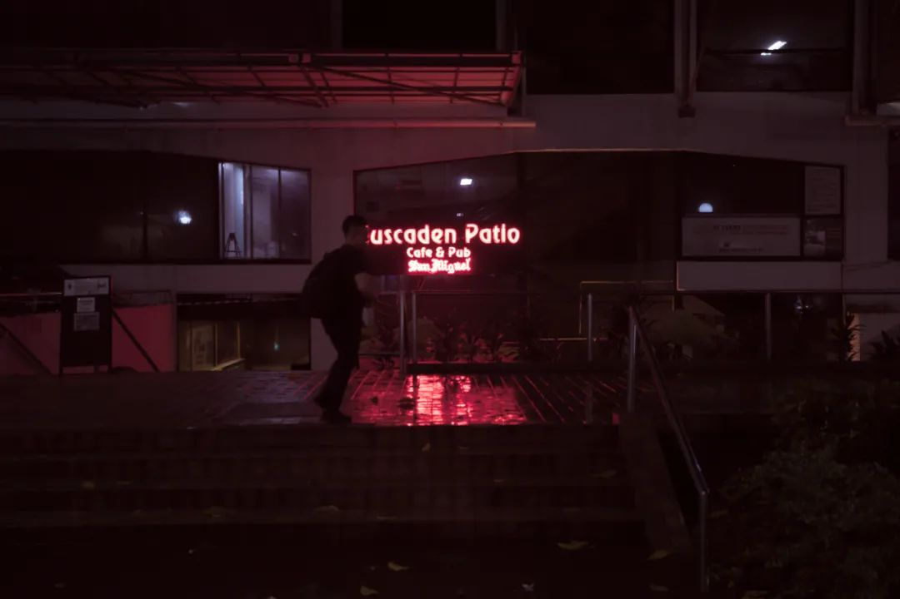
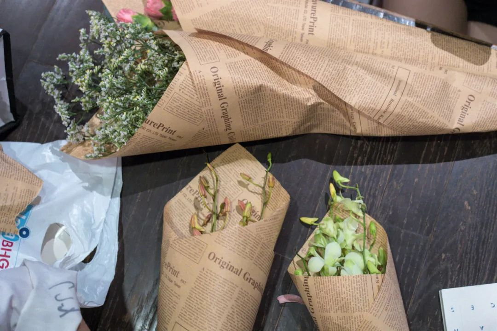

> 本文是张衔瑜第 180 篇推文 共计 2444 个字， 2 张图

看文献。静电纺丝技术

看那些形貌的图，感觉好像棉花糖

和做人文社科科研的朋友讨论过，也和走艺术方向的朋友讨论过。整体的感觉是，自科对社科的抵触，远远没有社科对自科的抵触那么强。换到日常就是“我从 xx 时候开始就学不懂物理了”，听到这个的频率远比听到“我从 xx 时候开始就讨厌地理”来得高。艺术类同理。

仿佛一开始就得先说上：

我对你们做的东西一点也不了解，但是你可以来学习一下我们正在做的

这令我想到一些关于负重、关于对抗困难的对比。这是一个不那么严谨的二元对立故事：

每个人所能接受的苦难是不一样的，一类是比较形而下的苦难、一类是比较形而上的苦难。前者可以在风雪天，饿着肚子背上三五十公斤的棉毛被褥，走上十几公里只为了省几块钱的路费，却受不了拿两本书放在 ta 面前。读书仿佛要了 ta 的命。后者就不一样，后者即使生活中没有什么事情发生，也愿意拿上一本书来翻一翻。可是如果这时候让 ta 只是背个小包去三四公里外的餐馆见朋友， ta 也会在心里琢磨能不能打车过去。

人们所惯常经受的苦难是不一样的。成因和很多有关，大抵是对某一种苦难越熟悉，就越觉得没有经历过和我类似的人，都不足以语人生。

大象席地而坐里有：

> 一位教授坐漁船 問漁民懂不懂詩 漁民說不懂 教授：「那你就沒有了一半的生命」 教授又問漁民懂不懂音樂 漁民又說不懂 教授：「那你又沒有了一半的生命」 漁民問教授你會不會游泳 教授說不會 漁民：「那你整個生命都沒了」 漁民把教授踹進水裡了 ...

一位教授坐漁船

問漁民懂不懂詩

漁民說不懂

教授：「那你就沒有了一半的生命」

教授又問漁民懂不懂音樂

漁民又說不懂

教授：「那你又沒有了一半的生命」

漁民問教授你會不會游泳

教授說不會

漁民：「那你整個生命都沒了」

漁民把教授踹進水裡了 ...

罗翔说：知识越匮乏，相信的东西越绝对。

科学是怎么回事呢？

自科里发生过很多吊诡的事情。明明是一群唯物主义者，在进行着从物质结构开始揭示生命那些艰深晦涩的内容。一个简单的比方，多少学自然科学和社会科学的人，在考试周来的时候转锦鲤、在自己做合成的实验室和整理数据的电脑旁挂上一张杨超越信小呆或者别的什么人形的非人形的锦鲤 （过几天可能又换了别人）

如果说像节日的这种祈福，多少已经成为了一种生活方式和传统。人们在门口把福字倒过来贴着，意味着福到，这就是一种生活方式和传统。但是在转锦鲤和各种有锦鲤人格 / 物格的东西，这本身就是对自己做的唯物科学上蒙了一层神秘学的面纱。刑法学也会认为，如果一个人只是拿着针去扎写有被害人名字的小人，被害人即使死得再惨，这个扎针的人都不会构成故意杀人罪。觉得心理学这边的锦鲤暗示，本身就是和自己所主要做的事（自科 / 社科）逻辑不自洽。

史铁生在《务虚笔记》里写：

> 我们不得不去作报告，按照别人的意图讲述我们并不了解的事，慢吞吞地念着讲稿度过没有生命的时间

爱笑的人运气都不会太差，因为运气差的人根本笑不出来

推理的时候把主次和顺序搞颠倒实在是大有人在

曹禺在《日出》里写：

> 她们都在饥饿线上奋斗着，与其他憋着肚皮的人们不同的地方是别的可以苦眉愁眼地空着肚子，她们却必须笑着的。

每天喝八杯水很难，喝八杯酒却很容易，只要一句：

_______________________

（我没想好，你们随便填）

想一些现在看来很难实现的事：比起努力更看缘分的恋爱，较之努力更看天分运气和选择的科研，之于其他所有都更重要的健康但是常常都不放在第一位考虑。想到有其他事情打岔，打开冰箱门猛灌一大口可乐灌倒食道抽噎，然后发现这味道和自己想象的有差别。我想的快乐不是这样的

这周都没有出去扫街。上周也没有。偶尔会反感一些无聊的城市景观设计与建设，觉得实在是新加坡的建设者们无计可施，才给城镇文明作下了诸如是生硬注解

有一说一，在特定的时候，我回消息就像 Siri 一样快

但是 Siri 从不主动给人发消息除非天猫精灵要没电了

有一天晚上吃泡面吃到生理呕吐

第一碗是一个泰国的冬阴拉面。很辣，变态辣魔鬼辣辣到我根本不想吃。本长沙人吃的香辣，大学的川渝朋友们吃的麻辣我觉得都还好，是那种让人吃到之后还想继续吃下去的辣。而这个拉面的辣就是屎，是我吃了一口之后只觉得辣根本不想再吃下去。火鸡面什么的我觉得噱头也就罢了，这个直接让本来挺好吃的冬阴功白月光掉到底

第二碗是调的日式拉面汁和碱面面团。把面煮开到半熟之后，加入豚骨拉面汁。拉面汁有一瓶，是我今晚新开的。面可能加了荞麦一开始味道有点奇特我也就忍了，把碗从微波炉里端出来的时候我整个人都差点 yue 了。这是人能吃的拉面味道吗，死了十年的猪都没有这个味道馊。我直接整碗倒掉了整瓶拉面汁也扔了

第三碗重新打开普通的出前一丁。也就普通味道，无惊无喜但是因为前面味蕾被破坏了，所以体验也不怎么好。吃了一半多一点，剩下的也都倒掉了。

总之至少一个月不会再吃方便面，剩下的也就发群里看谁爱要谁拿去。事实上昨晚吃一个叫老妈拌面的湾湾即食面，就已经被摆了一道。最近其他的生活不对付，也都跟吃拉面这差不多。觉得这跟郁期没什么关系，换谁都会一样的生理呕吐

最近出了一些类似上边说的这种闲置，包括不少的东西。除了不耐受的，就是没什么机会用到的。断舍离是一个很好的习惯，没有那么在意到底以多少钱卖给了别人。只要不是扔掉，其余的我就权当做公益了。

反正也是出给学校的同学，随缘出了就出了。偶尔也可以看看别人都在干嘛，想要些什么东西。作为在不同平台泳有多个账号的人，在我生活、熟识的人半径内的生活状态，看一看就能知道对方是在什么样的境况里。

改写另一个公众号的采访：

如果一个男生几张照片都是在健身房的自拍，撩起上衣的腹肌；如果一个女生朋友圈里都是自己买的新包和固定镜子前的造作。大抵可以认为这个人没有太多的爱好，人生主题就是自恋。以及照片过度精修（可能是摄影师的直觉），偶像包袱超过乞力马扎罗“许多人往上扑，导致和他人聊天的时候几乎不需要做出任何努力，就是再无聊像个白痴也有人爱”

我的感觉是，我们对“正常”的定义越来越模糊了，但是没想过“正常”这个词本身带有的就是约定俗成的程序暴戾。每天喝八杯水是正常，七点起十一点睡是正常，荤素搭配是正常，有上进心、打伞会偏向另一个人的方向是正常。每天喝八杯酒喝八杯果汁呢？六点起十一点半睡呢？全素汉堡呢？沉湎鸡汤文学的线上正义使者呢？

人类不需要理喻。偏爱的就在理，不偏爱的就离谱。

交封

昨天送给几位朋友的花

今生送花今生漂亮

