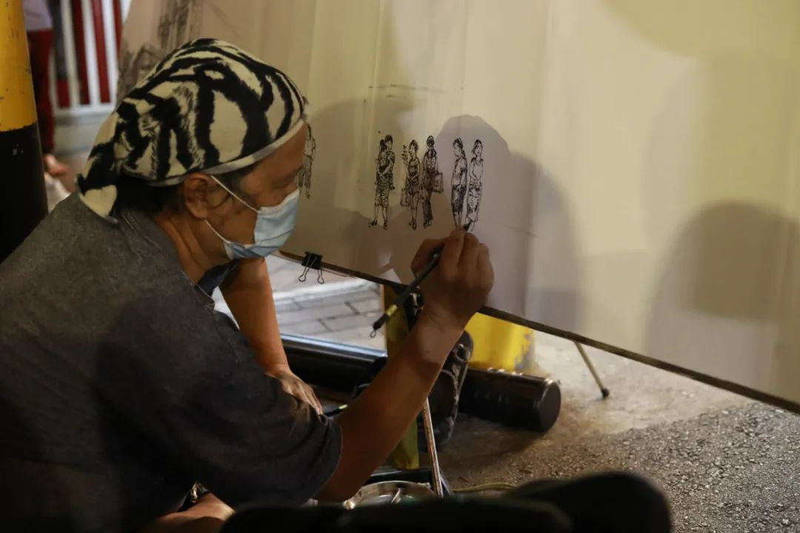
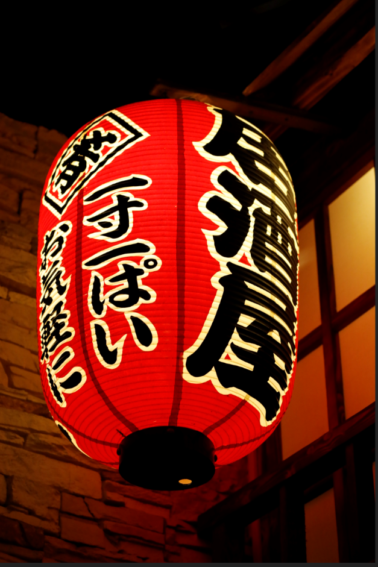
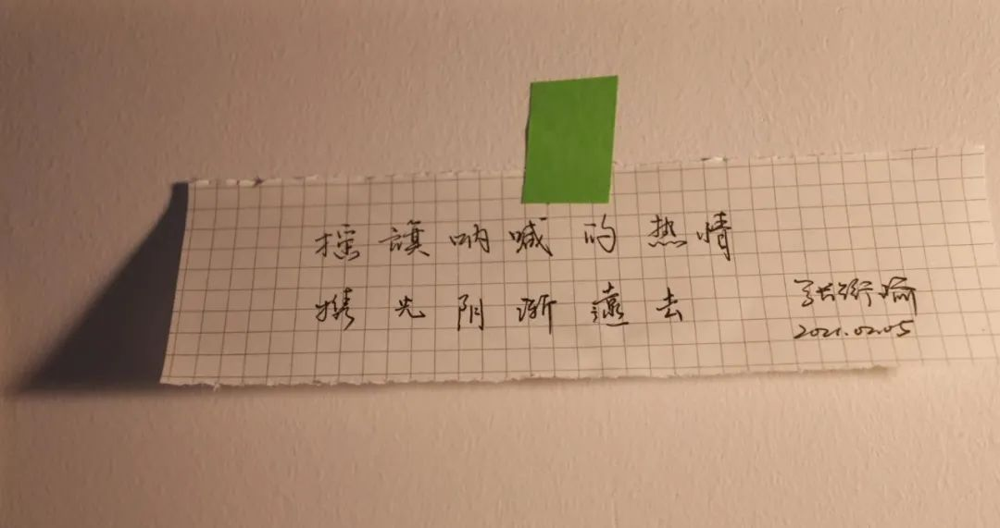

> 本文是张衔瑜第 184 篇推文 共计 1130 个字， 10 张图

- 深夜的路上根本就没有车到处跑，那么路口的指示灯到底在指挥什么？
深夜的路上根本就没有车到处跑，那么路口的指示灯到底在指挥什么？

- 要是仅仅数量庞大就可以击垮人们所谓的自信，那我每天不知道要喝多少阿伏伽德罗常数个的水分子，博人不会被我点天灯吗？
要是仅仅数量庞大就可以击垮人们所谓的自信，那我每天不知道要喝多少阿伏伽德罗常数个的水分子，博人不会被我点天灯吗？

- 所以呢，你感受不到那种郁结正在从肋间肌里边一点一点重结晶，沉到肋骨中间下凹的部分，一点一点把胰腺压倒下垂吗？
所以呢，你感受不到那种郁结正在从肋间肌里边一点一点重结晶，沉到肋骨中间下凹的部分，一点一点把胰腺压倒下垂吗？

小年快乐

凡能吃的节我都可以
