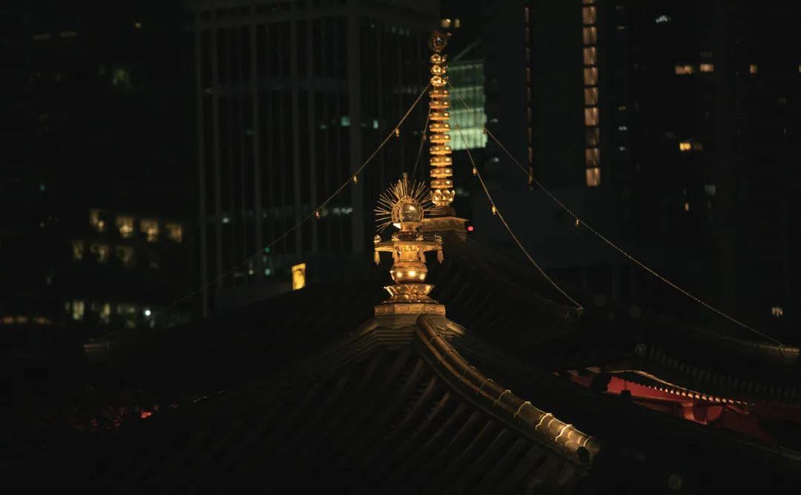
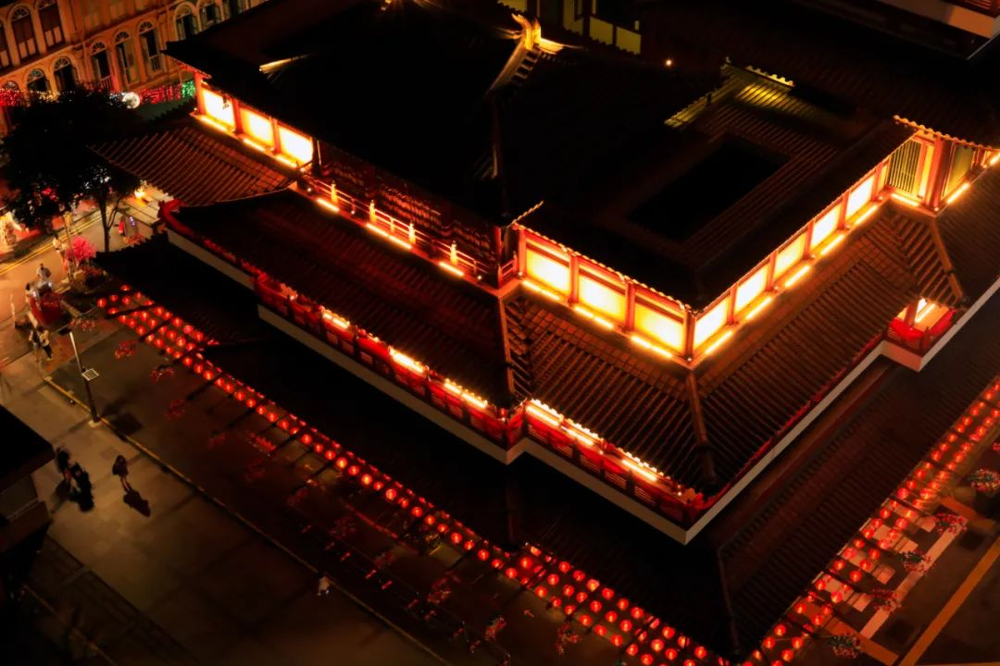

> 本文是张衔瑜第 185 篇推文 共计 2372 个字， 8 张图

本文是张衔瑜第 185 篇推文

共计 2372 个字， 8 张图

Word 文档提醒我， Kosong 不知道是个什么词，需要在底下划一条大红色的线。就在吃货研究所 / 果壳前不久发的《南洋老咖啡》文章之前，在点早餐的地方我也不大听得懂他们在说什么。

Kopi 马来语“咖啡”闽南话“咖啡店”

不等于什么都不加的黑咖啡，而是默认糖加炼乳

> ☞ Kopi （读作抠劈） = 黑咖啡 + 水 + 糖 + 炼乳 ☞ Kopi C （读作抠劈 - 嘻）：黑咖啡 + 水 + 糖 + 淡奶 ☞ Kopi O （读作抠劈 - 喔， O= 闽南话：乌，黑） : 黑咖啡 + 水 + 糖 ☞ Kopi C Kosong （读作抠劈嘻抠送， Kosong= 马来语：空空如也）：黑咖啡 + 水 + 淡奶 ☞ Kopi O Kosong （读作抠劈噢抠送）：黑咖啡 + 水 ☞ Kopi Gau ( 闽南话：厚 ) ：浓一点的 Kopi ☞ Kopi Poh （闽南话：薄）：淡一点的 Kopi ☞ Kopi Peng （闽南话：冰） ☞ Kopi Siew Dai （闽南话：少甜） ☞ Kopi Ga Dai （闽南话：多甜）

☞ Kopi （读作抠劈） = 黑咖啡 + 水 + 糖 + 炼乳

☞ Kopi C （读作抠劈 - 嘻）：黑咖啡 + 水 + 糖 + 淡奶

☞ Kopi O （读作抠劈 - 喔， O= 闽南话：乌，黑） : 黑咖啡 + 水 + 糖

☞ Kopi C Kosong （读作抠劈嘻抠送， Kosong= 马来语：空空如也）：黑咖啡 + 水 + 淡奶

☞ Kopi O Kosong （读作抠劈噢抠送）：黑咖啡 + 水

☞ Kopi Gau ( 闽南话：厚 ) ：浓一点的 Kopi

☞ Kopi Poh （闽南话：薄）：淡一点的 Kopi

☞ Kopi Peng （闽南话：冰）

☞ Kopi Siew Dai （闽南话：少甜）

☞ Kopi Ga Dai （闽南话：多甜）

回顾标题里的，应当是黑咖啡 + 水 + 淡奶。理论上来说，另外的几种点法我可能也在某些时候听到过。但是由于词频不那么高，而且大多数时候也只能听得懂我能反应过来是什么意思的东西才会记得在说什么。

也点过几次不是标题里的 C 空空，但是从表观上来看，可能会觉得早餐店师傅出杯的几乎是一样的作品。敏感地喝到才能知道一些细微的区别。除了偶尔在茶颜被当成老饕顾客去试不同内容，我才会主动去想是什么味道。其他时候也就得过且过了。

已经好多次在打开电脑的时候瞟手机，看到时间在 08:53—08:58 之间。落在这个区间内。

热带很少有自己体温低于环境温度，这件事已经说过很多遍了。

昨天看《忧郁的热带》时，看到作者去南美进行人类学考察的旅途中，航海水手说最怕赤道无风带：在这片海域内，两个半球特有的风都吹不到，所有的帆下垂好几个星期之久，没有一丝风吹动它们。空气停滞，使人觉得是被关在一个封闭的空间里面，而非置身大海。

现在也可以放一周的假或者两周，但那有用吗？所有的事情依然堆在我这里等我来，如果不干活，就都还是我的东西。不会因为我放假了而转嫁到别人那里去。更甚，我也不会因为放假而在效率上有多少差别。研究是以一种平静的态度在面对这一切，很少会有说在一个假期 refresh 之后充满干劲。不是这么回事。

还有，你们说的正常，是什么意思？

异地恋多久见一次正常

头发多久剪一次正常

拉屎用多少张纸正常

电费一个月交多少钱正常

香氛点多久正常

买花剪掉多少枝条正常

太阳多久落下正常

大象席地而坐正常

渔人缘溪而行正常

弱智闻风而动正常

正常正常正常

能不能先确定所指之后，再决定用什么情感程度的词汇。即算是现在，我也不觉得我读写听说中文有什么退步。骂骂咧咧的时候仍不在少数。

独家配方也好意思说啊

要看的是有没有笑，是你家的 Ta 家的王二狗家的关我什么事。只要便宜好用就行。单单说独家配方我可是一点品牌忠诚度 / 归属感都不会有的呢

可以去买番石榴吃

至于为什么

因为我刚刚吃的菠萝蜜

如果我有罪

等等 我哪有罪 我没错

如果遇见一个人要花光所有运气。那最好别遇见，因为马上要过年了。还要用这点运气来打牌，人可以输牌不能输

证明语言能力，如果最高水平只是按照上述这样说一些俏丽的话，充其量只是一个会说话的嘴巴。脑子不需要可以捐给做脑花的串串店。现在以为，语言能力是在精确而细微地描述或者表达处得到的最大体现。沮丧、实验后的沮丧、做完一整天实验后的沮丧、做完一整天实验没有吃饭的沮丧、做完一整天实验没有吃饭而且结果是错的的沮丧、做了很多天实验而结果是错的的沮丧、做了很多天实验作息混乱饮食颠倒而结果是错的的沮丧、 ~ 并且还有人跟你念叨 “不是一万次实验失败而是试出来这一万条无效” 的沮丧。人类的语言可以 cover 这些差别吗？应当是可以的，只不过能力达不到罢了。

昨天和人去一家湘菜馆，服务生说主厨是永州人。翻了翻菜单，倒是不惊讶他们写老坛双卜，写成这个“卜”毕竟也很难写准。但是罐装饮料写的是“灌装饮料”，这个实在让人有些怀疑。

至于“卜豆角”和“卜辣椒”，我还见过写“扑豆角”、“普豆角”、“剥豆角”，至少没有写成是“卜豆壳”已经挺给面子。

从制作工艺上来说，这个字音对应的是一种豆角的制作方法，精髓部分在于晒。所以字应当写作“暴”或者“曝”，一曝十寒或者苏洵的那篇《六国论》里边写的“暴霜露，斩荆棘，以有尺寸之地”诸如此类。

开灯的时候我觉得肚子很饱，不用再吃东西了。于是我去刷牙洗脸，回来看了会儿书。关上灯，觉得饿了。

昨天早上开始，在做洒扫除尘。腊八之后就是年，从那时候开始起就有断续做一些。昨天把床单被子枕套都洗了。晚上我撤下了凉席，因为是新的床单，于是决定先不用竹席地在上边睡一觉。体感很不一样。

谁能想到，今天就腊月二十九了呢？感觉前几天小年的时候家里才转了过年钱给我，感觉才不久过的腊八。感觉己亥大年三十，一边看春晚一边看姬哲湍已经毕业快两年的学姐在武汉写最硝烟弥漫的前方战疫稿，好像还在不久前。谁能想到，明天我还有节课呢？

李健：当列车徐徐开动，掠过蓝色站牌

李健：迎着月色散落的方向，把古老的歌谣轻轻唱

有和好朋友聊起，说从多少岁以后，日子渐渐地变得飞快 Time fly fast 就像 他 说的。

不是简单地“没有记录就没有发生”，而是在没有写日记 / 没有写周记或者其他时间间隔的记录。总之没有把一天当做一天过的时候，日子亦不成日子。

过去的一个多学期里，有近三十封往来邮件才到手一台电脑主机，前后近三个月；有给我上博士阶段第一节课的老师，那一天他拖堂了好久，我还在隔离寝室里于是开始在朋友圈骂骂咧咧。后来他的 tenure 到了没有过考核，于是现在已经不是这个学校的老师。听说已经去香港了。这两件事没有关联，可是我就是要写到一起。

如果有一天，也像其他人一样开始找借口说“没时间来了解 XXX 一件事”，那意思应该是说“没有脑子 / 多余的线程来处理新的知识”这样很不好

科学民主自由

相信未来

放几张腊月二十六，在牛车水 ChinaTown 拍的佛牙寺，以及路上的人群。

那天我穿的汉服裤子出门，可能是看我也拿了相机，所以其他扫街摄影师就也放心在我旁边举起了相机、用起了各种直闪离闪。

张衔瑜

庚子年腊月二十九
