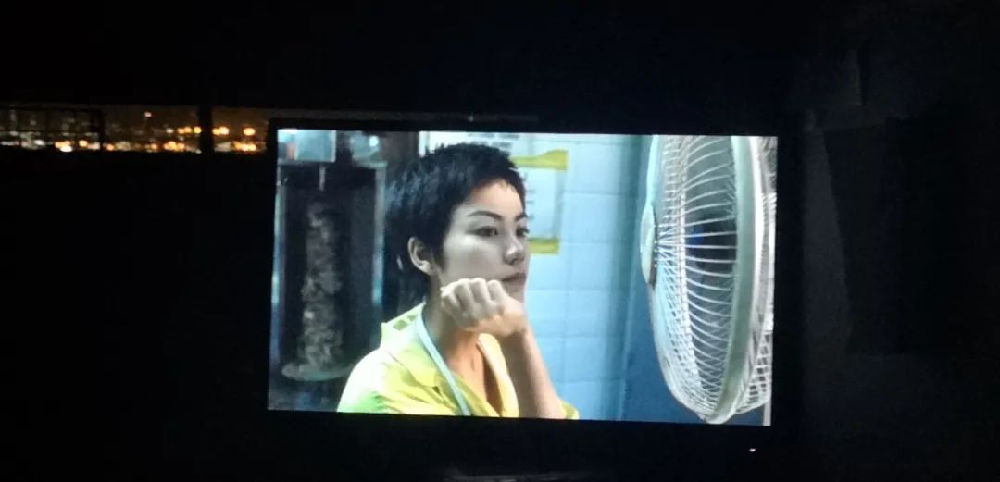
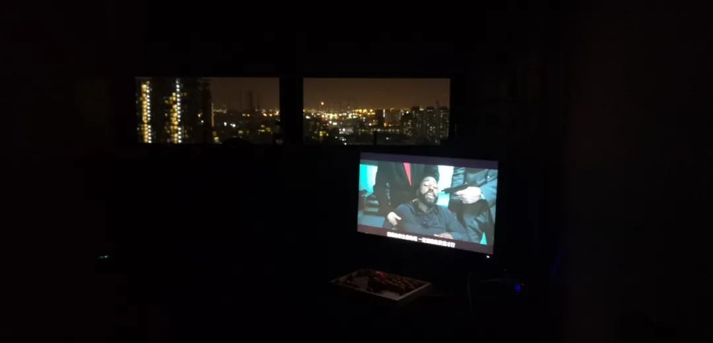
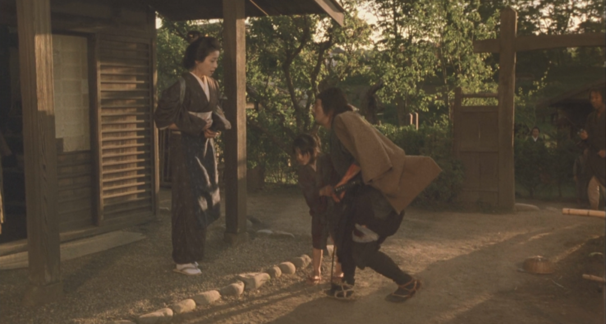
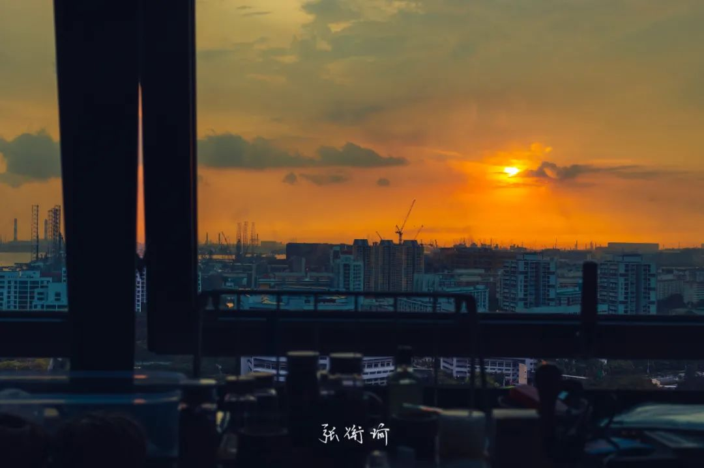

> 本文是张衔瑜第 19 0 篇推文 共计 1400 个字， 2 张图

最近在看鲍德里亚的《消费社会》。第二章消费理论中，出于人类经济学有这样一个说法：

在一些秩序中，物质增长的社会，被当做了物质丰盛社会的对立面。

旧石器时代有可能是最初的丰盛社会。这种绝对的“贫困”生活让他们“凭兴趣”狩猎和采集，并分享一切。他们的浪费是完全彻底的：他们会一下子把所有的东西都消费掉，既没有经济上的考虑，也没有库存。

我对此没有什么评价。

去公交车上的时候，只有我一个乘客。等我走到座位旁，坐下来之后，司机在我刚好坐下的时候开车起步。应该是从看车内情况的镜子里看到人坐下来之后，才开车起步，因为踩点踩得刚刚好。

//

在实验室等电梯。因为我在的楼层比较矮，所以会遇到一些从比较高楼层下来的人。那天遇到了一个戴眼镜的老师，整齐的夹克和腋下夹着的小包。在我的楼层门开之后，他一个垫步然后箭步冲出，没有正眼看的时候几乎要撞到我。发现楼层结构不对之后，又悻悻冲回电梯井。冲回去的时候我看到，他的背上有夹克出汗之后溶出来的一圈盐渍。我想，他的名字可能叫做盐王爷吧。

//

SchoolgirlByebye 在歌里边写道：

把自己拜托给耳机

买了一个小黄人联名的蓝牙耳机。连接上的时候会有小黄人在耳朵里面叫的声音。

Opps,oh oh-kay.

//

当我想起来寝室的显示屏可以用来看电影的时候，就连着看了好几部电影。

- 无依之地 2020
无依之地 2020

讲的是美国退休群体。觉得多少触碰到了一些合理的人口老龄化进程。因为最近的英语课作业是写的人口老龄化：因果分析和问题解决，所以查了一些附近的资料。包括长期护理保险制度和一些再就业政策的指导。

所以看到这部的时候就想起了这些问题。

还有比较近的在新加坡食阁里，看到的那些仍然在做工的新加坡老年人（已经明显有神经退行性病变的那些震颤动作）

这部找到了一个好的题。但没有讨论得更深了。

- 重庆森林 1994
重庆森林 1994

- 送你一朵小红花 2020
送你一朵小红花 2020

- 信条 2020
信条 2020

- 黄昏的清兵卫 2002
黄昏的清兵卫 2002

**

相比于书籍，各位电影导演、制片、监制、场记等等这些我分不清具体工作职能的人显然更具有读者意识。书籍在成书的时候除了编纂各种大典，其余的共同参与度应该都不如电影这么高。当然也可以说电影从编剧开始，处理工序上的人越多也就越会被各种风格所影响。

这是我更喜欢去话剧和舞台剧剧场的原因吗？

这可能是答案构成的一部分。占比不知道有多少。但是需要指出的是即便在哪一天我给出了一个占比，这也绝不是最后起效的比例。也就是说这些比例本身和比例之间的相互作用是会导致到所有的这个结果。

**

所以呀。很复杂。

生活也很复杂。

交封了就不复杂了。

