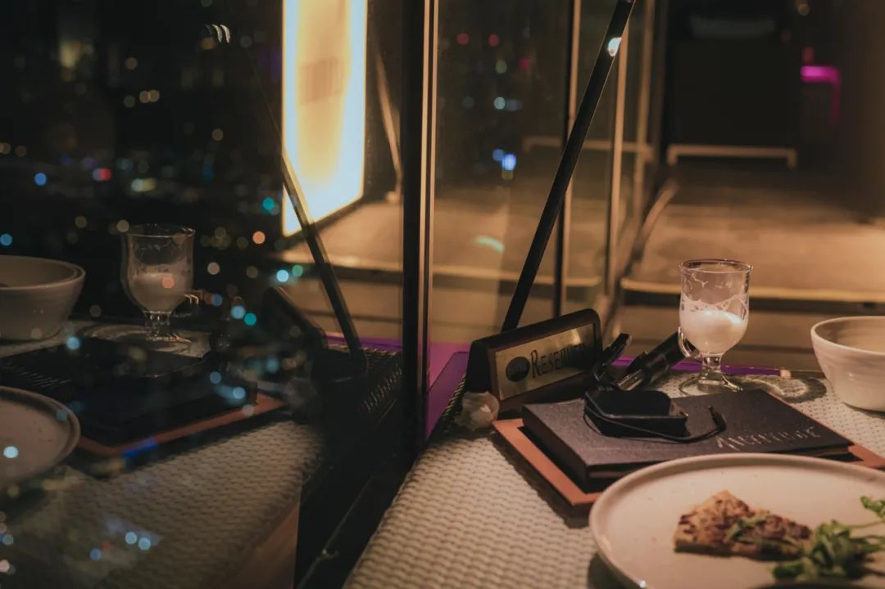
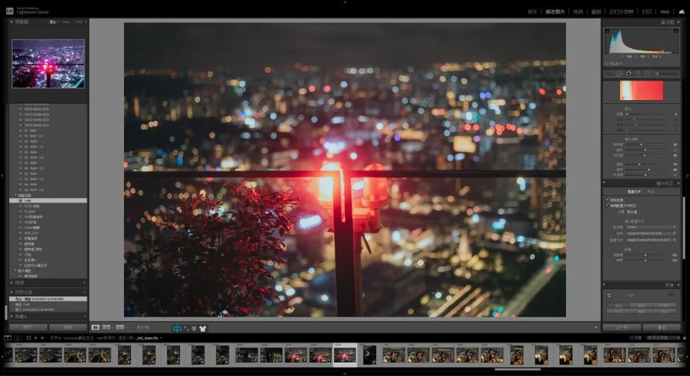

> 本文是张衔瑜第 191 篇推文 共计 999 个字

走上公交车模样的校车。校车师傅戴了衣服墨镜。平常是要查学生卡的，来确认是本校的学生上车。这一次我拿出校园卡之后，不知道师傅到底有没有查看，因为既看不到微小的眼珠转动，也没有大幅度的肢体动作。

当时有一种感觉，即把身家性命 - 驾驶安全交给这位盲人司机，应该是一个值得有所保留的选项吧。

最近在常去的地方，开始被要求打卡。要求打卡签到出勤，就像是一档电视节目以收视率为衡量指标。从数字传媒的角度来看，怎么还停留在这种阶段呢？

就好比觉得说好话的人就是对你好，说坏话的人就是在对你坏。小孩子互殴才这么浅薄吧。无论是舆情调动还是人事管理，最好的办法始终是让人觉得这个想法是 Ta 自己产生的。优秀的营销来自于让人产生：我就是要买这个产品可是并不那么清楚为什么。这种营销在世纪初就已经广泛蕴含了，而现在还有人沉迷于去麦当当的店里帮人擦擦皮鞋护手霜来销售手上的一款新产品。

的确有时候很纳闷：是你疯了还是我疯了？是你傻了还是我傻了？

一般问这个问题，就是真的觉得有问题。

和初中的时候一样，没有要求我的时候估计我会做得更不错的一点，因为自律更高效也更好玩；但是一旦有要求，人们的聪明才智就开始导向到怎么钻空子上。比如说让我早上九点到，可早睡早起了这么久，我以前都早上八点到，现在就会演变成十点钟到我都困成弗洛伊德。

总而言之，要求和约束对我来说都不是什么好事。凡是学过一点点材料工件方面力学计算的人都知道有约束反力。事实上现在我也是一边在看一堂舌头编成了脏脏辫的网课，一边写这篇随缘的推文。

小和尚念经——有口无心

有眼无珠

有恃无恐

有的放矢（取古汉语含义）

有心冇相

有心冇相是一句长沙话里面的佛偈：「有心無相，相由心生；有相無心，相由心滅。」这里所说的心与相、生与灭，是对立统一的两组内容。类似的也有打麻将的时候少了一张牌的小无相功和多了一张牌的大无相功。

我们把这叫做：生物之以息相吹也。

万勿复言，万物敷衍， bdBB

//

最近看的电影一部是杨德昌的恐怖分子，一部是王家卫的东邪西毒。看的这一部王家卫，没有上一部看重庆森林时候的沉浸，也可能是环境不同。周末的下午在寝室里看完了这一部，感觉怪无聊的。诚，杨德昌不愧是杨德昌，开解剖室的电影导演果然刀法精湛。

看了电影就不想看书，书有毒。

吃了饭就想睡觉，打雷有毒。

下了雨就穿拖鞋出门，广告牌有毒。

有了上顿就盼下顿，吃饭真好！

天天吃饭意识抽象

象多惨呐这不得吃上四五筐香蕉缓缓

世界线收束

交封在新加坡最高屋顶酒吧的生日派对

剩下的修了，但是不发

