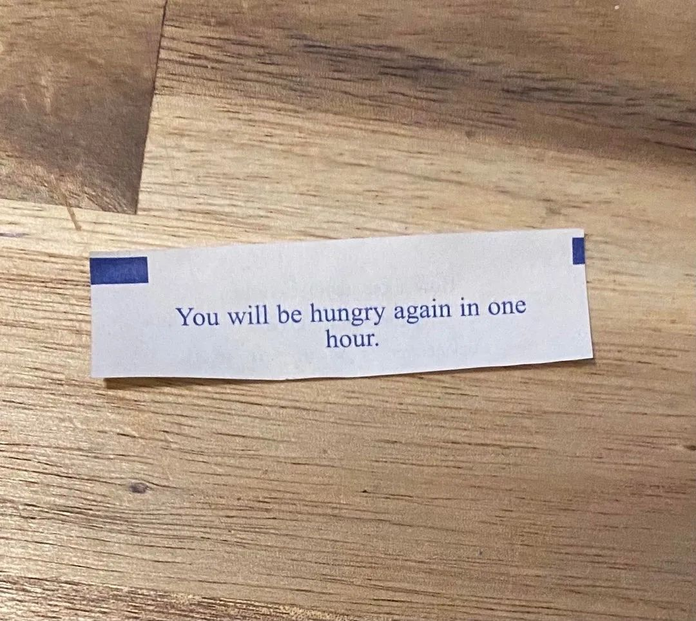
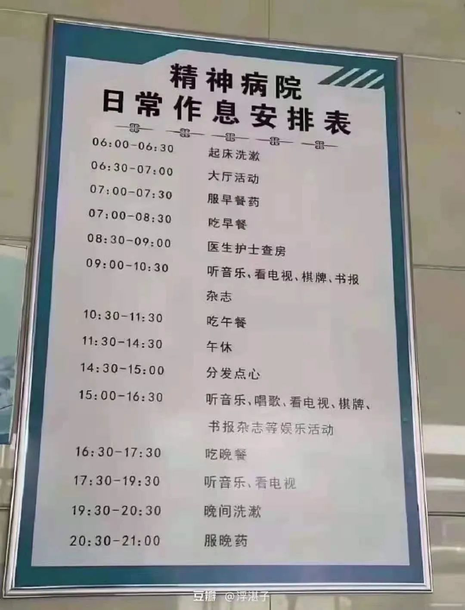
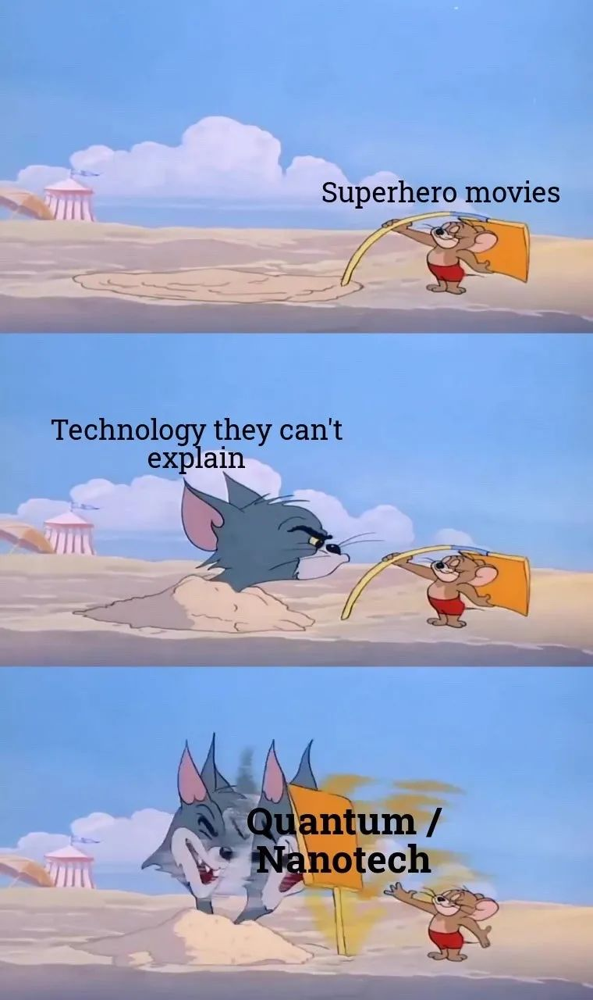

> 本文是张衔瑜第 192 篇推文 共计 1253 个字，结尾是大家最喜欢的弱智图

共计 1253 个字，结尾是大家最喜欢的弱智图

看了看最近两周的早起打卡记录，像极了小学生找规律。

小学的时候我最做不来的题目就是扯淡的找规律题。可能 1, 1, 3, 7, 15, __ 这种还比较亲民，但是其他的真的要想很久。主要这种题也都是来恶心人。出题人为了报复社会而弄些这种东西来搞坏别人的家庭关系。社会的隐秘不安定分子。贩卖、触发焦虑，并在代际传播。

是一些毫无意义的增长，即使看出来的规律于己也一点增长也没有。无非是对自作主张的成年人又多了一些厌恶，就像是被迫吃下一整颗皮蛋那样 （我讨厌吃皮蛋、甲鱼和狗肉

//

桌上摆了一本温铁军主编的《乡建笔记》，描写的是三农及其建设中新青年的对话历程，同为主编的还有梁少雄和刘良。我觉得写得还不错，人家是真的基于自己做主导的事情，把前因后果和自己在建设过程中的想法进行了剖析。剖析可能还讲得轻度了一些，温先生开设的可能是解剖学课堂正如杨德昌的影视架构。

这本书看起来就像是：我做了这些事，我告诉你为什么我们要做这些事，并且希望如果有可能的话你也可以一起来和我们共事 / 把这些事情传承下去。

应该要传承延续的东西很多，这本书的确很有号召力。虽然还没有看完，但这是很一手的感受。

应该要做的事情实在有很多，不管是空前绝后的、还是历史长河中的一环。事件相互包容包含而又独立存续。这些看起来都很重要的事情，因为每个人的不同而在个人世界里出现了次序之分——依照知识储备、经历储备和兴趣趋向的不同而展开到不同次项。

//

来说说早上的事情。

基本结论是：早起毁一天，毁到如果有人在面前听我骂的话可能已经死了七八九十个王朗，当然我也不是什么好村夫。

关注的几个摇滚的公众号还在炒几十万年前的剩饭。除非我说，老板给我来碗剩饭炒陶碧华，不然还是直接 12315 见。所以我打开了 Marshmello 来听听老棉最近发了点什么东西。黄记煌，老棉最近的比起当年我的入坑曲 Joytime II 不知道深沉到哪里去了。于是只好还是打开 Joytime 的专。因为现在不是听新专的时候。

有些理由听着就假的很。不亚于听到一句：鞭笞我吧，公瑾。

好久没有当秉忠贞之志，守谦退之节了。也难怪人家叫荀彧不叫狗货。

> “不可。丞相本兴义兵，匡扶汉室，当秉忠贞之志，守谦退之节。君子爱人以德，不宜如此。”

此乃驱虎吞狼之计。

笑死，谁能想到每天都在背些什么东西。要是坐我旁边的汉献帝或者胡椒面突然背一段《梦游天姥吟留别》我也会先确认一下别人是不是还没有睡醒

扯，就摁扯。

//

听说空想特摄到了熟悉的地方，第一个就跑过去问候 882 你这个 gzz

我梦见赛文奥特曼输给了泽迪

我和蚊子是好朋友，我两经常一起玩捉迷藏。它赢了吸我的血，我赢了我就要它的命。不过最近要是能遇到也都是在工院食堂里，说轰炸机群不过分吧。前天晚上下单了一些有粘力的纸，是那种能展开之后像粘老鼠的版子一样贴别人脸上的。

//

今天我要去买一点营养快线来喝一喝。不管怎么样，反正就是要喝营养快线而且是保质期内的。又不是谁都会对黄桃罐头感兴趣，还不如喝营养快线 Nutrition Express 翻译过来真就是营养元素的快递。快递过来就是各种营养素，冲一手食物理疗。

**

说好不看弱智图的今天又看

