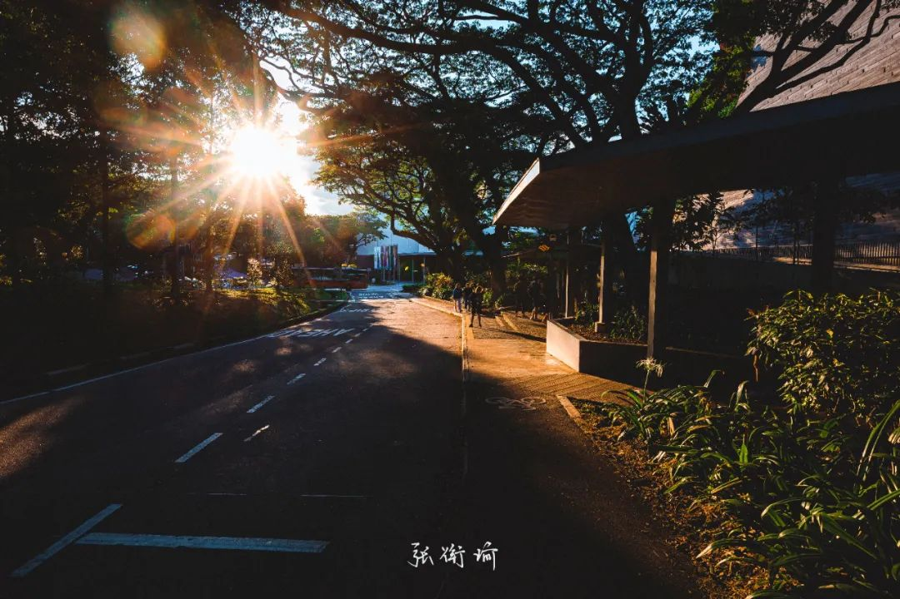
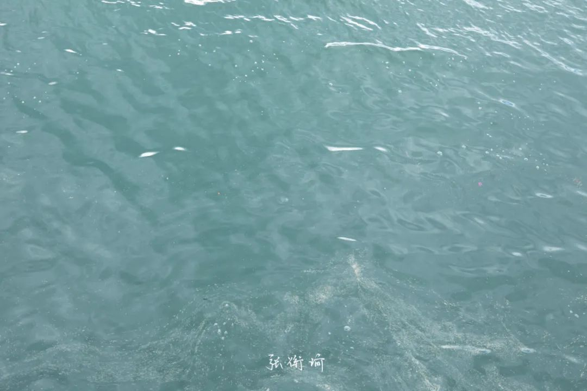
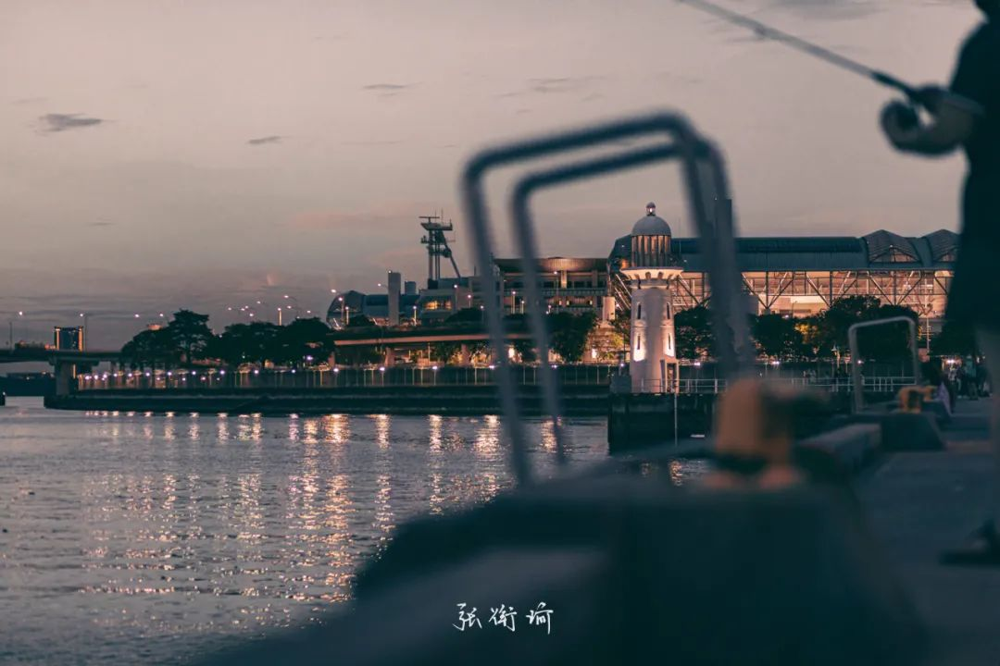
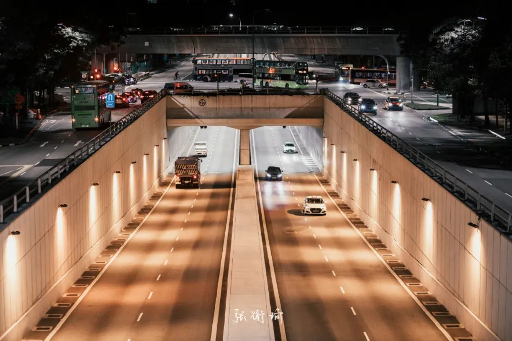
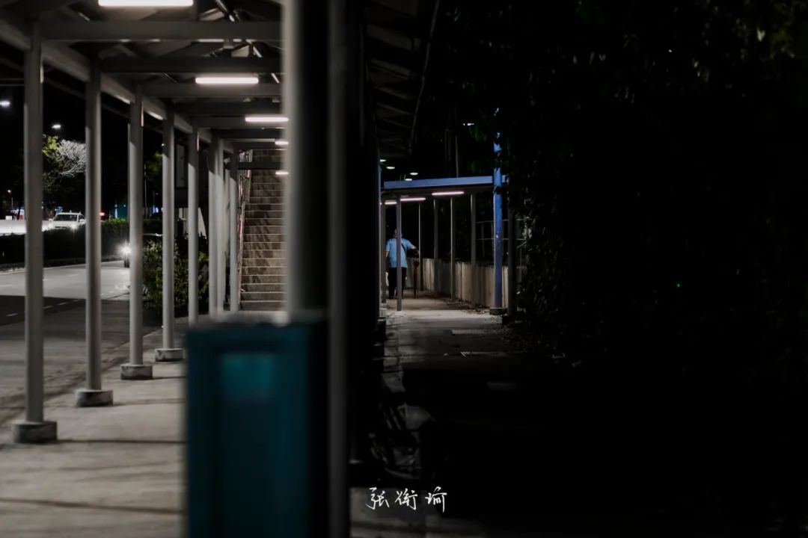
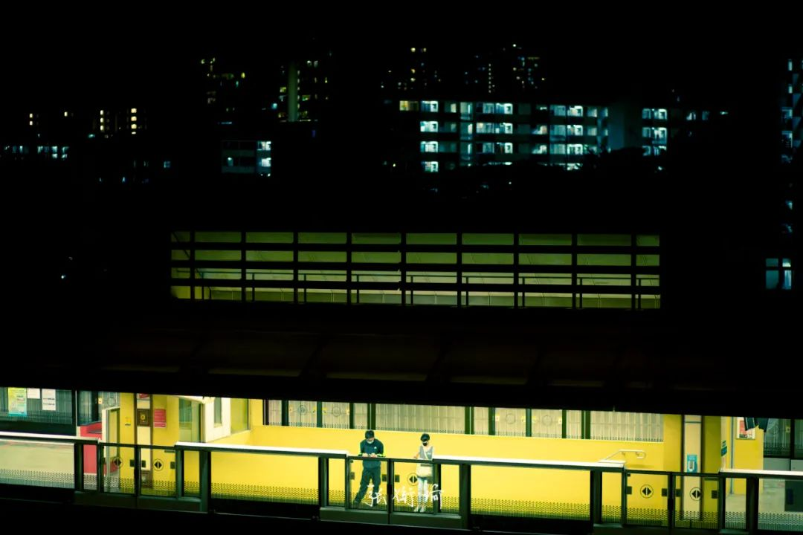
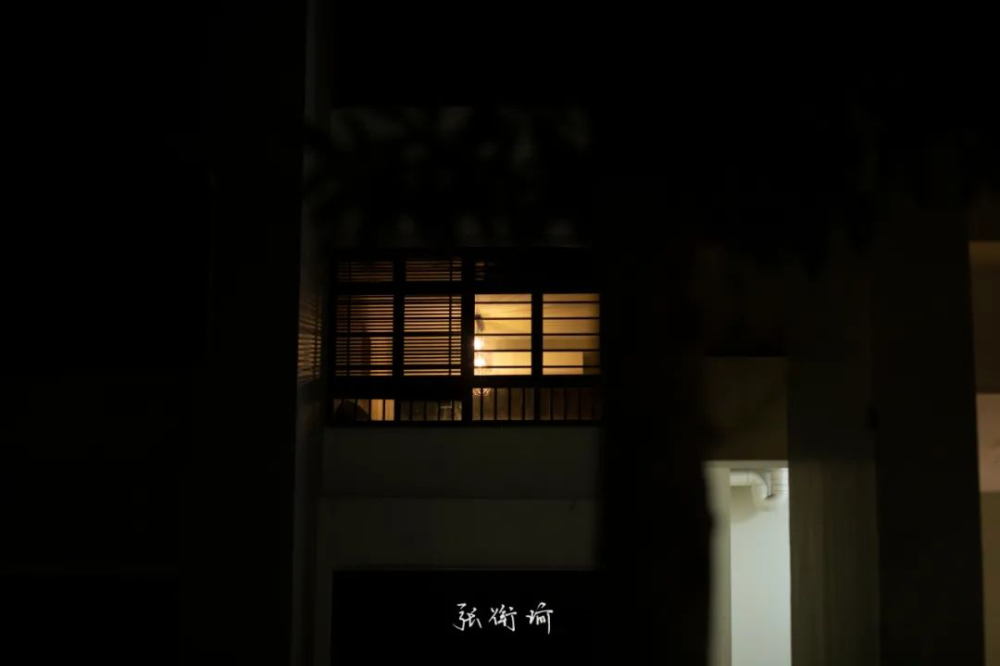

> 本文是第193篇推文 没有写什么字，全是图

本文是第193篇推文

没有写什么字，全是图

为了原创而编的闪灵

今天做不完的就明天再做吧 今天做不完的就明天再做吧 今天做不完的就明天再做吧 今天做不完的就明天再做吧 今天做不完的就明天再作吧 今天做不完的就明天再做吧 今天做不完的就明天再做吧 今天唑不完的就明天再左吧 今天做不完的就明天再做吧 今天做不完的就明天再做吧 今天做不完的就明天再做吧 今天做不完的就明天再做吧 今天←不完的就明天再佐吧 今天做不完的就明天再做吧 今天做不完的就明天再作吧 今天做不完的就明天再做吧 今天做不完的就明天再做吧 今天做不完的就明天再座吧 今天做不完的就明天再做吧 今天做不完的就明天再做吧 今天咗不完的就明天再做吧 今天做不完的就明天再做吧 今天做不完的就明天再做吧 今天做不完的就明天再昨吧

电梯门突然打开

可并没有人走出来

我想

也许是有人整蛊邮递员

让送一阵风

是谁是谁
