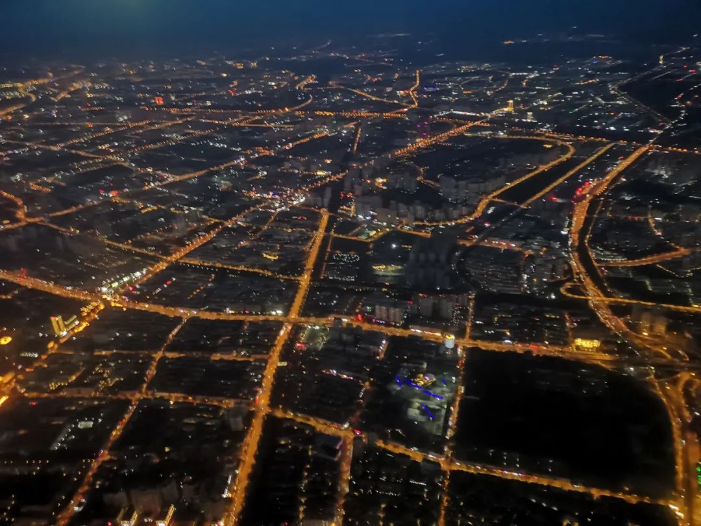

本文是张衔瑜第 203 篇推文

共计 4145 个字， 70 张图

我的储备习惯是，在写文的时候是这样：每次都重新开一个文件夹，把这一次写文的文稿和图集都放在里边。文件夹的标题，一般是我打开文件夹的日期，文题是在文件夹内的文稿上。今天写下文件夹的日期时，又打了一个 2020 出来。

有一张图是这样写的：

2022 is 5-month approaching

Me still processing 2020

七月初，突发奇想决定出一趟门。办完了一些家事之后，终于可以走开去。出发的时候是四点整，上的士之后买了张机票：长沙黄花飞往天津滨海。

我说：我想去听相声了。也许相声能让我开心一点。毕竟他们是专业的相声演员，说学逗唱就是演得卖力也抖下了包袱引观众开心。去哪听相声呢？天津吧。

天津的的士师傅说：来了天津去哪儿逛呢？随便找一家说相声的馆儿坐下来都不错。开在天津的就没有差劲的。对，就这么自信。

Accordingto 吃姜高手 和 日山小熊饲养员 的攻略支持，在海河旁闲逛一会后去了同发号。可能是在汉族聚居区内，民族特点展现得最显著的就是回族人有关。选的这家也是回族馆子。聪明的大拌菜之后，牛窝骨和八珍豆腐都能抗住狠狠地打。

我知道北派的相声和南方的差异巨大。在春晚已经基本被北派相声笼罩的现当代处境下，我也只在脑海中隐约存在小时候模仿南派相声的些许印象。

当遇到一个之前没有见过的艺术形式时，可以先站在人家的思路里把前因后果梳理通畅。我的意思是，应当从更普适的理论往这一个特殊形式去发展，而不是用一个已经特异化了的自己的思路来衡量 judge 另一个特异形式。这一段话有点绕，但是道理是明确的。因为一些原因，我最近不大能把所有的想法都表达清楚，但是自认为这些层级关系和推导是依然稳健的。

艺术形式不单指艺术形式，也可以同等代换为很多东西。我最近经常用这个句式。艺术形式可以代换为某一种菜系。拿湘菜来作比吧。自己是在湘菜区长大，某一天去了东北吃东北三丝的时候就问人家：这没了辣椒怎么吃呢？这就是拿一个特异化去衡量另一种特异形式，而并没有去拿更普适的餐食文化向下发展。

去听相声前，除了想去听听能让人开心的内容之外，也像修摩托车的禅师傅一样想了这些。倒没有花多久时间。毕竟在备忘录上也就只留了一笔，真正细节化是现在写推文的时候才来做的事情子。

最先是一段快板，说鲁提辖拳打镇关西。相当于是用一段和着语音文化的韵脚来唤起听众的耳朵。像序曲。找到极品相声帮的时候，里边的快板已经开始。听起来就像在催促着，快些进来，里边开始噜

此后，是四段相声。也就是传统嘴艺人的逗哏捧哏。

像为什么一定要去现场看音乐会音乐剧、以及在现场听话剧一样，相声在现场听，也当然有在现场听的道理。相声演员会和观众互动，会时不时和你打趣一下今天的天气、说说我们的生平还有在行业内的感受、甚至不时和你的衣服开开玩笑打趣一会。

相声演员的临场是一方面，更重要的是会更沉浸。演出之所以要到现场，是因为现场会真实感觉到有人在表演，以及从去剧场的时候开始就已经进入观剧状态了。

Intotal, 在天津看相声会真的不同。一部分因为天津本身，是我从长沙离开之后，选择的去处而停留开心；另一部分则纯来自于演员们的功底，功底不是未经锤炼就可以成就出来。

比起相声，我更熟悉的是剧院：音乐剧舞台剧喜剧荒诞剧。比起相声，看剧似乎没有那么累。第一次看相声的感受让我觉得，很好笑是真的很好笑，但也是一次高强度的情绪释放。转折不一定需要“但”来表达，因为没有那么强烈的前后对比。

相声比之于话剧，除了包袱更加密集，场子本身的光线导致的观众与演员的“强制”交流也是很更耐人寻味（看完话剧之后如是想）。

似乎是，在相声场子里，观众也要表演，所以这里笑意的来源是哪些，就更复杂些了。

转折的意味只在于，我不能连续两天或者连续几天都听相声。或者说，我不能连续几天做演员

于是去了北京，决定看喜剧。

补了餐，一个月前在北京想去但是最终选了聚宝源的东来顺。这句话又很冗长。这篇文里老犯这样的毛病。最近说话也是。

一度很有倾诉的想法。于是想到处说点什么。不管是通过其他人的表达还是通过我自己的表达，但总有旺盛地想要一直说出点什么的表达策略。在一小段时间里看还好，只是比较精力充沛一些。时间尺度拉长一些，会发现经常保持这个模样并不合理。

开心麻花的《横财满屋》

在海淀剧院

一位模仿印地奇怪疗法的医生入场，双手合十、自眉心像前上方伸去，腋下所夹的皮包应演员迷醉的声音而落：“学会放下。”

场面一度非常地开心麻花。今年的喜剧中应和得最好的也许就是这一幕了。学会放下。

精力旺盛到，可以早上去天安门看升旗。而且也真的这么做了。前一天晚上住在前门，查升旗的时间是早上四点五十二分。四点多一点就起来，往天安门去。

天蒙蒙亮，而人群已经乌泱泱一片地往里快步行进。看了看今天的日子，原来是七月七日。许多年前的这一天，是卢沟桥事变。

前排的人们举起了自拍杆。卫兵们经过金水桥，来到天安门广场，和破晓的时分一起升上国旗。时间并不长，国旗护卫的仪仗卫兵即返回。环顾四周，百年党庆的痕迹还留在广场上，许许多多的公民跑去和党徽合影。

抓拍了几张是家长支着挥舞着国旗的小朋友，在天安门广场上行走来去。正是以人民大会堂、国家博物馆和人民英雄纪念碑为背景。

喧闹的人群在等着进故宫去。 从故宫东侧的北池子大街一直往北走，世界变得安静了下来。也可能是还在清晨的缘故，路上少行人。

也随便走到哪。累了的时候去吃早餐，打车经过北大红楼，在鼓楼旁的姚记炒肝店点了份豆汁和爆肚。假装老北京一点的吃法。

吃饱了的人脸上会露出什么？

消食。既然在鼓楼，消食从烟袋斜街一直走向什刹海去。什刹海多有荷花，像是观赏荷。印象中，这样的荷花常常出现在颐和园、圆明园这些去处。

白天的时间是热的。热，是只有游客才去凑的热闹。我们是不会去凑这个热闹的。得休息。

关于一口炸酱面，于是到 Caesar 推荐的海碗居。几个大件的排面。排面是的确有排面。食味也很妥帖。我们到蓝色港湾的时候已经过了中午，门可罗雀，有点点萧条。拌面都有点心不在焉。

离开蓝港后直奔 798 ， which 是来北京多少很久以前就瞄准了的一个目的地。留下的时间不多了，只够看完波普艺术和一些萨满的片段，在艺术区内逛逛就离开。

离开的目的地也心仪已久，蜂巢剧院。武汉中南剧院在读本科的时候已经让我把孟京辉的先锋戏剧和这个地方联系在了一起。这次到蜂巢，孟导的老本营，想看的也是个性鲜明的独角戏《黄湘丽：狐狸天使》

不愧是独角戏女王。在舞台上没有人能缨其锋芒的。一人独自 handle 角色与转场。的确是黄湘丽。

剧终后，我一般走得比较晚。回头看了看灯光师傅，不曾想看到孟京辉也从观众席上起身和灯光交谈着什么。毕竟是这一轮狐狸天使的首演啊。我想也正常子。不知道有没有机会等到再过段时间《一个陌生女人的来信》和《伤心咖啡馆之歌》来长沙。

离开北京之后，到武汉。到武汉有事要办。发现我叙述的风格，时而迅速时而缓慢。这似乎是一个不太妙的征兆。

武汉的司机很暴躁。我一上的士就感觉到了：勒个车子怎莫停起不走咧搞莫斯啊？殊不知，后座的我已经把手拴在窗户边的把手上了。疫情之后，这是第一次到武汉。武汉现在也要被写在尬走篇里边了。

单读书系 25 争夺记忆。买这本书的时候还赠送了一本《孤岛与对话》说的关于后疫情时代的反思。对于这样一个，宏大的群体记忆，人们从疫情开始发现时的“不明肺炎”、到中间小区街道乡镇里的过激防疫举动和理解，有没有发现在这之后我们反而没那么愿意谈及在疫情时期的事情。

就比如现在，要是新来了一篇报道在分省份地回顾武汉疫情中的支援情况，大抵瞄一眼标题或者二级标题就过去了。《中国医生》我还没有看，据说除了母题本身的感人之外，电影的手法一般。这个说法待考。按着之前的思路继续说，我的确有觉得在后疫情时期，虽然防疫的规定还在，但是早已不会主流地想按照疫情之下的模式比如把村头的路断了只为封堵往来人员去继续生活。

人类不会从历史中学到任何教训。疫情给普通民众留下的多吗？我不好说。寝室楼下的宿管阿姨还能叫出我的名字，也是这次第一位主动和我提及疫情的武汉人。我们交流的时间不久，大部分是她向我描述武汉疫情期间到底有多恐怖。但是我们有构筑心理防线或者预警性地判断到了什么程度应当是打破现状了呢？

郑州的地铁司机。把各种指责加给一位地铁司机，没有必要。长期在隧道里工作，倒是一个很好的扁平的文学形象。不知道会不会有人将此加以善用。

预订了一份古德鸡王。我发朋友圈说以前的感觉又回来了，因为走到学校里又是我长得最像认识路的那个人，又有人找我问路。

晚上跑去花火和食，我的日料启蒙店。大众点评的一些团购单已经下架了。虽然场地没有变，也可能是我的口味变得挑剔了。以及，老朋友见面，发现和并不久远的两年前在南京大牌档里聊天的内容，已经发生了从人生进程上而言的不小改变。我以为这只是回国之后稍微有点大的一次真实面对变化，不曾想回了长沙之后，这样的次数还有很多很多。

清晨，又跑了二十多公里从光谷到汉口去吃严老幺重油烧麦的三鲜豆皮。果然还是那个味道。诚不我欺（语序没有问题）

武汉的景点，想想还也就是那一些。有些新的，也见了的：比如物外书店。所以我只待在了校内，见见朋友和老

武汉有几家是我可以无限回吃的店。西小门外的回民烧烤即是其中之一。时间上并没有来得及，把所有原来的记忆点都一一对应。毕竟那些记忆点，以前也不是在一天之内留下的，怎么可能就在短短的时间里全部挂钩上呢？这不可能。

回民烧烤仍然是熟悉的模样。

想了想，时间其实也并不久。我出国回来也才八九个月，回国一段时间，回国之前算上离开武汉的也就六七个月。人生的确经过了不少阶段。身边的人也是。

怀旧空吟闻笛赋，到乡翻似烂柯人。

句子写得很好很美，而且表情达意也很到位。湖畔有很多支流，也有停靠的码头、水榭亭台。船舶的吞吐量很大，都容纳在这里。社会的分工，正让各自船舶的特异化形成。有些船只尾大不掉，在岸边搁浅了；有些被湍急的激流冲击，躲在避风港内歇息，待到时日晴朗了再出发；还有些押运着粮草，一直吃水很深很稳，打算沽个好价钱也值得如此。

写了很多，也很多都没有写。写了，但是并没有写全。也写不全。下一站不知道去哪里。也没个准信就通知谁去哪里接我。这些都是很难被定义的事情。思来想去，还是睡觉有意思。睡觉不会 judge 你，睡觉不会突然被拽走，也不需要刻意地努力。写完这篇的动力来自于再写不完就没法写张衔瑜四岁了。只得先收尾再写四岁。谨此纪念。

图文||张衔瑜，两粒酱

