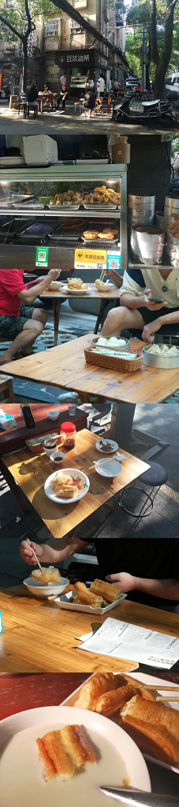
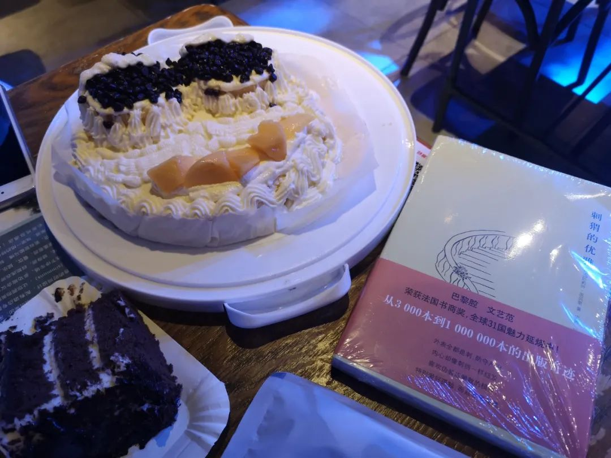
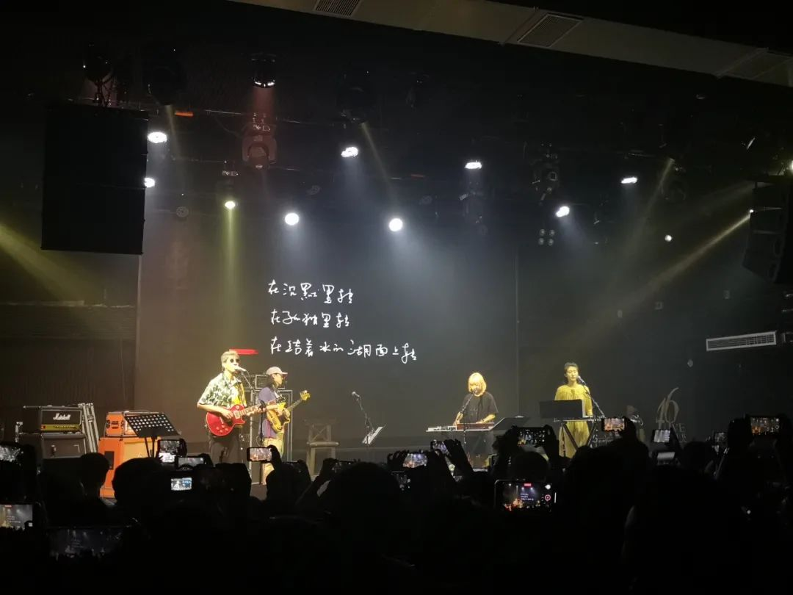

本文是张衔瑜第 205 篇推文

共计2385 个字， 55 张图

读完理想国译丛第三帝国三部曲中的第一本之后，开了一些其他的书：荣格的《红书》看代序和前言们似乎经历了许多的出版折磨。书的纸张很大，而且像尼采的《查拉图斯特拉如是说》一样不好读。

发生日推那天，读了一本王小波《一只特立独行的猪》，经常看到落款原载于 94-96 年的南周或者三联。他的时代，有他的时代意味。放在阶段里来看，也是很大胆的作品了。科技哲学内容，即使放到现代来也依然觉得是可以很好对话的人。哪天我该找本许倬云来看。

没有继续看荣格的《红书》了。因为畏难。于是打开了梭罗的《瓦尔登湖》。我并不为之前没有读过这本书而觉得惭愧。没读，现在就来读一读呗。果然不是善茬。抛开许多希腊神话和文化类印证例证，梭罗本身的文风也令人喜欢不起来。作为非虚构的书来看，即使梭罗在我面前，我们也不会成为好朋友。当然我还是会继续看下去。

提到荣格的《红书》，是因为这像一本笔记书。故事开了，没有不说完的道理。于是上面说完了。接下来继续由《红书》引出来的我自己的笔记。

> “狼人杀上警和社会形成”

狼人杀上警这个 mode 我们已经讨论过多次了。几乎在狼人杀现存的模式里，等价于准规则的形成了。也就是规则中没有明确规定说预言家一定要上警，同样的规则里也没有说预言家一定要说出来自己查验了谁。只是在朴素的分析中，预言家有职责、而且游戏氛围要求预言家上警。

在数学的抽象意义里，有同类的表达。当高深的矩阵论和粗浅的矩阵论谈到“距离”的概念时，即使看起来已经都是向着微小极限走去了，但仍然存在有哪一种标准更严格。更严格 much strict than the other ，意在两种趋近方式里，哪一种更难达到。慢慢发现我在描述这些事情的时候，开始用不那么“算术”的语言，而像和描述楼下电动车过马路闯红灯一样，语气等同。

绕回来，在社会意义上，也存在类比于狼人杀上警和极限的严格程度区别。这一点，规定“社会人”的那些学术说法会更加确凿一些。我对上述这些都不懂，于是可以按下不表了。只在这里草蛇灰线地留一着，查有此事。

> “公众舆论是一个软弱的暴君。”

这句话是在看《瓦尔登湖》的时候，从梭罗的字句里摘抄出来的。 所以我说，即使梭罗在我面前，我们也很难成为好朋友。 如果这本书的非虚构写作，和他本人真的很到位的话。 当然这种可能性还是蛮大的。

> “魔鬼专门给游手好闲的人找活干。”

我觉得这句话是不是翻译得有点那个毛病。于是我就去搜了一下这句话的原文： The devil finds work for idle hands to do. 手闲着没事做，魔鬼专门替你找活干。有点《坎特伯雷故事》的味道了。字句上的翻译倒是没什么问题。

就是，这句话得联系上下文来看。这是讲工作的篇章。说实话我也没太看明白。是要说别去工作只做该做的部分呢 , which is the main purpose of thischapter; 还是想说给人找活干的是魔鬼。我看不懂，也没怎么受震撼。

没看电影。

但是我知道 FIRST 正在，因为有朋友去了。

我的打算写在生日推里了。看王小波的不同杂文就发现有些例、句会像炒剩饭一样总拿出来说。虽然呢，也还可以，放在不同的情境中都也还行。可能我比较挑剔。

还没有好好说过在长沙这两个月的吃吃喝喝呢。稍微写写吧。看看，意思是看看又不会长胖，有什么关系呢？

尤其是到最近了之后，早餐吃得很多，导致都没怎么吃中饭和晚饭。底下这个句式里的@得先跟Python的高阶玩家做一个群组免疫：毕竟这个在写程序的时候代表着修饰器decorator或者直接表矩阵乘法。所以这里得做去敏，底下就只表示at

火焰手工面@高桥火焰城

周记粉店@火星镇

三和面馆@小吴门

矮子粉 ‍ ‍ 店@湘春路

彭记（？）肉丸粉店@左家塘

是不是彭记我一下忘了，反正走过去就在路边。最近打疫苗排了一万个人在左家塘社区旁边的街角对面（一万个人是虚指不要来杠）

玉林粉店@德雅路

聪明的打开方式还包括对面的这波炸货油条

七点米粉@长沙晚报

波记粉店@阿弥岭（ 桂花树 小学 ？到底是不是这个名字啊我好疑惑）

虽然对三和面馆和公交新村感到抱歉，但是的确这一家已经超过你们了 在我心目中是的。前面是去顺兴餐馆吃面的时候路过了这一家，看到许些社区居民坐在这一片大坪里聊天，时间还没有超过七点。那时候我就觉得这个地方肯定不简单。这不是今天早上来吃一次，果然不简单。点了一份酸菜蒸肉的重挑带迅干，双码韭黄炒肉再加个煎蛋。老板直接被我这波点单搞得算不清账了。端着面和一提小笼包坐到坪里来在街坊们跳过我的招呼中坐下来吃个面。这种感觉很近又很远。

豆浆油 ‍ 条@龙柏小区 早餐中国同款

秦九和@梅溪湖，不过长沙分店蛮多的。只是我跟宝鸡同学聊过之后，发现那边并没有这一家。属实让人火烧云

水库十五栋@桂花公园

胡记（？）炸炸炸@文庙坪

问号是因为我只知道这肯定不是姐妹炸炸炸，至于是不是叫胡记炸炸炸呢有待考证。因为我只记得怎么走了。不过也没关系，因为比如点的炸香蕉这样他们没有的，他们也是不晓得找了旁边哪家再炸了过来，所以没差i suppose

享味堂糖水铺子@湘春路

景天@万家丽 ——图为虎皮肘子

犊门火锅&果呀呀@芙蓉广场

胡桃里@万家丽

看到胡桃里的阵仗也应该知道后面要说的是什么咯

也看了音乐剧和 Livehouse

很好笑的一点是 46 Livehouse 在新民路，所以去的时候就可以说“我去新民学社啦”事实上也确实在那附近，也是一群年轻人在用音乐说自己对这个世界

万晓利『呼吸』长沙站 46livehouse

红白色乐队长沙 46livehouse

『面试中文版』长沙梅溪湖大剧院

还想看水曜日、朱自清、帆布小镇、伤心咖啡馆之歌和一个陌生女人的来信。现在都没有了，本来今天应该去看水曜日的，现在票都被退回来了。

还有一个半趣斋的评书专场

生活里不是只有吃、喝、看书、看音乐剧话剧& Livehouse

在这些之外，多的是搞一些没什么趣味但又还是得做的内容。也有值得说的，比如我还蛮想记述的一次审阅他人稿件的心路历程。不同于之前我自己当主编的时候决断，在学术出版里往往一个审阅会意味着更多的东西。用编辑来信的话说 this is an embargo period所以现在还不可以公开（保密的意思）所以等方便说的时候我会来写一写。角度和之前吐槽&思考的会很不一样，因为身份转变。这里自我记账一笔，等时间合适了再说
