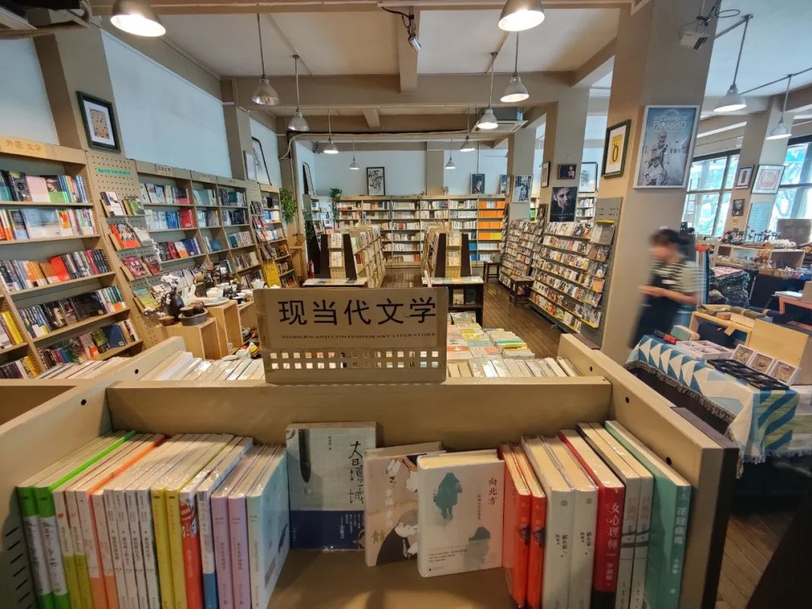

本文是张衔瑜第 207 篇推文

共计 3209 个字， 19 张图

桂林是我很久以前就想去的地方。在新加坡，和山水隔绝了一年，这样的念想只要一被提起如果不达成的话就会越发难置诸脑后。

从长沙离开，从永州出湖南之后，沿线风情变化得很明显。我没有想好这种变化应该怎么描述。描述湖南，似乎是丘陵。描述桂林，好像也是丘陵。说喀斯特地貌吗？那湖南崀山 5A 级景区也是这个地貌。所以从大的方向上我区分不来。也许有人可以吧，但那区别也应该是赵孟頫和欧阳询之间的区别，如果不是内行的话即使知道有区别但也不能名 ( 动词 ) 之。

扯远了。到桂林后，的士从桂林北站到两江四湖，沿线的城市景观愈发同自然地貌交融。行政区划上，桂林立市而不是县。选早上出门，中午到了之后吃个午餐，还能休息会儿上个网课。课是来恶心人的。在外面玩可不能被恶心到。所以网络也不好的时候，就把课水了。

踏一支助力车出门。打出来的时候，我发现这个用语结构就很不大陆。应该说成骑共享电动车。不过随便吧，到哪算哪。于是从王城附近骑车随便溜达。

桂林没有给人一种，很急迫的感觉。刻板印象中的城市里，如果物价越便宜人们遵守各种社会守则的可能性会关联地降低。但桂林不是这样。桂林物价不高，人们生活得很自在。我说这个的来源在于：连骑着电动车的人，都很少闯红灯。

如果做群体画像的话，骑电动车的人或许会着墨在薪资不高、地位偏低偏幼。不怕指摘地，我就拿长沙来作比：总在变灯期间强闯的电动车，每天如果全都抓去罚站的话能站满整个橘子洲头和橘子洲尾。但是桂林就不会，文明城市。我从酒店出来，到几次穿过漓江然后在两江四湖逛来逛去，都极少有感觉到电动车在鲁莽驾驶。我自己骑着车，都有种之前长期在武汉开汽车后回了长沙开车的不适应感。

因此，桂林之行从景色、到接触到的人，都变得让人紧张的神经放松下来。

悠闲地放飞了无人机，让小飞机带我去看看空中的视角。这次的游记里，我不会 include 全部定点的图。桂林的图，人们还要看多少呢？几乎是要多少有多少，去过的人都交口称赞。我不是小红书博主。我需要写一点给自己看的内容。

无人机的聪明点在于可以超过人类限制太多地覆盖三维地形。桂林市区两江四湖，飞上了无人机之后俯拍过漓江桥和解放桥：会觉得原来人和城市是这样生活在一起的。苍翠的山岭由映带的漓江串起，嬉闹的人们从城市出来只几步就扑腾进了水里，朝无人机招手。夕阳从山峰凹陷处落入不见，这会儿的云彩像残影在太阳的几个身位之后，不一会儿也跟着去了。

晚上，这一点倒没有什么不同：游客都会去城市中心的商业步行街。服务生沏了油茶，点了份啤酒鱼。因为油茶，不是其他地方人能想象出来的样子（自问我是不能顾名思义）所以这里用图展示：

吃法也许是将豆子放进碗里，然后用汤 （？） 浇在豆子上，最后撒上小料像葱花这些。尝鲜噜。味道在我来说，是还没有找到好吃在哪里。

一早去了阳朔的兴坪古镇。反而没有太多话可以在这边说。无论是 20 元人民币背面的取景地，还是九马画山、桂林山水甲天下 （这是一个拍摄点） 正所谓舟行碧波上，人在画中游。这时候想起的是小学时候背不出来是不是还被罚抄了的课文。

反而在这些地方，空中视角没有那么好看。最好看的视角是乘船在漓江上的。水清冽，从岸边可以直接看到江底长上来的水草。骑着电动车，把放歌的软件打开。人间聪明。

漓江不是单独的一个地方。漓江是流经了很多地方。在拍摄点的也是漓江，到了阳朔县城里依然是漓江。夜深了，走到漓江的浅滩边去，找一家把船系在江边的烧烤。这是我这次旅行里，最喜欢的部分。

把路边岸上的活动桌板合上，带到漓江里。江边的浅滩不深，没 (mò) 过脚踝但不远。带着桌板到水里，打开来、支好，一边玩一边觉得好好笑。凳子也拿了条，打开来、支在石头缝隙间，压实了。坐下的时候，都不用觉得，而是确凿地物理意义上地坐在漓江里。

叫了扭扭螺丝和烤鱼，螺丝是炒的。餐前想洗手，都不需要怎么费力。在自然静息的坐下时，手下垂，即在漓江中。熟悉浅滩水性的，应当是附近居民吧，会打着手电在附近潜泳。刚从西街下来的时候，走到渡口边我也有些忐忑。直到逛了逛，坐下来吃点什么，才开始观察他们。

事实上也不非得要吃什么，只是说坐在这里，待一会，有点光、有凳子，不太冷。吃颗螺丝就往漓江里一扔，听到噗通一声，然后被略有些湍急的水流带起冲走。不知道会不会对浅滩的潜水人造成困扰。也许他们正在找螺丝呢。想洗手的时候就欠身往水里一伸。总觉得水在涨高 1.5 cm 就会顺着凳子缝隙来打湿我的裤子。打湿也没关系。

没关系了之后我还会想，漓和离，离火在八卦中代表的是朱雀，也代南方。与之相对性质的著名地点，就是呈坎了。漓的本字是醨，薄酒也。 《说文解字》注： 薄對厚言。上文醪醇醹酎皆謂厚酒。故謂厚薄爲醇醨。今人作漓、乃俗字也。屈原賦曰。何不餔其糟而歠其醨。从酉。离聲。讀若離。吕支切。古音在十七部。 《康熙字典》： 水滲入地。所以这么看起来我前面讨论说三点水的部首和离卦之间，还不能用于我坐在江里吃夜宵的时候烤裤子。

烤鱼也很棒。是那种，在烤架上烤的小鱼。不大，但是很好吃。时间已经到晚上十一点多，来吃夜宵的也都是深夜人。山的轮廓在附近，但是看不真切，只觉得也许有、也许没有。抬头望天，根据 Star Chart 来定位和辨认星座。这里是金星，那里是大角星。我至今也不能在没有软件的时候，凭空看出来几个。不过我很喜欢这么看。喜欢的事情，又不非得擅长。我爱听歌，但也至今不会编曲。

最近还喜欢另外的一些可以说模式也可以狂妄一点叫范式。别人问问题的时候，我总是不喜欢直接回答别人的问题：有没有、好不好、行不行，我都不想回答。不过不管是出于礼貌或者是出于什么，我又还是会回答，这时候我的办法是：我来给你讲个故事。讲故事不是太主要。真正的其实是我没想好这个问题怎么回答，于是就给了一个情境 （给情境这点我很在行） 这样一来就可以把对我的问题转移到对情境内的考量。我把这种事情叫做请君入瓮。忘了看到谁，会在别人问事的时候去给别人唱首歌。私以为离谱有够。

漓江上的阳朔段已经没有手工 / 人工筏子了。人工筏子得去遇龙河。于是就去了遇龙河，金龙桥到旧县，有漂流感。只是去的时候在大中午。回来之后洗澡，感觉毛巾再擦得稍微用力一点点的话，腿上的皮肤就会掉下来。是晒伤了。不过筏子还蛮好玩的。

阳朔的电动车比桂林市区的好玩。市区的是共享电动车，阳朔的 corresponding to 每一个租车点。就可以直接骑车到好远的地方去，只要在有电的时候回就行。在的时候正好是印象刘三姐和桂林千古情没有开放的时间，于是游人不多，酒店价格也不贵。

飞机顺着十里画廊飞，可能逃了一千块钱左右的票 （？除了溶洞）

有些景区最好看的景致，在景区以外没几公里远的地方。阳朔很好地印证了这一点。从月亮山往后，放飞无人机。这是我这次旅行中唯一修过的一张照片。虽然江不是漓江，山不是那些马儿画儿，但炊烟来自龙潭古村、云雾是黄昏时造物者之无尽藏。

沿小路骑行进龙潭古村，在溪边喝上当地村民们打的井水。湘桂之水，相通于灵渠。灵渠的一端是为湘江，另一端为桂江，而桂江的上源是漓水 （为了押韵而改成曾用名）

走进去之后，看到的是一个侗族的古村落。脑子里在疯狂调取信息，想着以前调研湘南古村落的时候有没有提到过这个：因为湖南怀化通道的侗族寨子和这边是同一个少数民族，而且风格很像。但是没有调取得出来，回来也没有查 （理直气壮）

从远方奔赴一场，还蛮有意思的。我觉得在桂林玩得挺开心。乡间小路沿着阳朔山水蜿蜒，渐渐暗下来的天空让人失去知觉。为什么那么多人休息的时候要到山林间来呢？也许山林的力量略同于中药：缓缓给药、但是让人从内驱力刷新自我。

旅行，亦即在张衔瑜一直写的尬走，总很满意把一个地方能去的地方都写到，安排的时间也紧张。这次不是。这次的时间很轻松，紧张但也不那么紧张。还好。很适合，是现在需要的旅行：得到了一些快乐，也证明了好些事情。保持适情山水的秘密基地，情绪不会偏东倒西。还会有机会到桂林的吧，也许是好久以后了。

末了，刀锋书店。

并，致敬广西师范大学出版社的理想国系列

