本文是张衔瑜第 208 篇推文

共计 1357 个字， 2 张图

你说

诗人和程序员有什么区别呢？

还不都是

分行码字

一种回车键被叫诗人，另一种回车键就被叫程序员、码农。从农作物的手工业密集型，向以电子设备为基础的手工业密集型转变后，挣扎于温饱线的群相依然很像。

可以随便写点东西了。最近有挺多事情发生，除了已经写完的桂林，还有在长沙的一些好玩和想的好远的事。

不止一个人说我想得太远、太绕。但这种远和绕，又不是全方位地拓宽。如果恰好被远和绕的一部分 cover 了、或者完全没有被 cover ，那就会都很糟。

长沙最近去探了 [ 益华家菜馆 ] ，可惜没有在他们家拆迁之前去过老店。应该就是上个月搬的，去了新店之后，开业的花篮都还摆在外边。

这段时间我想去吃味上湘菜馆，也想去吃益华家菜馆。但是走进了益华。走进益华，看到味上的厨师穿着制式坐在里边试菜。可能这就是同行。我跟朋友打了个比方：这就像 Sigma 的人进来送货，发现你在 Aladdin 下单 （这两个都有卖化学品） 有句港句，味道还行

同样让人有点错乱的，发生在去听帆布小镇 Canvas Townlet 的音乐现场。开场前的上台曲子，是夏日入侵企画的《想带你去海边》；这么一说还真的很苟，昨天在回春丹的现场，开前的最后一首是哪吒乐队的《脑海》。后话会说：夏企、帆布、温和治疗、霓虹花园、新废可能并没有给人太多覆盖面打击。回春丹如果放蛙池，或者华北浪革、或者刺猬、寸铁，那也都还勉强。但如果到了寸铁之 ( 动词，到 ) 万青，那就有点致敬的味道了。

待在现场的好处是：身边有和自己差不多年纪的人，虽然不熟悉，但知道都是因为玩所以才跑过来。音乐与运动，接触过众多类型的音乐形式：按演出场地分、按流派分。现场的音乐，除了一起听的人，还有乐手的 improvise 和新歌。乐手的弹奏中，可以明显地用他们自己的音乐将你纳入到他们的音乐感受当中去：在海边、在看日落、在用炸药包炸掉正义。

这两天，前排的冷气都不太好。很热。

我想着正常情况下穿一双普通养护的鞋子去蹦两场：过了帆布小镇后如上图，过了回春丹后如下图：

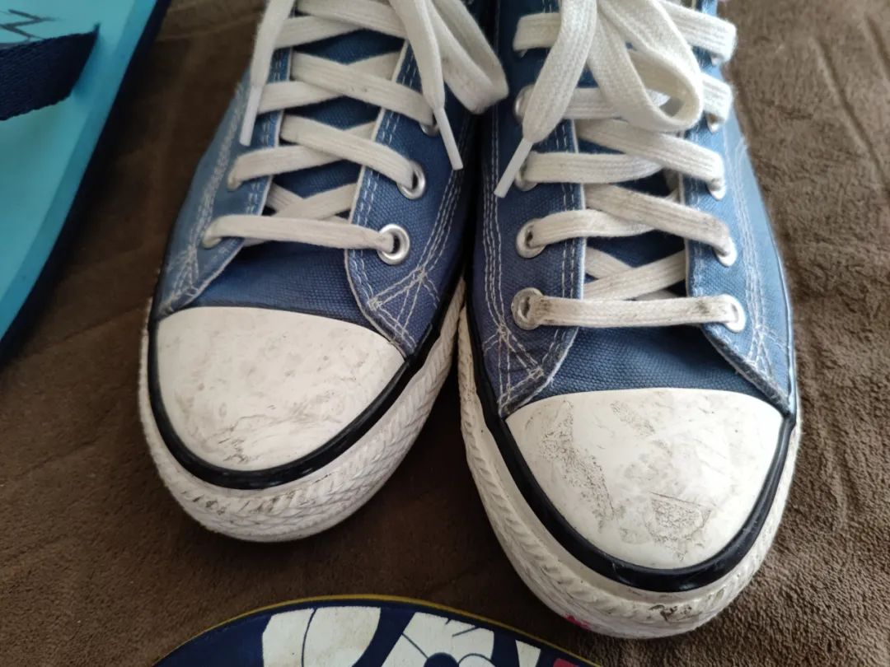

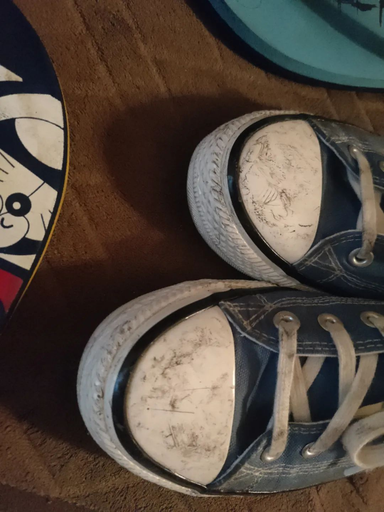

看起来就也还好。倒不是我刻意想拿着手机录一段、拍几张，而是确实有够热。

除吐槽外，蹦的感觉的确很棒很解压。或许，沉浸感只有在现场才能感受到：功放有多大，演出的时候哪些声音完全呲掉了嘶哑了崩溃了，为什么有人边哭边听、带着旗子来现场的人是有多快乐。

这次回长沙后，听到的乐队都有不小程度地依赖 Mlog. 有一个例外，是回春丹。回春丹请了调音，也请了灯光：于是现场的灯光舞美让人看起来有如孟京辉工作室出品的多像。感觉就像是在一场类似《空中花园谋杀案》里的灯光蹦迪。

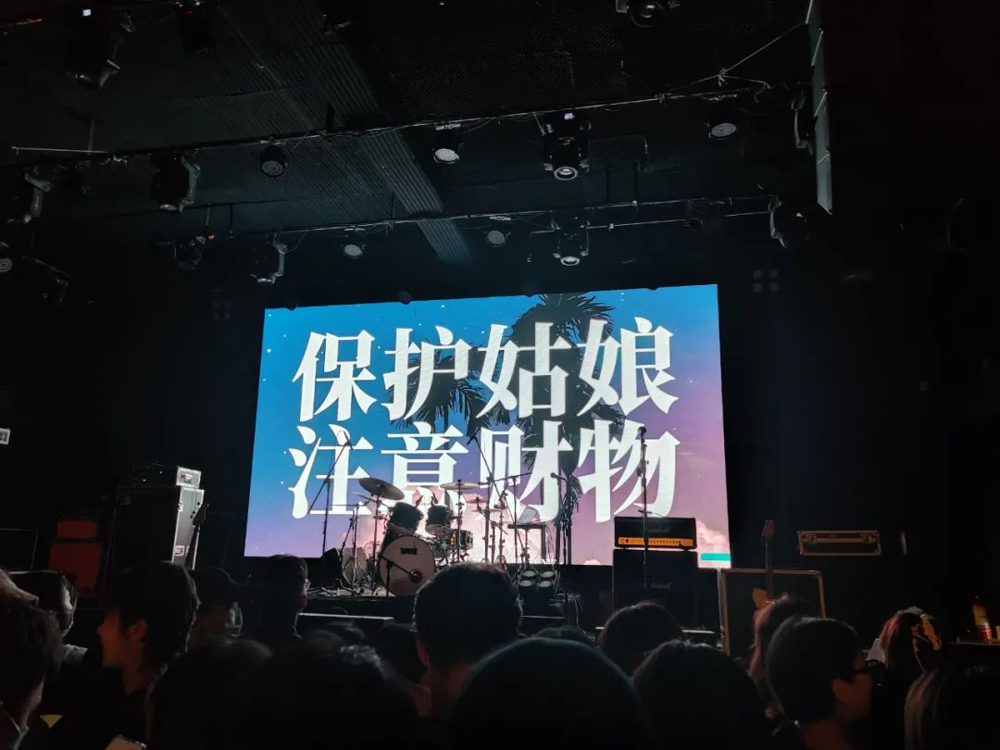

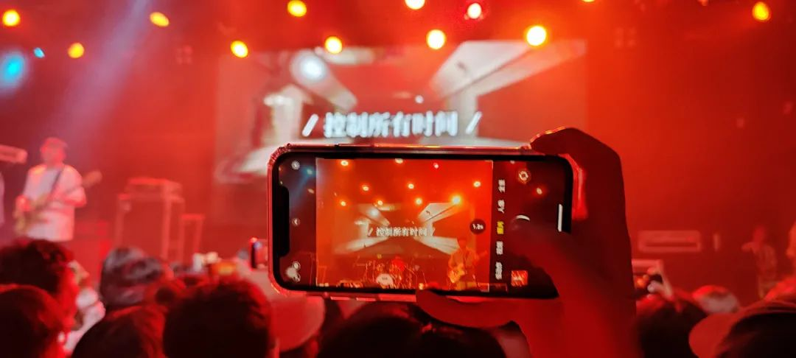

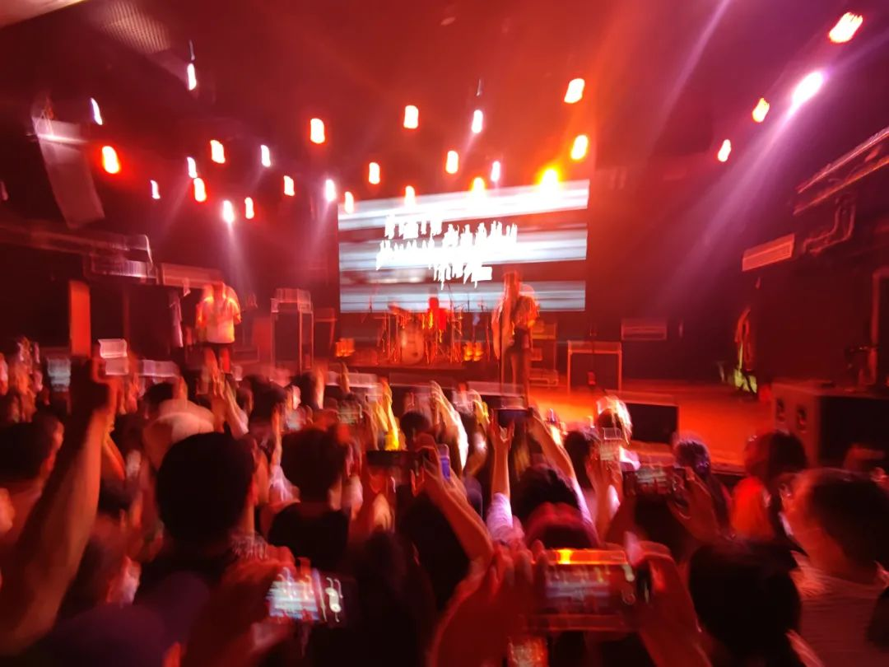

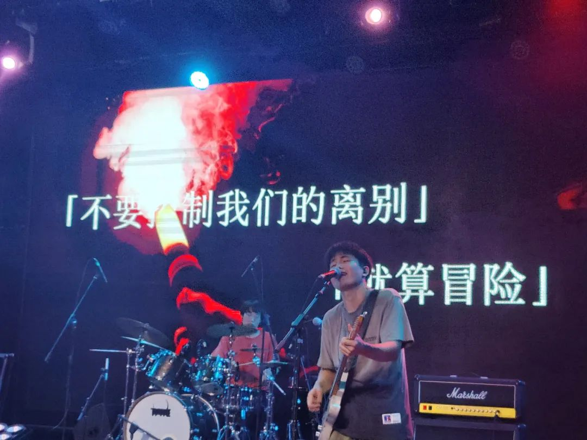

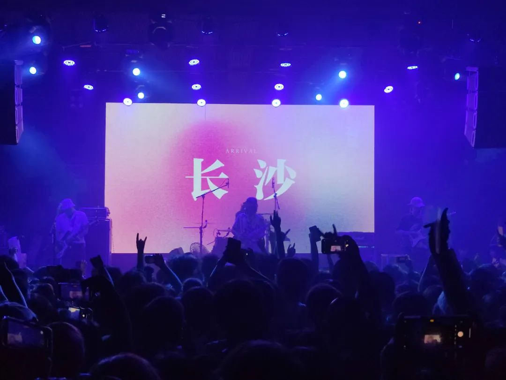

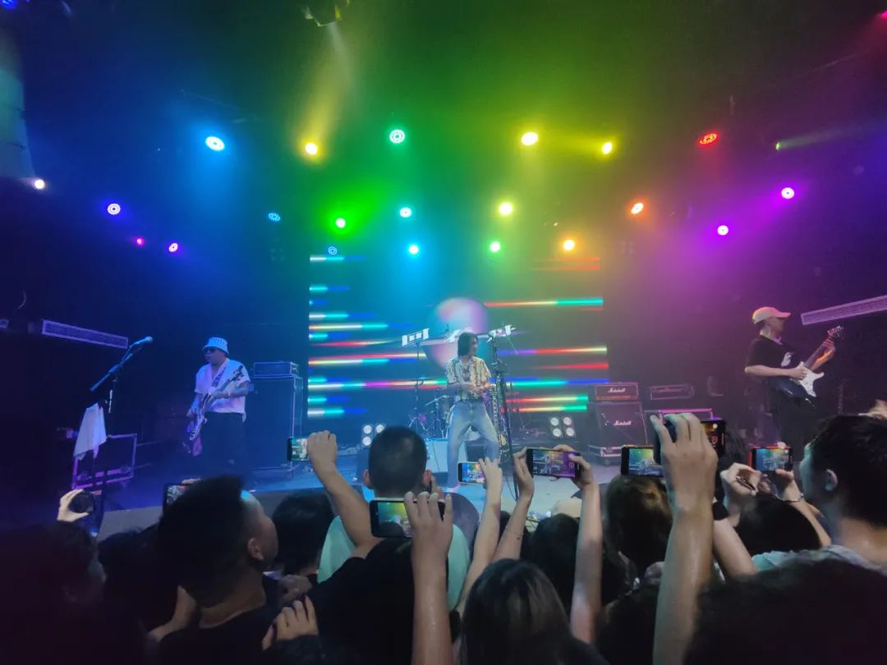

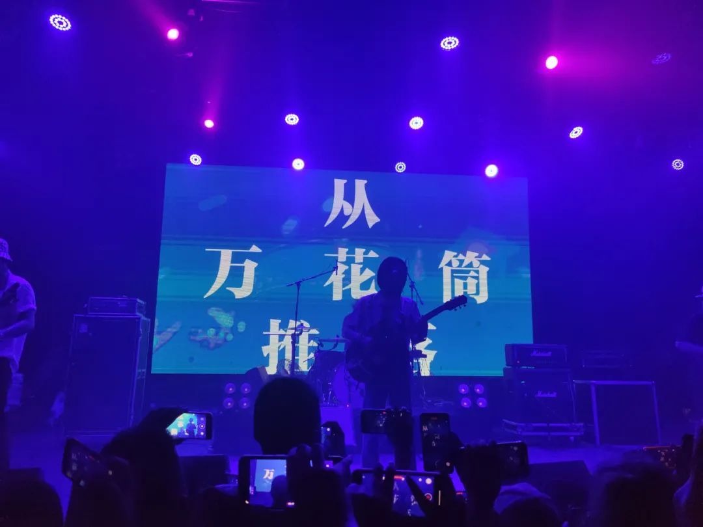

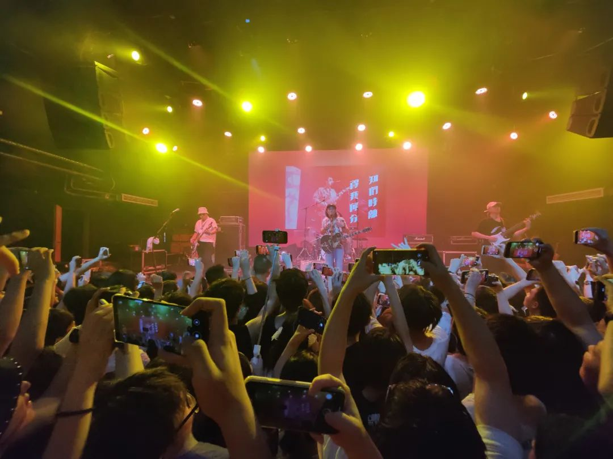

翻唱周星驰电影《食神》的片尾曲《初恋》，只有玩一下玩过去了的前面四句，大概是不在巡演歌单上吧。出后，我说我看了回春丹，于是被投喂了一把背景资料。

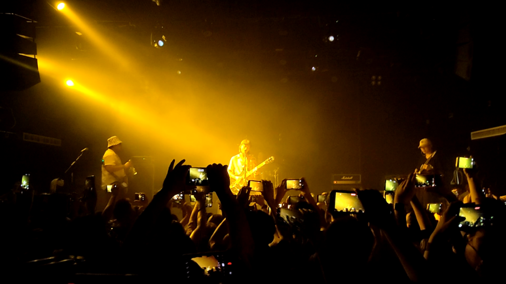

蹦之前，我对傻逼实习 Say No 了。职场 PUA ，加上欺骗性的招聘广告与从事内容，加上对薪酬的不明确描述，加上作为实习也不对我之后提供多少帮助。那这么一算起来，感觉就是在正常的时间离开了一个 suck 的岗位。跟我玩这套，做什么梦呢 hhh

音乐会给人以释放。不一定是摇滚，也可以有后朋克。我不太分的清这些流派，就好像我只知道哪些菜咸、哪些菜辣，其他的我并不知道。去的路上，朋友和我吐槽一些事情，吐槽完我说：“这就是我们现在坐在同一辆车上去蹦现场的原因。”一种释放压力的方式，也没有什么。如果不去追究来源，何苦拿着方式在这里说事。大家可不都是普通人。只能远程蹦的朋友可以私我要云盘链接，救个是个。

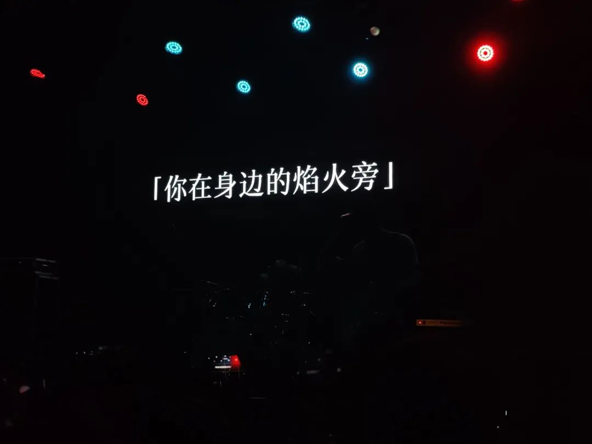
