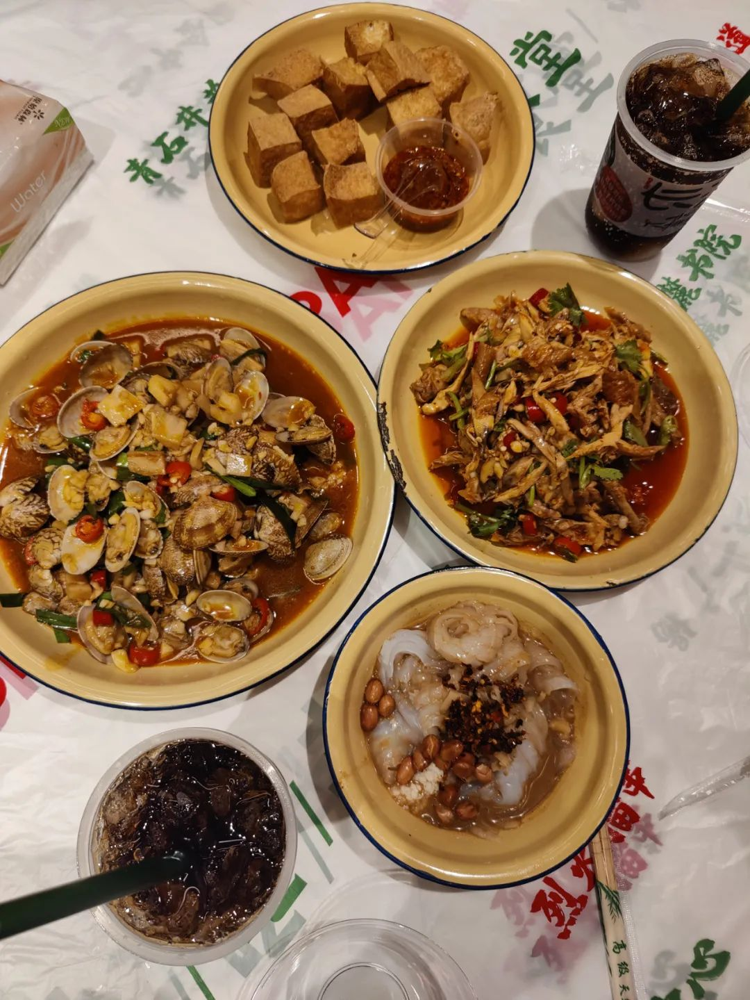
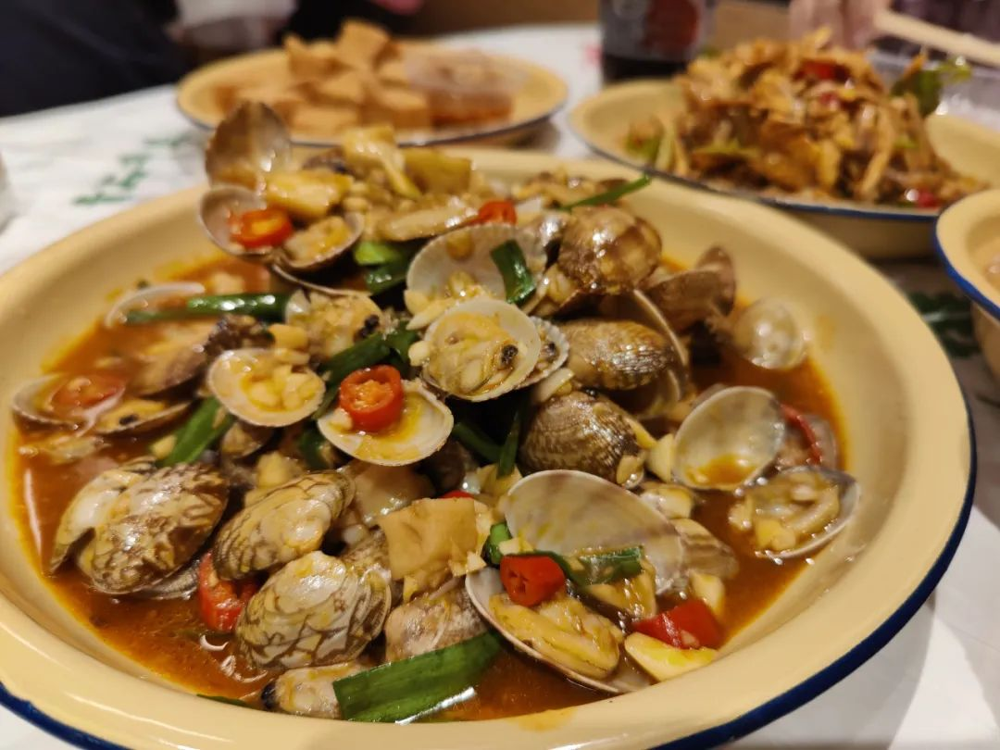
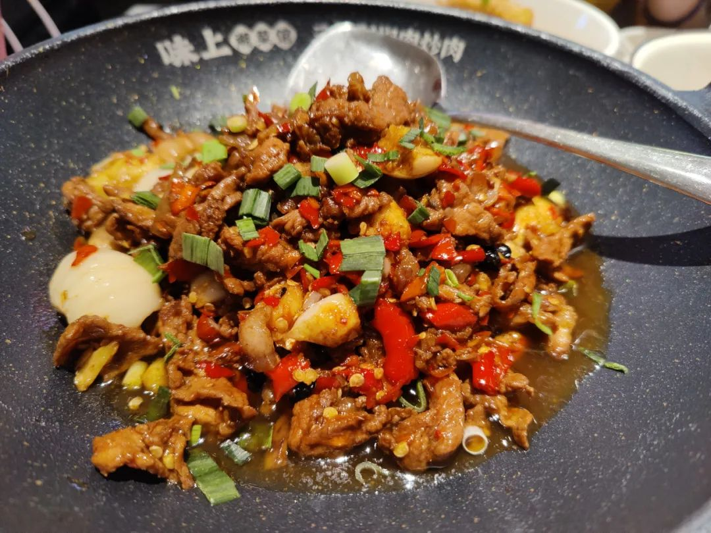
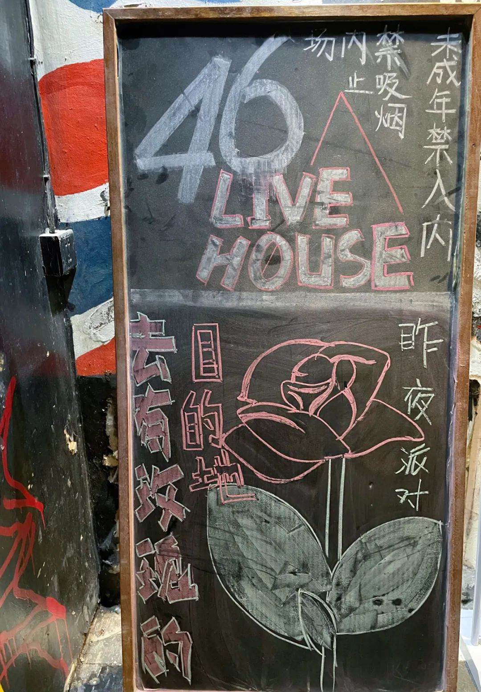
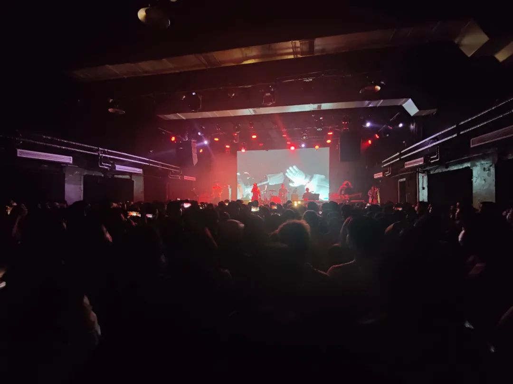
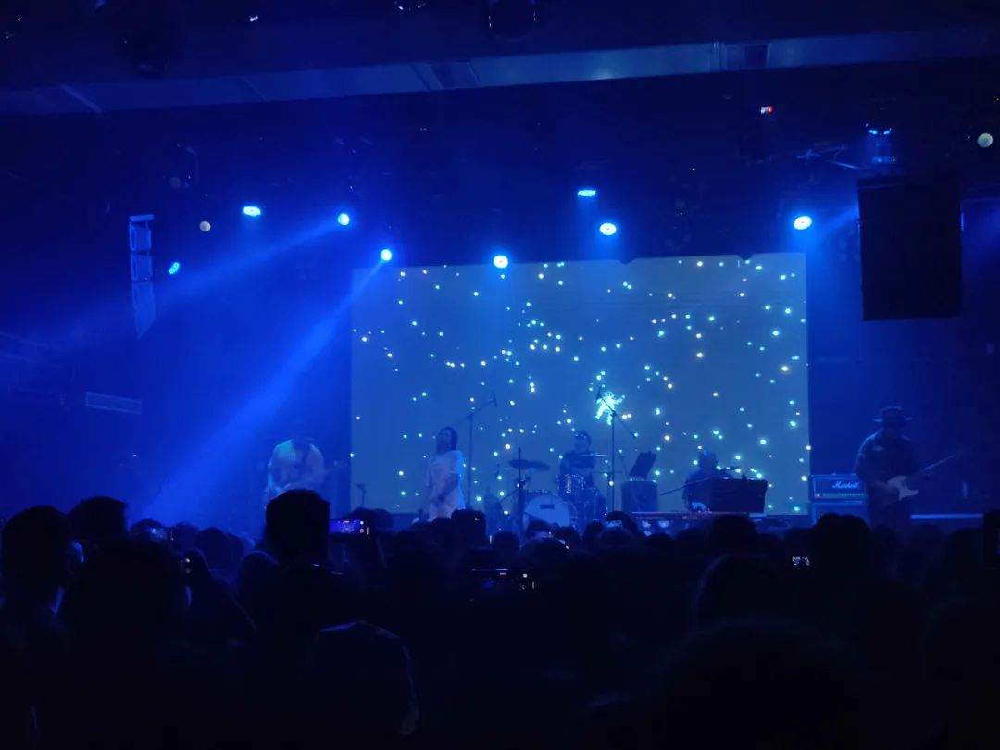
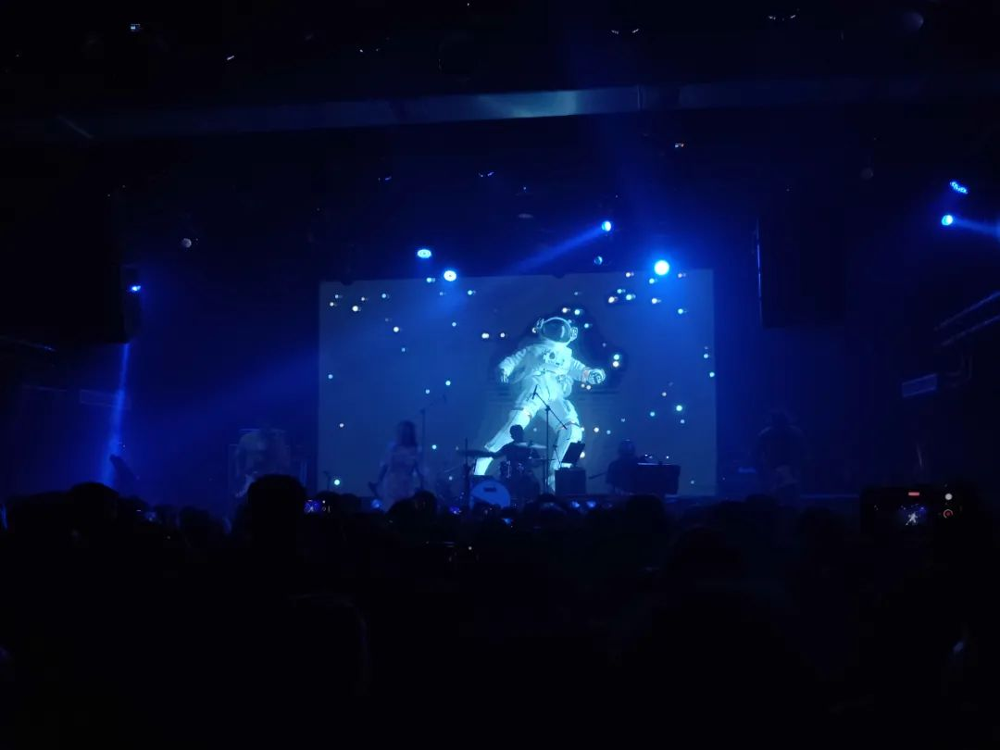
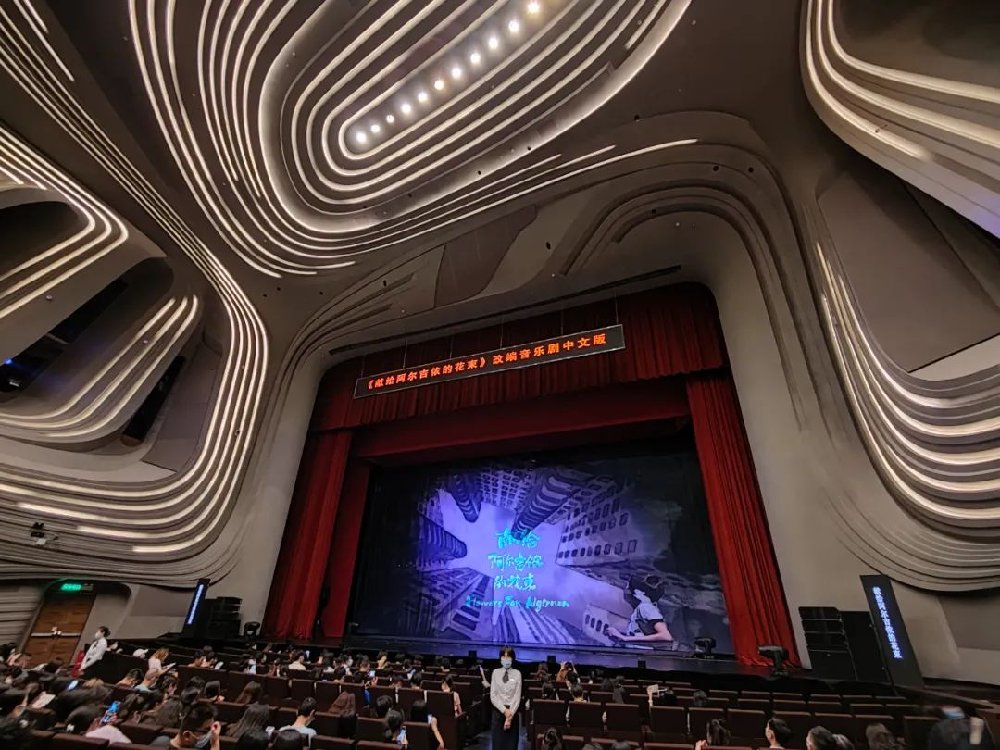
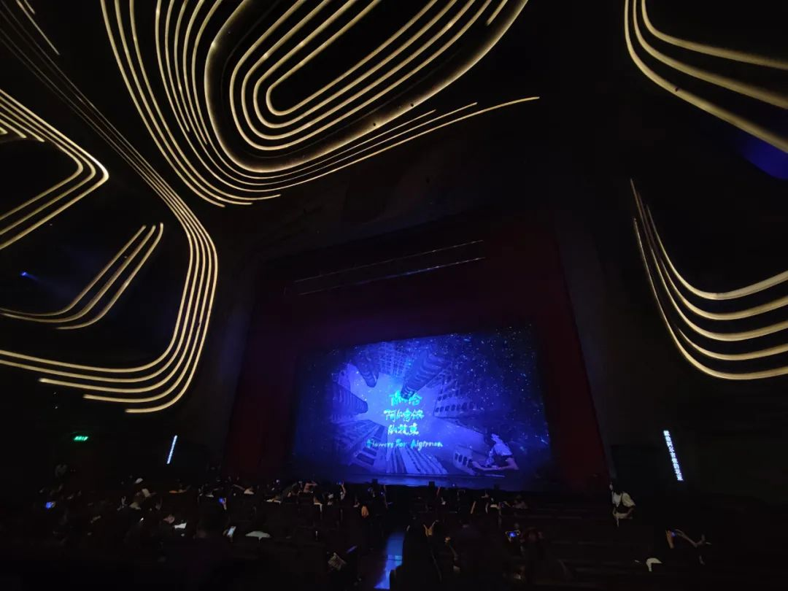
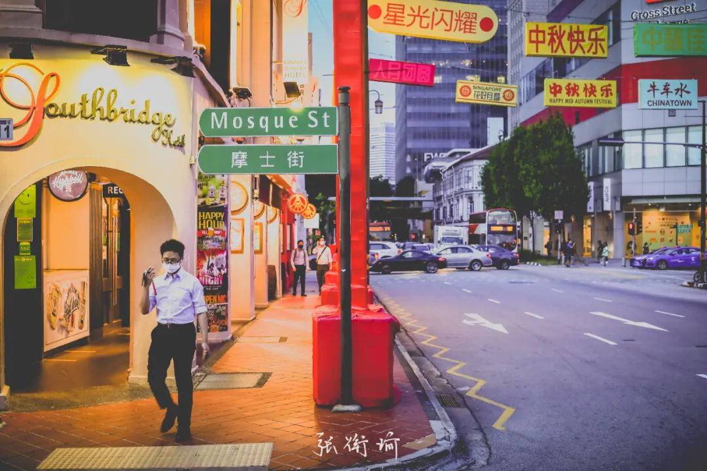

本文是张衔瑜第 209 篇推文

共计 1992 个字， 11 张图

我还是想写后疫情时代，因为感觉怎么写都写不够。除去前情提要式的铺垫之后，我想说的肯定不止是简单的“每个人的生活都被改变了”那么简单而草率。同时，也不会是“我恨死疫情了”、“都是 xx 惹的祸”、“希望疫情快过去吧 ( 合十 ) ”、“快去签名溯源调查”，倒不是说不应该这么做，而是因为除了呼告和既定动作之外，还有太多值得人反思的。

我主要指心理状态。前序的文章中有提到我在看《单读》的第 25 本（也可能是第 23 本），在记录讨论反思疫情。 2020 年上半年，国民对防控政策的拥护程度吓人地高，而且不断给自己加码：说户外空旷地方打球可以不戴口罩了还是要戴、进电梯之前喷酒精没用但还是要喷。 2020 年下半年，我不在国内，据说情况成了人们开始对所有有关疫情的事情觉得不耐烦。描述比例的话可能得说成是 a considerable proportion. 当然了，该有的防疫慰问、补贴、各种演出都也还没有少过，该给开的绿灯也还开着，但是人们从心理上是跨越不少以至于抵触的。时间段兴许还有延长，可以说要到庚子 - 辛丑的年关过后。

今年又不一样。今年这些直接的情绪都被疫情的次生影响带着走了。譬如，疫情导致的一些旅行无法正常开展，从一些城市旅行到另一些城市的时候会被防疫指挥部请去调查。更深层次地，因为疫情而影响到了经济的健康程度：自己气数已尽的尚且不管、一些招架不了疫情限制和经济减档换速的部分让结构上下都有些不安。

> 当 2020 年及之后出生的小孩 看 2019 及之前的人民生活纪录片 会不会突然发现： 原来人们不是生来就得戴口罩

当 2020 年及之后出生的小孩

看 2019 及之前的人民生活纪录片

会不会突然发现：

原来人们不是生来就得戴口罩

如此可以看待人们的心理防线。 从疫情刚到时候的过度防护，到暗戳戳的排斥和厌倦，到后来仅对次生本身纠缠在一起。

想做一个预测，但又发现做不出。坡县从原先每天无关联几例十几例就紧张到不行，到现在日增一千都还觉得自己不会玩脱，也只有一个月的时间。这个月月初都还在十位数，现在已经破千了。而那里只有多大呢？ 719 平方公里，不到长沙城区的开福区加上雨花区大，或者直接说没有一个岳麓区大。想做的心理预测，又觉得我应该到了环境中才能说得出来。

在英国的同学，反应最强烈的时候在群体免疫刚提出来的时候。那都已经是什么时候了呢？在美国的同学，除了一些人限制自己的脚步少出去，另一些人也不限制自己的脚步。我说不清，到底是放弃了还是不在意。

下一步会变成什么样呢？听一些“神救世人”的话吗？我对一些有强烈宗教信仰的人并无偏见，就按普通对人地那样对待。我所厌烦的是像和神佛做交易，跑到寺庙里去贿赂一下哪一位大慈大悲圣者，然后圣者就会帮你忙。帮到了就帮到了，没帮到就是自己命不好。我怎么觉得圣者是一位消极的黑社会家长，根本称不上大慈大悲。这些称谓都有很多种代换方式，为了不搞得像数学公式一样抽象，我就用了现有的表达。

上次和一位朋友说的时候， ta 说有些东西就是非线性的，表达和思维也是非线性的。我反问，那你知道什么是线性的吗？线性代数里左 2×3 右 3×2 可不可以相乘、左 2×2 右 1×2 可不可以相乘、左 4×2 右 2×3 可不可以相乘？

是不是因为不懂，所以才觉得简单。就好像对网络运作完全不懂的人，以为造几个网红出来就是动动嘴皮子的事：既投不下钱去做专业努力、又不想花时间来提升自己的水平。前几天看完了王小波写的《沉默的大多数》和《黄金时代》，前者中的一篇中说到和另一位浦东船厂的哥们儿去给一家店装修门脸，前后忙活了两个月，可最后还是让人施工队捞了活计去、分派工程后令人咋舌地做好了。

想事情不好玩。但是比只写我今天吃了什么要有趣。所以问题来了，我吃了什么呢？

东牌食堂，在长沙青石井巷。

应是原有东牌楼与西牌楼。东牌楼我小学中学经常去文艺汇演。

味上湘菜馆，很多地方都有。招牌炒肉做得很棒，冰粉不错、稍欠薄荷，其他平平。

昨夜派对 L. N. Party 很纯美的乐队，蹦起来很热情但不急躁，温泉享受带起伏。英文咬词在乐手里算很棒的了（没有在腹诽 GALA 的意思）我更爱编曲。

主唱叫我站在后排摇得很欢乐的男生，总是挥手朝我示意。我长得高是一方面，毕竟我是交钱来蹦的，难道来罚站吗？本来也很沉浸。

这就导致一个问题，我在昨天去梅溪湖看《献给阿尔吉侬的花束》的时候，音乐到位的时候我差点有一种要从椅子上站起来的感觉。阿尔吉侬和查理·高登开始在奖励机制下蹦跶起，我也有种要光速起飞的感觉。

后续就很精彩了。我没读过原作，不知道是原作这么精彩，还是这一版的台本幕间与舞美灯光就设计得精益求精。阿尔吉侬对生物伦理的反思，虽然我自己在生物医学工程系已经对细胞实验、动物实验这些的报批手续有多复杂了解甚多，但在文学作品 | 剧作中看到另外的视角又是另一种代入。更别说这是能到梅溪湖舞台上的音乐剧。

其结果是，我觉得这是我今年看过最棒的音乐剧。剧本伤也有，不过，应该就在昨天，这部剧收官到尾了。本来这一轮就是收官轮，收到长沙之后，为期三年的阿尔吉侬只剩下北京的五场。抢到了最后的场次是很幸运的。

去年在坡的中秋节@牛车水ChinaTown唐人街

交出封面祝大家节日快乐

