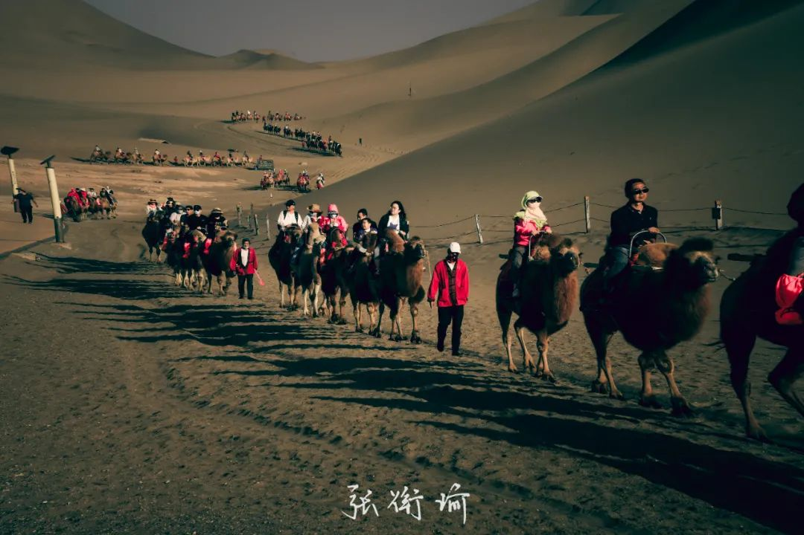
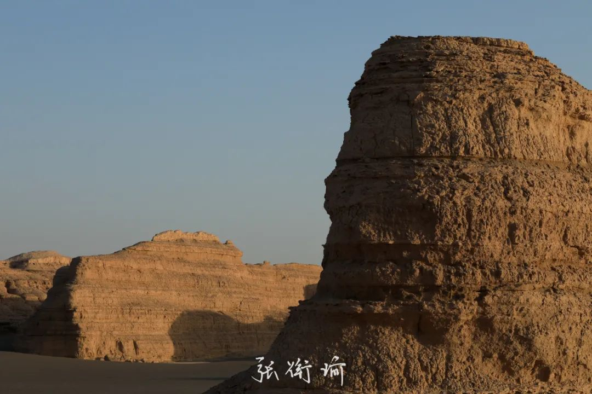
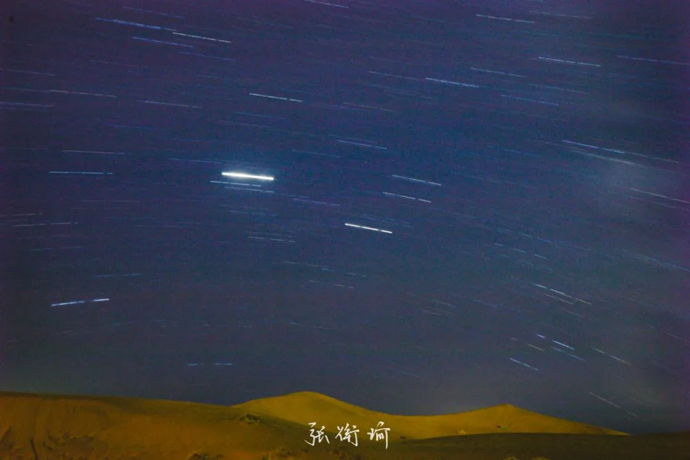

写下这个标题时，我还觉得有种身在西北的感觉。没有带唇膏 ( 而且也没有 ) ，所以嘴唇依然很干。一天喝八瓶水似乎也没有用。回长沙已经五个小时过去了，缓解了些，但还没有消去。

敦煌，一个已经在很多作品和宣传中被描摹过太多次了的地方。名字真的很美，敦为大、煌为盛。甘肃的这些名字都很美：兰州、张掖、武威、酒泉、敦煌。古诗词中已经描述过太多太多：嘉峪关、玉门关、阳关。随手一拈，沉甸甸的文学与历史典故都能给人砸出几个骨折。

( 敷衍的开头过去了，现在准备起飞 ) 虽然我在敦煌只停留了六天五晚，但整体的时长并不只有这么久。去敦煌之前，我简单地过完了三部纪录片《河西走廊》、《敦煌》、《敦煌画派》，其中也有不少重合之处。越往后，准入的专业门槛越高，也符合我的需要。

我对敦煌之行的期待是：一个人去自由自在地感受一些素有定评的艺术。艺术包括了纯粹自然的艺术像雅丹地貌和戈壁滩风光，也有前卫一点的现代雕塑与舞台剧，当然还有不能不提的莫高窟和榆林窟。既然原来的身份也有，于是我就找了几篇文献和学位论文来看。可惜我不学艺术方向，所以只能看个热闹，并不能去评判。

在这样的知识储备下，我到了敦煌。以及，开始了流水账式的记录。

《又见敦煌》剧场是我到敦煌后的第一站。我不能明确地定义这类叫什么，因为有舞台剧的元素、也有类似实景演出的手法。

我在这里、和后来在洞窟旁，都有还没看的人问我：你觉得你刚看的好看吗？我常常会反问一句：你的审美是什么？所以，如果很喜欢《印象刘三姐》、《桂林千古情》、《天门狐仙》、《炭河千古情》、《又见平遥》，那应该《又见敦煌》也不会太偏。可如果是深耕戏剧理论和舞台转场，挑食黎星林兆华孟京辉也就是不杂食，或许会不太受用。

较之 T 台走位一般的历史走马灯、沉浸剧本杀式的 break-up room 和最后的舞台汇演，我喜欢的是中间墙壁设计中的舞蹈与灯光。

剧场后，到了敦煌市中心也就是沙洲夜市的北上客栈。这家青旅应该是我见过的青旅里最干净，而且细节上把握地最好的一家。从进门开始，就没有觉得哪里不对，这样的细节功夫在青旅里已经非常难得。老板两位都兼具有青年文艺的气质和入世规划的干练，我想找 common area 的图但发现在屋里时我都没有拿出镜头。

尝试这样打比方：就好像在玩某一个需要经常跑图的游戏。在外边的时候可能是各种各样的杀戮打斗、当然也可能仅仅只是需要从这里到那里一边采集一边运什么，戳得满世界的 checkpoint 等你去一个个解除。在外的音乐通常是激越的、紧张的、甚至躁狂的。但是有大本营，异于小安全屋的地方，到这里之后连 BGM 都变得舒缓了起来，神经也变得放松。老板在这里布置了设备以支持胶卷冲洗、调音、冥想、露营，或许还有其他我没看出来门道的。就这样，青旅构成了我这几天高强度旅行后的休息点，而且也的确有 backup 到。

中心思想是，敦煌的北上客栈的确是我目前到过最棒的青年旅舍。

第二天清晨，即向东往瓜州行去。目的地是莫高窟的姊妹窟：榆林窟，以及沿途与不沿途的锁阳城和雕塑作品群。

之前在飞机上，从长沙中转兰州后来到敦煌，一路上窗外的景色有在渐次变换。两湖地区的岭和冲依然绿意丰盈。估摸着距离，离开常德恩施神农架一带后，绿植就像被理发师打薄。过秦岭到兰州附近，就只剩下防风固沙的植被，和愈发明显的沟壑。

祁连山、阿尔金山、当金山、昆仑山、焉支山。地理书原来是照实书就，只是面对同一方屏幕大小的人们已经成了想象力残废。

> 亡我祁连山，使我六畜不蕃息。亡我焉支山，使我妇女无颜色。

从敦煌市上高速，转过城里的部分后，突然某一刻，视野两边的景色都变得开阔了起来。那感觉就像是在城市生活中被动敷衍了太久，现在有了真实可触的祁连大山给人以压迫。仅仅一个转弯过去，人情不自禁地“哇”出来。这是此行中，开始说感受祖国九百六十万平方公里陆地国土上各种奇伟瑰怪的开始。

G3011 高速旁是省道，省道旁是铁路。早晨十点，开车走在高速上，并排了一趟火车一齐向前。描述旅途，多是有含时参量的。如前所述“哇”地一声，只是在那一下，后续的余威很短。而更多数的时候，譬如并着火车向前，时间维度会在此延展成长长的一段。看着路的我，余光瞟瞟几个镜子、又看看一望无际的沙漠上穿行着的火车。人的触感和视听都在那时间延伸开来：茫茫是茫然的茫、是苍茫的茫。

某一刻我觉得，该走了。于是就一脚油门下去，对着反光镜里没有人回应的火车挥了挥手。

从柳格高速下来后，路过雕塑群和锁阳城镇，就来到了另一片戈壁自然生态保护区。也许保护区不叫这个名字，因为自驾，我并没有腾出手来记录路边的路牌，只记得有一片保护区让我遵守没有 highlight 细则的法律法规。不过我本来只是普通观光客。以及还接到了红西路军纪念馆的邀请短信。

离开镇子后，道路穿行于沙漠而一直通往大山中。山并非南方所理解的山：淙淙溪流与茂林修竹，这里的山是粗犷而野性的夯土成山。防风固沙的白杨 / 胡杨树退向更远处，眼前的大山却不见得近。目力所及的范围也许已是十几公里远，因而导航常常摆一个“继续行程几十公里”后而自行歇息。所有的这一切，都在时空上给人离退于外的平静感。可以想任何自己踌躇不定的事，只要不翻车；可以什么也不想就干坐着，只要不翻车。

终于到了榆林窟，这时离我早上出发，已经过去了三个小时。写榆林窟的时候，我拿出了在手边记载内容的笔记本。相对而言，用手机记录没有那么礼貌。

榆林窟分为普通窟和特窟。四个普窟一共 40 ，特窟则 100-250 不等。我都看了。

普窟为 11 、 12 、 17 、 19 ，特窟为 25 、 3 、 2 、 4

西方净土变、结跏趺坐 | 半跏趺坐、观无量经变、妙音鸟、珈琳颦伽。这些原本在纪录片里的词，即在窟中出现在了眼前。天龙八部众的体现、显教与密教在仪轨上的区分，文殊菩萨与普贤菩萨在画法上的异同。讲解员还讲了很多，榆林窟莫高窟里我一共写了三页笔记。尝试降低艺术赏析门槛后，我想说说看到时候的感受。

震撼，这是一个有些口袋化的形容。被城市生活异化了的人们，亲临现场看到古老的传世绘画，才惊觉：原来在物质匮乏的时代，有人可以在艺术上攀登上如此的高峰。那种感觉远非“震撼”一词所能写尽。因为那时间感到的是重新对周遭世界的认识、对净土世界的幻想和用技艺打底，这所有一切都登峰造极的惊异。原来这也是人类。

像榆林窟第三窟，是我这次在榆林窟最想看到的普贤变。在严格的汉传佛教仪轨下，普贤菩萨由天王、童子侍从出行，接受玄奘的朝拜。我想接续上边的异化来继续说。当看到这些壁画时，听到的是“这幅绘于西夏”、“普贤手执梵筐”，但心思早已经飞出很远了。

不能说以前的心灵叫干涸，那样太抽象。人原本可以控制的东西，反过来捕获了人，为异化。当所居同层同质，自然也会同温，不会去想象世界外还会是什么样。洞窟艺术就像一柄木槌法器，敲击在这些裂开的土地上。原来西夏年间，人们对于从来没有见过的佛国世界是这样构想的。他们当时绘制文殊变与普贤变时，也在哪些程度上参考了平常人的生活吗？

天乐不鼓自鸣，意思是琵琶、排箫、箜篌这些乐器飞在天空中的时候都不需要人去奏鸣——它们自己就可以处理好。我猜测，也许在敦煌石窟艺术中感受到了冲击的人，都有激发了自己本身活力的成分在之中。对原本的生活状态颇有微词也好、想来到石窟艺术中有一次提升也好，自己本身活力的激活是在看到艺术群像时下意识地一个激灵。

最后一个特窟，只有我一位游客。讲解员说，第四窟是目前大部分内容都还说不明白的一个窟。只能断定朝代在元代，具体的内容对应须得去翻阅佛家经典。而有些佛家经典秘不示人，它们可能还在某位藏地寺庙的喇嘛那里。那些人过来之后，也许也不需要怎么讲解，自己就能看懂，而普通游客除了能比较好理解经变画内容，其他的就比较难了。

不过，我并非需要看热闹的游客。能解读透彻的是风景，不能解读透彻的难道就不叫了吗？拍照培养人的点，在慢慢有自己的视角去观察。好像是不同的到达途径：有条分缕析因为在哪本经书上描述了什么、旁边的洞窟也这么画的，所以这里画的是什么什么，表达了什么什么；也有这些都不管，我看到了什么，于是我感觉到了什么。就好像一场梦，弗洛伊德和荣格抢着来解释潜意识等等普通人说不上来的名词，但是做梦的人记下来的是一种感受。做梦的人甚至不好名状，到底是这样呢？还是那样呢？

我曾经喝过一种水，水温很好。有人拿着冷水和热水放在我左右手边，让我碰碰这个、碰碰那个，“是更冷水一点呢还是更热水一点呢”，然后勾兑一下，接着再来。我能读到很多数学的思想方法，自己在高数课上也都学过。看敦煌的石窟时，这些会被放置在一旁。榆林窟第二窟绘有释迦说法，沥粉堆金以成像。中原入南宋，就算到了现代也还是能感受到其法相。多少年了呢？再看看现在人生不满百的别人呗。

离开榆林窟后，顺路去了锁阳城。锁阳城是以前瓜州这里的夯土城池，内城外郭看得很清楚。还有据说安放了佛骨舍利的塔尔寺，和西宁的不一样，但也叫这个名字。瓜州以前叫安西县，《送元二使安西》的安西指的却不是这里。故事指的是龟兹，在新疆境内。

我望着远远的一条护坡，问讲解员那是什么。讲解员说，那是一道防洪堤 / 防洪护坡。我心里一阵错愕，一个年降水量 50mm 左右但是蒸发量几倍于降水量的地方，哪来的洪水？讲解员说在每年的五六月间，这边雪山融水和降雨一起来。只需要预报开始后一个小时后，降水洪水就能从山区冲到城边。有很重要的因素，是地面因为长期没有降水，所以根本不吸水。看到的骆驼刺虽然地标只有一点点，但是向下找水的根系发达得超乎人想象。

于是这就是一种，我大西北自有地域特色在的感觉。

离开锁阳城，离雕塑建筑群还有几十公里。完成了一天要踩时间的景点，根本不急。歌单正好切到了回春丹的『初恋』，一切都很棒。我放下所有的车窗，伸手在车外。保证安全的前提下，随心所欲地大喊、摇动、背诗或者营造一些我觉得应该是那样但也说不出来为什么的肢体-口头语言组合。一切都很自在。除了道路上的交通法规之外，没什么要受的限制：何必呢没人管我唱歌时多大声、背的诗缺漏了多少。切到痛仰乐队的 的『西湖』就算行车在戈壁的防护林内，知道外面是沙漠，也不失敞阔。

在太阳落山前，赶到了雕塑建筑群附近。从高速路口到锁阳城，有张骞头像、大地之子、无界，还有其他不知道名字的。 我在这个不知道名字的地方拍了影子自拍，又在清华美院做的无界旁边拍了日落。

目前还搞不明白的是，我从无界看完日落后下到县道上，看到的究竟是什么？在我视线前方，也就是西偏北方向上出现了一抹不薄但是很短的云。云向着日落的日头方向，仔细看还能看到端上有一个明亮些的小点。起初我只是疑惑这是什么，但是穿行在大山中发现有云有在动，于是决定停下来找一找。可是等到开到张骞附近的停车点时，天空中的样子已经消失不见。

牧夫天文没有发说那天日落后会有什么不一样。和一位天文爱好者问过后，觉得不是火流星而且也不像彗星。记录一个问号咯。

这一天也被制裁了一下。我带了两瓶 1.5 升的水和两瓶 500 mL 的水出门，外加一盒奥利奥，构成了我早餐后吃过的所有东西。即使这样，嘴唇还是干裂到仿若山河表里潼关路。

又开车又玩，还是有点疲劳。所以开高速去，走省道回。走省道回敦煌这会儿正前方就是金星，金星在天空中的位置是直接省道对着的位置。这是自己开车才能有的体验，像是星星在指着路回去。值得一提的是，停车去路边休息的时候，看到了几只黄羊因为车灯而受到了惊扰。等我打开相机时，它们已经消失不见。

第二天一早去莫高窟。关于莫高窟的艺术地位和景区体验，在看完纪录片也看了许多攻略推荐之后，也知道了一些。

数字敦煌看的影片，往往无出纪录片之右。正好凳子、椅背也都很舒服，起得实在太早于是我也在这边睡得挺香。

据说莫高窟有三个游览必然经过的洞窟：藏经洞、九层塔和涅槃卧佛。至此，藏经洞旁的主殿内就已经进入文物保护阶段，只遥遥地看着一众游客。

莫高窟是八个普通洞窟加四个额外的付费特窟。法华经变、妙法莲花经、供养人。能看到榆林窟是莫高窟的姊妹窟，从形式到内核也都分享着很多相通之处。千佛影布与壁上，千佛有千面与千名。让人想起千江有水千江月。讲解员还提到了很多回鹘 / 回纥等河西走廊 - 丝绸之路上的民众生活场景。如果我的脑子还在处理社会与人文地理信息的话，也许会蛮认真的听讲。可也如在榆林窟一样，没人能不被这些艺术本身所吸引。

“萨埵太子舍身饲虎图，刚刚大家在数字影片中看到的，其原作就正在大家的眼前。”听到像这样的话，任何一个内心戏足够的人都早已把心里的剧场开到了海角天涯。

飞天。敦煌怎么能绕开飞天。为什么会有飞天呢？飞天从笨拙的样子像要往下掉，到后来真正轻盈的舞姿。第 427 窟和第 428 窟，飞天是在佛祖讲经的时候，讲到真正欢快的地方而有的一阵法喜飞天。散花、礼赞，轻盈的仙人们经由飞天，为佛祖的讲经团簇了就像有香味从壁上弥散出来。特窟 321 窟，飞天茅台的原型也就在此。

禅定，第 259 窟禅定。进门时，我走在最后，恰好站在了禅定佛旁边。那种笑，有描述说是深沉恬静。我以为很妙。禅定佛其本身，妙在不管从什么角度看，讲解员变换了多个角度的灯光，禅定笑容都是一样令人感到安神入定。如此造像，对现代常常都市生活的人们而言，谈皈依感有些刻意，但是向往这种生活状态 ( 即使是木胎泥塑也 ) 是件很自然的事情。

进入特窟 46 ，发现塑像中甚至带起了空气感。束带流转，手工的捏造或归功于技法的锤炼，但是什么样的人才会在脑中预构出来一个这样的形象呢？性格的把握与风格的形成，会觉得是在和真人交谈。而这位真人，是真实存在的佛法修行至大乘的菩萨。再谈 57 窟，沥粉堆金的美人窟会觉得果真是初唐世界。后来发现，画面连玻璃杯的不同折射都构成了，那么是不是就在想“众人是未开悟的佛，佛是开悟了的众人”这种道理。

我不是佛教徒，也没有宗教偏好。莫高窟和榆林窟内虽然筑有佛龛，但是把除募捐箱之外的敬香处都悉数移除。最后一窟北凉时期的犍陀罗艺术窟，佛龛甚至出现了专仿的阙形象。这和我在榆林窟的特窟最后一样，也是一座研究价值大于观赏价值的窟。我们游客进去前，还有想研究人员模样的人在里边讨论。

莫高窟第 3 窟千手千眼观音常年不开。也许以后会有机会在淡季过来，看到 220 窟的弥勒讲经和维摩诘经变。但其实也还行，因为在榆林窟第 3 窟的文殊变与普贤变之间，便是维摩诘居士与弥勒辩论。可惜没有带小望远镜。除此的确看不到的之外，想看的也都已看到。

后来我在想一个问题：为什么强调说洞窟要到当地去看呢？即使我们现在已经有数字敦煌，有多种复原件临摹本，而且在现场的每一个人每一次呼吸的温湿度变化都会对壁画 & 塑像造成影响，那我们为什么还要去现场当地。我想，这是因为在现场才能保持观察的连续性、思考和感受的连续性。

我说的连续性不是指的画画的连续性。画画的连续性最扎实的肯定是一个个洞窟地临摹过来，在临摹中感受技法工法的巧妙之处。我说的是作为普通观赏者的连续性，莫高窟景区的普通窟一共 12 条线，都已经把要看哪些时代的哪些窟安排好。这时候是作为一个观察的主体进入到景点内。换而言之，在纪录片看到的大小、缩放，是人为已经控制好了的放大和缩小，摄像机已经在合理的地方预升至对应高度。而普通游客不一样，当我在看四五米高的普贤变壁画时，我站在跟前会明显知道画有多大、有多少压迫；当我在禅定佛跟前时，我能自主地凑近去看看禅定佛嘴角勾勒的线。

能做到以上的实地前往，再借助既往的全部人生经历、纪录片的分析和讲解员的解读，艺术的感受才这样一步步被推开大门。虽然，也许说下次随机拿两个洞窟来，问我这个是属于隋朝时期还是中唐时期，大多数情况下我会说我不知道。也的确不知道。但好像是在没有窜入各种本本和教条的时候，感觉到了一些粗糙但原本的快乐。

从莫高窟离开后，去了趟鸣沙山 - 月牙泉。路边有秋英和铁线莲。我脱了鞋子开始爬沙山，写到这里提醒我：得把相机拿去清灰。底下的骆驼，山顶望下看到一泓月牙泉。从山顶下来，每一脚都是流沙。沙子本身还挺棒。

上山比普通爬山要累很多，即使已经有木质的天梯放着。下山有下得快的，也有下得慢的。我属于后者。所以下着下着就开始拍照。拍一会儿再下。因为没什么要写的，就用图来记述。

笑说，这次来敦煌虽然是独自旅行，但是在这样的时候却越发把时间弄得紧张。榆林窟是往东的长线，莫高窟是市区不远的地方，西边则是另一条长线：到阳关、玉门关和雅丹魔鬼城。两条线的全程都接近四百公里，包车的话差不多都合四百一天包干，租车也不会偏太多。只是在我的理念中，到的景点是风景，一路上因为有驾驶位而集中精力见到的周边环境，也同样是风物。

去西线时，有位也是独自旅行的小伙伴一起走。自驾，可以交替着开车。

西出敦煌市区后，视野又变得渺茫了起来：能见的植被都渺小、旷远的沙漠令人觉得茫茫。无数戍边送别的诗文都要提到这两处：阳关、玉门关。都别说人家，我在去过西线后，告诉其他人要注意带足水、带够吃的，那也有西出阳关无故人的感觉。

阳关景区一般般，我们开车到了门口，也遵照着其他旅游攻略所说的那样没有再进去。这里是西线离敦煌市区最近的点，不曾想，也是最后一个有饭店的点。再往西就只有玉门关的景区餐厅，到雅丹魔鬼城之后，往里开就是无人区了，得进了新疆的城镇才有下一个补给点。

玉门关有汉代的长城遗址，烽燧与垛口，甚至能看到里边的芨芨草。秦时明月汉时关，甚至可以遥想霍去病带兵打河西走廊时，穿越都没有设立关隘的地方一路引奇兵入阵，天下莫不称道。

雅丹魔鬼城，主要是看雅丹地貌。再远，就要开专门的野营露营车去。再远，就进入新疆了。按地质知识来推测，也许那会是罗布泊了。雅丹是一种风蚀地貌，记得小时候都有在课本上看到过彭加木和余纯顺，想来是再往前了。

地质结构，多靠想象。

但是刚刚看完榆林窟和莫高窟的人，有很多发挥空间。交封。

回程

到敦煌市区后，发现已经好几天没有正经吃饭了。于是找了壹格胡杨焖饼，却发现焖面其实并吃不下。倒是沙葱炒蛋和杏皮水的味道不错。

这一次的吃都不多，后一天中午吃的驴肉黄面长这样。

最后一天的早餐一顿半也记在这里。信得过兰州拉面 ( 我点的韭叶 ) 和杨老五羊杂土豆粉。

比较好玩的可能是看对桌的人吃羊脑壳。我从没见过人撕着馕然后水煮白肉蘸一点盐巴辣椒面就这样吃。后来我也要了一个馕 ( 没要个羊脑壳怕吃不地道 ) ，撕馕饼的时候就觉得一股西北风情扑面而来。

没睡好，所以补了个觉。出门旅个游，悲悲惨惨开了四个会。开完会跑去了敦煌市博物馆，虽然有复原的莫高窟第 3 窟千手千眼观音和第 46 窟菩萨如宫娃，但是我对此并不太感兴趣。绕了一圈出来，把原来在纪录片中反复强化过的记忆又深刻了一遍之后，不到一个小时我就离开了敦煌市博物馆。

看时间还早，就去了一趟西晋壁画墓。说实话有点瘆人。的士从普通道路上拐入砂砾石铺就的简易道路，两边从路到三危山边全是各个时期的墓葬。由于地形平坦，又没有什么遮拦，于是看过去就全是一个个的土堆或者称坟方。司机师傅是位西北大汉，说没什么人会选择到这边来。

景点总共有两个墓，一个是汉代的、一个是西晋的。二十分钟前，我在敦煌博物馆看复原的时候还不觉得，但是进入墓道内却感觉一阵凉意。讲解员在给我讲完墓主人生平和纹饰与绘画代表后，自己弯下腰，从墓道进了墓室里去。虽然许久前就看过《盗墓笔记》和《鬼吹灯》，但也许是体质比较特别，进入明知是墓道、甬道、墓室的地方还是会觉得渗人。其中西晋墓上有一个打得非常漂亮的盗洞，有如八十年代的摸金校尉。

敦煌博物馆是因为太少内容，壁画墓是因为太瘆人，所以草草地结束了下午的行程。

回长沙的前一天晚上原本是聪明的行程：因为晚上的行程是去沙漠腹地里晚餐和露营看星空。前边的文字记载，到这里已经转入纯图。

我在朋友圈写：

> 和天南海北的朋友们聊着天 突发奇想觉得要从帐篷里出来看看 抬头 一颗流星从英仙座开始划过三角星系消失在双鱼座

和天南海北的朋友们聊着天

突发奇想觉得要从帐篷里出来看看

抬头

一颗流星从英仙座开始划过三角星系消失在双鱼座

现在想想，上一次看到流星，也是差不多同一时间： 两年前，也是踩点在国庆节前出去玩，班聚自驾去武汉木兰草原露营。 缘分描述的是一种性质： 既有偶然性，又有确定性。 流星和时间都转瞬即逝。

河西走廊第一次有中原王朝的身影时，是汉朝建元三年。那一年，张骞 27 岁，汉武帝刘彻 19 岁。这个公众号是我成年的当天，送自己的生日礼物，到今天写下这篇，也并不久。仰望同一片天空下，站立着同样的土地、沙漠。

万能青年旅店的歌词里写道：星河下，电子荒原，亿万场冷暖，亿万泥污人。和青旅里遇到的朋友聊天，就总会有这种感觉。没有谁是一座孤岛，但想做的事情又有些坎坷。或者陌生网络社交平台也是。匆匆而过的时候，看看人家完全或者不完全的人生，审视自己缺残或有完美的思路。由此上达群星，是许多渺小或短暂的移动构成了整片的夜空。独自在敦煌的旅程，也显然会有一个结束。希望再少一些人为束缚与自卸手脚，再少。这一段的句子，不非得相互关联。可以看做是回车键诗人没有了\n

