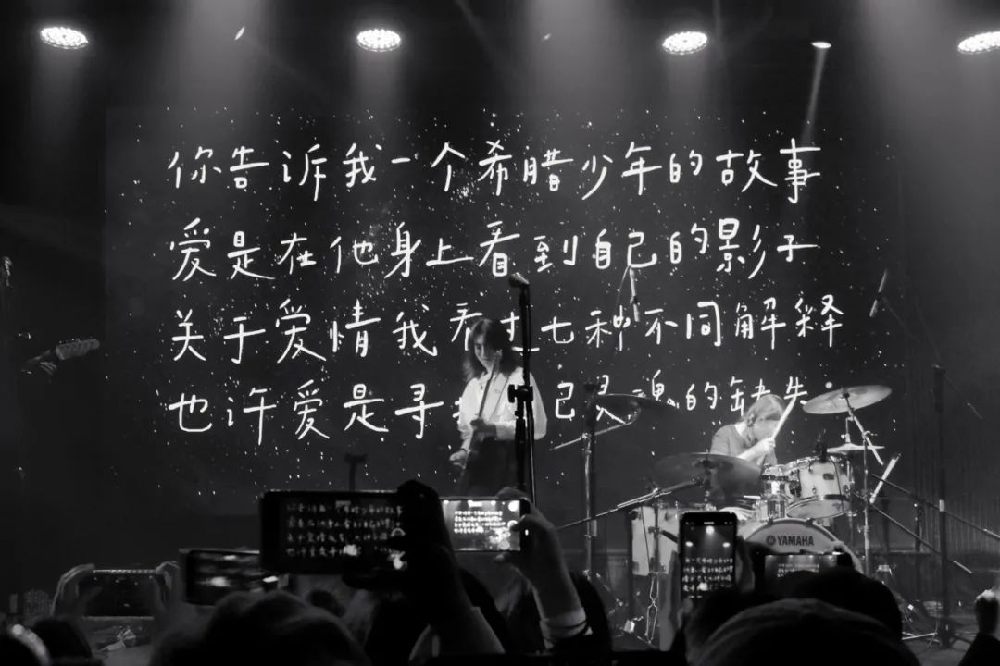
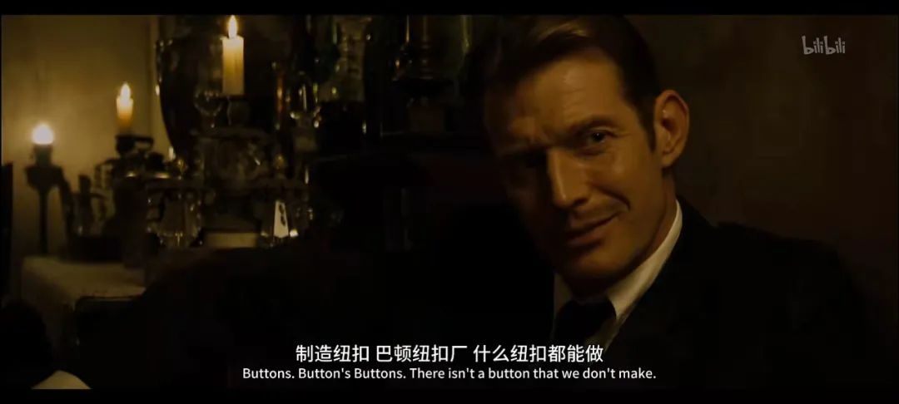

本文是张衔瑜第 213 篇推文

共计 1267 个字， 2 张图

写尬走篇的时候，很多小想法写进去就会有些突兀。虽然有很多种手法可以去处理，就像一道菜，用很多方法可以掩盖一些味道或者把前序的瑕疵隐藏起来。我选择把它们搁置。

往往这样的搁置，一晃就是很久。也许在近三四次我去翻备忘录的时候能找到，并且想方设法加塞到新地方；也许我找不到它们了；也许我就让它们过去了，就像我走路会想象人行道中间有一块石头所以我会突然跳起来一下跳过那块石头。但其实这里并没有石头。也许我所说的突兀不曾存在。

这很重要。所以这不是前话，这是正文。

去了一趟 Schoolgirl Byebye 的现场。以前我经常是不是哼出来他们的一句歌词“ 我可以把自己拜托给耳机” 感觉就像疫情以前我说自己出门 “没带耳机就像没穿衣服，没戴口罩就像没穿裤子” 的裸奔形容。当然他们的语句用词要美得多。

. 你告诉我一个希腊少年的故事 .

. 爱是在他身上看到自己的影子 .

. 关于爱情我看过七种不同解释 .

. 也许爱是寻找自己灵魂的缺失 .

有人问我为什么最近突然感觉独立、小众乐队出来了这么多而且很多是台湾的。于是有或曰：台湾的特产是什么？答：乐队。需要指出的是 SGBB 不是台湾乐队而是南京的乐队，和后来的帆布小镇一样都是。这里不谈 01 的问题。

SGBB 现场蹦不起来。虽然没有觉得烦，但是想去跟着蹦的人自己成了气氛组。是多少有点无聊的一场。

也去了正儿八经的舞剧，谢欣和黎星主演的《一撇一捺》属于是临时起意然后突然冲过去。疫情之前，应该说是疫情正开始的时候 2020.01.13 武汉封城前十天在琴台看的黎星工作室《大饭店》比对这一次感觉工作室的创作力依然招展。

当代最富表现力的舞者，和最令人发困的音乐。上次是一起去的 soda对 穿了棉袄直接在《大饭店》的上半场睡得香香地睡到了下半场，这一次换我恍恍惚惚“他们在干什么 wait 谁出现了”

看了两部电影《波斯语课》和《本杰明·巴顿奇事》两部都是听了很久很久。前一部虽然已经不记得内容了但是知道三号厅有安利过。后者就是仅仅听过名字，记得有安利这么一回事但是可能是 recurrence 在作怪。

前者真的很不错。长镜头也很让人喜欢。

后者除了那些已经被评论说的差不多的，应该就是这一句烂梗：

BenjaminButton:

——What line of work you in, Mr. Button?

TomasButton:

烂梗和冷笑话实在是太有趣了。深秋初冬就应该多一点冷笑话，这样才能早一点逾越冬天。

想起今天审的一篇稿子。虽然我一眼就看出来这个人多半是为了凑一篇论文所以在这里做了点没什么含义的东西：既没有触及到当前领域的核心前沿推进难题、又没有在应用上踏到实处。主要是作者自己还有个大概的印象，知道哪些东西是有用的，于是刻意说：咳咳这些问题我们在这里先不谈。看起来好像是满满的求生欲，其实一点责任也不想负。

即便如此，我也得继续按照条条框框一个一个来对照，哪里有问题，是为什么这样产生。我甚至打开了量子计算的教科讲义来悉数为什么会产生这些问题。当然量子力学以及后续计算的讲义本身也不那么好读，虽然我懂一些，但是要用规范去框住别人还是很费心力。

还好稿子也不长，大小麻烦大部分也没有超出我的认知。工作了三个小时，然后睡了一个半小时。In total, 算八个小时工作量，应该不过分吧？

接下来进入八小时睡眠时间 886
