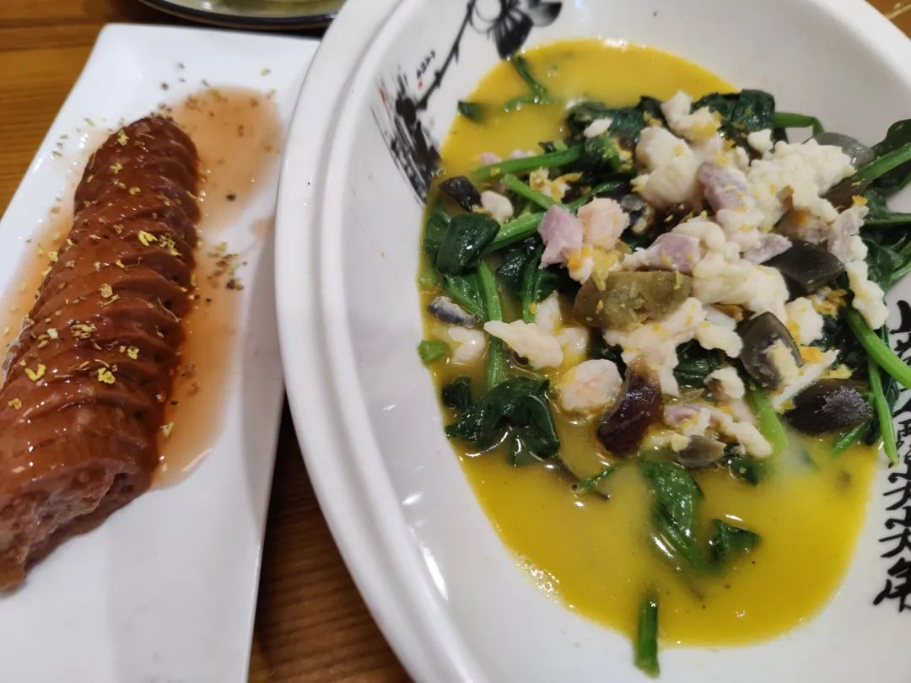

本文是张衔瑜第 214 篇推文

共计 7221 个字， 83 张图

我出门不喜欢走回头路。这意味着我出门，很可能是走一个圈，绕一段再回来，而不是因循来时的路。生活却不总是如意。比如从宁波到义乌， G1432 次列车就是要先经过杭州，然后才到义乌；比如从杭州到贵阳，在航旅纵横上就明显能看到飞机经过长沙。前者尚且可以提早下车，后者却是没法在空中 drop me

仅仅是基于省钱的考虑而多了几程。想去的地方是义乌，来回就把另外三个城市也串了起来。

这是前话。

长沙有直飞宁波的畅游中国，没有直飞义乌和杭州。看了下同样有直飞的台州和温州，还是决定冲了宁波。出发前倒也没有想的那么轻巧，幸福的烦恼也是烦恼。畅游中国得提前五天订票，对于习惯了把时间踩上最后一个点并且很少失误的人来说，几乎等同于因为想要省钱来的强制行为矫正。

宁波栎社机场，计划到达时间十二时十五分，实际到达时间十二时二十三分。小雨。飞机上我带的是《战争时期日本精神史： 1931—1945( 理想国译丛 036) 》 两粒酱 说你要不这次别带书了，实际上效果差不多，因为会在路上碰到一起说话的人。

拿到行李之后，我开始做在宁波的攻略。实际上也是坐上地铁之后，大概知道了很多好吃的都在城隍庙那边。以前看到过一个段子，说在公司里相比于总是精致带妆穿着整齐的人而言，那些穿着随意而素面朝天的人说不定可以在颠簸的半小时车程里化个全妆。相比于一年出去旅游次数低于两回的人，熟练工就可以从各种维度上 customize 自己的旅游。

老朋友硫利达嗪向我推荐了聪明的宁波菜餐厅 阿拉明灶 。甬帮菜讲究什么呢？我也说不明白。但是和我之前去吃过的老娘舅，倒总是和现在吃到的不一样。菜单：勾魂东坡肉、秘制酱青蟹（半份）、汤圆、腐皮包黄鱼。因为真的挺饿的还。

还好宁波的湿冷和长沙的湿冷不是一个频道，虽然下过雨，但是不会真的刮在身上来剔骨。天冷了就应该吃一点宁波的汤圆，下一届有位神奇的叉科同学，以前会从慈溪发那种刚从山上采摘下来放在顺丰冰袋里，粒粒分明的杨梅带给大家。那是开春以后的事了。

老板问我站在菜篓子旁边迟迟不点菜的原因是什么，我说我想等下一桌客人来分半份或者四分之一份红膏呛蟹。老板说现在已经一点半，我们不接客人了，刚刚是看到你一个人拖着行李箱来我想着不能让你白跑一趟。

在天一阁·月湖游荡了一会，这里有一片树林，邀请了与宁波有关联的院士都来这里种下一棵银杏树。我到的时候正碰上银杏落叶，很多人在湖边林下拍照。沿湖是许多大夫、衙第和学宫的建筑，当时就想：或许这就是宁波这一方水土了。刚刚正好看到 2021 年新当选的中国科学院院士名单里，软物质研究方向的南京大学马余强就是宁波人；值得注意的是他的亲弟马余刚，在 2017 年就已经当选中科院院士了，做的中高能和极端相对论重离子碰撞。

觉得还早，就去南塘老街逛了逛。时间稍微掐一掐就得了，提着箱子二十斤对于普通人来说也没重到不能走路。地上很崎岖，大抵是仿古的砖所以刻意不平，拖着箱子会觉得整条街上我比外放的人还吵。

在猫空盖了几个章。不敢相信我以前可是去了哪个城市都想先找找这里好玩书店的人。

走到缸鸭狗外边的时候犹豫了，到底是吃还是不吃呢？吃不吃呢？吃可能就真的赶不上高铁了，不吃应该还凑活。缸鸭狗，亦即江边一位名叫阿狗的汤圆担子，连锁字号。虽然姐妹说在网上也能网购到冰袋来，但是是不是现场做的就好吃一些呢？

存疑是正常的。现在我也没法验证其真实性了。

//

到义乌。早先调查了一下义乌的青年旅舍都挺糟糕的，安排了华住之后就往夜市去。三挺路夜市，也叫宾王夜市。我坐了最后一班公交去夜市，九点半的，夜市上还有很多人。

最主感觉到的一点：便宜是真的便宜。以及思维方式的一些变化：玩具什么的是按斤称；还有销售模式的变化：我尽量想批发给你，而不是走小的零售。这一点在夜市上我只是浅浅地感觉到，而第二天到义乌小商品市场也就是国际商贸城里边的时候，感觉特为尤甚。

我在一家卖户外用品的店里，看上了一款质量很好的户外战术包。包包看起来很大很结实，比我身上背的五六十块钱的小青蛙可以容纳更多的东西，而且有一些合理的战术绳索可以挂载有需要的东西。我想买一个，就问店家这个多少钱。

店家

你是做什么工作的？那就给你 95 吧。

我 （知道规矩） 所以问

你说的 95 是批发价还是零售价呢

店家

当然是批发！

我

那零售是什么价格呢

店家

零售就在批发价上乘以二

我

好离谱 （我喜欢但是钱包不喜欢）

零售是多少算零售呀？两个十个可不可以算批发

店家

不可以噢。批发价是五百个起批

故事到这里就完结了。我谢谢她，装模作样看了看店里别的好玩东西就走了。反正我是学人精。

长沙也有一些批发市场。以前古早的叫下河街，没有湘江风光带还是没有堤坝的时候，湘江一涨水这条街就下河游泳了。还有金苹果，毗邻火车站。下河街后来也搬到了这附近，给了一个地铁站叫朝阳村。

在义乌我还逛了另一个电商小镇，叫（江）北下朱村。提着箱子走在路上的感觉，就像是到了武汉的汉正街。以前在武汉汉正街就到处是搬货卸货的电动板车，我在 [18年 冬天的文章中](http://mp.weixin.qq.com/s?__biz=MzUzNjE3NzA3Mg==&mid=2247484679&idx=1&sn=dbf6943ae6c602eab348f84dc02117b4&chksm=fafb75d8cd8cfcce3f996bd4f41335348530782e0a3722a99a0e3b24bbceba13518b6d7dde4e&scene=21#wechat_redirect) 的有提到和 Susu Weierstrass 从南岸嘴一直往汉正街走。在北下朱则是各种三轮车。不管穿得怎么样的人，什么年龄，都开着三轮车穿来穿去。

除了囤货，最多的大概就是供应链了。这些三轮车有时候会把装货的三边围栏全部放下，以明显超载的方式来运输。不过我觉得不会颠簸出去。就公共路面而言，我推着箱子在北下朱村走，这里是最不违和的地方。我完全不会觉得我的箱子很吵，或者有推不动的迟滞感。

水论文的人，会把同样的一句话用不同的方式翻过来滚过去。但讲的都是同一个东西。这有时候是为了降重，有的时候是为了凑字数。我回来或者当时在义乌给人发消息的时候，讲的全是说，我在义乌真的长见识涨知识。去义乌之前我说，我是抱着学习的心态去见世面的，果不其然。

小商品市场，也就是国际商贸城里边，我这次拍下的最经典的莫过于这两组：

我从未想到手电可以做出来这么多种形制。而且义乌对外进行的文化输出，看起来做得也不错。如果输出到我的话，把耶稣头上戴的荆棘王冠再加一副 VR 眼镜，可能在朋克玩家的心目中会直接炒上天。

原来有种说法，说别国大选之前，义乌的老板就已经知道那边会获胜。部分还在战乱的地方有政府武装和反政府武装，义乌的老板会来图生产两种，然后分别销往两地。我不知道他们预测还会不会参考别的，但是单就生产小商品类似应援单 let alone 各种产权纠纷问题的话，义乌老板在量这块早就已经拿捏得死死的。很正常，来单订制，看看 Keep Calm and Carry on 呢？老实说设计得还不错，接下来就看单了。

国际商贸城有一二三四五个区，每个区有一二三四五层楼，每层楼有一二三四五六七八九十排。也不全部有这么多，但反正很多。我绕一绕，也没怎么绕明白。有些地方明显要火热得多，有些地方看起来还是惨淡。汽车可以开到每层楼的门外，方便店铺卸货装货。

主要是多，又令人咋舌。长沙一直以来做得好，而且现在也还存在的类似去处是高桥现代商贸城。几乎在老长沙人的一代印象中，没有什么东西是你在高桥找不到的。高桥，再搭配旁边的火焰城安置小区，我觉得和现代商贸城搭配北下朱村的方式类似。

义乌小商品城里，卖皮带扣的店可以就只卖皮带扣。大的小的、镶边鎏金、各种颜色，卡扣方式、圆角直角。凡是可以自己定义的，好像都可以在这里找到一套。这和之前的那一墙手电在指导思想上是相似的。这一片叫做辅料店，皮带扣、衣服上粘着的亮片、硬质小壳，这些我都叫不上来名字的东西，在这里都有。因为门脸都写着辅料，我想看哪一样的时候就像个外国人一样，说“这个这个、那个那个。”

前一天晚上从宾王夜市回住处的时候，司机问我“您这跑业务来看货呐？”我顺嘴接下去“可不是吗明天进商贸城，他们几点开门啊”第二天发现，不管几点开，我都很难逛完。

国际商贸城，当然还要有一点其他国家的参与才能叫国际商贸城。二三区那边有一些，做灯具加装那一块。我记得看到了两位戴头巾的中东女士在看着一家机械刚猛的重工业店，不知道是不是发电机。但是隔壁是卖扳手的。还有一片在五区一楼，贸易很多的国家都在这里有。最离谱的是非洲的部分国家馆，还在这里卖非洲早期的不知道是什么图腾雕塑。

其中有一位隐匿馆名的老板，说得一口流利的京片子（应该就是京津冀那边的人）我问他其中一种草的名字，他说叫象草。我质疑，这怎么能是象草呢？象草在非洲有种植或者野生吗？他说这不是象草，然后拿出了编织的筐子，说这个筐子遇水可塑型、烘干即定型。我一听，这是什么材料特性木质素、单宁酸有这样的道理吗？那非得鉴定一下这是什么东西才行。主要是形色也看不出，于是我简单声明了一下 CAS 的身份 (previously) 然后拿走了一些寄到 P 大。

义乌就很神奇。完全可以想出各种 variation 去订制所有想要的小东西。虽然因为小，但是也好在可以走量，所以不需要那么精细。因为模式不同。我走到卖节庆用品的附近时，全部是一片的大中国红。明显这一边的人穿一副都不用穿得其他色温下的人那么多。

中午的时候，前有敌军后有追兵，对四周用声带喊：“盖浇饭，牛肉饭，鸡米花。”大部分开门的店铺都是自己带或者点的外卖，反正也不一定看得出。我拿了一份十五的便当坐在旁边。在义乌的半天下来，就已经走了两万六千步。

//

到杭州。转场太多的行程就好像行李箱是别在腰上的。

坐城铁到杭州站的路上，正好是下元节十月十五。据说有钱塘江的潮。但是我没有看到。我看到了人潮，在七点半我到杭州站，八点钟演唱会就要在候潮门开始了。

第一次拖着箱子去冲，那又怎样，反正有储物柜。第一次在杭州蹦，那又怎样，没人认识反正我听的是音乐。第一次蹦三个乐队拼盘，这个我倒是真的不熟悉：结冰水、海德薇、报警 alarm 但是这三个我都熟。

原来的顺序是海德薇第三个出场，但是现场的报警 alarm 到了最后。杭州的氛围比上海的好，也比长沙的好。不过也看场次来，这一场的气氛组到位了而且拼盘乐队也只拿自己的得意曲子，拿当然冲的起飞。我冲到被夸“体力好”或者在别人拍的里面看到自己也不是第一次，所以总的来说，玩好了就好。

和猫去吃了西湖湖滨店的九甲里·老底子杭帮菜。杭帮菜两吃鱼：一半糖醋、一半清蒸。猫在东北口味的底子上已经即将满一年杭州生活，好像还是不好接受。我可以。并且杭帮菜还是想吃东坡肉，苏东坡真的还可以。桂花糯米藕、鸡汤上汁菠菜、酒酿圆子羹。杭帮菜是到位了。

我住的地方在上城区。原本是基督教教会的青年会，后来三楼改作了青旅，四楼是画室：我看招的是那些要考中国美院的人、一楼是餐吧和美术馆。二楼我趁着门没关的时候进去看了看，空空荡荡，就出来了。

这家青旅好像是杭州最多人收藏。也难怪，装潢就像德鲁纳酒店一样就确实很有意思。

醒来之后，我去灵隐寺飞来峰。在西湖边，很堵，正好看看风景。断桥残雪杨公堤，曲院风荷，大抵和四年前的暑假来这里时差别不大（可恶 17 年已经是四年以前了吗）坐在车上就容易失神、冥想，时不时恍惚到好久以前。

坐车直接到了景区下客门口，但是看着牌子我难得地走 错 了路。

我走去了法镜寺，三天竺之下天竺。进去逛了一圈出来，我想，要不就来三次呢？上天竺、中天竺、下天竺。

好，那么今天就先玩到这里。

于是回到观光车集散地。还是想去看看灵隐寺，也还是没有找到门从哪边开。这是我出门这么多以来，能记事的少数次找不到路的情况。

很荒谬是吗？

说起来也确实。就是找不到。

我最近把头像换成了下面这一张：咫尺西天。

点开大图看的朋友会说：噢你去哪里了呀，是不是灵隐寺？我说是的呀。我大概约莫或许也知道这里就是灵隐寺外的一个标志。但是，其寺灵隐，我站在游客人潮当中提着箱子，就是找不到入口在哪。可以说匪夷所思。

时间不够了，打车去萧山机场。从飞来峰景区南边绕着，走过云栖竹径和一片茶山。标记一处地点，有机会应该可以用徒步的方式在这边逛一逛，让无人机带着我上天看看这边西湖龙井的种植工艺。

在萧山机场是我这么久以来最极限的一次操作。 16:04 我坐上出租车， 17:07 在滴滴上打电话给萧山机场，确认南航的值机柜台应该从 13 号门下。计划 18:15 的飞机起飞， 17:30 停止值机。司机把我送到 13 号门，已经 17:28/17:29 了。打开准备好的绿码，过防爆检查。飞到值机主任柜台的时候，出示 17:30 停止值机的界面，已经 17:31 了。但，还是赶上了。

一脸轻松地通过安检，时间才到 17:36 我觉得挺早。环顾四周，吃小笼包还是吃什么呢？因为选了绿色飞行，飞机餐实在难吃。 17:44 带了份 M 记，往登机口走。 17:52 在催促登机之下，坐到了我该坐的位置上。一看微信提示，您的托运行李已装机。很好。

后来的配色就和我从新加坡回中国广州的南航航班上的色温一样暖胃。

诚然，在一段时间内，我喜欢 紧 张而又遇到新鲜事物，而且也可以把麻烦事安排透彻 。比如极限操作，我不是指的极限运动那个我做不来，极限操作我可是很熟。只要有能踩准的时间点，在我眼里就好像一个节拍，音游玩家可以开始狂喜了。

很久很久以前，我以为新闻传播就是做这些。现在我们有一个热点，有第二个热点，有第三个热点。每一个都可以去抓，选题报题、至于坐下来一个题。如何在人物稿中找到典型性，如何保持行文整饬。我现在公众号里已经不多见这些影子了。当时我以为做一名记者，不管是校园记者也好还是持证执业的社会新闻记者都是 紧张而又遇到新鲜事物，而且也可以把麻烦事安排透彻 。后来慢慢发现还可以讲究热点事件的形成规律，不是跟在事件后边走。

这些想法并不分家。我也从来没打算把这些想法分开过。于是总结这些规律，不管是用什么样的方法得到一套系统、严密、有漏洞和瑕疵的思维模式，我以为有了很朴素的兴趣重点从新闻到社会学或者哲学的转移。当然现在我也只是勉强在面对实证主义、存在主义这些概念的时候能勉强把比如许知远熊培云吴琦的一些访谈书读下去，但是做不到把这些概念又讲给别人听。

于是在历次的实践中，因循着 紧张而又遇到新鲜事物，而且也可以把麻烦事安排透彻 的模式，我在不同次的尬走篇里边对比不同地方。以前还在新闻口的时候，我还保有着侧写的能力。现在是真的很少了。很难再感觉到有还原感。可是又做不到像真的社会调查田野调查一样，基于某一指导思想之下，针对一项特定的问题，在几个选取对象之间进行周密的实验设计之后展开实验，最后形成结果并反思讨论。做不到。

《伤仲永》是一篇好文章。即使天资聪颖，不假努力，也会泯然众人矣。这句话可以有好多种变式模式：天资不聪颖，不假努力，则泯然众人；天资聪颖，加以努力，或泯然众人；天资不聪颖，加以努力，或泯然众人。内卷，或者说教育的导向，都在让人觉得出人头地是目标。我也不例外，我觉得一些停滞是混吃等死。但是又会有一些觉得很富足的时刻：也许是我沉浸地看一本书、沉浸地看话剧或者是蹦现场、爬山没有带手机和相机。

//

抵达贵阳龙洞堡机场。不到三个小时的航程，飞机提前四十五分钟到达。应该是怕乘客赶不上地铁罢。坐到地铁上，定了一家在贵州省博物馆旁边的青旅。没想到第二天早上下起了不小的小雨，走过去还有接近两公里。

我发现是，极限操作和普通操作在我的生活轨迹中会指向相同的后果，就是在下一进程中继续极限操作。形成习惯好像是一件比较可怕的事情，因为和太多人格格不入。有时候不太好。比如每次去机场都能看到，一大堆人不知道坐在机场的凳子上干什么，要么就是在旁边的店子里逛一些老贵老贵肯定不会买的东西。

我不相信有那么多人中转联程，所以只能认为是提前了不知道几万年去机场然后坐在这里空耗自己的时间等着。李云龙可以在坂田联队进攻的时候一边战术性撤退一边在前线布置雷场，我也可以在别人以为我严密计算了的时间里留出空白弹性时间来缓冲许多突发事件。

来看看贵阳的银杏吧。从地铁站出来走到这儿，没有下雨、又有冷风和落叶澄澈黄，配合一定的坡度让新城区也不单调。不好意思放成了折耳根/鱼腥草。

洗完澡，去黔大毕吃了个烙锅。 失策了，干嘛洗完澡去。 锅 里的内容只有个小视频就不放了。 折耳根，贵阳的确实要好吃一些。 我在笔记上写了一个词，叫“料峭”，很好地形容了吃饱了折耳根出来的我吹到风的感觉。

来贵阳之前我感觉我认识的贵州同学好少。来了之后发现，确实还是很少，但是了解贵州的人很多。大家不约而同地提到了肠旺面和丝娃娃。以及让我去黔东南、六盘水、遵义、梵净山之类的各种地方（ which 在我说我到了其他地方的时候也经常有但是只有很少情况下去成了）看来不像我是第一次来贵州。

于是我想，去一个地方，就是应该要去看看博物馆。在贵州博物馆先看了一个有关古建筑修复的，有各种侗寨的图纸及营造过程：肇兴侗寨、郎德上寨。还蛮神奇的。虽然我不会，我也画不出，但是很神奇。看一看总很好。我最近抱了太多这样的心态。反正我很喜欢，我不懂，但是就是要放在这里。

贵州也是一个多有少数民族的省份。看到少数民族服饰的时候，这部分原来在学北大先修课《中国古代文化》时关于服饰就没有讲得很深，更别提民族服饰。贵州多山，故而十里不同天，隔山不同服。当时就想 @ 张爱玲过来，可能要么是惺惺相惜，要么是直接打起来（随缘想象画面）

思南傩戏的这些面具也很有意思，比湘西的保存至少我看到的在形制上要多得多。不知道是不是这边的人更多，或者我在湘西那边看到得太少。傩戏面具感觉拿出几场来就可以做成动画制作里边很棒的 IP 来把古早的内容带给现代人。艺术的底色在这里了，剩下的看如何造型输送罢。

瞄了一眼钟书阁

听君一席话，如听一席话。看了一个阁，如看一个阁。

梁文道有关于书皮学。具体我就直接引述一段了：

> 什么叫书皮学？书皮学是这样，现在的出版业，尤其学术出版，英文书，法文书他们都喜欢在书的背后，或者如果是硬皮书的两边的封皮里面那一页，都会有作者的介绍，有这本书的简介，甚至加上评语。你如果厉害的话，你看一看这些，翻一翻目录，你就已经大约能知道这本书是在讲什么，这本书是在干什么，那么这就叫做书皮学。然后你跟这种人聊天，就会发现，他好像什么书都知道。深入呢，他不深入，但是总是能够适当地转移话题，触类旁通，举一反三，这种人搞的就是书皮学。

回来。太冷了。先洗澡，后吃饭。

这 篇游记很长我是想到了的。我只是没想到会拖到周三才写完。当然昨晚去看的一个访谈和做的一些其他事情就另说了。另说的意思就是，另外再说。

这是后话。现在说完了。
