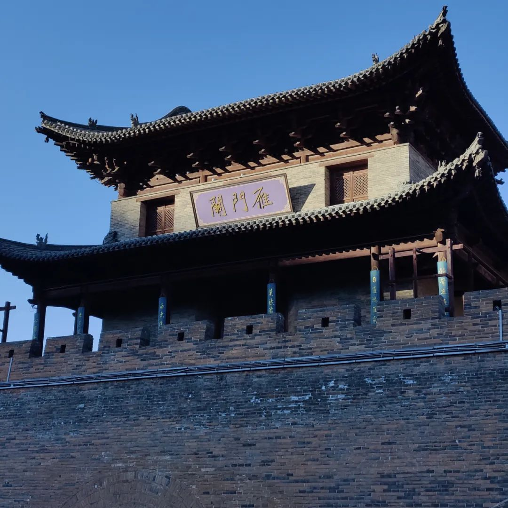

本文是张衔瑜第 216 篇推文

共计 12072 个字， 126 张图

这次经过了许多城市，大部分是租车自驾。为了方便抄作业（稍后会说），所以我先把这一次的旅途的 checkpoint and note 写下来：

Day0 长沙 — 太原：幕宿青年旅舍

·晚上十点钟还有去市区的大巴

Day1 太原：老刘蒸饺 — 山西博物院 — 晋祠；末班动车去大同：和阳客栈

·金虎便利店可以便利餐食

·大同南站晚上非常难打网约车，而且很冷

Day2 大同：租车云冈石窟 — 紫泥 369— 大同古城

·大同第五人民医院急诊科和发热门诊的核酸结果检出时间差别很大。急诊科十二小时能在支付宝上查到，而发热门诊要到二十四小时之后去了

Day3 大同：华严寺；去浑源县：悬空寺；去朔州市应县：六斗米铁锅焖面 — 骏怡连锁酒店

Day4 应县：二女凉粉 — 应县木塔；去忻州市代县：雁门关 — 雁门十八弯 — 汉珽酒店

·雁门十八弯建议驾车新手不要尝试，老手不要逞能

·听说广武新城、广武旧城也可以一看

Day5 代县：阿育王塔 — 边靖楼 — 代州文庙；去忻州市五台县外：佛光寺 — 南禅寺；去晋中市平遥县：汉庭优佳

·阿育王塔在代县人民政府院内，直接跟着导航从政府正门进去即可

Day6 平遥：镇国寺 — 双林寺 — 平遥古城；汾阳市；去太原市

·平遥古城夜间只开上西门和小南门

Day7 太原武宿机场还车；太原 — 长沙

· 武宿机场的过夜区很小而且不适合过夜

写下这些是因为相比于比较热门的城市 or 路线来说，我在山西走的这一条路线算是旅游中网绿级别的路线了。重走梁思成林徽因的山西营造考察之路，是我在出发之前心里想的对这段旅行的描述。

即使是在今天，可以吃得饱、可以穿得暖、可以在住的地方洗一个热水澡，但仍然不是一次轻松的旅程。安排了景点、也要自己开车，但对南方人来说最难的应当是北方的长风。

也没有完全按照梁林路或是清华纪录片 or 其他平台的一些推荐。随意地按照自己想的来安排了。

到太原是晚上九点。在长沙，我穿着短袖和一件长棉袄。这件棉袄是 19 年 1 月份，农历的三九天去长春的时候准备的。在长沙，我坐地铁去吃晚餐、坐磁悬浮去机场，都把棉袄脱了下来穿着短袖。从太原机场取了行李出来，马上扣好扣子不让山西的风灌进来 （虽然没想到过了几天又还是被灌晕）

机场大巴，或许是我印象里小时候才有的长沙中巴车。司机师傅把我放到了路线上离旅馆最近的路口。下车后光速戴上了手套和厚帽子。

坐太原地铁。地铁墙上绘着的都是梁思成《图像中国建筑史》的各种节选。

从府西街下地铁，去太原上过《早餐中国》的一家店：清真老刘蒸饺。可不要被名字骗了，可不要在这里当学人精。

我本来想就按照我的食量点，结果看到旁边体格娇小柔弱的人和明显已经到了乐龄的人也一人拿下一个甜麻叶两个油条（圈）和一碗喝的。

我人当下全是各种问号。偶尔也我也觉得自己挺能吃的，但是还是按照正常超量地就点了一个甜麻叶、一小份老豆腐和一小份肉丸拼馄饨。结果没有吃完。

到底是哪里出了问题呢？以前不觉得太原的码头文化很兴盛，真的需要在早上吃这么能顶的诺？

转身去了山西博物院。大概有三分之一 （或者更多） 的展厅在重新布展，还好最吸引人的展厅还开着。

按照工作人员告诉我的“顺时针、从下到上游览”的路线来说，那么与古建筑有关的厅就在最后。前边的厅会从诸如“三家分晋”的历史一直讲到近现代晋商的事业兴衰。算是对山西大地的文化积累，但是建筑和那些造像的都是我在很多地方都把前因后果完全了解了。现在需要看的就是建筑。

午餐在青旅旁的家常菜馆，山西过油肉以及糖醋丸子、西红柿面。从饮食上来看，山西不多菜。不多菜的意思是，变化都在主食里：用各种方式制作的面食，莜面、荞麦面、高粱面、栲栳这次在山西吃到了不下十种用各种方式制成的面食。

动身去晋祠。晋祠是现存最早的皇家园林，国宝级建筑为：献殿、鱼沼飞梁和圣母殿。我看到水道里结冰了，就拿着块石头狠劲地冲冰面砸过去。保安经过，笑：“南方人？”我：“是啊。还有大点的石头吗？这冰能有多厚啊？”

进入晋祠博物馆。虽然是北宋的营建，但供奉的却是西周邑姜，这已经又是多少年前的事情。鱼沼飞梁我看了很多遍，现在约莫为了承载客流的保护起见而加了些辅助设施。意思就是，鱼沼还在，飞梁也还在，但是看不太出来鱼沼飞梁被描述的那种震撼。

圣母殿外，天子用九柱，母后用八柱。每跟柱子上都附以木质的龙。太神奇了。木质的龙，应龙、蛟龙、蟠龙，八条龙盘踞在外柱上。

或可借由描述：

> 六椽袱与乳袱、五椽袱与割牵于檐柱重心处对接由铺作承之，实际上是八椽袱和六椽袱各分两段，形成了六椽袱对乳袱和五椽袱对劁牵的结构形制。割牵由斗枋、替木隔承，五椽袱与劁牵及四椽袱端部由驼峰和栌斗隔垫，并袱与攀间枋相交出袱头抵托脚，托脚上端斜撑平樽。

> 四椽袱之上于上平樽重心处设驼峰及斗拱隔承平梁，平梁端部交攀间枋出梁头，平梁与四椽袱之间所设隔承斗拱结构与中部地区的五代遗构基本相同，平梁托脚上端斜撑梁头下部，托脚上身于横向出跳拱尾相切接。平梁之上设蜀柱，柱头设攀间枋、替木并施攀间斗间隔，以承脊樽。攀间枋之上隐刻有捧节令拱，两端施叉手捧戗，蜀柱脚设合桔与平梁结构，这一做法与五代不同，亦与现存的宋代遗构不同，恐明代修葺时变更。

[1]李会智.山西现存早期木结构建筑区域特征浅探(下)[J].文物世界,2004(04):22-29.

[2]李会智.山西现存早期木结构建筑区域特征浅探(中)[J].文物世界,2004(03):9-18.

[3]李会智.山西现存早期木结构建筑区域特征浅探(上)[J].文物世界,2004(02):22-29.

做功课的时候，我知道去了一个地方要看什么，也预备好了在一个地方有奇遇。到晋祠，我知道要来看的就是在圣母殿外柱上的龙，也又看到了不曾被多提及的对越门。站在门前，就只留下发出惊叹。

当刺激过多的时候，人们就会使用越来越多的话来形容自己在想什么。比如，很直观的通货膨胀之通哈膨胀，需要用越来越多的哈哈哈哈哈哈来表达真的很好笑。一直看古建筑的时候也有这种感觉。辽构、唐寺，梁思成在看到应县木塔时说“好到令人叫绝，好到半天喘不上气。”

到后来依然觉得巧妙。只是这种巧妙不似说，我可以简单讲，一种是巧妙、一种是不巧妙，或者一种的巧妙要比另一种巧妙高级。晋祠建于北宋，佛光寺在大唐，华严寺往前去了辽。但是从今天看来，日子三五百年以上的而又具有历史的品格，我该怎样用文字来形容他们本身的历史意义，还是我该怎样用文字来表达我外观与进入建筑时的那种沉浸浸润？

特意在修缮圣母殿工作人员的部分加了曝光。

太原站很古朴。搭最后一班动车去大同。

大同南站则很制裁人。因为我从长沙穿着厚些的衣服到太原，觉得没什么事也就没有再加。结果到了大同之后，想坐的公交车已经停了、想打网约车但是网约车在人能去的地方都是禁停区。

总之磨蹭到我手都快冻成冰棍了，的士师傅才接过我手中的行李，尔后我坐上内饰了鬃毛坐垫的车。

出来混，总是要混的。这次的时间很多都被核酸检测混走了。山西省几乎所有的景点，只要行程卡上有省外途经点就都需要 48 小时核酸阴性证明。虽然可以去争辩一下，但最多也就是第一天凌晨出结果，用到第三天的晚上。

但这还不是最离谱的。最离谱的是一些医院没有全天的核酸检测，另一些医院则告诉你检测报告要到 24 小时之后才能出。平遥中医院和人民医院都没有夜间检测；大同五院的发热门诊低风险区和前述人民医院都得一天后才能查到电子档。好像还有哪里打电话去之后，对方说 48 小时后才有结果。

总之景区索要报告，检测又做得坎坎坷坷。来回几次医院，时间就混了挺多。

租车。从大同开始，重走梁林路变得越发自由。

前往云冈石窟。姑且认为是天气冷的原因，窟底下灵岩寺里都不多游客。

上山，越走越冷，越走越冷。不禁想，这就是黄土高原在冬季的日间气温吗？也就是在猎猎寒风要撕烂你脸皮的时候，不自主的震颤开始——倒不是因为季节，而是因为所见。所见之受季节影响、受水石风化，但是依然在那里。这是云冈石窟的第三窟造像。

云冈石窟总的游览体验比去敦煌莫高窟和瓜州榆林窟要好。也许是所有洞窟都完全对所有游人而且不限制时间地开放，同时冬天去的人又格外的少。打开手机上的导览软件听听讲解，结合去山西之前调研的文献，云冈图卷就这么展开了。

一个又一个的洞窟、佛龛，经由敦煌了解的佛窟艺术转而又应到了云冈。前前后后，敦煌的艺术把造像放在了主室最后，而云冈晚期直接用顶部支撑，并加建筑在外。

仍然能数出的佛窟中，第十二窟伎乐天人：暗红色周遭拿着筚篥、箜篌，一对又一对的飞天和姿态各异的夜叉。虽然人很疲倦，但那依然法会华丽。

第二十窟，昙曜五窟之首。我在听讲解器里的声音，本来阴着的天就突然开始打光。我听到讲主释迦像，阳光就只露出一线，刚好照亮释迦像。听到开始介绍侧边的胁侍菩萨，阳光就转到一侧。讲解也就是几分钟之内的时间，阳光亦只是几分钟之内的时间。

云冈去大同市区二十公里，都很冷。即使吸取了前一天晚上的教训，换了厚裤子加了衣服，也依然很冷。踢了踢在路边铲成一堆一堆的雪，踩一踩。夏虫不可语冰，冰等不来夏虫于是化水升天成云降雨涛涛。

坐回车里，等暖气多少把手吹热乎了，才慢慢往回开。紫泥 369 ，一家吃大同菜的店。黄糕、炝碗托、莜面栲栳。晋北菜体验 ++

冷。但时间又还早。云冈是太阳下山才离开。离开之后开车二十公里，外加一点堵车，吃了饭之后，这才八点半。想在大同古城里转悠会儿，于是开着车四处游荡。

古城内有不少的门楼，或许我应该叫做牌坊。反正我按照交通法规慢慢开，就在几处排放之间慢慢转悠逗留，只是不敢放下窗户因为冷风很冷。看看卯榫嵌合，我说不完全这些建筑之间究竟叫什么名字，又有哪些历史沿革。就在热闹与门道的边边上，探头、逡巡、彳亍，绕了一圈又一圈，随便后面的车怎么嚷嚷反正我已经压着最边上了。

早上从客栈出门，坐上车直接“哇！”了一声！！！

前一天放在车里的一大瓶 2.08L 的怡宝直接都冻成冰棍了耶

前一天我还在车里逗留了那么久至少晚上九十点的样子还保持了人能在里边不用穿大棉袄的温度，不曾想第二天一早车内就直接把一桶这么大的水都冻得成了一根旺旺棒棒冰。本南方人反正就觉得挺离谱的。

因为在南方航空选了绿色飞行，长沙到太原的航班上我就只拿了一瓶小怡宝，也带到了车上。没想到就这一天玩下来之后，小瓶怡宝里冻住的还就有内径的三分之一。仿佛回到了读小学的夏天，拿着一瓶冰就可以玩一下午。

和阳客栈对应大同古城东边的和阳门。修整了路面后的古城，所需要自己付出些努力的只有从停车场走向华严寺正门。

华严寺属辽构。如果惜字能说明有多冷的话，这一小节连春秋笔法的偏旁都写不完。大雄宝殿与薄伽教藏，走进门就会知道，为什么这里不可以拍摄。

华严寺大雄宝殿内外，我可以还原一下脑中还有的样子。但更多我想记下的，是感受：有骨骼的朴实、目光禅定的厚重。

我也是在这次才知道，大同旧处云中郡。持节云中，何日遣冯唐？会挽雕弓如满月，西北望，射天狼。费心思架构的文字，早就能在千百年汉语淘洗过后的诗文里找到前序。

薄伽教藏殿中天宫楼宇，据说是和契丹人信鬼拜日有关罢。乔峰这次带上自己的 BGM ，给音响插上电，应该就好了我想。

启程去悬空寺。不能饿着肚子。刀削面！

今年山西受灾后，很长一段时间都没有听到恒山悬空寺的消息。 我一度以为可能在有生之年会错过它。 故而一听到能去，就赶紧改变行程。

悬空寺，建造于悬崖绝壁上。开车向浑源县，伴着结冰的湖泊，送我向晋北大山中。山峰如斧斤削凿，细细上前，竟是人工假道之功。

之前高一的时候老师给我看他在悬空寺的笔记，句子大约是“攀缘寺梯，觉前人之足履于余头之上。”我当时想，真的会有这样吗？那一定得去看看。

等到我爬过栈道，登临悬空寺，往底下看：说实话不怎么怕惊叹的成分占了绝大绝大部分大到好像要压垮寺庙一样。竟然，就是几根柱子，立在悬崖的几个石头上，你们就这样存在了千年？经历天灾人祸，而依然巍峨在兹？

图为我在拍这几根柱子：

远处国道上的大车轰隆，我真担心共振会多少影响到悬空寺，造成什么损伤。寺门，人们常常说皈依佛门为入了空门。有个好笑的事情是我在旅行前打过佛光寺和南禅寺的电话，打过去都说是空号。我心想，空门用空号，这可不就打对了么。悬空，好像更加空空。悬于佛门的空。我现在还能依稀记得寺里一些殿的名字比如雷音寺。不过，从我的角度来看，不管修筑者 / 修筑团队还奉着什么、旨在如何，Ta（们）都一定是技艺绝伦的结构建筑师。

说来很巧，这次在路上经常碰到很巧的事。人在悬空寺最北端的檐下，飞檐有风铃一，偶有声响。过了上一个殿后，又过一小拱门，是悬空寺的最北端。我往后一看，拱门上写着小心碰头，看了看发现果然会碰头，不知道为什么开始过来又没事，于是感慨“真的会碰诶”顺便想起了一个古老的笑话“如果你和一个男生一起玩一周了还不知道他的身高，那他肯定没有一米八”风铃就突然小小的响了一声“是呀是呀。”

因为在端上，所以我打算拍拍照。

拍拍照就想到处走。虽然看准了栏杆不让自己掉下去，但是却没有留心头上的门。就，狠狠地碰了一下，让我自己摸头的那种。就这时，风铃也开始削“诶呀都跟你说了小心碰头啊”

又逗留了一会。这下我好好注意拱门了。终于又有游客从后边来。悬空寺几乎没给人多少侧身的地方，所以必然会交集一下，这会儿我也没有碰。从进景区，包括工作人员在内我总共遇到不超过二十个人。他们央求我帮忙拍照，我提醒了一下注意安全，就往后倒去。风铃又笑了，我又撞了一下。 886

神秘学归神秘学。但我一直本着也许再也见不到悬空寺的想法在这间岌岌可危的建筑里。你说这些形制，不管是佛教、道教、儒家 / 儒教或者其他，应用于祭祀礼拜各种场合，我想我看到的也许是要用美学来讨论的范畴。

诚然，美学需要基础。我下一个去到的地方是应县木塔。单体木质塔结构，塔身现在已经倾斜，普通游客只许进入第一层。这些塔、寺或者我们更广泛说有一定形制的建筑 ( 这就确定了要讨论的对象 ) 你是怎么觉得这些建筑古朴的，人们是怎么造出 “ 磅礴大气 ” 这样的词？

研究感受，像是美学；研究感受的机理，像是认知科学。

离开悬空寺后，驱车应县去吃晚餐。在长沙吃过一次的蒙古焖面，在朔州应县这个地方，又吃到了。

有多 好吃 ，应该看图 就可以了，不消多言。还有这个山西限定版的酸酸乳“古城”牌酸奶，来自山西省山阴县

还记得早上那瓶水吗？它现在还有这么多。

这趟在山西买的最正确的东西就是这天晚上买了一盒两块钱的郁美净。

朔 字很美。朔气传金柝，朔方，每个月的初一为朔日。

这里是朔州。所以跑来吃了一碗二女凉粉。凉粉这个词我总觉得在好多地方都有这两个汉字连起来用，但是表达的意思大不相同。这里是原料中加了少许姜汤/姜汁的凉粉和凉皮：

佛宫寺释迦塔也就是应县木塔 就是前述引得梁思成惊叹的地方 。

怎能不惊叹呢？图片只不过一张，大小撑死不过一个手机屏幕的大小。再放大，打印，又怎能比得上在人眼前看到的震撼。

人们说这叫百尺绽莲

也可以明显看到塔身倾斜。我在和人描述这件事情的时候，说的是 symmetry broken毕竟是 斗栱和梁枋

木塔已经不许登楼了，只能在第一层看。虽然扫塔的工作人员可以上去，但是其他人不可以。鸽子和喜鹊可以。

鸽子和喜鹊，云雀叫了一整天。我分辨不出哪是喜鹊哪是灰喜鹊哪是信鸽。不过有另外一些事情我构思了小故事。

鸟雀飞向木塔的斗拱间，或是木胎泥塑的佛像。人们，凡夫俗子把这当做一栋别致的房子和菩萨像，随着学识的增加而愈发受到其感染。鸟雀，鸟雀没管那么多，哪里避风、哪里好筑巢、哪里更接近基因里 programmed to feel being protected ，鸟雀就会去这样的地方。虽然木质在被制作成建筑材料的时候，就已经失去了生物学上的生命，但经由鸟雀而重获了另一种意义上的生命：

鸟雀把它们我的意思是它们当成了森林。

木塔旁的净土宗没有开门。当我回家，开始编排本文版面，离开木塔刚刚一周，景区公众号即宣布暂停开放。恢复时间未可知。以下是从离开景区不远的地方看到的样子：

挥别木塔。去下一站之前，本来只想喝杯水，奈何这个炸饼子的味道好好闻，于是就要吃个饭：

老板二位的午餐也就是一起七八个煎饼和一碗这种当地小吃，音为滴溜。酸辣口味，我觉得还挺好吃的这两配在一起。

下一站：雁门关。两位之前结识的资深旅行者 弦月 和 只踢不说 分别提到还可以去广武新城。可惜我发朋友圈的时候人已经离开当地。接着唠叨雁门关：

黑云压城城欲摧，甲光向日金鳞开。

角声满天秋色里，塞上燕脂凝夜紫。

半卷红旗临易水，霜重鼓寒声不起。

报君黄金台上意，提携玉龙为君死。

天下九塞，雁门为首。入关首先是主席题字的“雁门关”，而后是步道开始处两边分列的杨家将。《杨家将》这本书我记得是读初三的时候，午休时间在宿舍躲着巡查老师、宿管、保安看完的。进入正门看到的是边贸街，和之前了解的长城兼有军事与边境商贸功能完全对应。

直观来说，雁门关很冷、风很大。这样很抽象，但是可以描述一些事实：被朔北的风吹得流鼻涕。这还不够，伤得流鼻涕的风，又把鼻涕吹得倒灌回去听起来只是不太美妙，在当是时直接把人麻傻了。

雁门关城楼有不少重修过。印象中从长城爬到敌楼一线，的确在我去过的几个关隘中最险：自然地势、人文风格。不过，我又要开始写玄之又玄的东西，即雁门关完整地提供了一种肃杀萧瑟的感觉，犹如玄铁重剑穿云封刃而来。大可以把这描述成堪舆风水的一种形态。我喜欢这个地方给人的感觉，是边关气概。

可能纯描述起来，也不过峰峦倾角、道路桥梁。但是琵琶若干弦，竟也成为持国天王魔礼海的兵器。最近我正好在听刘德海的琵琶独奏『十面埋伏』和『霸王卸甲』明明也只是乐音，却就是有人杰鬼雄刀枪鸣在之中。时间会再度校准，塔身角度、城关选址、谱曲流转。那种感觉就和看字画作品差不多，尤其是最抽象的汉字书法，其他语言我不好说。汉字书法中的各种流派，为什么觉得颜真卿《自书告身帖》庄重、为什么觉得王羲之《兰亭序》飘逸。文本固有属性外，这就是一次美学交互，依赖主客方而构筑通道。

上一次在画前明显地感觉到一激灵，是在长沙李自健美术馆中，看到徐悲鸿于抗日战争之长沙会战时期留下的一幅战马。那里能听到嘶鸣的杀气。

离开雁门关景区，开车去代县。选了一条最短的路。走了不远就看到路边有写“雁门十八弯”那态势就好比在永州说此地多异蛇。我想，山路开车呗，不结冰积雪就没事。我大意了。

雁门十八弯是我自驾以来开过最险的山路。山岩绝壁让人想到万仞悬空寺和西岳华山，没有应急车道的路上，对向来车多是重型大卡：拉煤、拉醋、拉土豆。

第一弯、第二弯、第三弯，大车从上过来，直挺挺的山路驾驶教学之如何抢占高点、上陡坡倒车如何保护。在路旁看到有建筑欻的小斜坡，除了保护功能之外，上次在郴州东江湖白廊也见到了：是观景台。

群山向远，拥长城诸段，雁门关肇于其绝险处。业已日薄西山，陆地轮廓像别针一样镶着风电站。那种感觉也许是光子机器强渲染下模拟的 VR 游戏。用次级概念模拟高级概念是六耳猕猴，但是可以简化理解。速冻饺子也是一种饺子，模拟饺子，在最早期疫情封锁物资短缺的时候也有人连吃了一两个月的速冻水饺。但是那不是最高点。一般认为，认为 xx 理念高于一切的时候，就进入了对应理念中的原教旨部分。注意这里还有“理念”二字在，不是仅有一个宾语。

晋北的山川形胜，在山中给人以险峻、在山外给人以敞阔。地域的、民族的、国家的、世界的。我在旅行后的总结复盘中觉得，雁门关及其下雁门十八弯，是这次旅行中最印象深刻的部分。

燕云十六州。从石敬瑭那边开始数唐末历史，光是历史名词就已经让人回忆起很多激荡岁月。

离开十八弯，下一站是代县。

先找个地方吃吃吧，比如代县的天福酒家：凉调碗秃、过油肉、酸菜羊肉浇栲栳、豆面抿尖。其中“碗秃”的第二个字也有看到写作“托”或者“坨”，应该是根据不同地方的口音转为书面汉语。

代县有一些很有意思的事情。

看的第一家酒店在用烧锅炉的方式供暖。在我印象中应该不是用这种模式，退房是退房了，但还是去麻烦添火师傅打开炉子给我看了看：

前后比较，住了一家名叫汉珽的酒店。酒店里的布草上写着格林豪泰酒店 Green Hotel.

导航到阿育王塔想去看看，但是地图软件硬要我直往县人民政府院里开。我只是游览观光，就别给人制造麻烦。于是开着车在代县民居村镇里走来走去，绕墙徐行。实在奇怪了就拦人问，这塔怎么去呢，对曰：直接从县政府开进去，在大院里头。

这是我第一次见到景点在政府大院里头。停车细看，旁边还有一处毛主席路居馆，因为只作从陕北到西柏坡的途中停留而没有常住。告示说有设展，不过去的时候没有开。

边靖楼，取义边境安宁。据悉为亚洲最大的一块木匾。像在大同古城内一样，开着车绕了一圈一圈一圈总共三圈。没有登楼，就离开了。因为更想看后边这一处：代州文庙。

文庙算是建筑中的另一种熟悉。这种熟悉来源于对儒家文化的了解，或者更浅显一点，我去过山东曲阜。各个地方的大成殿以及外边碑林所能看到的先贤大儒文章刻画，大抵类似。代州文庙是州一级的学府，有又碰到巧妙之事。

看了挺久的殿外牌匾，又走进去看了内部构筑。分别对应了每一位造像的供奉主，了解说山西这边有习俗：用南方人的角度来看就是做几盘，每盘好几个长得像动物比如小猪的超大馒头然后画上画，作为贡品，在北方叫“面塑”或者是“花馍”。总之是大事才用。

本想离开大成殿，但是又觉得里边还有什么我没有看到的东西。又逛了一圈，临走前在殿东南和西南的拐角上看到了这两处。惊鸿式抬头，实为慨叹。

景点的东西是为风景，难道不在景点的，就不是风景了吗？旅行的意义在哪里？

离开代州文庙，走一段有些长的距离去五台山县。路上经过了好多煤矿的矿区，也许现在进行了清洁能源计划，放了多少化工工程师或者研究员教授们拿出来的催化剂，烟囱没有以排放不完全燃烧的碳颗粒黑烟方式来输出大气。现在看到的烟囱口是白色的雾。

矿车从旁边而过，不能不提一位现当代引发过许多人思考的媒体人：柴静，作品里环保类《穹顶之下》以及此前的《看见》和节目《新闻调查》。初中的时候有好朋友看完《看见》之后说自己也想成为那样的调查记者。后来本科了，我也遇到过有新闻理想而且是调查记者理想的人。看到一些矿坑就又令人想起在《看见》和《穹顶之下》中的一些表述。

如果要问我意见的话，我对一些问题有我自己的判断，毕竟学位是我自己拿的。写到这里的时候，前一天圣诞节是苏联解体三十年，今天是教员诞辰 128 周年，史料也是我自己读的。单讨论一个媒体作品、或者访谈，也可以。但杠就是你对。仿佛楚云飞在屋子里对着地图：整个晋西北都乱成了一锅粥。

没有上五台山，那里想必好玩，但不紧急。紧急的是台外的唐代木构佛光寺，其中的东大殿和文殊殿，还有一座经幢。

东大殿的描述是这样：

> 杪跳式结构。为双杪五铺作偷心造，一跳华拱出跳偷心，二跳华拱交令拱承替木、檐樽，令拱交批竹式耍头为缴背延伸制成；里转四铺作华拱出跳扶承四椽袱，四椽袱向外延伸制成二跳华拱，泥道慢拱素枋隐刻。

引文同上段引用处。下为梁思成《图像中国建筑史》的手绘图

唐门也很简单，没有什么复杂。朴实得让人感到又有各种变化，我不知道这种感受究竟从何而来。就好像人们会说平棊与藻井，用用专有名词限定之。我引用的那些段落也算。只是还没能好好用出来。

下为我拍的祖师塔和梁思成文献中所作

东大殿上书佛光真容禅寺，在莫高窟壁画所作五台山中都有提及这一处。看看日光在匾额上的倾角、看看时间，应该在南禅寺景区关闭之前是进不去南禅寺景区了，于是又去“减柱法”的文殊殿看了看。

我和佛光寺的合影。

很多照片。

那天的夕阳很好看。

总觉得得去一趟南禅寺，于是还是开车上了山。南禅寺寺门已关，但是是农历冬月十六，月出于东山之上，身披佛光寺未褪夕阳再洒南禅月隐。冬月的这时间出门，日月作伴的身形都很饱满。

思前想后，星夜前往平遥。去忻州市内待一晚上倒不如直接住到平遥去，第二天就开始逛那里。在山下省道旁的店里吃了炒面和排骨锅仔。开长途我需要吃饱。

平遥有三个地方好去：平遥古城、双林寺和镇国寺。各种大院或远或近随手安排。

古城里一些说历史的内容我已经在山西省博物院的展厅里看过了，主要还是想去两个寺。问题在于，平遥的景区预约系统实在是太僵硬 （上一次没去山西也是因为这个系统） 而且县里两个大医院都不做急诊核酸，景区要 48h 而医院的要 24h 才出。

总之周折了很多，前往镇国寺。五代时期的古寺，有三界门。到晋中，晋中不仅是市名也是中部，很明显觉得没有那么冷。太阳出来之后，在晋北穿的衣服都穿不住了。于是飞飞机。下为鼓楼（怎么我的印象中出现了两个鼓楼）和天王殿

镇国寺主要目的是看万佛殿，事实上这些从一开始抓住人眼睛的，从形制上也能判断出（形制是不是一种范式？）（第二张不是万佛殿，第四张也不是）

‍

下一站双林寺。

双林寺有着悬塑艺术的高峰和同比的建筑水准，另一处悬塑则在山西隰县小西天。这是外观能拍到的。

双林寺殿内悬塑俯身向近来的人，二十六臂观音与四百余尊佛像，凡进者无不感叹。

双林寺各殿殿窗大多紧闭，故而中轴线各殿之光线仅从正门或背向门传来。过天王殿后，即到了释迦殿。当时是下午，进殿看向左侧，正是日光从反照回佛像身上。宏观低速的物理学意义上，造像是不透光的，于是在背面出现了明亮部和阴影部。明亮部分的外边缘很大，括入了佛像所有的阴影部分；但明亮部分的外边缘又不至于大得过分，只有这一尊佛，而没有同一殿内分座的其它诸方。

我没有看到介绍文、榜，但如果问我看到什么，那那里的阴影就是一个人、或者一尊佛。佛是觉悟的众生，阴影下，也许是众生于佛。恰好在兹，不晓真切。

另，双林寺有一地藏殿。地藏殿，又称阎罗殿。还没进门我就被两个雕塑吓到了，它们面目已经缺了这那，咬合在为了保护文物而设立的铁栏杆上。回来查文物资料的时候我还怕看到它们。进去之后是这两个小鬼、地藏菩萨阎王爷、判官，我感觉那些密密的不锈钢铁栏杆不是为了保护文物，而是为了保护我。

延续一般在寺庙内的规矩，及近日落则不进入庙宇。我相机里还有几张我在院内拍建筑的照片。看起来最后几张也不太方便发出来。所以这里是大概是我感觉到，某一时刻，这个时刻的前二十分钟拍的：

双林寺侧边有寺院高墙，可以登上。

出后，对门有一家商店。商店的柜台大面是玻璃的，边角棱合处为铁材质。这些焊铁和门板窗棂都用着一看就知道是油漆调色的绿色。老板的皮衣外边有穿着一件比油漆绿色更深些的绿色披肩夹袄。那家店令人想到贾樟柯的电影《小武》

《小武》的拍摄地离这里也不远了，就在汾阳。是故晚上在汾阳吃饭。中国厨师之乡，主食果然很强。以下分别为蛋素炒揪片、炝碗秃、和子饭。这一晚上吃过饭之后，就算我还做了后边的事，通了个宵第二天回长沙吃午饭才感觉到饿。

早八点的飞机，打算机场过夜，于是决定在平遥古城里待到尽可能晚。

从上西门入城，路上没有什么开着的店。本地居民牵着狗从泰山石敢当旁边走过，互相打着招呼，冲骑着自行车又减速的朋友身上捏一把。

沿街自西向东走了好远，路过了打着诡异灯光的建筑。十点多，越往前走，越少行人也越少交谈。我拦下一位从我身后过来的骑车人，问晚上的城门还开着几扇，对曰小南门和上西门。我进而往前溜达想去迎薰门也就是正南门看，看看古城地图应该可以绕一个完整的圈，一般情况下我不太喜欢走回头路。但是某一刻，前后一看，都一个人也没有了，灯光亦不甚明亮。

于是往回。在一处丁字路口，转过另一条街去碰到一家正在营业的便利店。前边古城里的店，锁门关灯和倒闭店了的尚且不谈，除此外要么是掩着门有些亮光写了某某客栈，或者一看就知道是挂羊头不卖肉的民用小屋。这是我当晚在平遥古城里看到的第一家正经在卖东西的便利店。

进门买了一瓶三块五的冰红茶，寒暄 . 真的很冷版 之后，我开始问“老板，城里每天晚上人都这么少吗？”她自述开到这么晚的原因是在帮儿子打作业，但是店里没有打印机，按了两下之后电脑也没有开，所以就在玩手机；现在是淡季；晚上别去县衙那边，经过那的人，十个里面有十个都怕，有些古建筑是这样的。稍微聊了聊，她说，时间不早了，赶紧找地方住下来，或者出城去，明早再进城吧。

我拿着喝了几口的冰红茶若有所思的走了。不听本地人劝告，常常是一些惊悚小说的开始。也许她知道些什么，比如哪里有不干净的东西；也许就是单纯介绍游客，白天更好玩；也许很多说的内容都是杜撰的。但是神秘学开始起来就会没完没了了。我看到，我走之后，还没过主街的拐角，便利店窗帘门卷闸就落下来了。

回了长沙之后三天，平遥景区公众号发布平遥古城、双林寺和镇国寺暂停开放。

到前一天住的酒店去把手机满电后，出发太原武宿机场。

还车点在机场东侧的尽头，尽到离停车位不到一百米的地方就是机场塔台。我租的车和机场的牵引车、摆渡车、航油车停的地方只隔着用两边铁丝网隔开的通道。

凌晨一点，听了会儿歌，打算换衣服（毕竟太原和长沙的温差挺大）

到车后拖下箱子，东西散落了一地。下午开飞机的时候忘记拉拉链了。车厢里还在放儿歌，停机坪的风知我好冷。

还好本来也是要过一夜，于是把行李箱一摊，一件件地叠。打电话里是说太原机场有过夜区，于是我就还车了走过去。

经过了一段无人区后进入机场到达层。不寒冷，但也不是温暖的温度。过夜区只是几排普通坐凳，和几张按摩椅。和好多地方一样，都不想付费按摩椅，于是躺在上面听按摩椅一遍又一遍地催款，继续睡。有洗手间。

我找了个有电的插头，坐在地上看《爱在黎明破晓前》

山西之行无疑是丰富的。奔波了很多个地方，但没有像之前一样每个地方不管怎么心理妥协最后都一定会去。山西太冷了，所以没有去完。晋北和中部的一些地方去到，华北几省的图卷即开始展开。

河南、河北、山东、山西，不纠结顺序，但我们说华夏文明自尧舜禹后有夏商周秦汉，再往事越千年，文化核心从不难自人文与自然地理景观中获得。

所以我觉得这次在山西的沉浸，很别致。每天醒来后看到的建筑和造像雕塑在对话实体存在的千年艺术，是有感于整体或细节的身体舒畅，以及可以去跟纪晓岚和蒲松龄一谈究竟的众妙之门。

这篇写得很长。我很愿意分享是因为，古建筑保护是一个我并不知道我能做什么的事，除了了解一点、传播一点。它们需要一定范围的人去看吗？比如承载的导向应该要怎样还是怎样。我看到过一些文件，但那没有讨论过一些纲领类的想法。

上次有人问我“怎么总拍些烂房子？”我觉得中门对狙是可以，不过没什么用，别个也无辜。

在路上。

附上另一张梁思成手绘。本文除却自己的游历和参考的文献之外，特此鸣谢小红书参考文《重走梁林之路×山西|寻访中国古建筑之美》以及 两粒酱 在有关山西的风土人情文字图片尤其是食物上的系统性支持。

