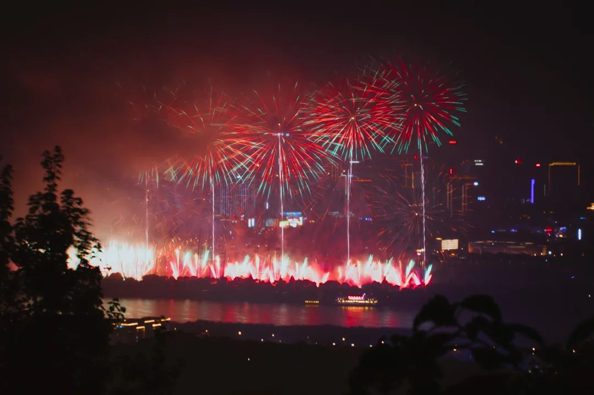

本文是张衔瑜第 217 篇推文

共计 9397 个字， 100 张图

标题取自回春丹乐队《梦特别娇》，原句应该是“梦把我从万花筒推落”，现讹传为“梦把我从万花筒坠落。”虽然没有什么推敲之功，但用以描述我在 2021 年的感觉比洽洽香瓜子还要恰当。

2021 年很喜欢说烂梗，所以把微信名的中文部分也改成了“婪庚”

你知道生活是一个 gradually realize 的事情。虽然我们说，这种以日历年来定义一个人的做法有失偏颇，因为人的生活是延续的、不屑于向下兼容断点，但我这是一年的回望。此为消歧义。

今年我努力不写成像去年那样三万字的非虚构自传。先给出九月份听回春丹现场时拍的吧（尽管拍的时候唱的《初恋》选段和《艾蜜莉》）

一月 。

元旦。跨年那天我在新加坡东海岸公园。那天我的朋友们分布在坡岛各地，当然你说世界各地也无妨。

焰火从离岛的船只上升起。起初，我以为红色的是信号弹，因为它们亮起时的火光照亮了一片，很难不引人侧目。我正视它们，并拍下了这张照片。

这天还有一些后话。有一位朋友在 2020 年的最后一天提前离席，我们问去做什么，支支吾吾。后来，不知道是在当天还是不久后就脱单了；当想切新年蛋糕时，我问了声“有没有在一月份生日的呢？有的话就唱生日歌吧。”没想到过来一起跨年的朋友的朋友，正是元旦生日。

过了元旦之后和 Ming 去找湘菜店。吃的这家叫密斯湘菜馆，让我们想起在雅礼吃万里香时候的感觉（不只是把肉拌起来这么简单）吃完之后我们都很疑惑为什么之前不出来找湘菜馆吃呢，能做出高中食堂的味道也行嘛

坡的早餐也就是。一开始觉得不仅味道奇怪，温泉蛋敲出来还是流体，两片全麦面包夹着 Kaya 酱，而且吃不饱。后来就只觉得吃不饱了。

和吃姜高手去看相机的时候，随缘近了一栋气味奇特的楼。当时我还听不懂 Myanmar 这个词，还好有高手在。在 City Hall 市政厅旁边的这一处，看起来也是他们国家居民的聚居区。光从书写的文字上，也只知道这不是汉语、英语、泰语这些多少能看出来的。

后来很多日子里，我都自己来、或者介绍朋友一起来这栋楼的缅甸商店买花。这里的花较之其他地方要更新鲜，而且也更便宜。图为一次我带上了包装纸过来买花， Pearl 包装好，然后一起抱着花回校区附近去。那天还做了 surprise 实验：随缘送给有缘的朋友。四个月后我离开新加坡时，听到了我无心、但是的确给人以力量的故事。每每想起都觉得这是一年里随缘得知的最好。

二月 。

当时我们开始讲新结构经济学、双循环和国内大循环，因为运输需要一个月，所以收到的是一个月之前我买的书。

累了就开始自拍。因为同一批里面到了一个气氛灯。我在楼下看，只有我的寝室这么造作。无妨。我旁边写着“禁止熬夜”和“你是一个大艺术家要照顾好自己”，然后自己开始放着歌随便嗨。隔壁的印度小哥已经毕业离开了，另一边的埃及室友常常凌晨加热沙丁鱼罐头，还有西安室友睡得很沉。我应该没太影响到过他们吧。

好巧不巧。虾米音乐停服。以前带我吃吉野家和西班牙馅饼的音乐播放器不再工作了。

准备过年。虽然每天的天气都是一样，但是也要过年。我本来是不愿意把图组合在一起的，这样搞得好像这两张图的加起来才能和其他图一个单张相比。

买了一堆年货，还是提前了一个多月买的。徐福记、良品铺子，有的没的，在国内不想吃的我都买了来，只是觉得我想看到这些东西。也许这就是在国外的感觉。

我在客服群里催“你是中国人吗？对啊，你也是中国人。我买的年货啊？年货不在年前拆开，给我弄到第二年去，那还叫年货吗？”

最后这批货正月初三到的。我喝了三支喜之郎 CiCi 果冻。

另外几张真正能置办的，是牛车水 China Town 卖广州烧腊的店、主街以及我跨公历年后收到的一件新衣服，决定留到过年穿。果然留到了过年之前，而且现在也是我衣柜里最好看的一件短袖。

正式的庚子至辛丑年团年饭，除夕夜看 CCTV4 的春节联欢晚会。在国外过的第一个农历春节，老早就开始准备，汇聚了不止两个国家不止四个菜系的团圆饭。致谢大厨 Gndisbg 和 寿司

长沙人的农历新年，怎么能少了一道“油抹粼光”的肘子。虽然国色天香把肘子尾端上的肉去掉了，形式有点欠缺，但是在坡的价格也算亲民，而且味道也到位了。拍出来也不错。

三月 。

克拉码头。酒只卖到十点钟的新加坡酒吧。随缘点的金汤力，玩玩 UNO

开始喜欢在寝室里看电影。周五晚上就去 Jurong East 的日本超市买一份煎饺和一份章鱼小丸子，还要一个 R&B 的 Ice Grape Tea 这样就可以了。图为和 老板凉 在独播库看《无依之地》

和 Claire 去 SDE4 看日落，得以到建筑设计系这边楼的观景位。日落有很多色彩变幻。

和 两粒酱 去 Tuas Link 看日落。这是 2020 年出片了当年前五，年度夕阳最佳的地方。

和实验室朋友们去了一次乌敏岛，这是新加坡本岛之外的一个东南亚原生态未开发的岛屿。这个岛得坐船慢慢过去。船东时常摘口罩的人，露出下半列牙齿中的其中几颗。其他的 想 是已经脱落了吧。

打开新世界大门之 Little Caeser Pizza ，谁不是从这个芝士培根双拼开始呢？

紧接着就是一位 close friend 的生日了。我们策划了一次大的派对，并在派对之前安排了一次小小的惊喜。

我们打算先吃完饭再去派对酒吧。吃饭之前打算和 老板凉 先去吃了味香园的刨冰。这家便宜好吃，凡是路过都想闯进去吃一份再走。

在新加坡最高的屋顶酒吧 1-Attitude 拍到了今年前五之一的侧面描写，和一个绿色的 Marina Bay Sands 和重庆朝天门广场的楼设计者出乎同一个人。

好朋友 Nancy 想拍学校的宣传照。于是拿了我的相机去。看到这一张很有明信片风格的味道，于是我借来调整了一下。这里的右手往前是我偶尔去的小游泳池 （虽然一般去另一个体育中心） ，左边是自习室和电脑室 （但是我几乎不去因为没有寝室舒服） ，再往后就是我舒服的寝室了。最高的两栋楼和我平常去的地方没有关系。平常走到拍摄点的位置一般是我从校外回来经过这条路然后回住处。

四月 。

课程逐渐紧张了起来（一直都是）

这张图融合了不同的时间。比如右下角现在觉得很离谱的大西瓜，庚子年年末的时候还有蛮多人在玩这个游戏。以前就是一个国际象棋一样的东西一直在跳，还有一个弹出子弹去一直蹭蹭蹭，还有一个疯狂下多少层。我玩过的都不少了。

也有做点正经事。当我做正经事的时候比如左上的十八烷基硫酸钠，别人觉得我像个卖冰糖葫芦的。但是，没关系，老师在坐下手撕傅里叶变换，我也没太认真听。要么在中间这样用 Lightroom 的地图功能总结在各个城市的图像地理标志，要么就像右上那样在抄佛经类似《大悲咒》、《金刚经》耳朵里还能听老师在说什么。同一种语言还会打架，两种语言可是太适合开双线程了都不会干扰。

做点运动，去攀岩。

攀岩过后吃点好吃的，于是跑到芽笼一线。朋友去开猫山王的榴莲，我用牙齿开田鸡粥里放的蟹煲。

最喜欢的活动！！！！生吃椰子！！！！

东南亚采摘了的椰子可以直接生刮下来椰肉生吃的。不需要煮熟，不需要添加防腐剂。聪明的食材不需要愚蠢的烹饪。这个还不够原始，我在clementi吃的虽然没有这个好看，但是是绿色的仿佛直接从椰子树上掉下来可以把人脑袋砸开瓢的。然后店里的那种刀斧手放到案板上使出浑身解数直接劈开。我在店外边等，里面我还以为是老板碰上前任也来买椰子了ssfd

夜行的明暗。

之所以能拍到 MDIS 附近的夜行明暗，是因为正好在附近吃口福。口福类似于食阁，不过环境比一般食阁稍好一些。图为酿豆腐。

有个东西和酿豆腐一样好吃，就是这家我当食堂的泰国菜餐厅 Nana Thai 在学校后街。尤其是芒果椰浆饭。就经常点了。而且饭是糯米的。如果想到什么是泰式的话那这就是泰式的样子。

到坡以来还没有好好看过樟宜机场。这一次是去送人，当时觉得在坡的许多一年（或者不到一年）的朋友里：挥手自兹去，萧萧班马鸣

老朋友 Boi 说要带我吃好吃的。于是我们两个人去荷兰村淦饭汉堡。

五月 。

我突然想起来应该减减肥。于是去吃了一次减肥餐。餐食里面是豆制品做成的肉类味道，我为此专门写了一篇公众号来激情辱骂这种行为。实在面目可憎。豆制品比肉便宜，豆制品做成的肉又比肉贵，合着我花了比肉多的钱吃了个比肉少的豆子。当时就觉得不能再这么下去了。我还为此配备了我从国内买过来的筷子，打了一杯西瓜汁，用我自己国内运来的麦秸梗吸管。真实不值得。

拍了一张寝室的清晨。 2020 年拍了太多夕阳，这次也来点朝阳。

不能一到五月就只知道 Mayday ，五月也有一些救助的办法。这是我第一次在 100 图给纯色图，因为前后的事情没法简单说清楚，或者用一张图的表达、几张图整在一张图里的猥琐表达讲清楚。

姑且新年祝大家都不要遇上这样的事 （从我这听说倒是可以） ，虽然你们并不知道我在祝什么。看一下我最近的一次明信片设计的背面吧那就。如果你曾经收到了一张或者手上有很多张，那恭喜你，你有了一张或者很多张我拍的东西。

博士阶段虽然全程网课，但是 5 月 6 号那天来了一个线下的考试。那天考完之后，我们去吃了泰餐旁边的清香馆，因为距离也不远。那天晚上是我今年喝的最后一次酒， one pint Kronenbourg Blanc 1664 and halfpint of Connor’s Stout Porter 这之后到现在就一直没有喝过。随便拿张图来冒充一下：

和朋友们说暂别、再见。

和实验室伙伴说 暂别、再见 。

还有单独去见面说再见的。以及很多没来得及说再见的。

最后和待了九个月、建设得美轮美奂的寝室说再见。谢谢 CX 帮我拿走了一些物品

过了樟宜机场的安检，那边就是回中国的载具了。

广州隔离酒店里拍下这张照片。之后很久都没有拿起相机。一周，也许就拿起一次两次，拍不了十几张。但是吃得很好。每天在三元里点外卖，都有人直接送上来把外卖送到我门口。丢垃圾也不用我丢，直接放在门外有人收走。实在是再惬意不过了。拍下照片是在吹了快一年南洋的风之后，又一次感觉到国内下雨的样子。那会儿才五月，天不是太燥热。

六月 。

去北京参加培训。是出隔离后，马不停蹄地就去了。路上还很不适应，不知道路上的人到底要不要戴口罩，担心几个人走在一起会出事，偶尔还会突然说出 can I help you 这样完整的句子 （希望路人没有听全）

回国之后第一次看剧，在北京地质礼堂开心麻花的《醉后赢家》。不仅以我以前看剧的经历来看，这部剧很棒，而且这又是回国之后的第一次进入剧院，实在是如听仙乐耳暂明。后来就是长明了。

洗了当初在坡的时候拍的四卷胶卷，两卷什么也没拍上，剩下的倒是出了一些漏光的。也算损毁吧。两卷黑白的都损毁严重。

但后来在敦煌的时候，住的青旅叫北上客栈，男主人是北京电影学院摄影系毕业的。我请他在我拍的一堆明信片里随意挑选。他在我一堆的明信片中只挑走了损毁的两张黑白。后来我们交流说，选择什么样照片，其实是审美倾向的反映。应该视杆细胞视锥细胞处理之后，能感知到熟悉的内容。

六月勉强拿起相机。不过没怎么拍。拍了这一张在北京吃铜锅涮肉。我还挺喜欢吃这种味道的，麻酱的确挺好吃。我知道辣味是怎么回事，那么也就不用到处找辣。清水煮到的羊肉甚至不会肉质变老。就很好，我可以慢慢拍，因为有点忘记。

七月 。

七月是和 sunrise 去拍橘洲焰火开始的。严格说是六月的最后。橘子洲头重新燃放焰火，献礼建党 100 周年。那天云遮雾绕，焰火完了，云雾才散开。长沙暴雨。上岳麓山很费劲，下山和离开麓山南路也很费劲。后来我们坐地铁出去了一段，才打车回家。

过了几天后，我又去了一趟天安门广场，凌晨四点起来看了一次升旗。那时候建党节的节庆氛围还很浓。

我穿着那件衣服随后去了什刹海。

其实这之前，我是想散散心。于是就去天津听相声。果不其然，天津的确是随便走进一家馆里相声都好听的地儿。

继武汉中南剧院最后一次《两只狗的生活意见》之后，终于能到孟京辉工作室的老巢北京蜂巢剧院来看一次剧。这次是黄湘丽的独角戏《狐狸天使》

这之后我到了一次武汉。疫情之后，没有返校也没有毕业典礼，第一次返校。吃个古德鸡王先 ~ 味蕾记忆为什么不呢？

第一次返回武汉，那就严老幺重油烧麦的三鲜豆皮，为什么不呢？

八月 。

不是不想选，而是选不出来。

教我爸飞无人机。在长沙烈士公园上拍了这一张。长沙三剑客（最高的三栋楼）尽收眼底，外加烈士公园的湖心长廊。

其余多乏善可陈。噢，还买了点书

顺便提一嘴，今年点得最多的外卖是霸碗盖码饭

九月 。

九月中，去了一次张谷英村。我也没弄明白要去看什么，姑且认作在看岳阳的高中生们画画吧。

几天后，去了一次桂林。当然也就还有阳朔。桂林阳朔很棒，果真风光秀丽而且治愈人心。舟行碧波上，人在画中游，很老的句子但是还很适用。

第一张是我在阳朔漓江边，深夜。筏子靠在岸边，随处找一个平整的地方坐下，直接把脚放在水里。叫一叠炒螺丝和一条烤黄花鱼，一边吃一边直接侧身就可以洗手。水是流水，也不冷，就很好。

第二张是阳朔附近民宿区的炊烟；第三张是桂林市刀锋书店。

还有一张龙潭古村，用无人机拍下。是这次所拍景色中的集大成者。

回长沙后，又用类似的方式拍了长沙梅溪湖大剧院和旁边的建筑。

有些事情虽然没有办妥，但是我想，那就不办了。走，出门去一些我好久以前就想去，而且特别有意义的地方。

于是花三四天看了跟敦煌尤其是莫高窟和瓜州榆林窟有关的纪录片、文献，启程西北。依次为祁连雪山、鸣沙山、沙漠以及我在的魔鬼城。

谢谢摄影 猫 送这张到今年前五。

十月 。

赶在国庆之前回来。我猜不想去凑热闹。结果马上张掖、兰州、银川相继告急。我过会儿就得于原来老师的邀请，返校去参加学术会议。

取道宜昌，再去一个平常少去的地方——神农架。正好在重阳节当天登上神农坛。就是有点受不了一直被唠叨“小伙子，你现在来的不是时候。”我问“那我走？”也就散散心看看罢了怎么徒生出许多事来。烦，武当山也没心情去了 （十堰我还是很向往的只不过不是这次） ，然后回了。

竟然我戴上 GoPro ，戴口罩而且一身穿成这样，竟然还可以支付成功诶！虽然我也写一点算法，但是看到支付宝刷脸支付这个还是觉得很神奇。

和 Yihan 讨论关于孟京辉新作《红与黑》的事。演员直接走下台来，走到走道里一楼的中间，领衔主演梅婷、张弌铖、罗欢和空花组的确是把司汤达的这部巨作又重新用先锋的方式先锋了一遍。先锋说：我担不起这么多句子成分。没关系，担当吧。

在长沙走了走。拍了一片粉黛子草丛，也许不叫这个名字。旁边的女生和她的两位同伴之间在用手语交流。我也想要不要学点手语。

九月夜桂花。农历九月。比还潮写的《八月夜桂花》晚一个月。

北海 — 涠洲岛 — 南宁 — 上海。这是一次去的。北海侨港的一些店面上，我指的是有间冰室。我如果把有间冰室和新加坡芽笼卖田鸡粥的店铺照片调换一下，除了相机、手机的差别之外就几乎不会从风格上感觉到质的变化。图为侨港海滩，令人想起杨德昌的《牯岭街少年杀人事件》

涠洲岛。岛的管理很一般。海很漂亮。

十一月 。

南宁。骑电动车很舒服，车道设计得很好。去了两个夜市，带了一包没有吃过的酸嘢回房间。事实证明，有些东西吃下去之后会让你分不清什么是事实。酸野明明只是一些果子，而且是我知道的果子：木瓜、萝卜、菠萝之类的，然后加了点老板的巧妙刀功和醋，还有辣椒。我最后没能明白我吃了多少，但是南宁本地好像很多人吃，我留了张便条给房间服务生“如果可以的话请别浪费，是没有弄坏的”

上海。老熟人了武康路。

前几天在北海南宁的火车上看了会儿手语课。没有仔细看。结果打车去找朋友的时候就打到了一位聋人司机的车。我在后视镜里对他说“见到你很高兴”、“谢谢你”，他觉得很惊喜。后来，他问我在哪学手语的时候，我没看懂，于是他打字。我给他看 B 站浏览记录后，他的惊喜又多了几分。我又打开视频，打算现学现卖，给他打一个“工作顺利”，他看了一会儿，纠正我“顺利”应该是右手食指尖由上到下划过左手大拇指。最后我下车，他抱拳，用聋人的沙哑语调对我说了一声拜拜。

这个故事我说过很多遍了，但还是想在这里再写一遍。原因是失聪群体是一个很重要的群体，健全人并不知道失聪群体要付出多少才能勉强像正常人一样生活和工作，比如成为一名驾驶员。当然偶尔我也有点私心，要是我出门也能只打手势就好了。

转身去了趟梅州和汕头。因为想吃那里的菜了。

梅州去了一趟客天下景区。没想到梅州历代出来了这么多人，还是了解之后才知道。

在汕头吃了一堆应当吃的。杏花吴记牛肉火锅、适口砂锅生滚粥、桂园白粥的生腌。我还是觉得当地的各种凉茶好喝，又没有兑糖，就这么站在路边喝就行。

住的青旅叫 N23.5 ，本来就在屋顶的青旅还加持一个天台，这里直接能看到海边。青旅老板 vyon 托我拍的猫猫，入选今年前五的宠物摄影。

回来之后又去听了 livehouse ，这一次是 Schoolgirl Byebye. 这张的背景算是乐队的 立 队人气台柱子（当然拍出来也还不错）

今年冲过的现场：万晓利、红白色、帆布小镇、回春丹、昨夜派对、 deca joins 、野岸刊、画家、丢火车、 Schoolgirl Byebye 、沼泽、结冰水、报警 alarm 、海德薇。每次去，我都穿同一双帆布鞋。我回国的时候那是一双新鞋子，现在长这样：

送 X 礼物的时候，央她帮我拍了一张《一个陌生男人的来信》指我是吃的纸

和 三替小王子啵 在梅溪湖游荡。正好我背了悲伤蛙，正好偶遇一位宇航员。于是想蛙能不能和宇航员一起玩。那天夕阳的光还挺好看

去浙江玩。天冷了，就在宁波吃汤圆， 硫利达嗪 直指阿拉明灶。

我是想去义乌见世面的。果真见识有了。义乌小商品批发城，没有什么搞不到。耶稣加上 VR 眼镜，说不定哪一天就在元宇宙里面见到了。

或者闻到了印度香味（迫真

今年第一次找不到路，是在杭州灵隐寺。

很奇怪。不知道为什么找不到路。我提着箱子在灵隐寺外边转，看到牌子好几次，但就是找不到进去的路。我一个 90% 以上的时间都在带路或自己认路找路的人，竟然在灵隐寺找不到路了。因为要去赶飞机，所以也没有再问路人。下决心不赶飞机了非要找应该还是能找到。吧。

贵州省博物馆的傩戏面具觉得可行。

岳麓山的枫叶红了吗？真诚发问。没多少，拍着好玩罢辽

十二月 。

去南京看枫叶吧。南京栖霞山也没多少，也不是说那种红遍了、红透彻了的样子。但一位师傅从山上下来，正碰上在千佛岩前找栖霞飞天的我，于是有缘得见。

镇江。金山法寺，妖孽禁地。完成一下巡礼

西津渡。还挺好看的在这个角度

扬州。扬州的汤包有多少个褶？这是我此行想解决的最大疑惑。我拿着纸吸管前前后后数了三遍才确信，这上面总共有 28 个褶，符合蟹黄汤包大于 25 个褶的扬州标准。

盐城。说要来看丹顶鹤保护区，没进得去。但林场也很好看。回去的路上看到丹顶鹤了也吃到了很好吃的鱼汤面。不错子，可以了。

本来可以直接回长沙的，结果被南航给摆了一道。于是去南通转了一下广州。有一些图，此处略去。回来之后，这个 20 吋的小箱子就已经完成了它今年的旅行使命，贴了一万张旅行易碎贴纸在外壳上。

接下来就是带 24 吋的大箱子去北方了。飞太原之后，开启最近的这一波 [山西](http://mp.weixin.qq.com/s?__biz=MzUzNjE3NzA3Mg==&mid=2247491025&idx=1&sn=b25b9042707c0008ca31dc066f22237a&chksm=fafb6d0ecd8ce418907259d58056314bc03358ba3f5c8519e287d85fd3604799a35c3754fc9f&scene=21#wechat_redirect) 旅程，也就是上一篇一万两千字的游记。

第一个高光给到晋祠圣母殿的维修人员。在处理图片时我特意增加了这里的曝光。大意就是想给一些给正在进行古建筑维修的人吧。

第二个给岌岌可危的建筑，浑源县悬空寺。这里分别是我在寺下、我在寺内、我从寺往下。我自己都觉得蛮恐怖的。

第三个是应县木塔。这个角度其实看不大出来木塔的倾斜样子。但是危急程度也已经到了楼上不许上去，而且拿不定文物修补方案。

第四个是代州文庙的挽留款。今年的年度最佳前五。这个是在殿的角上。我记得平阁、平綦、藻井、天花，这些名词分别指代并且有一些区分。那么这里到底属于什么呢？且待下 （或者下 ^n ） 回分解。

汾阳和子饭。说这五个字的时候我总想对对子“南阳刘子骥，高尚士也 …… ”大概是先把小米放在水里，然后加各种东西煮一煮，最后形成了粘稠适中的状态。总之是很保护肠胃的主食。

这一部分最多，是因为觉得古建筑保护是一项很重要的事情。我发现今年搞这样的事情就很多，一会儿倡议古建筑保护，一会儿又说学手语的二三事。

总的来说，今年是怎么样的一年呢。

今年是什么样的

一年 呢？

不是在这里凑字数或者凑行数。就是单纯问问，今年是什么样的一年呢？或者找到几个形容词也好一段话也罢，我会怎么样谈及这一年。

我觉得这一年很神秘。

就是你也想不到这一年为什么会这么发展，这么开始和结束。年初的时候穿着短袖在新加坡称了一只烧鸡、一斤烧肉和一斤叉烧去年夜饭。年末的时候我坐在商圈楼上写年终总结， 小时候这边还有栋新玉楼东，现在早已没见了。

回国的时候我不知道能在国内待多久。那时候听寸铁的《无题》，说没想到在国内又居留过这个月了。然后一直这么“我想再多待一个月”，后来想起好久以前就得返校，再后来也习惯了这么一个月一个月下去。改变现在的生活状态很困难吗？是的。会很不适应。

除了回想起来觉得神秘之外，这一年也发生了许多神秘的事情。有一部分是时机恰好，譬如我离开敦煌、我离开宁波和南京。至少后来还有多去几个地方的可能，只是在当地的人着实遭罪。还有些神秘得没法说的事情，就好像我自在这坐着 也写一点计划，这时候那些计划之外但是又在情理之中的事情却跑来找我了。人力有时尽，可神秘的内容总比我规划得还要好。

还有很多弄不明白的事。以及想等到终有一个确凿不变的结果时才公开的事情。促使我回国的直接原因和根本原因指向同一处，等到有机会的时候再说。

想起来这也是我第四篇100图了，也就是第四次用这种方式总结过去的一年。第一年开始想做这件事情的时候，是和 是真的可爱 在武汉物外书店。每年都只在跨年前聊一会儿天。当然也没有那么严格地，一年只聊一次天，但是只有在年前的时候才会聊开，总结、也看看过去的这一年另外一个不同境遇中的人经历了些什么。当我们整理过后，我才会来写当年的100图。才觉得能好好写。

虽然很多人都有一种，一年老似一年的感觉：今年的年度歌手/歌曲和去年重合一般以上、今年的拍照姿势好像还是只会扶眼镜、太阳东升西落etc. 马上COVID-19也要进入第四个年头了，世界有在过往变得好一点吗，或者有可能在能或者不能观望到的未来变得好一点吗？

我买相机的时间，差不多推算起来也正和溯源推测中目前所知的第一例时间接近，2019年12月月初。用词也许不准。2020年快门总共按下三万二，2021年按动一万七（32753和17347）没有计算出来这个数字之前我也不知道竟然差了这么多。尽管我们说应该把精力专注在怎么拍上，不应该只是简单当一个快门工。但是快门数量看起来的确少了好多。计算Curve的话，应该今年服从时间横轴、数量纵轴上的盆地。

不好意思啰嗦了这么多也没有吧今年的神秘讲清楚。这更像我对今年发的一些牢骚。可能是因为美好的事情大多写在了上边Figures and their captions, 所以在文末写点乱七八糟的。

我觉得不能放任一年就这么过去了。我不能就让一年时间，喂了狗。烽火戏诸侯的事情我做不到 （也做不到） ，但是扔时间和经历到水里总能听到一个愉悦我的响。

所以就和去年一年和解吧。我好像那种经常在点单的时候刁难服务生的顾客，或者德勤题目里面的那种左右不耐烦的Darren.

虽然一年发生了一些糟糕的事情，我能给这些事找到它们存在的逻辑性证明、合理性证明，但并不能说我就认为可放过或者对。

美好的事情也是，明年会有新的美好。2021年，我又去看了出品2020年年度前五的Tuas Link拍到了和去年不一样的灯塔明信片。但那张没有入选今年的年度前五，我想每年可以拓展到不同的好事。或者我希望每年可以有新的内容。故事可以新陈代谢，但放在人身上就会很残忍。我不在这里再开启一个有关社群及其亲密关系的新议题了。

今年已经将过。有种“长已矣”的感觉，完成未来过去，我也搞不清是什么时态。有时候也有点钟慢（物理相关盯

我通常是在Word里写完了文章，然后再选图片。100图不一样，先选完图片，然后再配文字。这一篇写到了这里，已经临行密密缝，拆开到了第四次。总觉得还有点什么东西要加到最后。但其实已经要让这一年离开了。不久，就要更名改换为2022了。

昨夜派对L. N. Party在《玫瑰往事》中唱道：

> 玫瑰啊 你从哪里来 我的真理用旧了 玫瑰啊 你往哪里去 我以哲学爱过你 玫瑰啊 我多想和你述说 从前的故事啊 他们说一切并非真实 那时万物正交响 他们说一切并非虚无 那时机器爱黄昏 你用凝视回应我

玫瑰啊

你从哪里来

我的真理用旧了

玫瑰啊

你往哪里去

我以哲学爱过你

玫瑰啊

我多想和你述说

从前的故事啊

他们说一切并非真实

那时万物正交响

他们说一切并非虚无

那时机器爱黄昏

你用凝视回应我

最后一张图，是一张我回收的表情包。来源已经在水印中，我就不注明了。希望大家一切聪明。BTW，这张也是今年的前五之一

这样就过了一年

张衔瑜

2021年12月30日

@ 长沙
