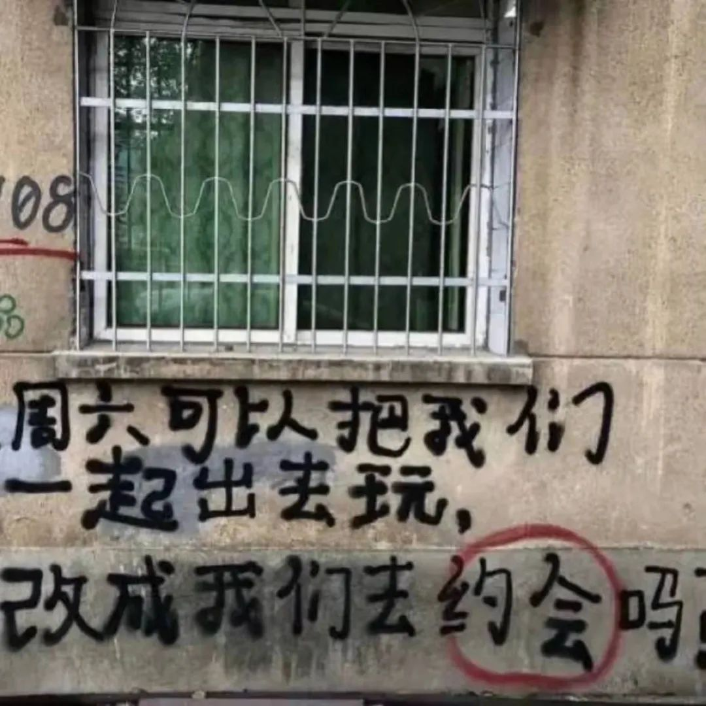
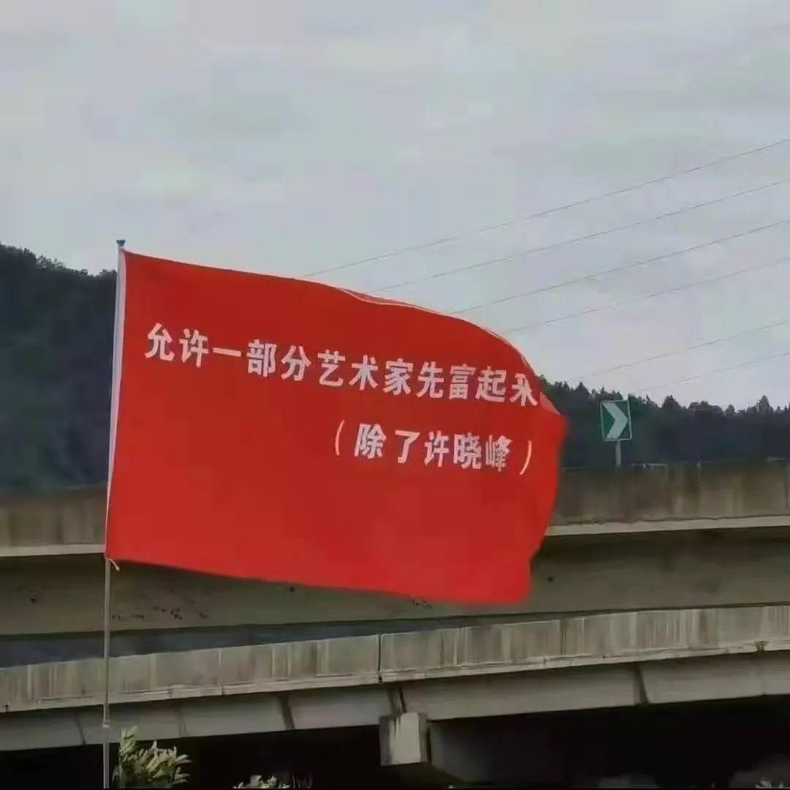
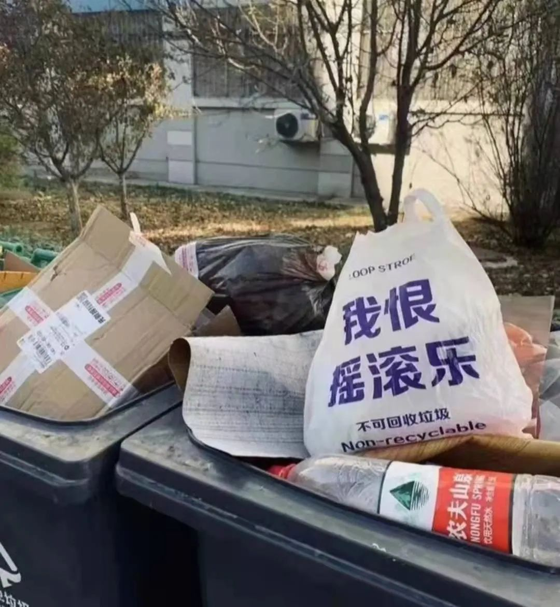

本文是张衔瑜第 218 篇推文

共计 739 个字， 5 张图

如题。

这学期还有一门课得上。一门英语课，我对你肯这门英语课的恶评由来已久。也许设立这门课只是为了宣扬或者炫耀自己在这门语言上有怎样值得骄傲之处，我推测、我并不认可。但也得去啦反正就是说。

你有多少无聊呀、

又好久不是因为写游记而打开公号写一篇推文。表达数量有下降吗？好像也没有。食量有时候在正餐也还是能吃一个必胜客的双拼披萨，不得不说乳酪大会拼超级至尊还挺好吃的。主要是乳酪大会好吃。

总有些想点的吃的。但是吃起来又觉得很乏味。老生常谈是等吃到嘴里才知道自己想吃什么，那么接下来呢，有些不想吃的我的确没吃了。

最近这段话写得不错

只要看到带点思想力的东西就觉得有道理，那只不过是彻头彻尾的笨蛋往前走了一步。由此的复述更显其愚钝，因为没有任何主心骨可言。我能接受人的想法在变化，甚至思想体系里有些相背的部分，这很正常。恶心的是把什么都攒来用胶布粘着，缝合怪都至少会用针线

句子好复杂。不过读两遍来就会觉得还好。话就是这么个话。

一切问题的症结，三千烦恼丝的源头，在于不想乃至不允许自己停下。因为不想停下、不觉得就停滞在现在的状态里是一件什么好事，所以问题在于停止不了好比有些人明明家徒四壁但总是手上不闲着不知在哪弄出那么多事情在侍弄来去。

我好困。困经常和饿一起来。

我的意思是，来也得看时间。

我最想的应该要算站在电脑前打字了，可以把台面升高一些。但是很奇怪的是唱 K 又想坐着，只有在去现场的时候才会考虑站起来，而且那站起来就是起飞好远。开学好渺小

这写文有时候挺快乐的。有时候仅仅只是一个任务，还有的时候随着状态而跌宕起伏没有一个什么准信。多写一点是刚刚发现字数比关注公众号的人还少

好无聊写的。看着我都觉得没劲

写的什么没劲东西

也没有蛮多特殊。写什么

不写了。睡觉

