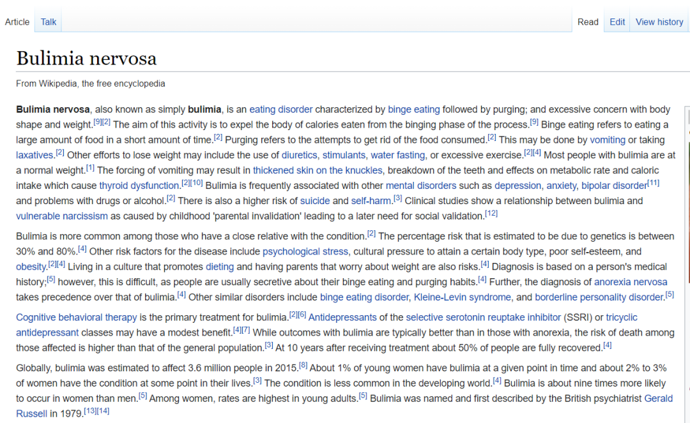
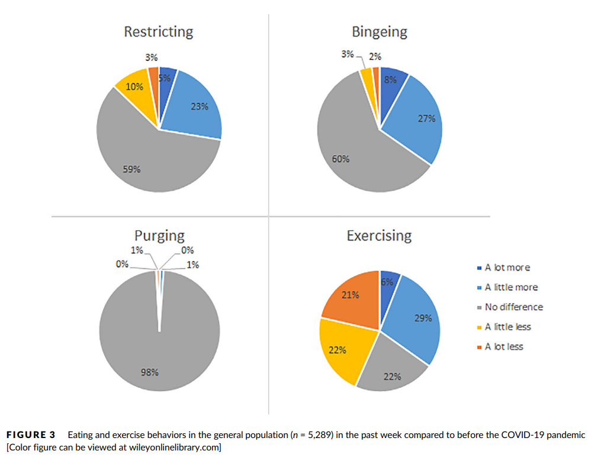
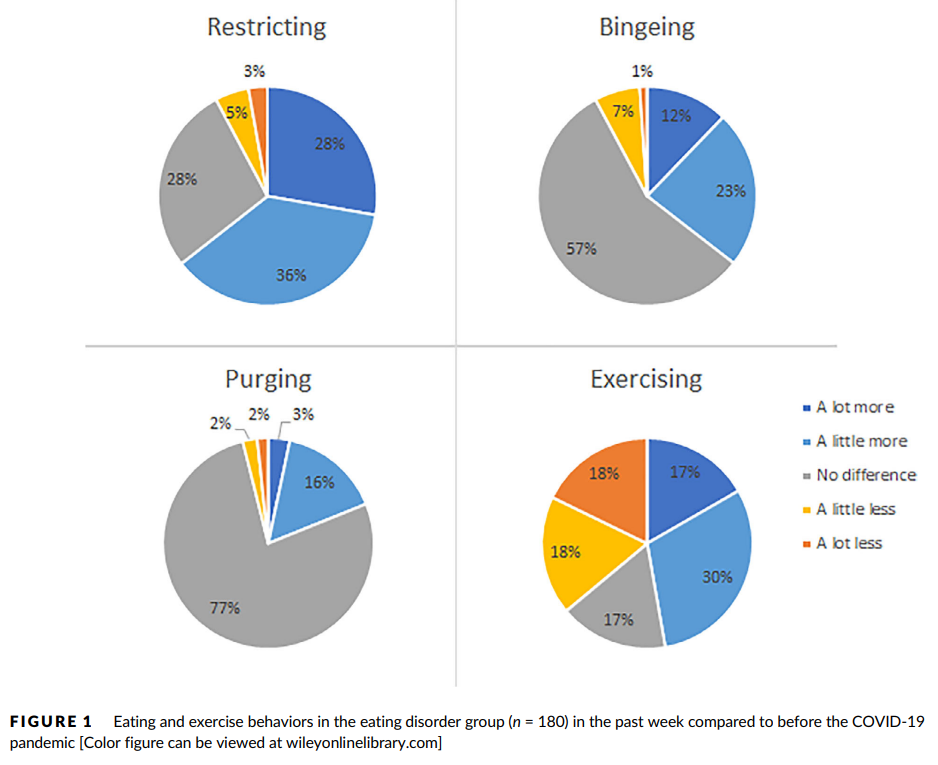
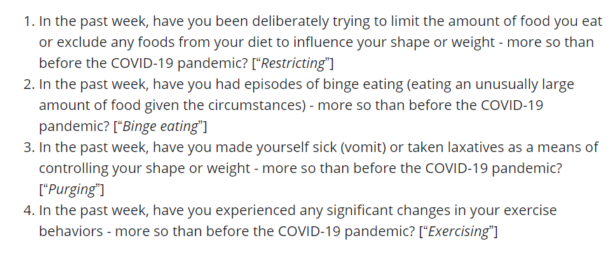

本文是张衔瑜第 221 篇推文

共计 2251 个字， 2 张图

谨将标题的这个比喻赠与我的生物钟。

想到这个比喻的时候我刚刚醒来，时间指到下午 17:33 ，其中 1 这个数字被标注成了红色。一加手机这一点就会让人想到《哈利波特》里韦斯莱家里的挂钟。现在人家里很少会再把挂钟摆出来吧，理解手机上的四个数字也像是一台赛博逻辑处理器。

自转就像地球的自转，有昼、有夜；公转就像地球会经历一年四季，春、夏、秋、冬。至于为什么人的生物钟也会有公转，那么大概你还在昼夜自转的第一层。

我说的自转就好像一段深度睡眠和一段完全清醒。当代人们早已不是日出而作、日入而息，休息的时间被以为成勤奋的一部分（实则不是）休息就是闽南语里的 hioh-khùn 歇睏。这样一来，它们也不会构成完全连续：

我们简单用竖直和平放的线段来标记一下 __ __ _ _ || || | |_ _ _ __ ||| || | | 这可以粗浅地构成一个地球自转周期里的个人生物表示。

地球自转，一个恒星日的时间是 23 时 56 分 4 秒；地球公转，一个恒星年的时间是 365 日 6 时 9 分 10 秒或 365.2564 日。这些都是确切可查、可以被计算，而且很多在算学等领域建树颇多的人贡献良久的结果。从古时候制闰什么的开始就已经具有很显著的成果了。

但是人的自转和公转和这又不一样。为了不把别人拉下水，我就说说自己。总会和地球的自转错开一个时间，有时候又能奇迹般铆合上。小时候有些气人的大人 ( 并不能称长辈吧这种行为 ) 就喜欢说：“这才几月份，就要开空调啊？”我一直想等我年龄大了了以后我也要胡说八道，可见如果把这种话当教育只有教条和束缚作用。于是当我奇迹中铆合地球自转周期时，我就神头鬼脸：“这都几点了啊，怎么还不起床？”

如此可见这些都是扯淡的话。这里的人奋斗的方向应当是为了不应只是提高自己一种地位的低俗而斗争。是把睚眦必报当成了段子讲。

春困、夏乏、秋盹、冬眠。类似这样，但不完全是。像了，但不完全像。废寝忘食，四个字拆开来每个都是我。

是不是又离开公转和自转的话题很远了。没关系，大概就是那个意思。因为我发现我写的东西也离最开始我想说的越来越远了。所以不写了。

最近和朋友聊职业的话题很多。职业就是那种会做一段时间的事业，也不非得在职业当中找出一个什么非常宏伟的图纸出来。自转和公转经常重置而且重置的结果方差很大的人，适合做什么工作呢？

当然也不一定准，说不定做起来又觉得不是了，反正人的想法总在变。最近这段时间又找到了一个不错的比方，我很中意定向越野的工作。当然不是那种，一个小时之内，在一个野外什么地方背着战术包跑来跑去，这种形式的东西不适合我。我仅仅指那种像跑业务一样，比如经常往来京广线、时而长沙飞大庆。反正就也像定向越野一样，去一个地方完成一个任务，但是时间又不太久。

上面这一段的内容我好像已经在不同场合说过很多次了，这次不一样的是想出了一个定向越野的这种奇妙比喻。

昨天睡觉之前很馋路边摊上的烤肠，本来打算早餐去买的，但是转了一圈都没有找到。好奇怪，有些东西就是那种明明你觉得就在旁边随时都能找到的，可一找起来就怎么都没有。

——写这行的时候是周三

从现在开始，每周的周三都是令人巨头疼的时候。巨头疼就是因为有巨头在压着，巨型压力压迫人。虽然分享给过一些人，但是想再分享一遍这个青春蛋炒饭：“老板，要一碗加量的蛋炒饭，给我 狠狠 地炒。”

[张衔瑜的文章不配图，就像猪油拌粉不要猪油 (就剩猪头了) ]

这句“狠狠地炒”说得就像是一个得了神经性暴食症 Bulimia nervosa 的人说的话。或许专职搞科普的人那里自然有一个限度，说多少人适合知道多少的内容，类似于有一些外科手术中红彤彤的图就常常会在电视上打马赛克 ( 好好的乐队可惜总是被打 )

我顺便去查了一下与之相对的神经性厌食症 Anorexia nervosa ，发现总的来说 Eating disorder 还是频率蛮高的，并且有明显的性别偏差。具体见下面这篇文献：

Makino,M., Tsuboi, K., & Dennerstein, L. (2004). Prevalence of eating disorders: acomparison of Western and non-Western countries. MedGenMed : Medscapegeneral medicine , 6 (3), 49.

Touyz,S., Lacey, H., & Hay, P. (2020). Eating disorders in the time ofCOVID-19. Journal of eating disorders , 8 (1), 1-3. 笑死，我想补一篇的时候又看到了一篇这样的文章，杂志的 IF 也有 4.861 呢！那么就和小编一起来看看他们写了什么吧。

好吧这篇没写什么内容，就是呼吁建立一些机制什么的，没有数据。老没意思了，我还寻思着能拿到一些新影响下的什么流行调查。

不过我找到这篇文献是因为它被引用得很多。我倒要看看什么文章引用了它，啊还是同杂志的 Phillipou, A., Meyer, D., Neill, E., Tan,E. J., Toh, W. L., Van Rheenen, T. E., & Rossell, S. L. (2020). Eating andexercise behaviors in eating disorders and the general population during theCOVID‐19 pandemic in Australia: Initial results from the COLLATE project. InternationalJournal of Eating Disorders , 53 (7), 1158-1165. 这篇看起来就有一些实际的东西了，研究限域在澳洲。

底下的两张图分别是有饮食失调的群组和正常的群组，四个群组分别代表的含义如下。我觉得这项研究就是用来印证、证实了一些对于饮食失调在 COVID-19 期间的猜测。这篇文章是 2020 年写的，现在情况应该如果按照定性猜测的话应该也不会有什么区别，只有一些小不同（比如再写一些文章给后面的学生毕业）对整个科学决策与生态的贡献也就慢慢下降咯。

另外我也很好奇这个词是怎么出现的，根据 Wikipedia 摘录出来的解释，我就直接复制原文了 The term bulimia comesfrom Greek βουλιμία boulīmia , "ravenous hunger", acompound of βοῦς bous , "ox" and λιμός, līmos ,"hunger". 摘自 Douglas Harper 主持编撰的词源词典。另一个词 Anorexia 由于懒惰而不会出现了 ( 除非有好心评论区 )

绕回青春蛋炒饭。药王街旁边中百罗森里的烤肠机开了，美妙，孙思邈知道了都想来几服。之前在紫菘，不知道多少次是罗森立大功；以及去琴台买完票没钱吃饭，罗森救大命 （倒也不至于 the point is 那附近没有人能吃的食物）
