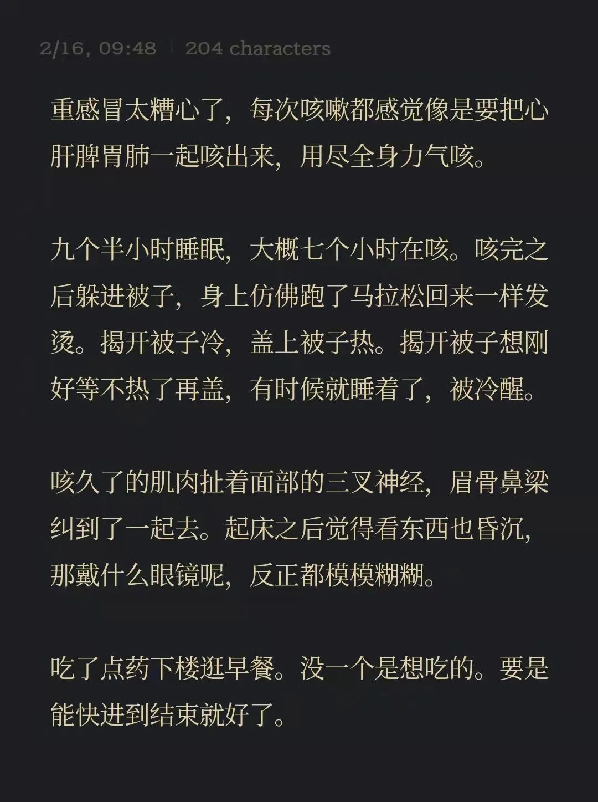

本文是张衔瑜第 222 篇推文

共计 588 个字， 3 张图

闲聊快速波尔卡 Tritsch-Tratsch, Polka schnell op.214

打下这个标题的时候只是我随便一想，去搜搜发现，还真的有这首曲子又名《叽叽喳喳波尔卡》而且搜到了王羽佳弹奏的版本。这么说应该早在看猫和老鼠的时候就已经接触过了

上面这一段写了个开头就没有再继续了。好像是去忙什么事情，忘记了。你说这些已经忘记了的事情，我在当时也没有觉得多重要、现在也不觉得多重要，那为什么长远效应需要基于这些索然无味的事情呢

后来在备忘录写了这个：

这一周的活动范围，除了其中一天取东西走远些，其他天最远的也就是到几栋楼外的早餐店去买一小切酱香饼或者两个肉包子。是很近的距离。上周末聚会完之后，这周复盘起来发现我们都倒下了。恺撒说，看来大家都不是随便通得起宵的时候了

通宵也是有原因的。有什么真的好玩的也算一个原因、来了老朋友好久不见要讲故事也算一个原因，原因可以有很多。不过这不是重点。

重点是听过一些果真头疼的事情之后，就会在当时还算过后的周一对在哀嚎单身怎样的声音免疫；重点是听到这些声音的时候并不会去贬损，而是自己知晓清楚着有人没上楼呢；重点是，这部分没上楼的人，和在楼上头疼的人，生活在同一个社会里，创作了不同的机理——不管自己知道不知道。

这时，肌肉会生长，当然，肌肉也会萎缩。肌肉可能被注射了肉毒素，可能因为什么长出肉芽，代谢差到捶墙。但是都没得跑。

来点最近的笑话吧

