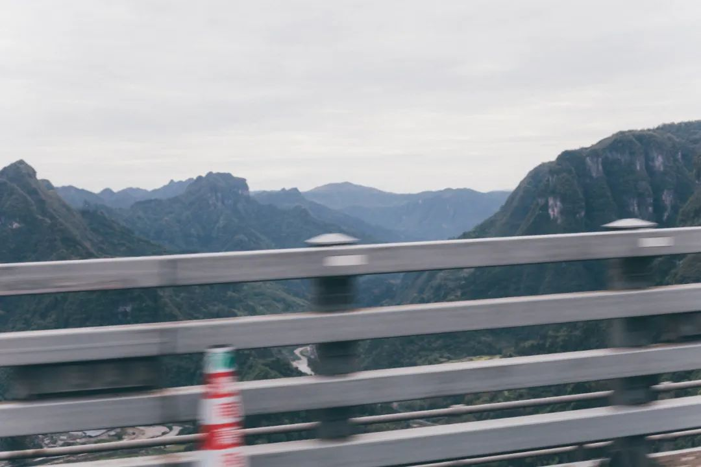
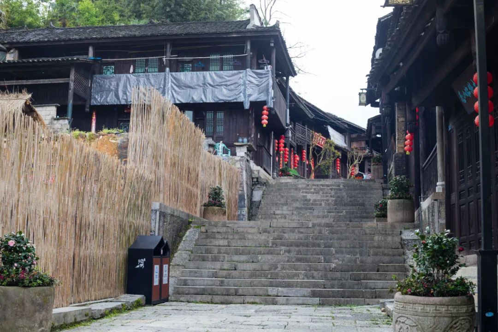
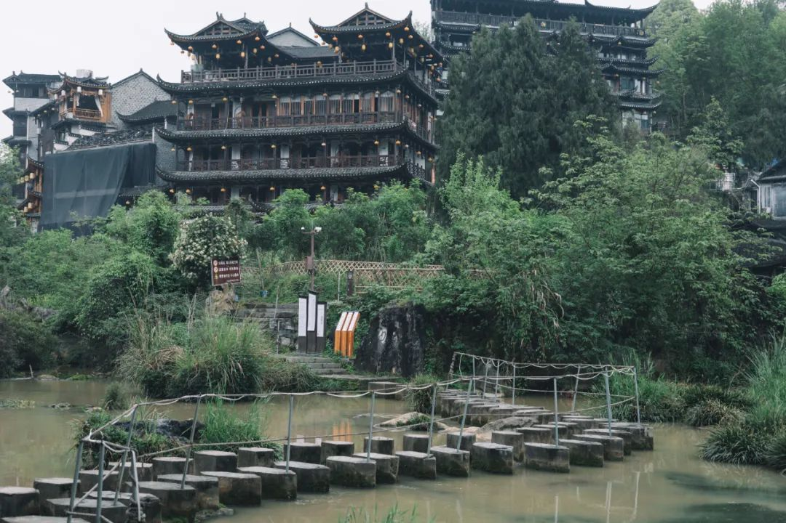
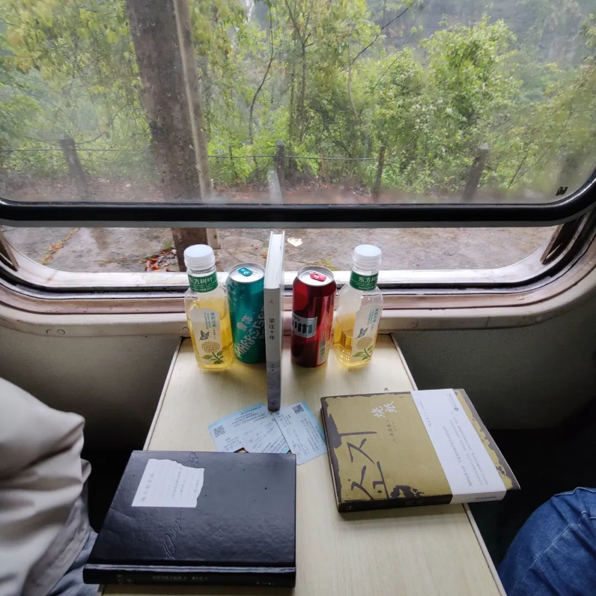

本文是张衔瑜第 226 篇推文

共计 6356 个字， 157 张图

需要指出的是，湘西在这里并不单指湘西州，而应该是更广泛的范围即湖南的西部。当省份的划分和地理位置相关联时，言及湖南的西部则总是和大山脱不了干系。

这一次的尬走，有两位小伙伴一起，是在公众号文章中出现过多次的 Olivia 和 Nuage élégant

出门的时候，湖南的疫情刚有些稳定的迹象。我们带着星城长沙的星，写了一个多少详略得当的 note ，在脑海中测量下湘西顺时针大回环的可能性，然后果断地租车出发了。

/

从北辰启程，天气聪明得像在为了出行而 leap for joy 。出了个胎压不稳的小岔子，转道从娄底下高速。拨通了远在洛杉矶的 不躲 同学电话，不得不说，在认路指示上 AR 也得服娄底老大。 不躲 指引我们参观了娄底市著名景点两家 KFC 在同一条街对着开之后，语音提醒我们进入了一条他忘记了路名也忘记了餐馆名的饭店——只记得怎么走。我也经常这样。

说实话这家叫什么我又忘了。可能当时吃完就忘了店名，但是菜品拍下来了，而且味道真的不错。 不躲 说他每次来都可以自己点两碗排骨，的确合理。

补完胎，起飞去娄底新化紫鹊界。

紫鹊界我在高中毕业的暑假来过一次。那时候印象是不好玩，而且外边住宿的时候甚至没有找我要看身份证。比较喜欢穷游，当时紫鹊界的门票令我不是太想去，因为还有一台车的钱。最重要的，到的时候没发现什么能看的。只记得是高考分数出来了之后，但是哪月已经忘了。

这一次到紫鹊界，地里也没有什么。湖南多为双季稻，早稻的秧苗还没有下田。远远看去，梯田的样子倒不如说是一丘丘水塘，倒映着天空，深浅未知。

追逐夕阳的山路，用相机和无人机分别记录。不曾想，这样追逐夕阳的时刻几次出现在了我们的行程中。而记录，也请求了和当时几乎相当的时间来消化和整理。

离开紫鹊界，夜宿邵阳隆回。

经查，隆回县于 2020 年 2 月退出贫困县。上次来隆回不知道是多少年前了，过来看滩头的年画。应该是我很小的时候，大人只说着天津杨柳青和苏州桃花坞的年画，非得来看看湖南的隆回滩头。那时候认路还全靠嘴上问，给路边一位奶奶五块钱请她带我们去年画工坊，结果她健步如飞，我们都跟不上。

贯穿隆回全境的河流为赧水。我是因为听了焦迈奇的一首歌才知道这个字怎么读。

吃了一个蜜雪冰城的冰淇淋和一顿酱骨头。正在逐步进入旅行的状态。算一算，离上次出门去山西，也有四个月，过去的一年的三分之一。谁不说时间快呢，中间又好像没有做什么。真是奇怪，在完全不会要花费这么多惨淡时间的情况下，空耗着。还好出门了，尝试一种久远习惯的复健。

/

吃了点早餐，启程去邵阳绥宁的黄桑。我很少在尬走中写地名写得这么明白。无它，实在是这边的知名度不同于寻常景点，即便是完整地描述，也未必就知道是走了条什么路。

黄桑是一处自然保护区、地质公园。知道大方向无偏的时候，我们打开窗户，在国道上游走。随缘停靠到了一家饭店门口，假装点了一些当地特色的菜。我说，如果不是拍了照，或许也想不起来那天吃了什么。点的三个菜是没有动多少，都在和山风念叨。

达成共识，没必要把时间安排得紧锣密鼓。想去哪就去哪，觉得这里不错，就停下来休息。后边的，后边再说。

餐桌架在走廊上，面前即是山峦层叠。木香花，这是 山林小粒儿 特别让我用形色扫的一种花，正开在当阳处。老板堆了十来桶水在厨房边，我们桌上也摆着一桶。山泉水、菊花茶、冰镇酒，一杯接一杯。一中午时间，就像是山峰和山风也坐下来和我们一起吃、闲谈，我吃一口、风吃一口。周围香香的、又不热，惬意得令人想躺下来睡觉。

去到黄桑的主景区，曲幽谷和六鹅洞。走进去几分钟就觉得，这应该就是本次旅行中体验最差的景点了，后来证明也的确是。才离入口几步路之遥，就有各种蚊子像集束手榴弹又像集群轰炸机往我们身上脸上栽过来。泰国的卧佛牌青草膏，这会儿也只能脸朝下卧着。

周边走二十米就有一个“禁止狩猎”、“有蛇出没”、“野生动物通道”、“请勿惊扰”之类的标志标语，开始还看得人一愣一愣的，后来注意力就全被蚊子拐走了。不是那种有垃圾而招引来的蚊子，应该是本身林中瘴气的。好生奇怪。

一路上，手扑腾不停地去到六鹅洞瀑布。说实话，瀑布是不错的。但是也仅限于在曲幽谷，曲径通幽走了这么久之后，来到一个地方，看到一处瀑布与泉。我们已经看过挺多瀑布了。瀑布带下来的风，吹得蚊子在水边飞行、站立不稳，无人机也没法起飞。我们的身边变得清凉了起来，有夹杂着清凉水汽的风、和因此而驱散了蚊虫的对比。

又一路摆手舞，一个半小时翻越林瘴回入口。按下不表。

怀化市通道侗族自治县，湖南省的西南边陲。我想来这里很久了，主要是看上了这里的侗族文化。 2020 年去郴州和邵阳写了一篇 [湘南行记](http://mp.weixin.qq.com/s?__biz=MzUzNjE3NzA3Mg==&mid=2247487294&idx=1&sn=9f322e2d7ac015226daa451241d61ed0&chksm=fafb7fe1cd8cf6f7225d1e284127f34ca3cf9af91966ed6ef978b7cb6f1548fbecffa5a362fd&scene=21#wechat_redirect) 的时候，我就同步调研了一下湘西的部分，只不过没有当做重点。论湖南的多民族现状，怀化通道总是妙极。

当年红军长征，湘江战役战损一半之后，在此更改此前原定的会师贺龙方案，史称“通道转兵”。那一封急迫等级超过“十万火急”的“万万火急”电令也是就此发出。转向了贵州，于是才有了后来的遵义会议。

收回历史到眼前，我们在皇都村走了走。当地人说这里 2015 后又整修过，看居民活动场也的确是。

你虽然知道年青一代都可以说比较流利的普通话，装扮服饰也和外人没有什么差别。可是不禁会想，我们究竟是怎么来定义民族这件事的呢？

点了一份野菜粑粑，有一股草木的清香。叫野菜是为了避免出现事实性错误，因为我们都忘了这叫什么，最有可能是蒿草blah，比蕨淀粉要嚼劲轻松。当然比在市场上买来蒸的要好，也比在长沙一些据称是自己手作的要来得更通鼻腔。

我翻了好些资料，来解释什么叫民族。比如说汉族、侗族、壮族、土家族、苗族、回族、瑶族，能大致说出来每个民族的不同吗？或者说，就算知道有苗银，那么如果是苗族的服饰和土家族的服饰在一起，果真能 tell the difference 吗？我是存疑的。

但是又隐约觉得，在某些时候还是有差别。比如如果一定要和我说，侗族人说话跟我们不太一样，或者吃饭的口味也不太一样。但我觉得这倒是没差，我在汕头的巷子里也听不懂别个在说什么，而且论味道和长沙菜的差别不会比长沙 — 通道菜的差异小。可长沙和汕头的汉族比例都在 95% 以上。这个例子也许还不够恰当，因为还暗含了城市对乡村的对比。

总之这是一个可以想的问题。更有甚是有时候和我玩得觉得没有差别的朋友，突然某一天在写个人信息的时候填了其他民族。这的确让人感到民族是一个值得考量的事情。普通能直接在公开网络搜索查到的信息我也浏览了个七七八八，哪天有空（很久以后）再来看看介绍族群与民族关系的研究文献吧。

皇都村的村民好实诚，一锅鱼里的鱼籽有一个拳头那么大，而且还有两坨。

夜宿通道县最好的酒店。三个人，一个不到两百的三人间。淡季的感觉。

/

早晨直奔芋头村，这是另一个和皇都村齐名的村落。只不过皇都村名字更好听一些，于是名在外；芋头村听起来有点跛，于是保留下来了更多可以看的村落建筑。

芦笙鼓楼。芋头村的标志建筑。

鼓楼原来是真的放了一面鼓在这。

环村多有这样形制的建筑。

崖上鼓楼。原本威仪肃穆的地方，现在多是老人们进去，攀谈、聊天。崖上这个地名都显不出来，附近的楼房已经将此名目削减了下去。

随便走走。

我们回芦笙楼吃饭。点了一个韭菜煎蛋。老板记完之后，拿了把镰刀去不远处的菜圃里，现场割一把来。那应该是今年吃过最香的韭菜煎蛋。图为老板在地里时，手上带着的侗族女子出嫁时的手镯。

老板的好朋友见我拿着相机到处拍，也邀请我到她家看看。进门一层完全架空了，一股香味充盈了原本空阔的模样。她说这是自己从附近山上采的茶叶，一边手不停地给我看各种制品——从最原始的茶叶、到晾晒之后干了的样子、抓起一把来给我闻。

她眼里闪着骄傲，说这是谷雨前茶，最好喝的细种，但是又没有想要卖给别人的意思，只说会送给谁和谁， which 我并没有听懂。

等她秀完自己的茶叶后，又告诉我前边有嘉庆古井。白沙古井知道这肯定也是常有人的，不然不会在旁边放水瓢。

菜好是好吃，我们买了一些这个侗族的酸辣辣椒回来，结果每次只能吃三四个就已经辣到爆。以至于发展到只要闻到味道就已经开始唾液腺预备备。谁在长沙想尝试一下的可以来找我，或者在外地的我拿给小罐子给你顺丰到付一点，就是浸泡后的辣椒，就这样凉的可吃。出家人不打诳语，张衔瑜不骗沙丁鱼。

到达怀化洪江时，微微下雨。逛古镇就是要这样，下点雨才觉得像是时钟在往后拨。忽然地看着周边经过的工厂，一种侧写感产生：主要是看到复旧的连续式车间，应当是时间线上很早以前了。

航拍时以为古商城已经同质化严重了，走入的时候却觉得还是很古朴。

十年前，我去初中的时候来过一次，那时候对这里的印象也不错。走在错落上下起伏的镇子里，天热得要命。旅行团在阴凉的庭院里避暑，我们队丢了一面旗帜（大小跟音乐节的那种差不多）放在另一个庭院里，于是我和一个带队老师跑去拿。路上又经过了一个来时没有注意的路口，我觉得墙体和路面在说话。

说不定我还能找到一些当时拍的图，当然不一定是我拍的了就。

这一次在里面的体验也很好。下雨，下雨到我在一个个屋檐间跑来跑去。没有什么人的景点，关闭了喧闹的买各种义乌纪念品的店面。留下了一些人家，和极少数的便利店、饭店。洪江古商城外的居民楼直挺挺地沿着商城的城墙而建，令古城的轮廓些许有些难以辨认。

饭店老板说鸡蓉是这里的特色。我觉得自夸成分不小。洪江只吃了一餐，感觉扎实更甚于口味，仿佛不像是出现在湘菜区应该有的样子。再往北，或者再往南、往东，都不是这样。就没有图了

/

从洪江到吉首，暴雨。

在湘西土家族苗族自治州的吉首住下。

从吉首出发。

经过矮寨大桥。旁边有专门游人停车下来，然后去走下一层的步道。我们去目的地了。

我们到边城了。准确说，是花垣县茶峒镇。

> 小溪流下去，绕山岨流，约三里便汇入茶峒的大河。人若过溪越小山走去，则只一里路就到了茶峒城边。溪流如弓背，山路如弓弦，故远近有了小小差异。小溪宽约二十丈，河床为大片石头作成。静静的水即或深到一篙不能落底，却依然清澈透明，河中游鱼来去皆可以计数。小溪既为川湘来往孔道，水常有涨落，限于财力不能搭桥，就安排了一只方头渡船。 —— 沈从文《边城》

小溪流下去，绕山岨流，约三里便汇入茶峒的大河。人若过溪越小山走去，则只一里路就到了茶峒城边。溪流如弓背，山路如弓弦，故远近有了小小差异。小溪宽约二十丈，河床为大片石头作成。静静的水即或深到一篙不能落底，却依然清澈透明，河中游鱼来去皆可以计数。小溪既为川湘来往孔道，水常有涨落，限于财力不能搭桥，就安排了一只方头渡船。

—— 沈从文《边城》

写得真好。

河流中心有一处岛屿，名为三不管岛。三不管，即湖南、重庆 ( 四川 ) 、贵州都不管的岛。现上有翠翠塑像一座，旁边只是修筑的各种设施。湖南这边叫茶峒边城，清水江对岸那边知晓有这篇文章，也称作重庆秀山的洪安边城。听起来也是文旅产业的内卷。

> 白河下游到辰州与沅水汇流后，便略显浑浊，有出山泉水的意思。若溯流而上，则三丈五丈的深潭皆清澈见底。深潭为白日所映照，河底小小白石子，有花纹的玛瑙石子，全看得明明白白。水中游鱼来去，全如浮在空气里。两岸多高山，山中多可以造纸的细竹，常年作深翠颜色，逼人眼目。近水人家躲在桃杏花里，春天时只需注意，凡有桃花处必有人家，凡有人家处必可沽酒。

典型民居。我看中了这个户枢。

我们在湖南这一侧晃荡了些，就坐在江边看人用捣衣木槌洗衣服。看着也不觉得有时间流驶。有船靠岸，我们也登船去。听船夫说了会儿附近的典故种种，哪里是国务院划定的分界点，自己的一生命运如何。一条清水江多少事，这不似长江上的临江仙，而多是个人自己在称道生命的开心。

在对岸下了船。意味着，我们到重庆了。看了看标语，确认自己现在确实在重庆。走到街道上，谁能想到在 21 世纪的今天，仅仅一江之隔的两镇，竟然会有这么大的差别。那时我们都觉得今天在边城更可以细一些走，于是慢慢地走过秀山的街道 as well as 洪安老街。

拉拉渡。渡船联结了花垣茶峒和秀山洪安，一座文革时所建写满了革命标语的灯塔建在重庆侧的正位处。找了近旁的店家吃饭，窗户敞开，正对湖南侧的拉拉渡和山岩上沈从文所写的边城二字。

再做点什么呢？湖南到重庆，在国道上的桥是封住的。不如去一趟贵州。走到贵州的显著不一样，是看到的屋门外所挂。

远处的山上也就只有山了。没有什么多的好看，于是折返。

晚上采购了一些食品。

事情的发展真的很难形容，不过这也是旅行的奇妙。

/

早晨，出发永顺芙蓉镇。土司所建城池称得上这个词鳞次栉比。

芙蓉镇，原名王村。刘晓庆、姜文上世纪八十年代在这里拍了一部《芙蓉镇》电影，叫好叫座，而此地更名芙蓉镇。我没看过这部电影，只看过一些截图。我拍的图是有很多，倒不如一次性都放出来。

我尝试着让调色的风格统一一点，统一到比较贴合我理解中一个古镇的样子。希望真的达到了效果。

和开着临街门售卖东西的奶奶聊天，她卖的椪柑是从后山山采摘下来的。吃了一个，永顺的柑橘真的很绝。而价格，只低廉到了一块钱一斤，一大袋子五块钱拿走（应该是不止五斤了）。回长沙后，家这边的血橙都到了六块八。人年岁已高是一方面，如果最后是开车回长沙的话早就直接能搬多少搬多少好了（检验前段的健身效果）

雨也是忽止忽续。

离开芙蓉镇景区，准备找一个地方吃饭。去往对向坐龙峡的桥梁正在整修，无法通过，需要绕道很远。前一天晚上采购的，本来准备留以后用，没想到现在就打开了自热米饭，在高速公路上接水。之前在敦煌自驾去瓜州或者雅丹，都是采购一些干粮。因为以前觉得自热米饭不怎么样，没想到买的黄焖鸡真的很香。以后也可以这么干。

到坐龙峡景区门口。

无人值守。

我正要进去的时候，八百米外有人冲我喊“不要进去了，里面很滑很危险”

于是离开了。

过坐苦坝村红石林。

没有进景区。

看到一位穿着雨衣的牧羊人，赶着羊群从路上经过。羊想吃路边的草叶，牧羊人挥着小鞭子，背篓里还有多的草叶。

想，要不要莽一波，去之前放弃了的一个点，泸溪县浦市镇。在路上停停拍拍。

想到了就莽。

湘西有四大名镇：芙蓉镇、花垣茶峒、泸溪浦市和龙山里耶。龙山里耶看起来不太想去，泸溪浦市就是最后一个了。

穿行三十个隧道，来到浦市镇上，时间已经八点多了。没有太多人家亮光，就开车远光。等近了的时候，再换成手电，照一照，看看有没有什么好玩的。万荷园，是一片夜下不见边际的荷塘。如果荷梗莲花全开，想来不失为一方盛景。只是不失现在，现在只能叫光杆。

回吉首，再穿二十多个隧道。暴雨，不像之前从洪江到吉首的晚上，在国道上跟人 70 码行车。这会儿是 80/100 码地在大货车夹缝中穿行。我在朋友圈里边随缘写：

> 阴翳林区里突降暴雨，开车一天跑过五十个湘西大山的隧道。对向卡车闪灯，雨滴 💧drop 亮起，狠狠地砸向挡风。像祛仇，我把雨刮开到最大。『尼伯龙根』言灵 · 时零可以脑补，现在需要一折「村雨」

/

在吉首歇下了。

在吉首站出发了。

这一趟车叫 7266 ，前面没有 G/D/C 也没有 Z/T 什么都没有，就只有四个数字。因为，这是可以绿皮车，最老式的可以开窗户的那种。

穿行在武陵源大山里，能数出来的大站是之前的怀化、麻阳，之后的张家界、慈利、石门县北、澧县。这些是可以在 12306 上买到票的站，更多的是升降点五等站，都没法搜到的那种。

列车走一回儿就停下来，焦柳线，从焦作到柳州。虽然只能搜出来几个大站，但是从小站上来的人也存在。精准扶贫的手段之一，就是这些扶贫专列慢火车。开窗户，可以直接摸到窗外的风。好冷。

农民们背上背篓，或者不知道什么的小物什，搭乘便宜列车出去赶集。我们坐的从吉首到石门县北， 243km 铁路里程，只要 ¥16.5 ，还不到一杯茶颜抹茶菩提的钱（当然了我上一次喝还是在上个月）

武陵源大山与江河，一边走一边看地图数，我这在哪。摊开了一本《梁庄十年》，我想这本书多少符合当前所要面对的现实情况——之另一个非虚构所在。可以看很快，因为书写得很平实，远不像我喜欢在句子里绕这么多弯；但是内里很值得细咂摸。

抬头看看外面一过的山水，又或是停在具体某一站时，兢兢业业的小站列车员也在挥舞旗帜指挥列车行进，就觉得一个人的思维触角实在是太有限、太有限了。

/

拖延症患者回家，多少把要调颜色的图整理了一下。相机好像脑子不太灵光的样子，连续编号的功能仿佛被干扰了，搞得我不知道自己到底拍了多少张照片。还好我人没有被相机传染，湘西之行净化身心的效果显著且到位。至于相机/手机混用，以及一些有关调色的consistency就不用在意了，因为我懒。

乃记之而去。去喝碗粥（回来那天太冷了

