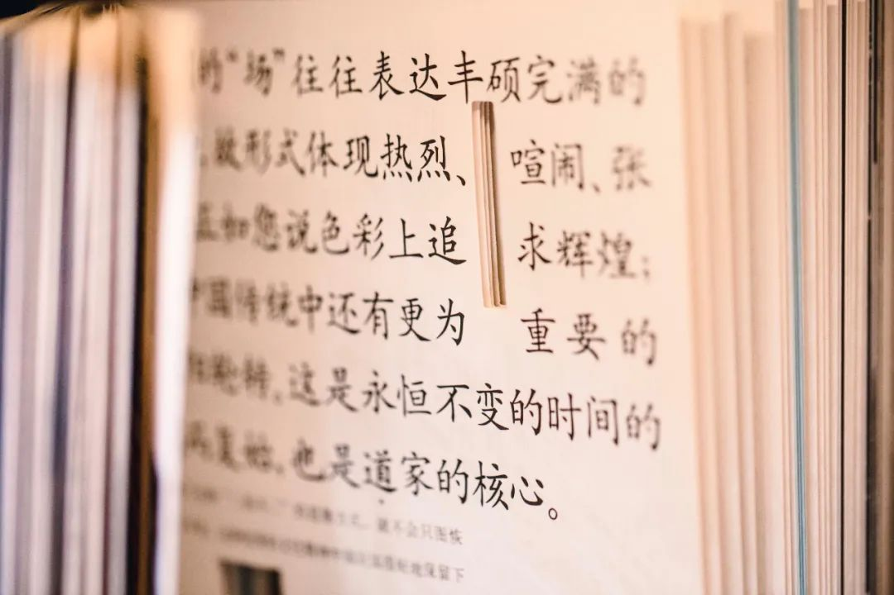
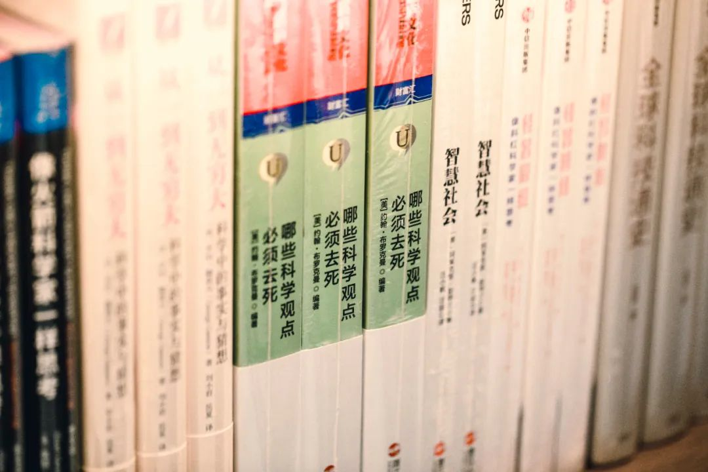
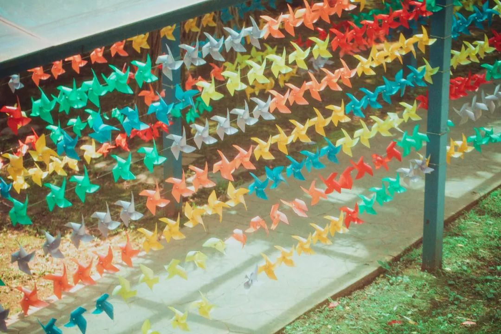

本文是张衔瑜第 229 篇推文

共计 2605 个字， 40 张图

道拉基是桔梗花的朝鲜语。取音之后的又一个谐音梗，是小学音乐课上接触到的第一个和谐音弄出来的梗田。

/

好困。看了一下 memo 上的东西，没有几个好写的。

每天我感觉自己要睡到十四个小时以上才能保证神情不涣散。人，生来就是为了睡眠，应该没有人要质疑这一点吧。昨天在健身房做有氧运动，投屏了一段《走近科学》的混剪，其中一段是说女子坚称自己四十年没有睡过觉，她的丈夫也说晚上醒来会看见枕边人鼓起眼睛瞪着自己就像在守灵。

后来仪器检测一下，当时应该还没有各种手环产品，发现这个人其实已经进入深度睡眠了。她只是不闭眼。

还有一个人天天吃 666 农药，一直吃一直吃，搓成零嘴配瓜子嗑，特别喜欢这个味道。后来人们觉得她吃没关系，主要怕带坏其他人。于是也是医生进行会诊，发现各项正常。于是检查一下 666 农药，发现这是十年前的， which means 早就过期无效了。她正好也钟爱这一个味道，没尝试过别的口味。

/

我觉得我每天做梦的内容，和诸上的这些比起来也大差不差。

梦到有一个人背着一把大砍刀在路上砍人。人们像在 livehouse 开火车一样，搭着前一个人的肩膀然后往前溜窜。我坐在一辆加速有余但是转向控制不足的卡丁车上，后来一想也有点像那种沙漠冲浪的摩托车。总之我就开着这辆车心里贼怕，但还是冲过去创那个背刀的贼人。结果他闪了，我往前冲过头，从一个花坛上划过去，他从我背后飞快地追上来。梦就醒了。

梦到在一个敞阔的礼堂里，有一次音乐现场。感觉还蛮好玩的，游走在里边。我没有像平常那样穿已经被踩得稀烂的鞋子去这一场，而是穿了一双夹板拖鞋也就是 so-called 人字拖去玩。乐队演出到很聪明的时候，大家开始鼓掌。我就把硬质的夹板拖鞋从脚上拿下来，高高地举过头顶去鼓鞋板底。

梦到一些吊诡而吓人的场景。我和不躲开车出去，车上还有一个女孩子。前面碰到交警在查行人乱穿马路，但是每一个人走路的步伐都好像失去了部分重力。最重要的，是眼神空洞，虽然不至于没有瞳仁，但是也好像只是在一个实物载体上贴了一层 artificial membrane 来掩饰没有活体生存的事实。

/

Sleepis just a time machine to breakfast.

However,to me, sleep can make myself a time traveler.

/

好多事情可以记好久啊。

我记得高一的时候，反正和我们班主任一个办公室嘛，就脸熟了隔壁班的化学老师。有一天正好有一个问题，是氯气入水的问题。那时候我还没有学，正好拿着卷子去走廊上，看到这位特级教师就问了他一下。

他的表情像是一锅烧黑的印度老番茄，说这不是我在班上讲过几遍的嘛？然后开始写歧化反应方程式和接下来的光照反应。我说我是隔壁班的，他的脸上又变成了角质化的西红柿南瓜汤。我在走廊上继续看卷子，他就溜了溜了。

还是跟氯气过不去。后来高二有一次看卷子，答题的时候本来两空分别是氯化氢和次氯酸，不分先后。他就来看了两百份卷子，以为这两空要分先后。我就被误伤了。教我的化学老师看了卷子去找他 (in CSC accent) ：“ x 特，里哦斯看卷子卵看子看咯？”

高三换了学校的理综大组长来叫我们化学。后来我自己从化学系毕业。不管哪个时候，一看这氯气进水，这一个几步反应不是简单得就像前几天茶颜悦色小主节充两百送五十一样必须参加。只不过后来我学的东西越来越多，可以扯一堆理论来胡扯，这里那里是怎么化学键断开又连上，拿什么仪器测什么速度。以至于上超算中心去交服务器去从求解薛定谔方程开始分析步骤，都已经离直接写个众所周知的方程式走远了好多。

Imean 何必搞得好像有种什么知识傲慢。

我向来也只是看不起不学习、习惯了低幼化处理事情的人，从来没说哪个人因为处在知识储备的早期阶段而对人有什么不耐烦 ( 倒确实偶尔也会有一些

/

昨天看完了理想国译丛里德意志第三帝国三部曲的第二本《当权的第三帝国》。第一本是到来，写纳粹党和希特勒是怎么上台的；第二本写怎么做战争准备；第三本就是二战的战时了。这就是我说的肘子书，一千多页，三分之一是参考文献。

当权的这一本，前面写的真的是又臭又长，又多又驳杂还很麻烦。虽然已经在尽力保持条理了，但还是很多很复杂，我指的是从一个非史学研究的读者角度来看。全书有七章，但是只有最后一章才是奔向战争之路。看完前六百页我感觉花了差不多两个月，也就是在健身房看。但是昨天早上看六百五十到最后七百页多一点的这里，就是一早上。

因为很容易看，这一段就不像前面一样那么杂，我感觉是作者懒得写了，很快就写完。一会儿就跟墨索里尼搞好了关系，然后合并了奥地利。稍不留神就把捷克斯洛伐克的苏台德地区拿了过来；最后简简单单地就跟斯大林谈判好，签了《苏德互不侵犯条约》我看上去内心就是“嗯，这一段是这样。嗯？怎么就部队开拔了？嗯？匈牙利怎么就上手了？”然后这本书就结束了。

/

晚上去不吝书店，这是新华书店在长沙除了几家乐之书店之外又打造的一处书屋。在里边的一个专门架上是理想国译丛，正离人最近的地方摆着的就是第三帝国的三部曲。

不吝书店应该是我在长沙看到过既敞阔，而且又有一些选书力在里边的书店。平衡得很好。西西弗卖的都是些什么书？我不说。空有了那么大地方，把书籍出版只当做一门生意。不吝的空间也很够，毕竟是新华大厦里新华书店的地。

不吝的选书力大概相当于什么水平呢，我觉得在 60% 的区域，选书力是和目田书店还有民生书局持平的。目田和民生是我觉得长沙书籍市场的两座高峰，除了地方不大。不吝的里边单开了一些部分给我觉得没什么意思的书，只是那些没有什么体现出一个书店的品味。比较神奇的是专门列出了一个有关书籍出版的艺术装帧区，猜测是新华书店的长项。于是我挑了一本方晓风 × 吕敬人《历史的 “ 场 ” 》，坐在窗边看，以为很适合。

中间理想国译丛这一块的两个大 M ，左边这个就是我刚看完的德意志第三帝国第二本，右边是我即将要看的第三本。

当然事实上我最近睡前都在读荣格的《红书》。而且，我也觉得晚上做梦颠东倒西的样子像极了跟荣格逻辑对打。荣格也读席勒。我不一样，我还可以强读郎之万、强读卡文迪许 ( 这个不需要太勉强

/

一些花花草草的出门图，按说也是最好多出去转转。

/城市

/

只是有时候出门了，我站着靠在墙上都能睡着。昨天去健身房里练核心和背部，有一个动作我简单说成是坐姿划船加上蹲起站立，全后侧链的整体训练。手上已经加了五十公斤重量了，教练在旁边计数，偶尔还说一说让我把器械往上腹拉。在这种情况下我也还是困，只要一下蹲就感觉如果闭上眼睛的话我马上就能睡着。

所以躺着就更不得了了。保持完基本运动就快睡吧快睡吧。难得我写一次推文里面，放了很多图但是没有一张是直怼食物的(如果水果要计入的话那就细化到碳水定食
