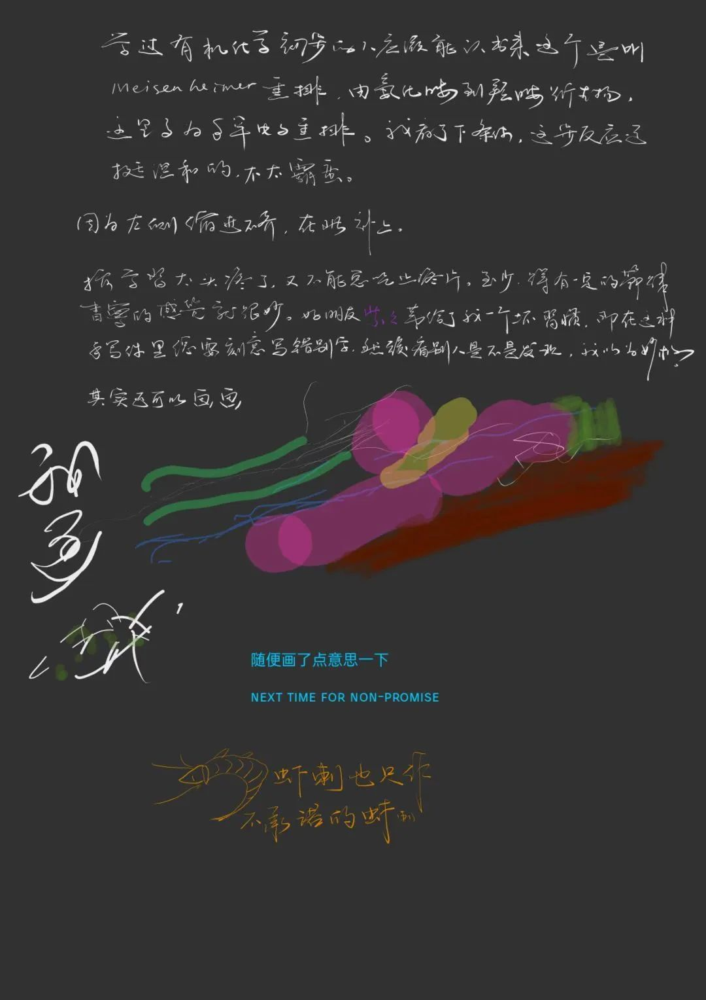
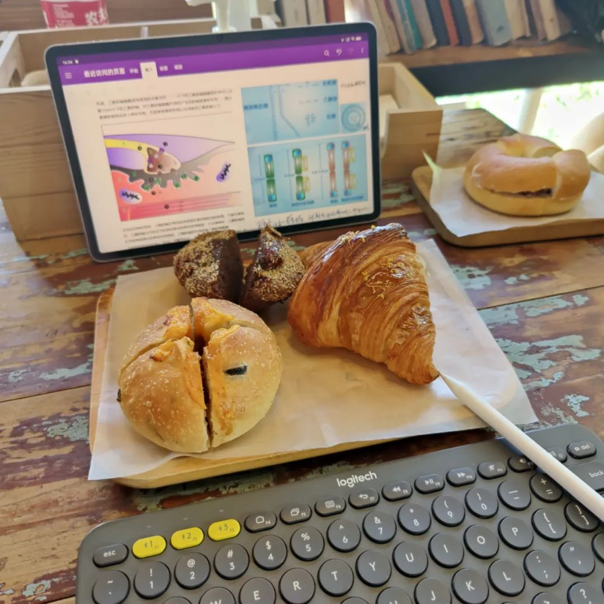

今天尝试一下用这种方式来写。大概需要的话，得点开图片之后开个autu-rotate横置过来比较聪明。我自己在写的时候也是这样做，把屏幕横置过来然后写。

麻烦的事就是，手写的话，文字总是不那么易于阅读。之所以要用一些规范化的字体，譬如仿宋的国标2312 GB/T 2312-1980就做到了这一点。

手写把我想写的东西都已经写完了。更接近于以前写日记的一种方式，只不过现在是soft-based rather than a hard-copy. 遥想大一大二的时候还可以在手机上写一份，然后又在电脑上写几份，最开始说自己如果完全把所有想写的写完，可以一己之力写起来好几个公众号。按照现在的产出效率，约莫是一件很难完成的事情了。至少，不是一件挥之即来、挥之即走的事。

浅浅地放一张结尾的图来把文章收束一下

