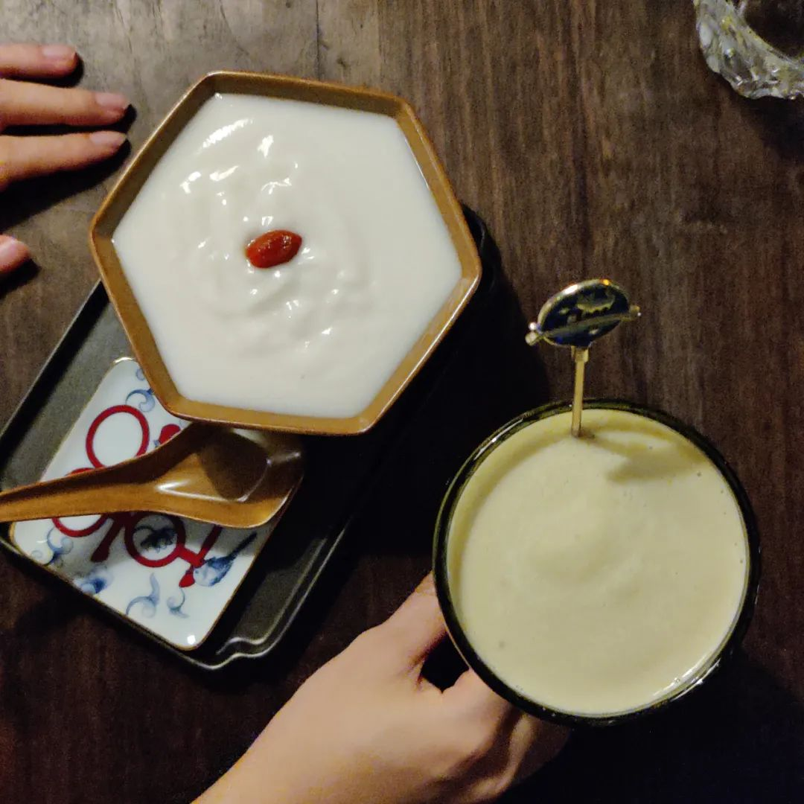

秋天就应该找一个公园的长椅，躺下来睡觉。长椅最好是那种软一点的木头，不要刚漆过的，不然有味道不蛮好闻。在树底下挺好，不管是白天晚上都有婆娑感，暗香疏影。长椅还是要有一定长度的，至少得从后脑勺接触的地方一直抵到尾椎。脚踩在地上没所谓的，你自己调嘛，又不是脚不能动。

听歌的话可能稍微有点麻烦，可也是不得已之举。很僻静的公园长椅，小动物也很喜欢来。太吵闹的公园长椅，又睡不着。能找到一个跟睡眠规律相符合的长椅，说来还真得费一番功夫。所以作为自己的调适，就得戴上降噪耳机。我很烦的一点是，降噪耳机没法在最低那一格的时候再往下调一半，就好像这个东西都是量子化的，没法取到一个足够精细的中间值。虽然我设置了功能，在手环监测到入睡的时候就减弱媒体音量，但是应该从来没有触发过，因为戴耳机播音乐的话我从来没睡着过。

写这首歌的人，虽然我很穷，但是愿意出面集资为ta颁发一个文学奖。我现在对这首歌就像是19年听到Burgundy Red, 20年听到我用什么把你留住，21年听到寂寞超音速。

同在一座城市，为什么好久不见？

这问题写着写着就开始混乱了。

譬如，

周五要开会，得提交一个材料。前面一直赶工。周二发现竟然做得差不多了，搞得我一愣一愣的。于是去找以前隔壁寝的好兄弟吃顿宵夜压压惊。周三确认了一遍，发现我的确都做完了，看来专注的时候，不管心情怎么样，事情都做得蛮快的。

稍久远一点的时候，我觉得那是有意识地虚度每一秒，有意识地拖延。就像一个幽灵在飘荡但是不撞到任何人也不受任何喷绘制约。我喜欢看时间溜走并且不加制止。摘抄本上写「惊慌失措的大脑被困在一个拒绝高效的身体里」我的输入法联想在高效之后写的是高效液相层析。在尖叫，也在吃薯片。

和 双倍甜 说起经过狮子山附近的铁路，我说我之前从桂花公园骑车的时候有印象经过过一条应该早就没有运营了的通勤铁路。按照之前在武昌北站四美花苑拍铁轨的印象，这一截兴许是长沙火车站的通勤铁路，比如给职工住宿通勤之类。没去溯源了，天气好，心情也很支持我出门，于是带上小飞机骑车去了这里。

拍了一些城市人文的东西。给这些题材调色，在我简直就是份内的事了。

回家的时候出了个小插曲。在马王堆汉墓旁边，操控大疆 Air 2S 跟随我一起走路。我没看屏幕，看路。大疆不看路，看电线杆，于是和光缆玩去了。就有了这一张最后悬挂在杆子上的样子。打各种电话，从五点一刻等到十点，扯各种皮。我的好心情不能被这种事情耽误，就算感觉很长一段时间以来每次我有心情做一些有趣事情的时候总是会出幺蛾子。

周四去了一趟相机店。想把相机出掉，但还是想把它送到有真的愿意拿着机子出去当做生产力的人那里。又去了趟大疆的店里，把飞机退回去检查。身上的负重减轻了一些，时间也还早，琢磨琢磨和泡泡肥皂去岳麓山户外拉练。

在雅礼的时候我经常走这条路，从二里半的师大教务处往蟒蛇洞去。路上没多少人。最早我骑单车在岳麓山大路和土路上上下下。后来没有单车了，但是蓝牙音箱还在。就背着包，蓝牙音箱庖代了水壶的位置，听蒋勋的播客上山。蟒蛇洞附近有我习惯去接的泉眼，水壶不在侧边栏，但也在包里。就把原来的水倒了，接上山里的水。

前几天跟家里人从国家超算那边上山，那是原来岳麓山林场工人运送木料的路。路边有掉下的锯木屑，很好闻，长沙人喜欢拿它们去熏腊肉，也很好闻，也很好吃。岳麓山我现在能马上想起的都有四处山泉流水，蟒蛇洞这里是我最喜欢去的。不过超算那边从齐腰宽的溪流，前几天去已经只有一小眼。周四和泡泡肥皂到蟒蛇洞的时候，原来空空的平台上建起了一个小便利店，上书《泉水泡茶》，几个人歇凉得歪七趔八。我去泉眼看，泉眼底下的石头说这里没水了你去找祝融算账吧。

走到万景园。商量是走前山的农科院茶林下去，还是趁着夕阳从后山莽下去。泡泡肥皂说走后山，我心想，那这真的是拉练了。到山顶军区的时候，手环说我们已经走了 5.49 km 以为然。补了一点柠檬酸钠葡萄糖水，从古炮台下山。这条路跟在岳王亭 - 蟒蛇洞那条一样，我最近两年内都没有走这条路的记忆，不过也还是知道怎么走，以及记得以前在这下山在哪摔了跤。只是不想到，下山时比我们想象的还离谱，因为天黑得比想的快多了。下的时候股四说不好意思，折返的话不太甘心，毕竟路打着手机手电又还是能看见。

这感觉就有点像憨憨游戏羊了个羊，很难通，但是又有希望，又但没有道具。当然，杀时间的游戏就是傻逼。花了时间，依然要说那是傻逼。我还说我爬了这么多年岳麓山，从真的在爬的时候就开始上岳麓山，到骑单车，到用脚量几乎量遍前山每一处还能看出路的小路，到雨天在后山摔得白眼通天，都没这次断黑时刻下党校累。在党校门口坐下的时候， 9.2 km 1k2 千卡，只想马上打车去找一个又能按摩又能吃饭的合理去处。

周五开完会，股四说不许。走出门去拿顺丰寄回的大疆新机子，还没出门就说电信大楼炸了，开福寺和潘家坪起火了。飞了个飞机去，测试机器，再加上离得也不远。

在朋友圈记录了这段话：

> 我对荷花园这一片还蛮有感情的。学龄前的日子很多都是这里的记忆。我读过的幼儿园，走路到这栋楼都不过十分钟。锦泰广场可以钻来钻去的健身器材，不知道玩了多少回，然后看着这栋又高、配色又丑的粉红色的楼。现在我骑车乱走的时候，也时不时去荷晏社区，小学初中的社会实践在这里搞了不计其数。后来去电信大楼的营业厅办事，我总腹诽这里面的人什么事也办不成。 18 年暑假，和金记者在旁边 12 层的楼顶，拍五一大道东二环的落日和金星伴月，还想如果能去电信大楼的机位该多好。

> 下午正好拿到顺丰换新的机器，马上起飞去看一下怎么样了。距离反正也不远不近。网图看起来都在西南面，已经烧得乌漆嘛黑，时不时有高空坠物。我飞飞机是迎着东北面去的，东北面墙体和外观都还完整。该去的力量肯定都去了，我听到的消防声音都没停过。看今天长沙几处火情就想起 1938 年 11 月 的文夕大火。天干物燥，小心火烛。 想想每天都很离谱，两天前我才去拍了旁边锦泰广场 火车站的南边通勤点。回来的路上飞机挂了，还打了 119 ，跟他们借云梯来拿无人机。接线员拒绝，说：根据中华人民共和国消防法第三十七条：国家综合性消防救援队、专职消防队按照国家规定承担重大灾害事故和其他以抢救人员生命为主的应急救援工作。所以不能借你云梯。

下午正好拿到顺丰换新的机器，马上起飞去看一下怎么样了。距离反正也不远不近。网图看起来都在西南面，已经烧得乌漆嘛黑，时不时有高空坠物。我飞飞机是迎着东北面去的，东北面墙体和外观都还完整。该去的力量肯定都去了，我听到的消防声音都没停过。看今天长沙几处火情就想起 1938 年 11 月 的文夕大火。天干物燥，小心火烛。

想想每天都很离谱，两天前我才去拍了旁边锦泰广场 火车站的南边通勤点。回来的路上飞机挂了，还打了 119 ，跟他们借云梯来拿无人机。接线员拒绝，说：根据中华人民共和国消防法第三十七条：国家综合性消防救援队、专职消防队按照国家规定承担重大灾害事故和其他以抢救人员生命为主的应急救援工作。所以不能借你云梯。

当下的情况是珍惜时间，以及很想吃清蒸闸蟹和黑松露披萨。就只怕螃蟹还没着肉。

和山林老师确认了这个叫做五白汤，也记得老板说这是五种谷物磨成的滋补汤。地点在丰盈西里，我的理想养老选择之一。奈不何黄金瞳的修猫有心事，会站起来凶人

