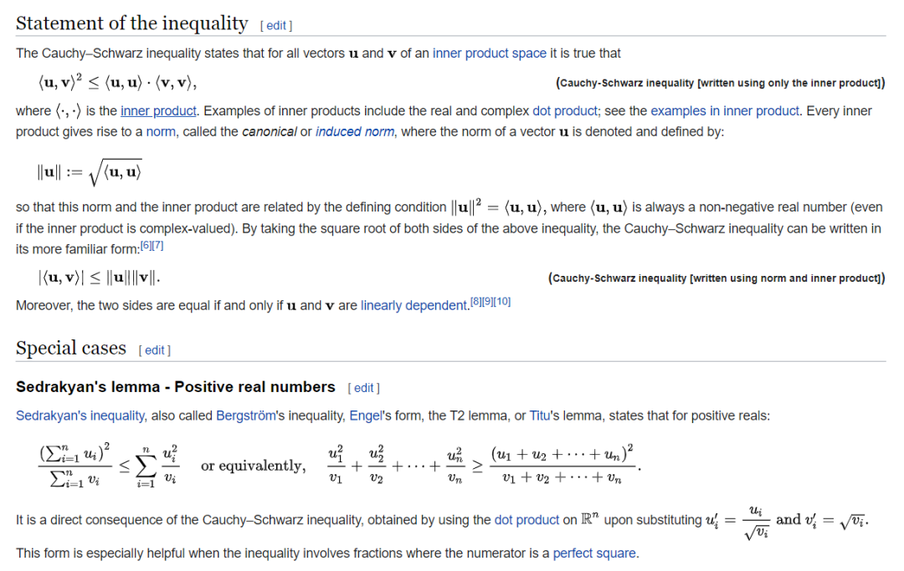
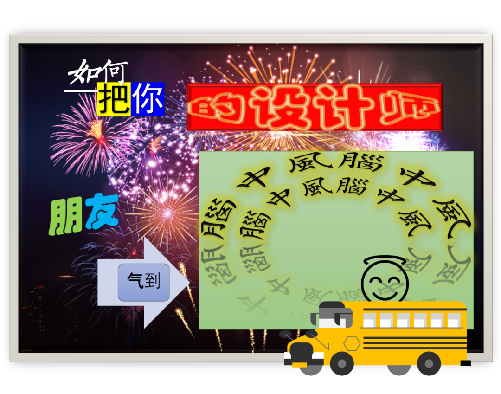
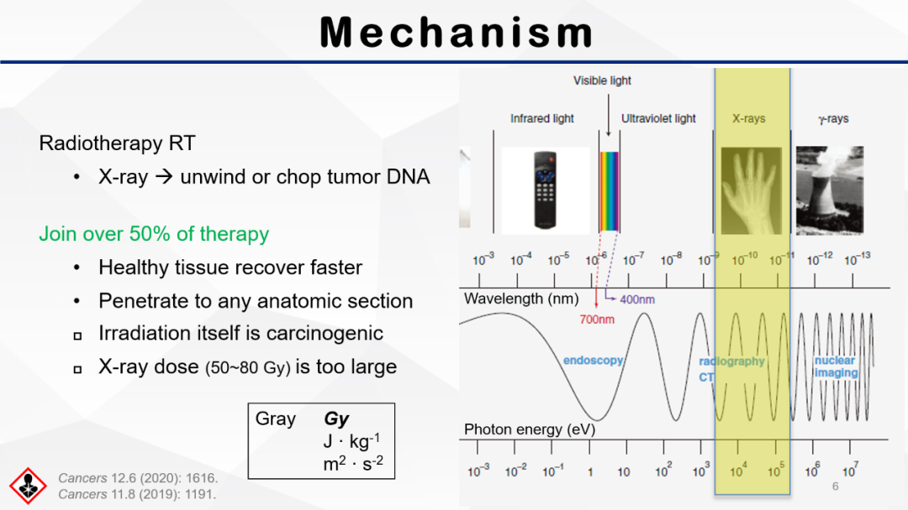

今天长沙转凉了，怕冷的人，晚上穿起了长袖。气温聪明，像是在喊我出去玩。可我没有出去玩，因为要思考明天吃什么。思考是很耗时间的。毕竟，时间是一个非线性进程，总是在关键的时候很贫瘠，在无聊的时候又很冗余。

客观唯心主义者可以来跟我多嘴了。

今晚骑车在路上，想起以前 骑车在别的城市的事情。如果对一个城市什么也不了解，不知道任何关于这个城市的底蕴也好、文化也好，或者不认识愿意对你说有关这个城市事情的人，那样的旅游跟邮差有什么区别？到了一个地方，从绿色的布包里拿出一个邮戳册子 “您好，戳戳” 然后就走了。

小时候，那时候还专门有课叫做电脑课。没那么直白的年级里，又叫做信息课。我对一些小学老师都没有什么好感，都是恶感，其中之一是关于做 PPT 。忘记为什么要我做 PPT 了，可能是被老师知道了吧。四年级的时候，数学老师要上公开课，我还记得我做的 PPT 叫做《可能性》，我现在猜老师应该不知道概率论与数理统计初步，应该也不知道 Cauchy–Schwarz inequality 柯西洗袜子不等式 snapshot
from Wiki

老师不会做 PPT ，让我做。那时候我也喜欢出风头，就揽下了这个活。在家里拿着好像还是显像管原理的巨大电脑显示器写 slides ，有一页的背景我还有印象是小学的凉亭，木质的，刚刚漆过油漆，还有不小的味道。以我现在的 PPT 审美看那会儿，只会觉得好笑。

比如我现在仿照那种情况下我喜欢的样子来做一瞎

因为觉得字体多就是高级，颜色多就是高级。有背景也很高级。可能这就是高级感吧。而且现在公众号能看到的图片其实还不能好好传达出来我的想法。因为我喜欢的还有加动画效果，以及一个最最喜欢的急刹车音效。就好像按了一下回车，我就说了一个带感叹号的祈使句。

实际上我现在做的 PPT 是这个样子的。取自上学期英语课的结课答辩。看起来正常很多。不是那种祈使句大王。

每天喜欢用祈使句的人，每天唯一能接受的新鲜事，也许就是食堂里的菜谱和昨天不一样吧。小学的时候每天就在想吃饭吃什么，现在是真的没那么能吃，只有找不同的花样。以前在科也看到很多明显不是本科生的更年长的学生，用餐时间背着个小书包在排队，探头探脑地看前面的人打了什么饭菜出来。去一些事业单位吃饭，自带饭盆的人，往往最喜欢敲，好像吃饭的期待心情掩饰不住了。

所以由此，我也能理解为什么微信除了支付以外还离 QQ 那么远。

也还是四年级，在老师办公室经过的时候听到他们无脑黑山东人，说山东人的耳朵后面是黑色的。当时我把这件事情记得很死，因为幼小的心灵受到了不小的冲击。那时候我正好在拼中国地图。

过几天我 在 学期中，喊家里人帮我请了一个礼拜的假，去一趟山东走走不同的地方。 在青岛 下飞机之后，还没拿行李，走去撤硕的路上我就一个人一个人的耳朵后面盯着看，看是不是有人真的不洗耳朵后面。 后来总算远远地看到 一个人耳朵后面黑黑的，我以为 这是真的山东人，小学老师说的没错。 走近一看，用现在的话来描述 是黑框眼镜的镜腿。

自那以后我对山东人印象就正常了起来，另外一些人在我心目中也去了他们本应待着的地方。但小学到现在，我对另一处当时也去过地方的印象依然不好，不在山东也不在两湖地区。尽管读本科之后遇到了很多来自那个地方和附近的人，但我小学去过之后，在中学阶段也一直黑那里，所以一直有一些思维定式。也因为我后来再也没去过，那么现在先记之而去，是哪按下不表。

去掉行文里过分多的“了”、“的”和“就”，会让语句读起来更像中文。改写以“当”开头的从句也可以达到类似的效果。我比较喜欢转义一些我爱那么表达的字词语句。如果读不懂，一般都很难接触到这里面好笑的点在哪。

希望说中文的人知道自己是在说中文。不要普通话也说不抻，方言的词汇量也下跌，外语（任何一种或几种）更连机翻和合成人声也比不过。
