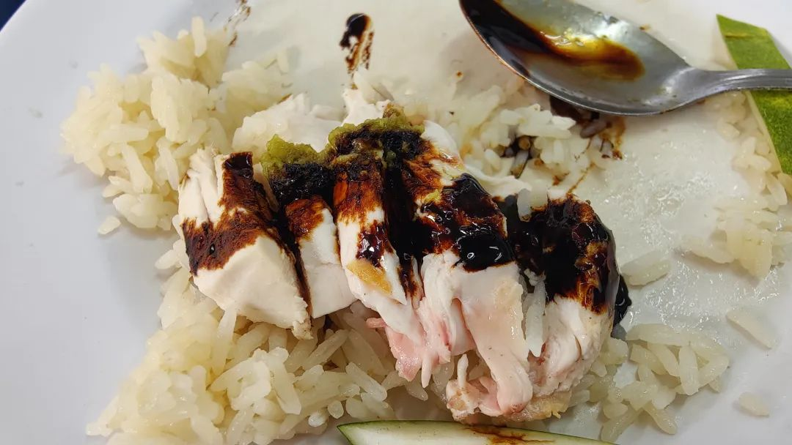
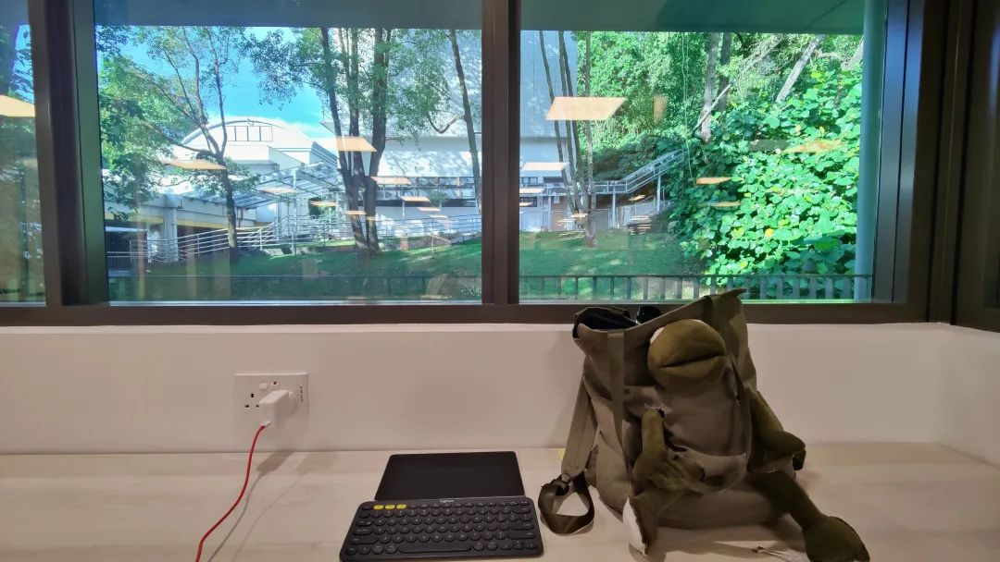
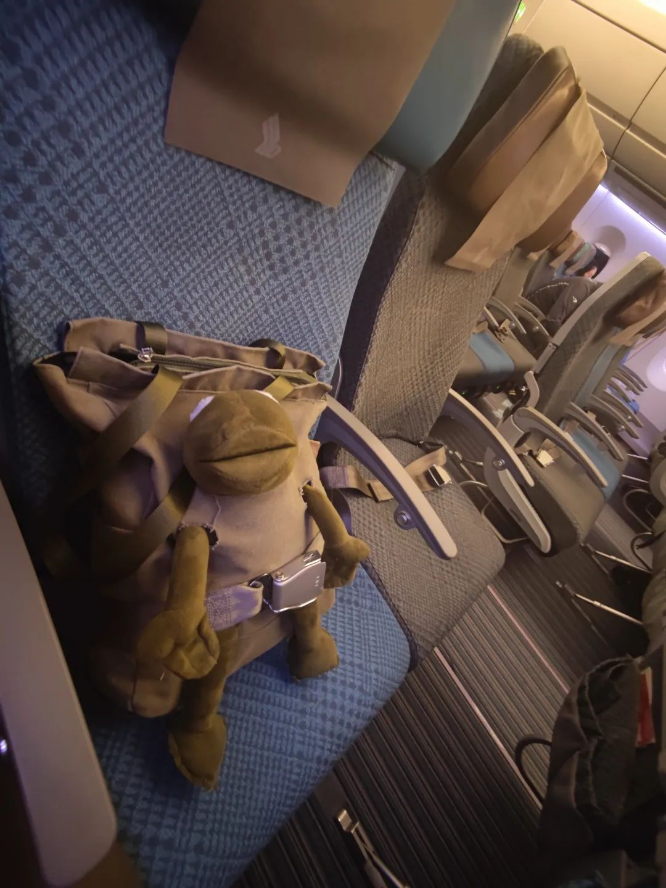
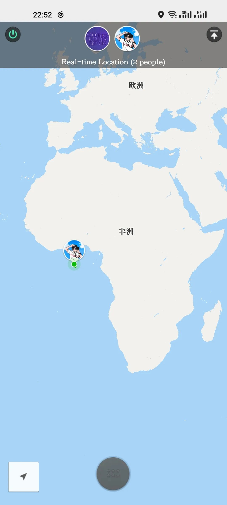
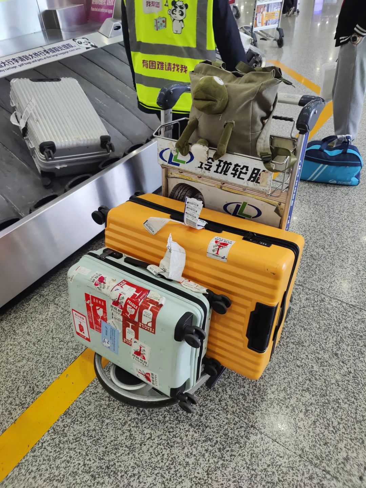

又有三周什么也没写了

简单事情，一旦涉及到了不止有一个人参与的时候，便会变得越来越复杂。社会用群体规范来管理群体性事件，纯粹地来说，规范是为了减缓群体性事件的复杂度而定义的。如果规范行之有效，则群体性事件可以得到有效消解。越高效的规范，使得消解越聪明。 需要注意的是，如果规范的复杂度和群体事件棘手相当，我们并不能认为规范是有益的。这里不是无过即是功，而是无功即是过。所以，规范复杂度超于群体事件，我们应当认为这一规范臃肿且有害，应当被剔除出去。我这么来表述并非有多大戾气。知易行难，多少只是一个敲， 更重要的是，社会现状是已经由许多的规范和无往不在的突发、渐变、隐藏、倒勾的群体事件当中盘桓错杂。一个规范，往往上下前后很难抽丝剥茧清这一个纸牌上又动着屋子的哪个犄角旮旯。所以，升斗小民保留朴素的宏观视角即可，但并不需要按之行事。普通人本就是朴素价值构建的个体，如果能听晓一些粗糙的与人建议，就已经很了不起，哪有那么多七七八八的要求。

现在在朋友家里写下随笔。很多次被打断。跟朋友家里关系不大，这里环境很好，我也很谢谢朋友能接到我来周转两天去寝室里。被打断是自己跳开的思路，以及一些沟通情绪而并非沟通信息的交流。 从长沙来新加坡之前，最后几天见到的朋友，我都这样描述着我的状态：没有很好，但是所有事情都凑合。确实嘛。周四下午开完会，然后就在纠结到底选什么时候的票。周五中午买了周二一早出门、午夜到的票，然后就开始修手机、相机、耳机、电脑，总之能修的我都修一遍，接着开始清点行李。行李也不难，第一批双十一的货已经在南海上快到坡县了。要带的东西很容易清点。好朋友也未尝不熟悉，在长沙该见的、能见的朋友也大多照面过，熟悉的人依然是这餐吃了吗没吃就带个饭吃了就搞一杯。在坡的好朋友们也都预先知会过，学习是次要的。

到学校图书馆里边来了。持续跟学校行政argue也没有什么太多用，反正又不是第一天领教他们的这种操作。关键也是最近，干活的两个人轮流休息，处理事情不连贯的话，也没法强行把别人的工作提上日程。

拍照的兴趣最近仅限于草率记录饮料。 那么最近喝了马蹄竹蔗、夏枯草、泰奶绿茶、柠檬茶、山楂洛神花、milo、Erdinger、酸柑酸梅、青椰掏心、还有一些航空饮料。 下了七部电影准备在飞机上看。四个多小时的飞行，只看完了一部王开胃的《一代宗师》这样的电影的确就应该是他来拍。没有提前注册航司会员，所以没领到航司的免费WiFi, 那就浅买最低量一个小时的来玩一玩吧。速度慢是慢了点，不过浅玩也不错。发现了接入点的秘密，定位直接给我定位到US Wa* DC去了，笑(不是很聪明

当时在装修的云茂潮中文图书馆，或许以后会经常来这边坐(也许 窗廊隔开，南洋热带树木高大。阳光在伸展得教人看着疑惑的叶子上，只让人觉得流火。好重的火汽，是蒸腾之后在建筑与人体周围唠叨不停。

拖延的习惯仍然和以前一样，对科研学习的逃避。重新返校之前，我想着：先把所有的程序都解决吧、先把新课题定下来吧、先让老师们都通气好吧、先把宿舍定下来吧。总有托辞的理由。事实上在等待，并不会给人多少宽慰。钝刀割肉，肉也会被割下来被我放进油锅煎炒烹炸，加入白沙井水稍许，淀粉勾芡、小火收汁。 好朋友给我的建议是，给学习时间安排一个确定的数字，但不必给休息的时间设限。其实很有道理，但是实施起来很危险。昨天早上去宿管那边argue，然后一天就因为这件事而被截胡了。本来应该带电脑，在哪坐下然后开始干活的，因为不管住在哪，工期不能耽误。可是在拖延的习惯影响下，今天这件事情没有做好，那么必须要按照序贯来办事，于是接下来我得去实验室的事也先不办了。 有趣的是，我并不是按常理出牌的人。我的拖延就和我干活一样地没个定准，当我现在在半月谈推文里大说特说自己如何拖延过每一天时，已经给我的吃饭手册(不是真的大众点评)找到了它该去的地方，干活电脑也是。

比较好的一点，不管我把事情说成什么样，做事的baseline倒是不会怎么变。思路是真的在到处玩绕，路没有多么直，好在不会轻易像思路一样丝滑游荡。 饿了，得去找点吃的。渴了喝、饿了吃、汗了洗、困了睡，不做跟自己基本生理需求相左的事情，适应环境起来会变得快乐不少。
