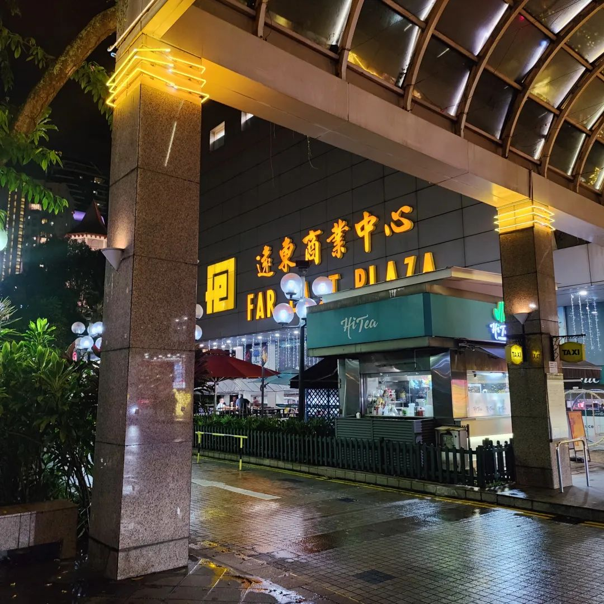
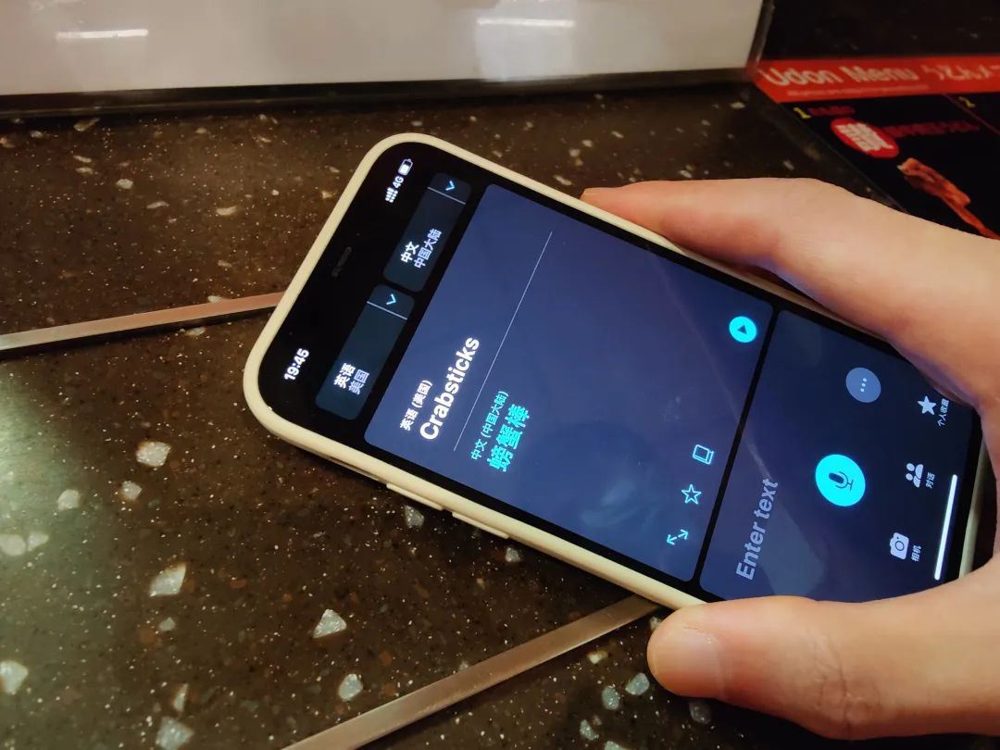
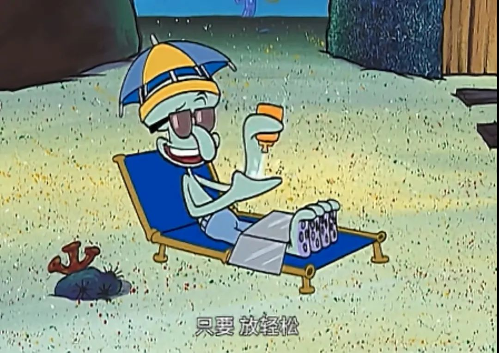

写这篇的时候，我正在听发光曲线的《午夜快车》

有点懒惰，所以从标点符号开始都 变得一 如懒散，就像写不出内容的写手一样。我刚写这几个字的时候 ，打网文，输入法帮我记忆了“惘闻”；我打“写手”，输入法帮我记忆了“携手”。活力像是上个世纪的事，所以人们才说一个时代很容易远去。

在朋友家暂住。朋友早上一般都得比我早。

下楼等车，等去学校的车。我觉得坡最令人称赞的一点，就是上一程公交可以 waive 下一程的费用。比如我第一程坐公交车去地铁站，第二程是地铁，那么只要在换乘时间内（以前我记得是四十五分钟）公交车的钱就可以抵扣一部分地铁的费用。最多可以有五程，好像还有些别的限制，比如不能接续同一个车号。

听说在另外一些交通联合做得很好的地方也有这种优惠。只是我没有去过罢了。

我刚刚戴上耳机开始写推文，才发现最近已经很久没有听歌了。我以前是多喜欢听歌和唱歌呢？以前大三的时候说，出门不戴口罩就像没穿衣服，出门不戴耳机就像没穿裤子。后来大四疫情进入人们的视野之后，我越来越讨厌口罩了。来来去去的爱好，我其实早应该察觉，因为这么久了没有需要给耳机充电。

在公交车站失神。我知道要坐什么车，但就是眼神会突然像漂移了，并不聚焦到一起去。公交车轰隆隆地开向站台，我看着公交车轰隆隆开过去。看起来好像真的没有什么理由，要这样眼睁睁地看着我等了这么久的车子开过去呢……虽然知道发生了什么，但要做出任何一点改变都好像要在原本不多的精力上耗费再多一些。

我想，这多少是长期以来应对等待的遗留瘢痕

好像就是习惯了等。如果一切顺顺利利的我反而觉得不自然。看着验证程序慢慢加载，每秒验证 26 个秘钥，总共有四万两千个秘钥。我宁愿一直看着，什么也不做。虽然我的确应该要去做点什么因为很多事情我要去完成，但我宁愿看下一件。这样很坏。

鉴于一些或多或少的信任。真想拿个笤帚给欧亨利一顿痛打。

现在听的这首歌来自 1997 飞行员，标题是《我们醒来就去散步》

看看手机里的健康记录，过去的这一周，日均 13516 步 850kcal ， 7 小时 19 分钟睡眠： 1 小时 21 分钟的深睡，离 20% 的标准线还有距离。

时钟滴答。社会时钟也在身后一直吵吵吵嚷嚷叫叫个不停歇。我说，你别追我，我自己会跑起来。时钟只会滴答，而我碰巧听不懂摩斯密码——主要也没有密码本，译不出。我说，糟，你是个铁坨，连硝酸你都听不懂，那我说个蛋。时钟：……，你是懂机械对表的。我，不懂，我烦的事够多了，别再来。

现在对等待，我仅仅说等待这个状态，的抗逆性，已经很高了。并且因为在等待，就变成了一种好像我的确在做什么事的焦虑。虽然会想这件事快点完成，但是在做事总得能让我得到一些有害的休息时间。如果打个比方的话，约莫等同于康熙年间地方官员剿匪只剿一半，然后就窝在家里开大会：“诸位的乌纱帽啊，可都是拜这些匪患所赐。如果没了他们啊，我想诸位的这个乌纱帽，多半是保不住的罢。”

因为每天都在和无休止但又没有完全把我杀死的等待相处，所以已经熟悉了这种共存。所以，肉眼可见创造里从每天充盈，到只有灵光一现才拿手机出来浅拍张照。是无结果的疲劳。

最后一首歌，来自污甩 Dirt Left 《我试图寻找他存在的证据》
