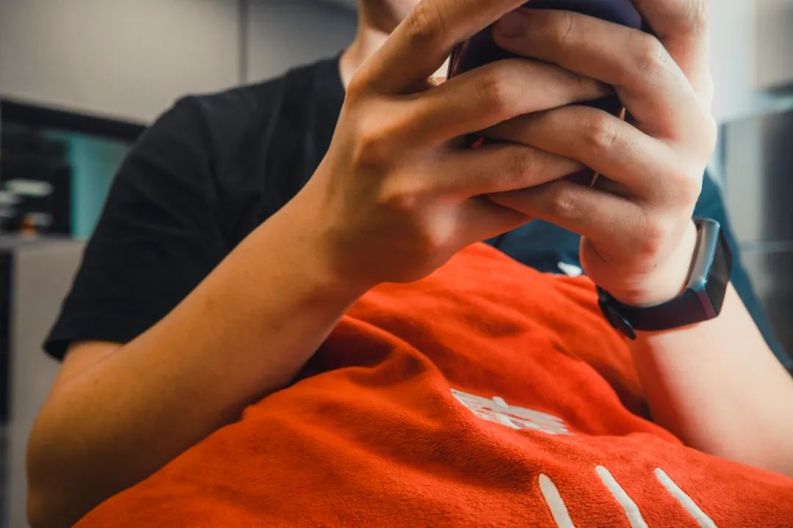
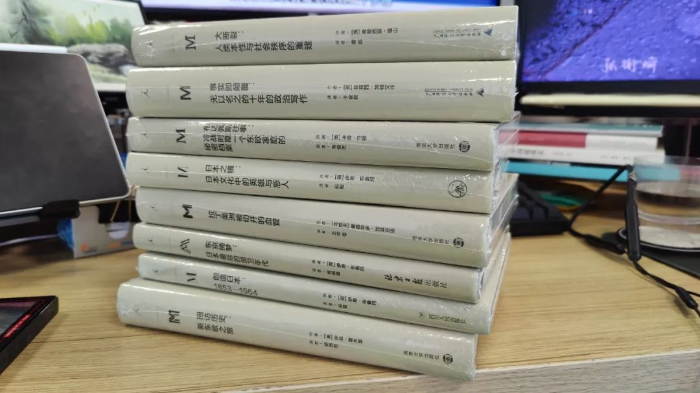

共计 3185 个字， 18 张图

通常，这种状态会被叫做微睡眠。跟蒲松龄写的那种“假寐”还不太一样，微睡眠时的意识是清醒的，离睡眠就只差去掉前面那个“微”字。

微睡眠的时候，一般意识不到。可能仅仅只会觉得自己稍微走了一下神，或者这一段实在是太难了，需要反复揣摩语句中的含义。简而言之，这会像在清醒和昏睡的状态之间快速切换，其实我觉得这稍微有些牵强了。因为这种振荡未必会多频，就是不会来来回回。

让我想起去年八月去北京国际电影节的时候，看一部玻利维亚电影 The Great Movement 伟大的仪式 。当时白天听了一天的量子化学课程，听得人行走在街上都感觉头顶烧得冒白汽。手环说我从坐在电影院起就开始睡，一直睡。最近也有我坐在电脑前写代码的时候，一边写一边手环说我进入睡眠状态了。但其实我写代码的时候感觉大脑还挺活跃的。要是能无意识写代码就好了，醒来发现所有东西都一五一十地写好了。我想 ChatGPT 都做不到这一点。

新到了一盏闪光灯来。

以前我觉得用现在手上这台单反，机身早就发挥到百分之八九十的地步了。但现在看看有了闪光灯之后，所有的机身镜头发挥程度都得往底下乘以一个缩减系数，至少往下拉 30% 区域。那些都是我不曾探索到的。

比如我和靠山的这张自拍。休息室这边的吊顶灯光已经成功形成了一个环境光源，于是我在正面直闪的时候，闪光灯开大功率直接超过了环境光的属性，看到的就是我的一张白脸。

另一张是用的跳闪。跳闪的意思就是闪光灯不直接对着人，通过侧边甚至后方来光来进行补足。我这张就是用的闪光灯先跳到我这里小格子间的一侧，然后反光回来给我的左手上光。

直闪、引闪、跳闪、离闪这些理论我以前也知道一些。虽然不叫系统地去学摄影课，那就是一些技法和例子的讲解。但是真正用起来的时候，竟然还感觉到了自己在拍照技术上的一些不足。技术和审美我是分开的，技术就是你怎么操控相机：比如调光圈、调对焦、拉曲线这些我都叫做技术；而安排图像中诸多元素、快门工移步走位、分离色调具体往哪儿偏色，这些我叫做审美。二者关系紧密，通常具有承继关系。

用上闪光灯之后，我惊讶地发现即使在脑中有一个明确的脚本构想了之后，竟然很难去将我脑中想的实践出来。而实践不出来并不是受制于灯或者镜头素质，仅仅受制于我还没法做好灯和相机的配合。想起以往用其他镜头或者别人的相机，拍无自定义光源情况下的照片，上手很简单就能按我的想法出片。尽管不一定是好片，但跟我的预想八九不离十。而一盏灯带来的思考强度，就好比你一直在狼人杀打预女猎白的版子，突然加了一个丘比特，所有思考全部上层级。

干脆什么也不做，吃饭去.......

难度反而让我想多出去试试这个机器。二月份以来，虽然也没出门几次，但实实在在超过了去年十月、十一月、十二月、今年一月这四个月以来的出门兴趣总和。这么说来不太地道，但是让拍照水平更进一步的办法：提升审美是最看不见但是最长久的、钻研技术是基础枯燥但是没有不行的、更新设备是对钱包伤害最大但是最直接的。

出门走了走。

以往拿着一个大的单反，只会有看到你的人来打量一番。带上闪光灯之后，现在即算是你不在什么奇怪的角度上找素材，一盏闪灯也足以让人发出疑惑——这个人在干嘛？拍一些狭小街道的时候也许还会闪到奇怪的人 ( 比如这段可能禁烟然后你正好闪了他一下

我用的方式是离闪，就是右手持相机，相机上放一个 X2T 的引闪器，用来引闪左手上扭向不同方向的神牛 V860III 都挺重的。出门就已经是负重训练了。之前觉得相机加超广角，在手自然下垂时握持感正好能保证中心和手臂延长线相符。但加了引闪器之后，重心有所偏移，估计高低我还得适应一段时间。

这张“反是不思亦已焉哉”的麦当当我很喜欢

这两张，可能单张还看不出什么。两张放在一起就能看出我这个闪光灯打得都乱飞飞到什么地方去了：几乎变成了一种胶片漏光。

我手上其实有一些副厂的色片，可以直接箍在闪光灯的灯前方，让灯发出的光线成为色片的光。这样都省却了我之后来进行蒙版漏光，而在前期工作时就做上。可这本应该是又高一层级所要做的事。这就像在拍摄现场进行一些电子调色，什么样的色卡配上现在的环境光能够给到什么样的色彩。我以我现在的色彩美学理解，要做这样的前期调色也不是一件像只对待自然光一样那么轻巧的事。

还有一些其他的习作。随便看看。

值得一提的是，我在我住的地方实践了这一组，是我很早以前就想自拍的频闪摄影。上周四去交警大楼换驾照的时候，顺便整理了一下我由此想到的一些内容。

昨晚自拍这组的时候，就感觉很像在敦煌和川西看壁画。

原本的讲，佛教会说菩萨是无相的。 密教中的上师、本尊与护法大多是恐怖相、忿怒相和双身相，上师即上德之人，西藏人称为喇嘛，本尊——观修以破我执的幻相； 显教中的佛与菩萨多是寂静像。 但通常来讲，无论汉传、藏传抑或南传，显教都会以寂静相示人； 所谓恐怖相和忿怒相则多在密宗当中。

细节地多嘴，汉传都有八大宗：天台宗、三论宗（法性宗）、律宗、净土宗、法相宗（唯识宗）、禅宗、华严宗（贤首宗）、密宗。用佛教术语来说，佛教分为大、小二乘 , 大乘又称菩萨乘，若以因果来分则分有因乘显宗和果乘密宗。密宗有一个善巧方便的修习法门——观想，必须通过观想佛像本尊，密宗造像就更多地体现了象徵主义的理性成分，它必须用具体的形象将密宗修习的法门表现出来。

单就艺术上来说，这里有一幅显然不是我画的大威德金刚唐卡。由频闪摄影，或者高一物理讲加速度的打点计时器，来看唐卡。据描述，这幅唐卡就兼有怒相和静相。按照密宗的说法，各种相图为了修习者的意念能够迅速地捕捉引起人内心烦恼的邪魔，所以常把这些邪魔描绘成具体可视的形象，供反思和修行。烦恼便是内心的敌人和邪魔。就像别人用手指头给你指示月亮的时候，你要看月亮而不要看手指头一样。其实我感觉如果完全分裂开来的话，在精神分析上都是有意义的。完全可以进行错裂化的分析。

刚编到这一段的时候想起以前在符号那边学“所指”、“能指”和“意指”，那样看来的话事情就变得更有趣了。我暂时还不想把结构语言学的东西用来强行附会在一组照片中观察到的感觉。

我的课题最近做到了蛋白质指纹信息。一个常识是： X 射线衍射获得的蛋白质结构只是一个 Snapshot. 这其实也是为什么 AlphaFold 为什么预测结构时能取得不低于实验精度的原因，因为实验只是单帧。我们现在往人工智能方向走的现实世界特征工程，也是我一直以来搞科研的研究核心，其实就是在想办法如何平衡“特征精度——课题结果”之间的互斥关系。以特征来反演实际，这种提取抽象的东西我继续写下去肯定就没边了，暂此打住。

出掉了二月两场以前买的音乐会。还是挺想去的，两场都是很怀念的流行乐：一场 Westlife, 一场 OneRepublic. 这个月的科研让人心力憔悴，虽然感觉出门在街上溜达溜达还算是比较合理的放松方式，但是并不敢把自己放到流行摇滚那种万人体育场里。

同理，这个月至今也还没有去看过电影。应该是上了一些很好的电影，我查邮件也经常瞄到有一些我想去的电影。毕竟放独立电影的就 Projector 比较聪明。有点好笑的是王家卫执导《花样年华》，因为没有说是重制或者高清修复之类所以我也没有计划去看。但是点进详情页面，发现是粤语原声、但只有英文字幕。笑了，我感觉我一个非英语母语、只能略懂粤语的人，去了之后估计会大脑语言中枢过载：到底是要听还是看字幕？

以前高中在长沙和外教们交流的时候，我尚且可以在长沙话和英语之间切换。长沙话虽然分类上也属于汉语，但词库和句子结构上来看显然是我先于普通话的第一语言。英语虽然那会也就是交流水平，不过还足够 cover 长沙话、塑普和英语的切换。如果切换的是粤语、英语和普通话，那显然粤语在我这的语用优先级是会排到英语后面。所以这种会造成人神经系统错乱的电影，我选择是不看。

（今天在读《在网下》）

