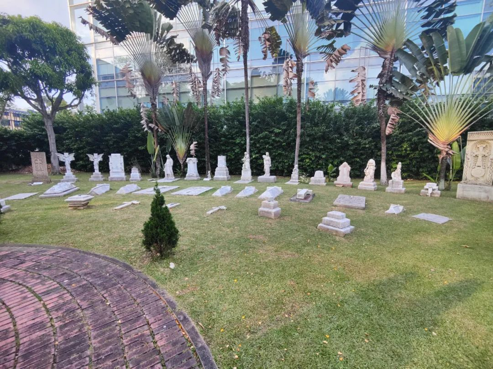
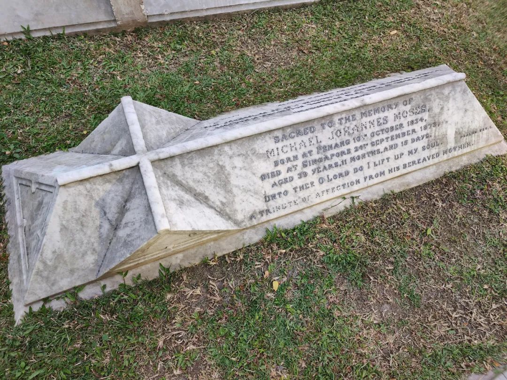
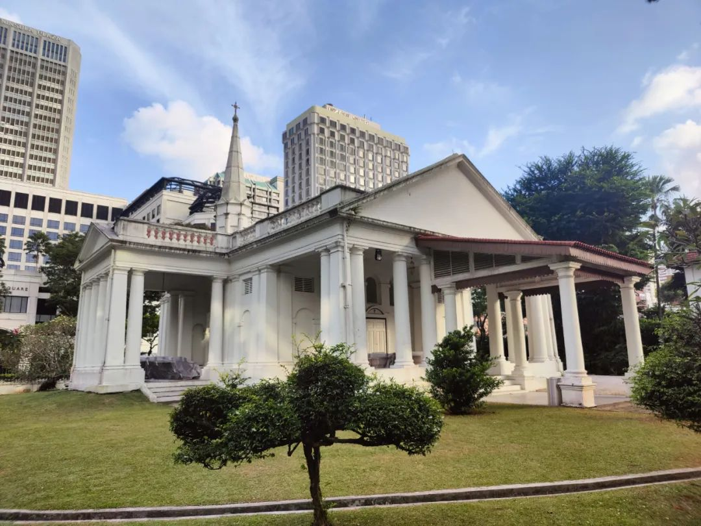
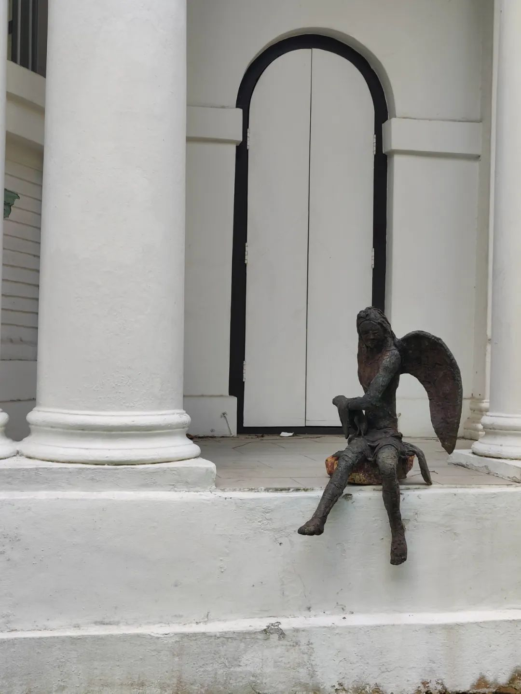
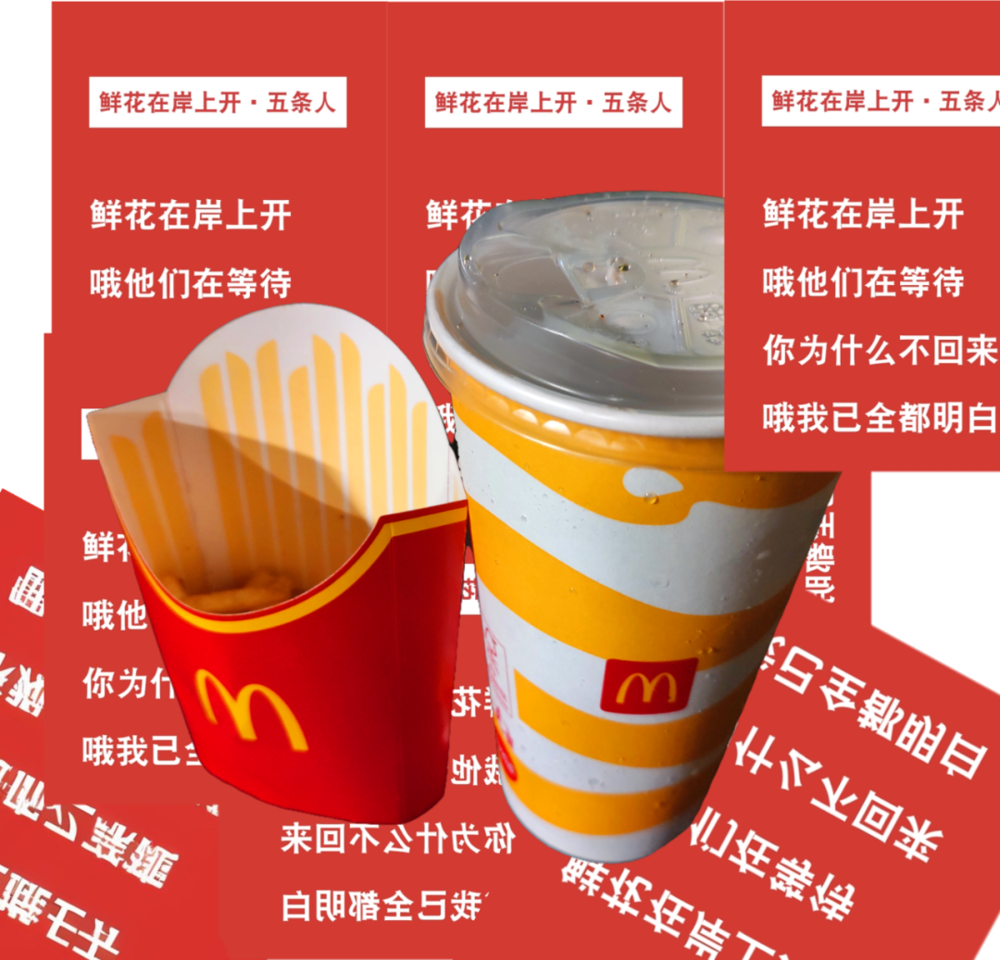
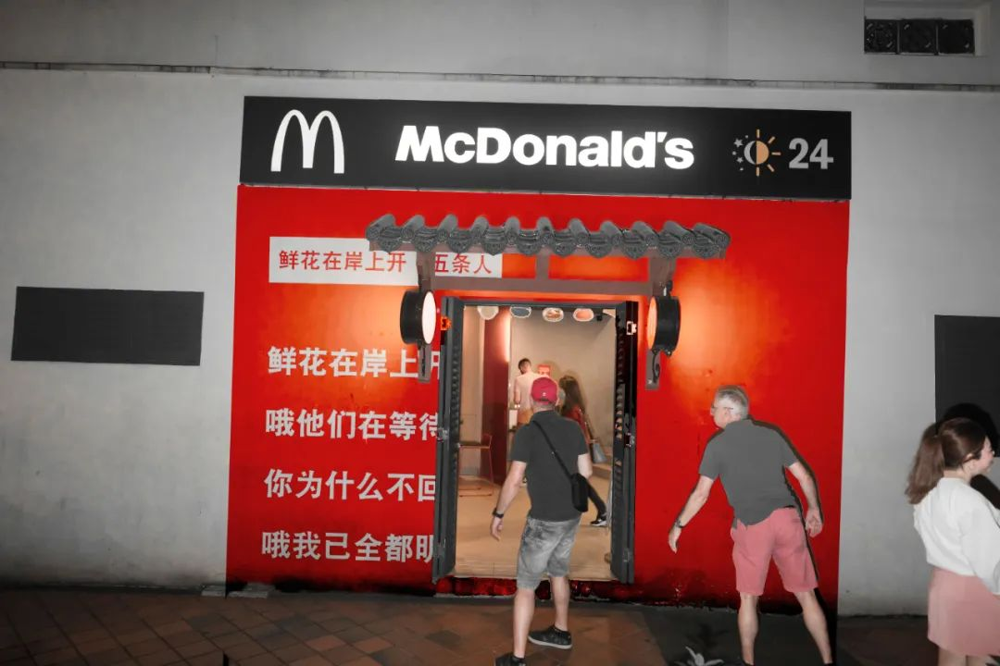
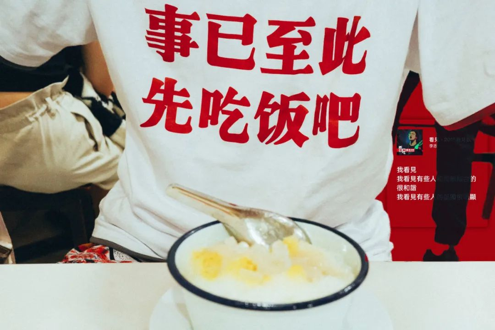
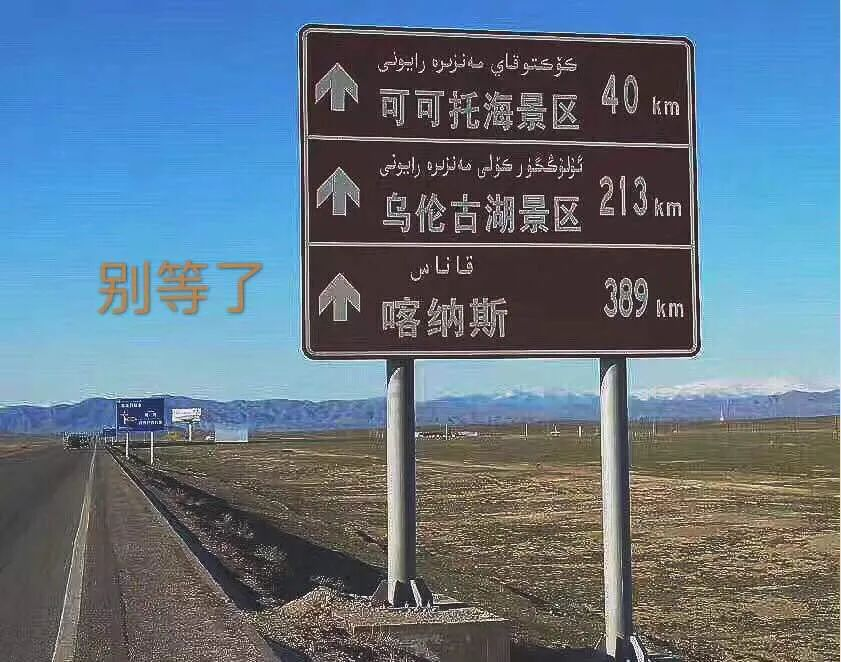

有一点戏剧的痕迹，但不多。比如一会儿要出门，可以先假设自己正在从事某一职业，或者有什么样的特质。一般我会一边走一边草稿一个只在臆想中的人物小传，用来把接下来可供观察的视角承托得更有意思一点。

比如昨天出门，我就假定自己是街溜子（这当然是我比较常用的一者）。人物小传在以前的公众号推文里写过不少了。于是就在街上走着走着，看见开了门的没写 No Entry 的地方我就进去溜达一圈。然后溜达到了一个公墓里。

这个公墓看起来还不错。我笑跟我一起来玩的好伙伴，得空得给自己看块地。这里埋了一些一战时期留下的人本痕迹，不懂事的老外孩童在教堂边追来玩去。教堂关着门。赶开了一直站在简介牌前的老外，我也想看。后来发现读长句子好难，还有一些比如艾美尼亚这种我仿佛又在看理想国译丛的单词，于是还是觉得看这些人的墓碑有意思。

同类的就可以把今天的马甲换成风水术士、或者盗墓贼。或者一个超商采买人，或者一个哑巴。只有能把小传写完整的，才知道视角。所以我需要蓝本，这就是为什么接触不同的人。

通常分析一战和二战来看，最近也看了点温铁军的分析视频。内容很优质，丢弃幻想、准备斗争。

在新加坡河溜达着吹了一会风。最近已经不是滚青了。滚的样子我已经滚不动了。尤其是最近。甚至也没有出去拍照。就把原来拍的东西又再拿出来玩。

中午在医院食堂打饭，今天他们换了一种新的打包碗。虽然讲道理是一点也没变，这个印尼风味的餐难吃但也是这里面为数不多能吃的了。

老无聊了。

想来，休学一年其实给人了一些改变，其一就是生活刺激定向在了由旅行去新城市、以及新按下快门时刻。当旅行的频率降低之后，就变得愈发无聊了起来。

这就是为什么去年十一月到坡的时候，会有一段虽然生活磕磕碰碰但是整体情绪还算不错的日子。因为纯粹把这里当旅游而非长居的地方在看。直到两个月后，也就是像进入这个月以来，就发现：噢，新鲜劲过去了。

这一条从一个月前的今天去那家店正好碰上关门开始到现在还没有买到。这家店倒是地方很多，但是一直没有遇上地方。可能是很累吧。

等有空就把住的地方收拾一下。嘿嘿唯一做到了的事。

也不在 Memo 里写什么内容了。说要写也不知道该写点什么。可能就没有太多感觉吧。只是把生活中发生的事分享一遍又很无聊。除了该说完没说完、想说又还没说。多的是想听又听不下去的话。我不擅长读也不擅长写长句子。

变得很喜欢帮人做计划。我几乎就是各地文娱旅游的野生推荐人。没事就热衷于帮所有人推荐在各个地方吃喝玩乐的内容，做计划、看最近有什么新活动。这让我觉得很开心，尽管我并是大部分都去不了也不由我来完成。但是做完计划就仿佛我自己也参与了一样，有一些精神股权来贡献给一次轻松欢快的旅行。

这不仅仅局限在给人做旅行推荐，也出现在给人挑相机、看文书甚至有些完全在我主业和副业知识范围之外的事。好在我只是不托大，的确在我范围之外的就只能说我们一起钻研了。这就是，只要不是我专业的事，都很有趣。

今天来实验室，桌上突然不知道从谁那里来的芋头牛奶脆。做好事怎么不留名啊！！以后请多来玩、来玩的时候多带礼物谢谢 :)
