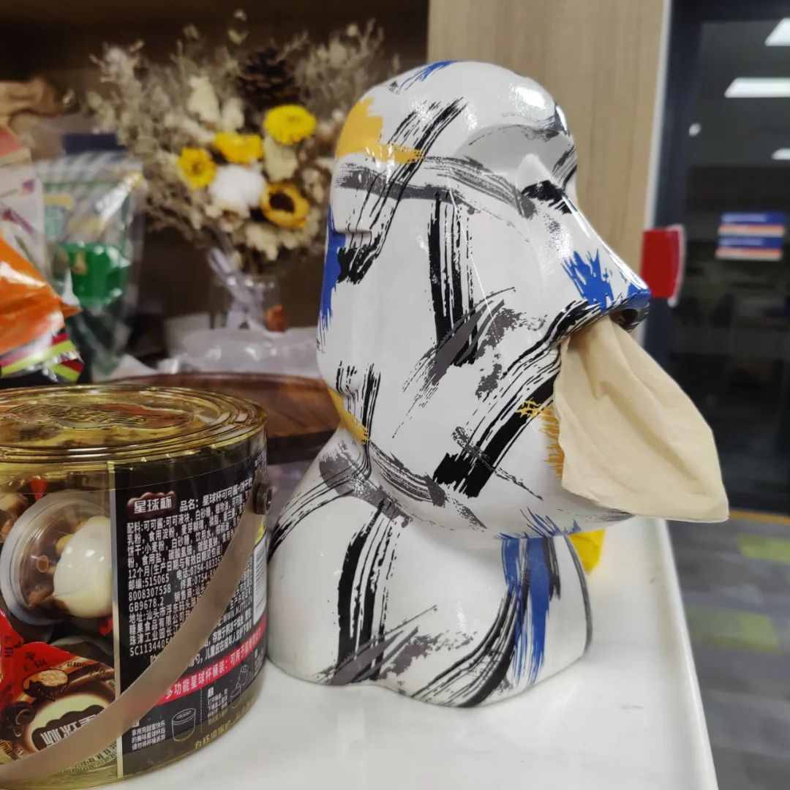

共计 2595 个字， 1 张图

最近有国内的朋友说看到了在路边炸烤串的很像我，一个浓眉大眼、看起来就不会背叛革命的人，在路边炸烤串。朋友说看见他的头发也掉了不少。所以跟他聊了一会儿天，一点点地问他，为什么在这儿摆摊、有没有什么科技与狠活。朋友又问这位据传长得很像我的烤串师傅，平常喜欢拍照吗看小众电影吗买各种奇怪小玩具吗

我：？？？图穷匕见了是吧，等我回国打爆你的头

抽纸快用完了。我回到寝室的时候，看到抽纸盒的模样是上下反过来的样子，像一头从床头柜的悬崖上栽了下去，栽在床头柜和船板的缝隙里。其余的一切，和我早上离开时没什么两样：风扇和出去时一样开在最大，根本就没有的百叶窗还随着子虚乌有的呼吸不断开合。

刚刚突然笑了很久，觉得笑的原由也不是很好玩。最近还在写代码，于是一边在监视程序的时候，一边在这边写随笔。刚刚看到屏幕上闪过一段话：

难道真的没有人觉得好笑吗？在解电子步和离子步的时候报警说两个前线轨道的跨度竟然是返着跨的。意味着就好像有人的生长是逆向生长，不是在往外笑而是在向内收敛。

上周两度在实验室感到巨困无比。正同于那个表情包“我比狗困”。每次感觉到巨困的时候都在我戴上防护眼镜的时候，当然也可能是细胞房的原因，一走进去就觉得来由不明的困。如果人能相信一见钟情的话，为什么不能相信有些地方就是让人困顿 ( 笑

巨困的感觉即使除了细胞房也还是持续，一直觉得很困很困。在能不能站着也睡着的边缘试探。但是又睡不着。上周一周都在写一个接口，明明这个接口应该很简单，看起来很简单的一个接口程序，也有大量的人早就已经在这个区域深耕多年。结果我就是没法把这个接口协议写成可以大宗泛化操作的样子。

这种感觉叫悬而未决。钟表里拧紧了的发条，虽然钟根本不走，但并不代表发条一直很松。因为我的手一直再往前拧一点，再往前拧一点。我说的接口，俗落一点说是螺丝和螺母之间相处得分歧很大滑丝得车不到一起，典雅一点说就是设计卯榫耦合的人被腐蚀了，写些这种版本号串行有大病的东西让人给一个踢脚。

希望还在床上睡觉的人都从床上掉下来

昨天跟人讨论关于一些人对自己原籍地持逃离态度的同时，对另一个地方持迷恋态度。通常而言有以下几种情况：

- 政治难民。这很好理解：国家是阶级矛盾不可调和的产物和表现。在阶级矛盾客观上达到不能调和的地方、时候和程度，便产生国家。所以当一个阶级 ( 群体 ) 运用暴力政治工具统治所在地的另一部分时，这种逃离很好理解。
政治难民。这很好理解：国家是阶级矛盾不可调和的产物和表现。在阶级矛盾客观上达到不能调和的地方、时候和程度，便产生国家。所以当一个阶级 ( 群体 ) 运用暴力政治工具统治所在地的另一部分时，这种逃离很好理解。

- 原生地缺爱。上一条谈了国，这一条说小家。不一定指代家庭，也指代相应的邻居、社区。当一地之民风偏狭，接受过一般教育并且认同教育观的人能喜欢上这种环境才让人觉得可怕。
原生地缺爱。上一条谈了国，这一条说小家。不一定指代家庭，也指代相应的邻居、社区。当一地之民风偏狭，接受过一般教育并且认同教育观的人能喜欢上这种环境才让人觉得可怕。

- 以逃离行为来弥补充实自己寡淡可怜的人生。这一类基本上属于自己的问题，就是在哪里都差不多，一样地寡淡。这部分人往往是最多的。比如在新一处看到了什么让他们觉得很不一样的东西，这比旧一处的什么内容强多了，言论诸如此类。看起来好像推理很整齐，但其实仔细理看看内容，其实很垃圾。就是在原籍地过得也很寡淡、在新处所也很寡淡，倒不一定把两地逃离像做生意一样鼓吹，只能说这种转移行为本身变成了斯人身上的最大谈资。取笑别人的阅历是不道德的行为，但是别人自卑而又喜欢炫耀的行为却总能成为快乐源泉。它的悲伤也不彻底，它的恐惧也只是一阵云烟。这跟手艺人的鼓吹还不一样，在不谈地域之争的异化时，前述行为在我看来十分幼齿。
以逃离行为来弥补充实自己寡淡可怜的人生。这一类基本上属于自己的问题，就是在哪里都差不多，一样地寡淡。这部分人往往是最多的。比如在新一处看到了什么让他们觉得很不一样的东西，这比旧一处的什么内容强多了，言论诸如此类。看起来好像推理很整齐，但其实仔细理看看内容，其实很垃圾。就是在原籍地过得也很寡淡、在新处所也很寡淡，倒不一定把两地逃离像做生意一样鼓吹，只能说这种转移行为本身变成了斯人身上的最大谈资。取笑别人的阅历是不道德的行为，但是别人自卑而又喜欢炫耀的行为却总能成为快乐源泉。它的悲伤也不彻底，它的恐惧也只是一阵云烟。这跟手艺人的鼓吹还不一样，在不谈地域之争的异化时，前述行为在我看来十分幼齿。

- 工资与购买力。我们假定两地工资所对应的当地购买力相适，但两地的绝对工资差异不小。所以在一地打工，回另一地消费，就可以把原来工资和购买力相适应的情况改换为用地域差异换来的高绝对工资和低绝对购买力。当然工资只是一个作比，利用不同地方的财产政策，比如税收政策利好的方向来钻营，这一点有点像第一种政治难民的反面，或可假说为投机分子。
工资与购买力。我们假定两地工资所对应的当地购买力相适，但两地的绝对工资差异不小。所以在一地打工，回另一地消费，就可以把原来工资和购买力相适应的情况改换为用地域差异换来的高绝对工资和低绝对购买力。当然工资只是一个作比，利用不同地方的财产政策，比如税收政策利好的方向来钻营，这一点有点像第一种政治难民的反面，或可假说为投机分子。

言说每一种流向背后都有一些原因在。我觉得上述第一类和第四类相对来说都是在清醒地做出对自己最合适的决定。第二类的悲剧色彩多少有些浓厚，感觉很能成为各种分析社会问题的样本同时也不乏人文视角与关怀。只有第三种是个笑话，偏偏又最多了 ( 笑

跟朋友说，我最近在现实生活中遇到的人都好正常。虽然在留学生群体里，评价一个人最高的评价可能就是你很正常。但我其实喜欢生活中来点多少有点毛病的东西。

无聊的时候做了点摘抄：

有人很内向。万不得已要出门的时候，也首选走下水道。

世界没了你还转什么转？硬撑罢辽

麻绳专挑细处断。

最近在看的书是《创造日本： 1853—1964 》作者是荷兰人 Ian Buruma 伊恩·布鲁玛。另一本书是《残酷剧场 -- 艺术电影与战争阴影》我就说怎么成书的风格这么像，原来是同一个人。中文版的代序我记得是许知远作的，现在写的时候书也不在我手边、我也不准备去查证，姑且如此。

盲目地在等程序出来结果。一旦要等程序上线之后给出大批结果，一直要排队。不过怎么说也没有花钱在这个部分上。讲起来倒很简单，不过是花了两个月时间做到能够批量而且稳定鲁棒地对服务器发起请求。

实际上也就只是这点东西。但是因为计算的软件没有那么多产品经理。于是只能被钳在某一个地方。当然最后的结果就是，这是开发者的问题 ( 恼

写着写着差点睡着了。收工

