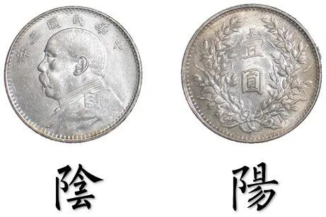
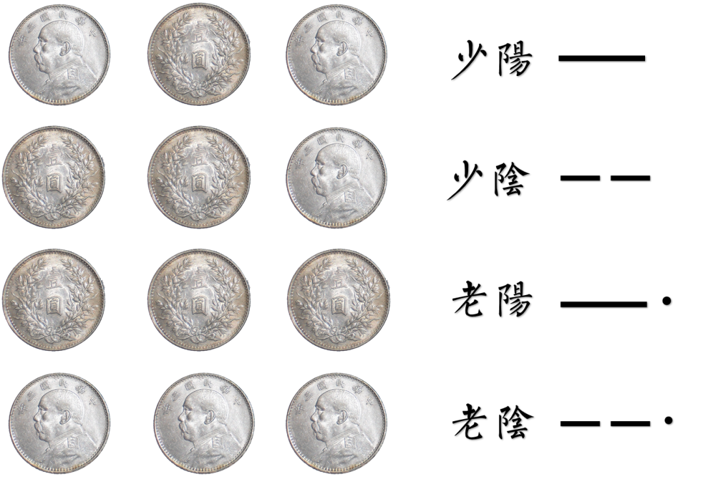
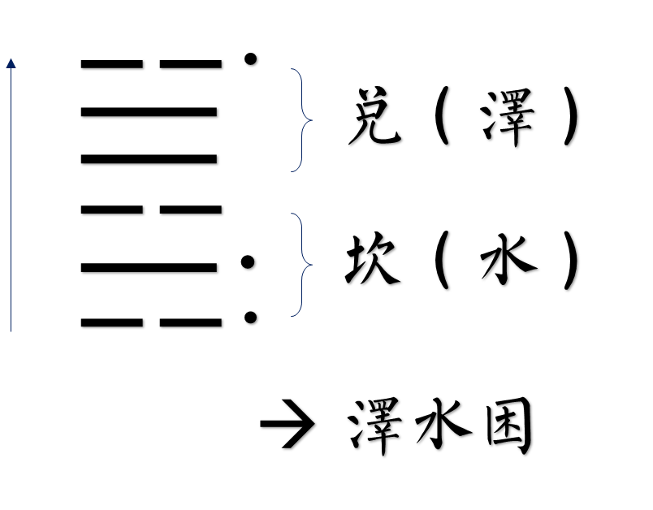
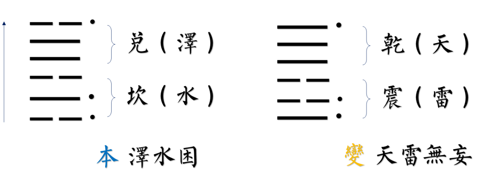
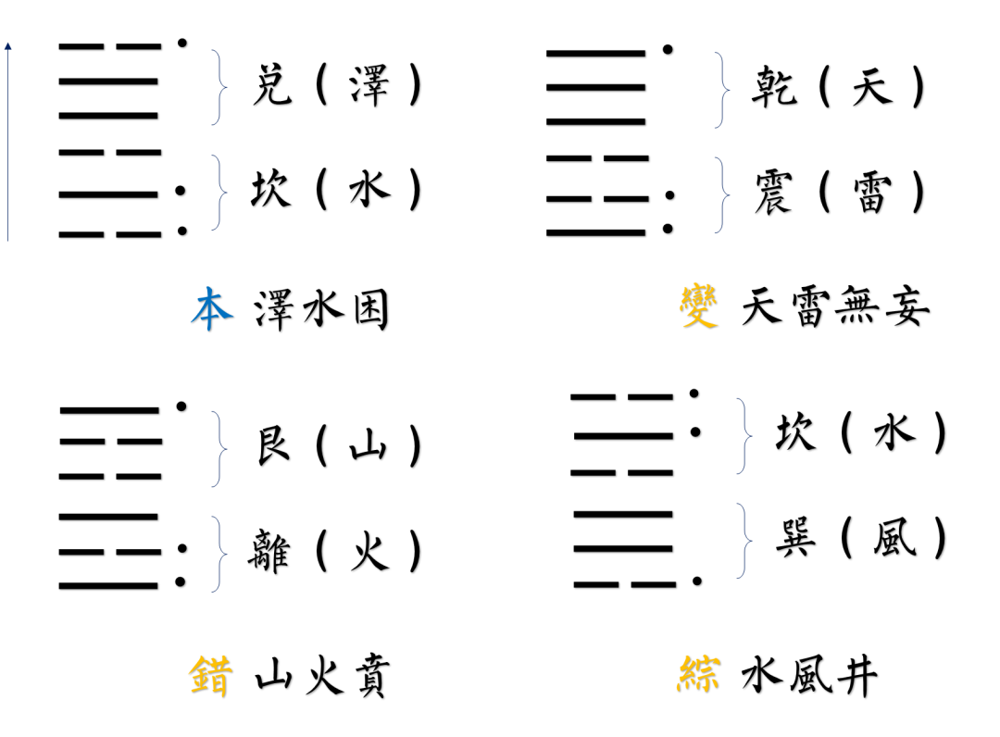

最近一直都在搞抽象。 抽象 是从众多的事物中抽取出共同的、本质性的特征，而舍弃其非本质的特征的过程。 抽象化 是指以缩减一个概念或是一个现象的资讯含量来将其广义化的过程，主要是为了只保存和一特定目的有关的资讯。

如果能看懂上面关于抽象和抽象化的定义就离谱了。这种定义在尝试用比抽象更抽象的方式来解决对抽象的定义，那无疑是完成了一次对抽象的哲学化，这本质上也是一种自我抽象的行为。所以我们选择这一行为的共轭面，那就是钢心《冠军》：如果你已生于荒野就假装自己像个冠军。

上周写了一周的报告，从什么都没有，到问朋友写了四十多页、师兄写了一百页、学长写了六七十页。我写到今天，一共写了一百零一页。凑个吉祥的数字。文字本身就是一种抽象，抽象了这个世界的存在和主体上对于客体的描述，或者上升到更高维地描述感受，这种抽象把大象打得是真的疼，以致于无法待在房间里——在公园里也没法席地而坐。

上周之前的两周我在大批量地调适代码，写了很多突破就在刹那间，然 后之续者滚滚而来。我是不带电脑回寝室的，结果其中有一天带回去了，情况非常糟糕。后来我还是因循守旧，没有带电脑回寝室。不过我带了在实验室干活了一整天的脑子回寝室。为了避免一直想着跟实验有关的事情，就做了一些今天想写下来的东西。

我们说人工智能是什么。从底层上来讲，我觉得是一个对于映射关系的处理手段。这么说起来有点怪，再换直白的讲法就是：对应关系，数学上就叫函数。这些名词都太抽象了，我们还是要更具体一点：这东西不是左耳朵进右耳朵出，而是耳朵进、嘴巴说。这就完成了对于智能最浅显的抽象。

换一种在领域内实行的语言来讲：实行了 输入 、和 输出 。这是对应、函数、映射的共同定义。人工智能的各种算法和途径都不过是在不同的场景里搞了不同的东西：对于文本有自然语言处理，对于图像就设计了中间的池化。等等。这不是什么难事，根据其面向的是什么问题提出了什么方法方法的实现怎么样，而有了智能程度的高低之分、以及介入事件时的角色之分。有人专门看生物口的输入到输出、有些人专门看无实物表演的输入到输出、有些人专门看蹦极的时候谁会更勇敢。人也能做这件事，比如我是个蹦极教练，我也可以凭经验说出来谁上来之后就可以不顾一切地往下掉、谁就会坐在那里不下去。但是这个谁，到底为什么会这么觉得，我观察到了哪些内容、分配了怎样的权重？人工智能不过是重新做了一个可以追踪的数据化，这是碳基生物在适用硅基方法来给自己的碳基行为进行修正。

所以就变成了，你把一些碳基能明白的输入、翻译成了硅基语言、教硅基学习、再把学习结果翻译回碳基。我想让硅基认识一个人的脸，就翻译成了一个个的像素点和像素值，教硅基怎么分割轮廓，再把下一张脸的像素点和像素点拿去让它认。我就是做第一翻译步的，亦即对于本领域事件的特征工程，把本领域内容特征成为数据语言。

这个特征工程有用之处就在于，你到底选了些什么东西来描述这个事件。一句话摆在面前，我们假定事件是辨认这句话是不是张衔瑜写的，那么你可以看遣词造句是否离了大谱。这里，辨别就是事件，输入就是这句话，教学就是看这句话是不是离了大谱，输出就是是不是张衔瑜写的。如果你选的特征并不是这句话里面的每个字，而是这句话的标点，那么可想而知你并不能完整地反映目前阶段的张衔瑜，而只能反演到以前还在“文不加点”时期的张衔瑜。我们就认为这种特征工程是失当的。

当一个人来到你的面前，你想辨认 ta 你觉得你是根据谈吐、神态、气味？当建筑在你面前，你是根据建筑物上写的字、棱角、曾经接触过的建筑材料？当一个人与你聊起政治见解，你给出反应时是想到了什么呢？

前述这些在如今的人工智能中也就是一些初级的任务，语义理解或是图像分割，我写到这里只是因为想写到这里。我的强项是在搞抽象，不是在搞科普。

接下来我们继续搞科普。我们前面谈过抽象了，也弹了很多如今研究也好、吧啦吧啦的，都是弹棉花。但我寻思着，卜卦是极早期的特征工程，也就是抽象化方法。重点就在这里，为什么卜辞能成为一种抽象化方法，为什么八卦能够指代世界。我看现在在弄国学里尤其是周易的人，普遍没有接触过新兴数据科学方法，所以我打算还是这个内容，只是用数据的方法再讲一遍。

接着我将对周易理念做简要介绍：

祸兮福之所倚，福兮祸之所伏。

讲完了。是不是很抽象，这个东西就是这样的，喜欢选用浪漫化的表达方式来把本来所干的东西表达出来。所以吧我觉得还是要有个什么例子来简单解释一下他们在干什么，所以我试着用铜钱卦来简单说一下计算过程：

准备材料：三枚硬币。不是硬币也没关系，只要能轻松定义正反的就可以，其意义就是给个正反。硬币选相等大小的，需要在市面上流通过的，比如天圆地方乾隆通宝，然后经过处理比如水煮。这些都是细枝末节，一般各个流派就喜欢用这些东西来搞特殊。

首先定义正反。定义有字的一面，通常意义的正面为阴，有花的一面，通常意义的反面为阳。至于为什么，也不重要。据说是因为农民下地干活，背灼炎天光，所以背面为阳。这些东西就硬扯。

那么我们有阳面和阴面了，接下来就可以按照所想的事情掷卦。讲得很高级，其实就是随便往哪扔。然后就会得到三个正反面。这时候以少为尊，少量的少。比如二阳一阴，就是少阴，少年的少；如果是三阳，那就是老阳，老年的老。这个阳就是一根爻，八卦里面不断的那一根；阴爻断开。

接下来，得到的结果按照次序从下往上写，那么就有了六根爻。上三根爻组成上卦、下三根爻组成下卦。这时候就可以去查表了，这个上卦加这个下卦组成了八八六十四卦当中的哪一个卦象。

我们来回忆一下：祸兮福之所倚，福兮祸之所伏。意思是这个事情总是在运动当中的，不要用静止的观点看问题，和马哲的想法一样。所以，上一步我们得到的卦象，将它叫做本卦；还记得老阳老阴和少阴少阳吗，少阴在发展中会变成老阴，所以没关系，但是老阴老阳在发展过程中会分别变成少阳少阴，所以这一步叫变卦，也就是原卦象中的老阴老阳变卦。这一步是很优美的理念。在周易中意味着事物的变化。这个还有更好的表达：反者道之动、弱者道之用。

接下来，按照本卦，将所有的阴阳全都反过来，阴变阳、阳变阴，这个卦就叫错卦。周易中意味着原本卦象的对立面。接下来，按照本卦，按照中心对称，也就是一百八十度翻转过来，这就得到了综卦。错卦和综卦放在一起，就有了错综复杂。

错卦的错卦就是本卦，但是错卦会有错卦的综卦。变卦的变卦还是本卦，但是变卦的错卦却会不一样。如原本四卦以至于八面玲珑。说道是这里，就有了太极生两仪、两仪生四象、四象生八卦的基本衍生理念。

每个流派对于这些辞的处理都不一样。比如有些的综卦可能是取中间的几根爻来进行变换，所以这时候可能对于六十四卦的签辞也不同。鉴于我懒得去解这些签辞，也不打算用周易来占任何东西，所以这些我根本不管，也不建议别人学这些“术”，因为更高级的东西在后面。

说到这里，我们来整理一下如果用人工智能或者搞抽象的语言来谈一谈周易的话会怎么样。首先，周易将所问占的事情用手中的钱币进行了一个很浪漫的特征工程。我说很浪漫是指的相对于硅基而言的，毕竟硅片运算和用很有生活气的钱币所谓运算基础，观感差多了。

其运算是半经验的，意味着运算时的格式根据各个流派而已经优化好了参数，根据这些参数也已经有了半定量解，就是那些卦辞。在解释当中需要引入后处理方法，也就是变卦、错卦、综卦，还有那些在此之上的更进一步。这其实要求了问占人、占卜者的共同介入。相比于人工智能的 fine-tune 微调而言，还不太一样。

文王拘而演周易。我上面没有写那些伏羲八卦、后天八卦之类的东西，因为会把人绕晕。我在这一段中打算浅说一下关于处理方法建立的事情。目前现有的 GPT 模型是怎么出来的呢？ GPT ，按照 OpenAI 公司给出的解释，这个东西叫 Generative Pre-trained Transformer 中译生成型预训练变换模型。有没有感觉事情有点像了。

GPT 作为一个基于大规模语料库的预训练模型，其参变量是在庞大数据库上扩大深度学习之后训练出的结果。我现在尤其写正式邮件的时候，就会把我写的发言提纲放进去，然后让它有模有样地按照我的提纲，生成一个我所需要语气的邮件，然后发出去骂人，很有用。扯开了，我这一段的本意就是， GPT 是一种基于大量语言模型，然后你放进去运算你的输入（比如一段话），然后得到了一段反馈，完成了在一个碳基友好界面上的与硅基交互。

易学的这些东西我倾向于认为是在当时算力上所能形成的结果。比如没法处理庞大的语言量，但是有优秀的辩证法作为指导（比如反者道之动）就可以用一种最为经济的方式来高屋建瓴地解释所思所想。也许这个屋子建得太高了，云深不知处都到了真的云上的程度了。又因为一些经典传承时，散秩和增删不断进行，所以整体显得像裁缝师弄出来左一块丝绢右一块尼龙的感觉。但作为一个对人工智能相对了解的我来说，易学内容就是目前这些数据学科科研的中式高级浪漫表达。

反的这一步，就是道要转移过去的动向；让你变弱的行为，其实就是道的本质。我把反理解为“返”，弱理解为动词，用的话就得是中体西用的那个体用关系。易学也讲很多体用。

总体来说，因为我更熟悉当代计算科学，所以会觉得易学中是在对当代一些计算理念的构建方式的高级理解。比如易学的这种特征工程，研究物矛盾的对立和转化。以前朋友说，自己手撕了杨振宁 - 米尔斯微分方程才明白这些做对称和规范理论的人已经走得多么远了。现在觉得这些人搞抽象，还有点意思。

如果你想用西方的理论来看这一套的话，叔本华所写的《作为意志和表象的世界》就不错。高二的时候读过这本书，现在才想起来有用。这里其实就是叔本华讲整个世界只是单一意志的表象，其中我们个人的意志是现象。这个理解起来相对比较简单，因为做一些西哲里的循证就好了。相比起来旁逸斜出的先秦文集更浪漫但是对初学者好像一直在门坎上坐着就是不知道怎么进来。

说明白这个之后，要谈其他传统国学应用与现代科学解释就容易多了。

比如我们谈中医，中医的方剂是怎么开出来的。其实也就是学了中医理论的那一套先验参数之下，加之医生本人的理解和经验来重新对这套参数进行校准，根据望闻问切的情况给你开出一剂方子。这里面所设置的超参数就海了去了，比如可以又根据上面的那些问占结果来校准，甚至可以包含当天的天气。

中医处理着接受进入的高维向量群，结合者手上药房里的另一个高维向量群，开出了要在时间维度上验证的丹方。能有用实在是一件很了不起的事情。

当然，这些就是我不知道的内容了，比如输入集到底怎么构建、中间过程到底搭建了多少。医生自己除了不见得想说，也许有的也就是说不明白。人工智能搞得越多我越能体会这种说不明白，因为我也不是那么对自己所做的有些特征工程为什么有作用能讲清楚。当我们涉足到具体门类自然科学的时候，这些反而可以说清楚了，比如我现在能算出来的弱相互作用怎么拆分为互斥、诱导、吸引和色散。这里能闭环。

当易学和人工智能在搞抽象的特征工程这块闭环了之后，我觉得又有必要提一提我大二看的一本书，后来大四下又读过一遍的《思考，快与慢》。这本书后来才知道是经管里面很推荐的入门书目，神经经济学当然是后文了。这本书虽然是经济学领域的人做的，但其实是基于认知科学方法，就是讲人怎么样认识这个事物，阐释理性和非理性动机的关联。超过理性经济人远甚 ( 笑发财了。这是一些参数网络的自然生物演化过程。我觉得破译这一过程跟破译遗传密码差不多复杂。

还可以一说的就是认知科学上更进一步、泛化到族群当中的例子。比如《美国大城市的死与生》里除了城市芭蕾之外提到那个情境：两个小朋友在街上玩，有一些陌生成年路人走过，人们以什么步伐走过的时候你才会觉得两个小朋友在街区上玩是安全的？这就当映射问题来处理的话，我觉得反而隐藏着很多我看不见的东西。

这一篇虽然写得挺认真的，但是写出来的内容旁征博引（夸）实在是因为我想给读者制造阅读障碍，所以把我的一些思考过程也写下来了（笑）
