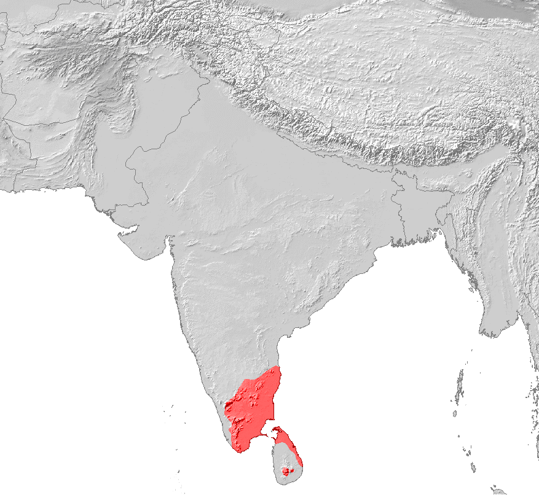
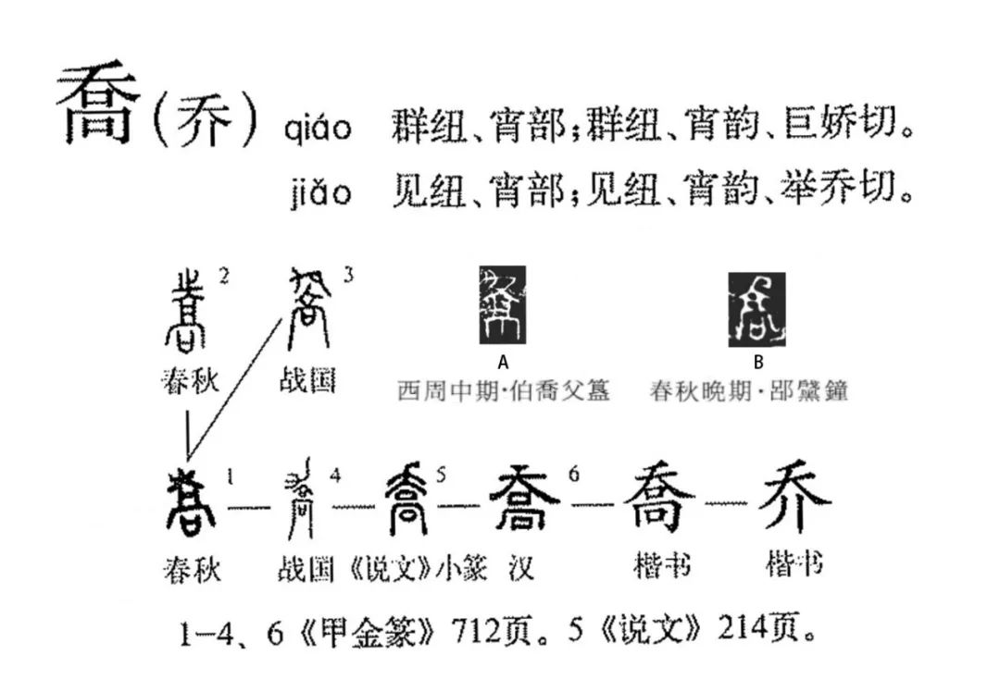
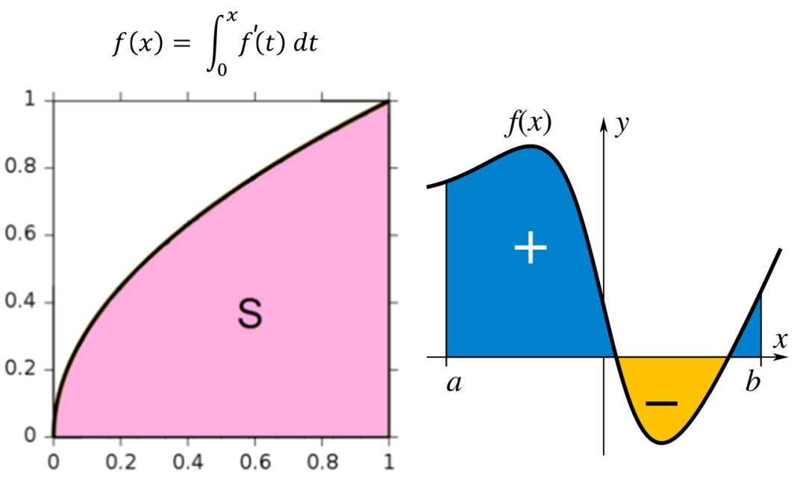
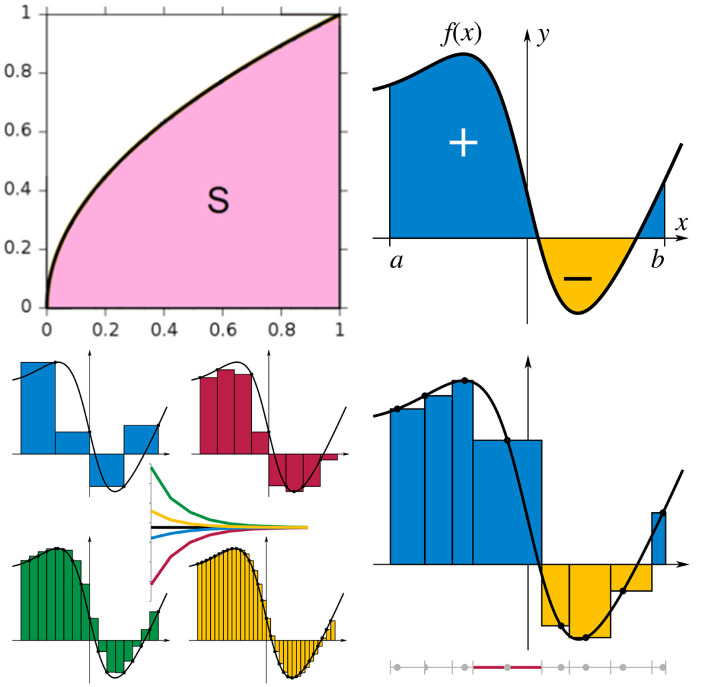
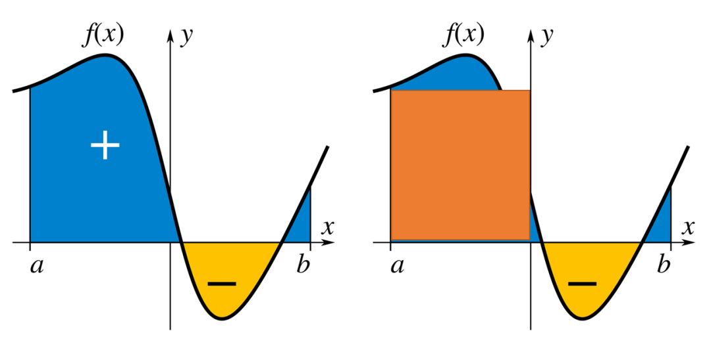
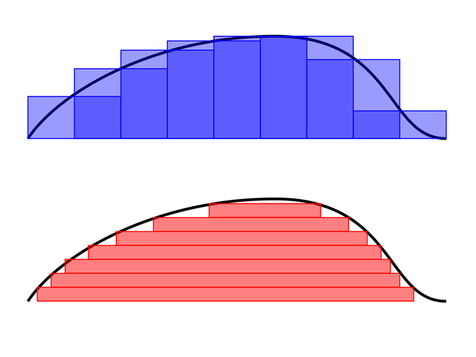
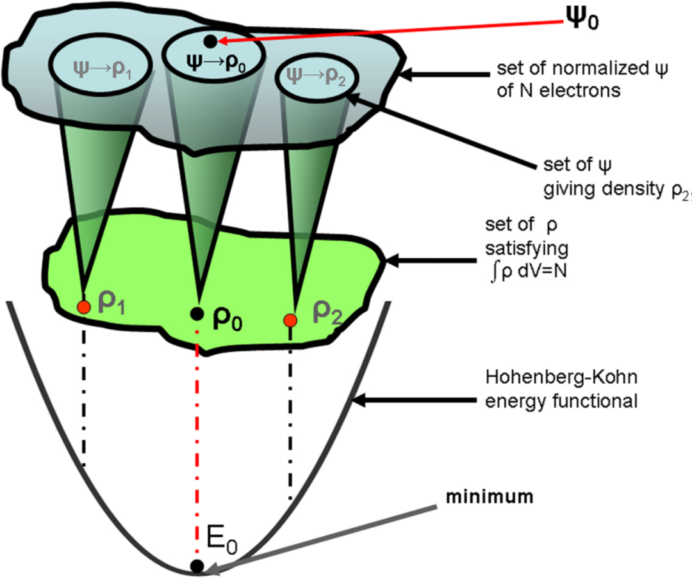

本文是张衔瑜第 260 篇推文

共计 4190 个字

（事实上是因为我的主屏幕现在还是竖屏，所以趁得在竖屏的时候先把要高产量写的东西写完）

前几天跟泰米尔师兄聊天，他是印度人，来自印度南部的一个邦：泰米尔纳德邦，与斯里兰卡隔海相望。印度现行的操作是按照语言划邦，也就是说这个国家的语言是还没有统一的。比如国家层面就还有旁遮普语、印地语，诸如此类。我们谈到说英文作为表音文字，是 26 个英文字母组成的，他说泰米尔语里有 247 个字。我说汉语言都说不明白到底有多少个字，本字、加上各种异体字。

中国，或者说汉语言，在很早就实现了文字上的统一。也就是秦王扫六合之后，能认下的大一统：车同轨、书同文、度量衡。书同文，从符号学上将符号义、符号具统一；车同轨，让车辙印能行辕向远上达成一致；度量衡，在格物框架里引入规范。这三者都具有建立社会规范的意义。之所以社会规范是有意义的，是意在引导社会指向在这个范围内行走。

我尽量用简单但是有力的方式来说明。曾经参加过西班牙共产党的英国作家乔治·奥威尔写过一些很有意思的书，其中一本是《一九八四》。这本书里引入过一个概念， Newspeak 新语，是一种“世界唯一会逐年减少词汇的语言”。因为他的表达比我想出来的例子有意思多了，所以我直接照抄他的例子：

新语的基础是删除语言的多变及模糊，余下简单的二分法：冷 （ cold ） 或不冷 （ uncold ） 而没有温暖 （ warm ） ；只有明亮 （ light ） 、不明亮 （ unlight ） ，没有黑暗 （ dark ） 。只有好思想 （ goodthink ） 或有罪思想 （ crimethink ） 。新语的另一目标是通过减少词语的音节使发音更加短促，例如思想警察 （ thinkpol ） 把两音节的 police 缩略成单音节 pol 、真理部 （ Ministry of Truth ） 简化成 Minitrue ，让人们不需在语言上作深入思考（鸭语 duckspeak ，像鸭一样地说话）。理想的新语使词汇越来越少，字典则越来越薄。

同时，用作比较修饰的词语亦作简化，例如优异 （ better ） 变成更好 （ gooder ） 、首选 （ best ） 变成最好 （ goodest ） ； great 变成 “ 加好 ” （ plusgood ） 、 “ 出色 ” （ excellent ） 或者 “ 了不起 ” （ splendid ） 变成双加好 （ doubleplusgood ） 。新语的最终目标甚至是使简单二分法变成单一的 “ 是 ” （ yes ） ：无论回答任何问题，人们将会条件反射地回答一个顺从的 “ 是 ” 。

这其实就是我今天主要想写的，为什么会从语言语用的角度来审视现在的抽象化方法。昨天我们谈的是硅基抽象： 为什么周易卦辞可以被看作一种特征工程方式，为什么易学的行迹很像预训练模型比如 GPT ， 为什么反者道之动会是半经验参数。今天借由前文已经随便写过的几个跟语言有关的东西，接下来准备谈汉字的演变，以及我适用的方言语音。

首先得举一个例子。我给我现在课题组的每个非华人都取了一个中文名，并且都在合适的时候送给了他们。最后一个没有送出的是导师的名字，她是一个做纳米科技的欧洲人，姓名发音有点像佐治亚理工的那个佐治亚。我最后给她送的名字：乔咫涯，寓意着在咫尺纳米之间沟通天涯的远桥。

乔，就是一个很古老的字。试看字形：

其本意是高而曲，乔木。从字形上看下部为“高”字，上部为“力”；力的本义是耒，金文像曲柄耒，弯曲的手柄在耒的高处，故用来造字表示高而曲。更抽象一点就有了乔迁、乔装，桥接、华侨城、峤角、傲娇。

研究字的时候就很有趣，不枉我高三的时候如此热衷于搞训诂学的内容。

一旦把汉字自抽象绘画而始，进而在改朝换代中历久弥新的运动理念反演到各个历史时期，其实就掌握了初入书法“字如其人、墨含其志”的基本框架。我们如果用昨天谈硅基的话来说，就意味着开始对超参数的调整进行了符合情境原理的专家介入。

谈回到语言。描述型的语言是碳基对于世界进行特征提取的方式。

余还济洛川，睹御者未见之丽人，告之曰：“髣髴兮若轻云之蔽月，飘飖兮若流风之回雪。远而望之，皎若太阳升朝霞；迫而察之，灼若芙蕖出渌波······凌波微步，罗袜生尘。”——曹植《洛神赋》

为什么我之前要提到乔治·奥威尔在《一九八四》里所提到的 Newspeak 也就是新词呢？因为语言的萎缩意味着在这一环境中特征工程的萎缩。为了更形象地表达我的意思，往往我们需要借助其他的工具。以下就是数学语言中和积分有关的一些简单几何解释：

昨天我们已经基本说过了在函数 - 映射 - 对应，这个关系中我所需要描述的东西。现在我们想对一个事件的发生进行描述，在现在的情况中，我们把它视作是积分，也就是黑色函数曲线下的面积积分。我摘了一些维基百科的图。正负号目前还不是很重要，虽然这个东西有严格的数学定义。当我们无法精确求解面积的时候，就可以采用各种近似方法，去建造一些易于求解的矩形来近似我们所想要达到的那个曲线。这种不断近似的思路就有点像暴力破解，所以左下四张图给出了黎曼积分在右端值、极小值、极大值和左端值时的不同风格。

当你所经历的时间是这个黑色的函数时，你怎么向人描述粉色的积分面积呢？于是你开始基于自己的想法，像记载流水账一样对这个事件进行语言的描述。早上从寝室起床，去实验室。这个事件就像是积分。用了十个字来描述闹钟，用了十个字来描述如厕、用了十个字来描述洗漱，用了十个字来描述赶车。当每一个步骤都描述完了，客体来阅读的时候就知道了主体的过程。完全理解了，美学就达到了。

描述不一定是时间序列上均等的，比如坐车的时间虽然很久，但其实是一样地无聊，于是就像右下角的图一样，有些区域的矩形就很随意地划分得很开，函数变化得不剧烈或者完全在预料之中。可下车之后和心动的人在路边相遇，于是开始大脑运行过载、清理不需要的程序然后紧急脑补剧情，那一段在时序上就划分得特别细，因为函数变化得很剧烈或者总是在预料之外。

当语言开始萎缩的时候，意味着那些精妙绝伦的事件和不怎么精妙的事件会共享同一个描述段落。比如本来就是一个平平淡淡狄利克雷函数在第二象限，在橙色积分手法上，也和原本精妙的函数共享了同一个描述方法。这就是新语所讲的那种：新语的基础是删除语言的多变及模糊，余下简单的二分法。

个人在语言运用时，也会有正常的高估、低估、漠视、偏见。这就像坐下黎曼积分子区间上不同取样方式构成黎曼和的感觉。当一个人的特征手法也就是认识论出现了差异，自然就是对同一个事件的不同理解，那就是在右下角的时候不同的不规则闭区间取定，以及在这个区间内的取样方式。

我们看本卦、变卦、错卦和综卦，就可以直接结合几何意义上不同象限之间的中心对称、垂直或者水平翻转来看。当不同的卦象又再次续上，这个过程就可以向三维空间进发。

为什么我憎恶做得不行的标签化呢？也许就是因为很多标签化实则是对精细事件的猥琐抽象。用一种看似能到处都用的方式，消解了事物的复杂性 并！ 同时消解了其本质，这和保留本质的抽象完全是两回事。这里往下谈就可以讲当代白左如何借由诸多已经被古典自由主义吸收的概念来完成对自我政治标榜的满足、讲当代文书格式在便利性和功能性之间的权衡。这个是后话，可以理解为我对一些抽象方法的憎恶来源，算后果，也许下次说。

今天还想继续讲对于函数事件的积分语言。当我们指代到这一事件的积分面积时，我们除了在上面讨论了黎曼积分之外，其实还有其他的取样方式，比如勒贝格积分。这两种积分的方式甚至是正交的，意味着这种方式和另一种方式之间垂直了，他们分别不相干。

虽然我的英文还不错，但为什么我只用中文来写作我想的这些精细活儿呢？是因为我只有在写中文的时候，我才能在更高置信度上认可我写下的这些东西：他们整体上表达了我所想的内容。所以也很难有道理去跟另一个不是以中文为高置信使用语言的人交流在这些内容上的思考，英语我也能说，但是我没有那么确信我说出来的和别人接收到的一样。几何解释就是一个很好的方式，不然为什么计算机语言 C++ 也能被叫做一个语言。

当我讲长沙话的时候，事情会变得更好玩。如果假设我讲普通话和我讲英语分别是黎曼积分和勒贝格积分，一个横一个纵，那我用长沙话描述的时候可能就会变成用梯形在近似这个区域。线性代数和高等代数中，对于矩阵的几何解释就是空间的变换（引申到三蓝一棕的视频）。

为什么我昨天说卜卦是一个很有趣的特征工程。我们看上面的图都还是二维的，但是到三维之后，语言的取样方式变得更多样，不只有立方体取样、可能还有球体取样、可能还有锥体取样。这些工作方式我只是在用形象的方式来表达。

我的专业中还有一个更离谱的东西，由那些已经在量子力学前沿走得很远的人提出来，这个东西叫密度泛函理论 Density Functional Theory 是现代计算化学的奠基方法。什么叫泛函呢？讲白了就是函数的函数。函数的函数，就叫做泛函。别把这些东西搞复杂了，他们就只是一个标记，就是一种分级。完全展开的用起来没那么方便，于是就用泛函来进行一些整体操作。量子力学的基本假设里，核动力要到研究量子动力学才会有明显影响，于是我用的时候直接一个波恩 - 奥本海默作个核不动近似 Born-Oppenheimer Approximation 就完事儿了。

半经验的卜卦在对函数进行空间解释之后，得到本征值，再介入事件的定义来进行解释。我觉得就是一种很浪漫的做法。昨天棍棍留言了关于状态穷举的问题，我觉得这个还不一样，因为从泛函角度来看，卜卦得到的还只是一个中间状态。当然这要还记得一些量子力学尤其是计算方法科目的内容才可以知道我在说什么。

当我们把一种抽象方式进行越来越深的挖掘，那就会成为这个专业里的专家。学习就是学了越来越多关于越来越少东西的过程， Learn more and more about less and less. 博士的定义标志一个人在该领域内具备出原创理论成果的能力，所谓 Ph.D. Philosophy Doctor 意味着应用该学科方法可以系统而哲学地对这个领域进行思考。这是一个艰深的过程。

当我们把不同的抽象方式进行耦合，那就可以在多种途径下进行所知的变换。比如为什么有一些中英双语都会的人，但是你跟他交流起来远没有和只会中文或者只会英文的人交流起来舒服，大抵是因为这两门语言不管哪一门都只是轻飘飘，都接近不了精细的事件函数。自然远不如只会中文或者只会英文的单一语言人士交流。做得失当的耦合是显然会吵架的。

我们现在讲的还是有了一个事件函数时的抽象。当抽象走到很前面了，就该想想事件本身还会不会变。当我的抽象方法已经知道了最擅长处理非齐次线性情况，也许在更多的非齐次线性空间当中就可以是更多走去的。于是就诞生了专职一科的人、专栏作家、和各个领域。所以其实和各个领域真的有所了解的人交流都是新识见的打开。这就是为什么有时候去旅游，走到这个地方就知道这里人的生命力会和另一个地方的人生命力有区别。
