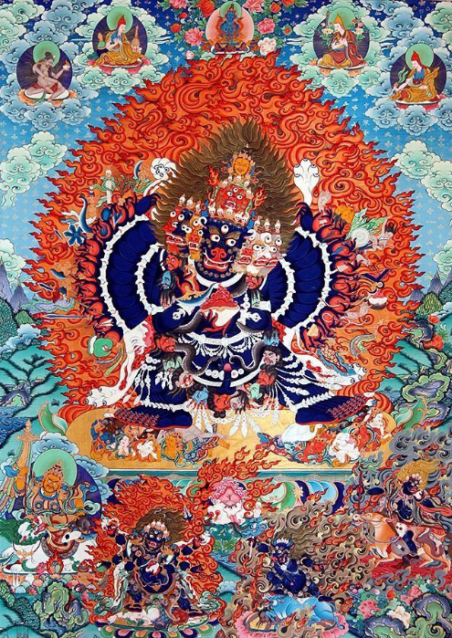

共计 2459 个字

今天经由文学文本来谈抽象，应该比之前用符号化语言来谈抽象要更生活化地给出讲解。我的备忘录上记了两个关键词，一个是罗生门、一个是密宗，看起来他们也只能在更广义的艺术形象中统一。好在我不是一个严谨的名词解释人，做着范畴上严丝合缝的讨论。姑且用运动与转化来为自己开脱，实际上之所以能运动和转化也是因为在各个面上都定义明确。扯远。直接由罗生门开始吧。

罗生门这个题我之前写过， 2017 年 8 月的一篇中提过一嘴，那会儿我才建这个公众号没几天；最近的一次是 2021 年 5 月 25 日《 [忘性大的人不会老](http://mp.weixin.qq.com/s?__biz=MzUzNjE3NzA3Mg==&mid=2247490101&idx=1&sn=7d8b1aad872837fcc3ff41825e784f60&chksm=fafb6aeacd8ce3fc76591bdb82187e1d1f3bba348daf36607de078620bdbda54955aa1aa71d4&scene=21#wechat_redirect) 》，那会儿我在广州隔离，看黑泽明 1950 年拍的《罗生门》，我发现当时都没有写得很清楚，都默认了读者知道什么是《罗生门》、以及芥川龙之介怎么写的《竹林中》

倘若我用最粗浅而抽象的词句来描述《罗生门》或是《竹林中》，最朴素的说，他们讲的都是一个成语：各执一词。简单来说就是每个人各说各话，最后搞不清纷繁复杂的事情到底是个什么样子，每个样子看起来都可以说得通。罗生门作为民间文本要早更多，原本就只是很短的一篇，我们现在讲竹林中是因为这一部是内核上的衍生，并同时构成了黑泽明这部电影的主要内容。

网上已经说得很好了，我直接复制原文：

一个日本武士陈尸于竹林中，案件披露后，召集了七个相关人员加以讯问。作品将七个人的证言以告白的形式表现。最早发现尸体的樵夫、路过的僧侣、办案的差人、被捕的强盗、忏悔的妻子、借灵媒之口出现的武士亡灵等。每个人的证辞都具说服力，但又相互矛盾，各执一词。真相隐于竹林之中

- 樵夫：男性尸体的第一发现者。现场遗留物品是绳子与女用的梳子。没有看到马和刀。
- 旅行僧侣：凶案发生的前一日，在路上遇到男子与乘坐在马上的女子。
- 检非违使衙门的差役：强盗多襄丸被捕时穿着粉红色的衣服、带着死者的太刀和弓箭并骑着马。没有看见女子。
- 老妇：死者是若狭国国府之武士金泽武弘，是其女婿。同行女子是其妻真砂，也就是老妇的女儿。不知女儿的下落。
- 强盗 多襄丸的自白：杀人的正是我本人。我觊觎武士身边女子的美貌，于是诱骗了武士且将之绑住，以占有女子的身体。强奸了武士的女人后，我也没有打算要杀害武士。直到后来女人要求嫁给真正的强者，我就将武士松绑了，堂堂正正的决斗二十三回合后，我把武士杀死。人是我杀的，请把我处死罢。
- 从清水寺前来之 女子 的忏悔：因为在丈夫面前被盗贼强奸，感到非常羞耻，所以用手中的小刀将丈夫杀了。本来想要随后自杀，却又办不到。
- 附身于灵媒的 武士鬼魂 的告白：事情发生之后，妻子对于我的存在很厌恶，怂恿强盗杀了我。那强盗竟然因此而愤怒，询问我是否要杀了妻子，而妻子察觉到危险就丢下我逃跑了。在竹林中只剩下我一人，我感到绝望而厌世，所以用妻子遗落的小刀自杀了。
看文学书籍时我有明显的阶段之分，高中毕业基本上都在看俄国文学：屠格涅夫、索尔仁尼琴，当然疫情中又看了陀思妥耶夫斯基。日本文学是在大二，看芥川龙之介、大江健三郎、夏目漱石。我已经很久没读纯文学类书籍了，现在有的也都是以前留下的记忆。罢而不谈。

《竹林中》这一段就是很巧妙的一体多面之阐释。把武士葬身于荒野，用灵媒、女子和强盗多襄丸的三者对立冲撞出来。最简单地摘抄一下段落理解： 武士的说辞，显示出他想保持自己的士族形象，与被杀相比，自杀更是一种表现出武士道的行为；至于女人，她意在显示自己贞操的形象，她因为不甘受奸淫之辱而把丈夫杀死再打算自杀，表现出自己被污辱的只是肉体，灵魂仍是贞洁的；强盗多襄丸则希望表现出自己的武艺强者形象，武士不过是跟他在汰弱留强的决斗不敌的被杀者。 樵夫在罗生门下向和尚还有乞丐和盘托出自己看到的另一番光景，女子挑拨武士和强盗为自己而战，但樵夫到场时，镶满珠宝的刀却不见（电影指向樵夫的贪婪）

这种各执一词的方式，在各种含有搜查、循证的情境中都可以顺畅地引入。之前听罗翔说刑法的时候，有选段是《罗生门之判》可以参看

每个人都有自己的一面之词，按照我去年这会儿日常和几个人待在长沙万达的情况来看，用剧本杀来指代这种体、面关系实在是再合适不过了（只是我还是得先把《罗生门》这个母题提出来对吧，注意是罗生门不是修罗场）

真相隐于竹林之中

今天意旨不是在讨论作为文学文本所反映出来的自私性，而是想说抽象性。七位传唤的证词，关联和佐证四位，交代前情提要。三位主角的证词各异，人们始终不知道是谁隐藏了，不知道会在哪一个范畴内统一。这就是很显性地出现了各人美化各人话，为何不同的特征工程总会伴随对事物本体的消减和折损。我们之前用 symbolic 手段来解读了抽象，而文学的手段则更加深入人性之心。

三个月前，我写过一篇《 [一行文字要读两遍](http://mp.weixin.qq.com/s?__biz=MzUzNjE3NzA3Mg==&mid=2247492346&idx=1&sn=cdcb5614c0f23856118ff1f7d9ce9e2b&chksm=faf89225cd8f1b3302c781cc358ac1c5728934dfdfb8d5205e78cac87ac9c8ccc5fd213ecc95&scene=21#wechat_redirect) 》，里面简单地讲过关于密宗的善巧方便的修习法门——观想。那时候我提过怎么从精神分析上，和怎么从“意指、能指、所指”来分解。

显教中的佛像常以寂静相示人，而密宗象徵主义不同，他们常常给出恐怖相和忿怒相。按照密宗的说法，各种相图为了修习者的意念能够迅速地捕捉引起人内心烦恼的邪魔，所以常把这些邪魔描绘成具体可视的形象，供反思和修行。烦恼便是内心的敌人和邪魔。就像别人用手指头给你指示月亮的时候，你要看月亮而不要看手指头一样。

这和罗生门是一致（本文基本上来说就是把竹林中和罗生门相互指代了），罗生门也只把文学形象拿了出来，而并没有给出后段里人性的解释：这是武士的士族、这是女子的自贞、这是强盗的武艺自觉。大概一个月前，余华和孙火旺分别谈了关于“长衫”的话题，无论《罗生门》还是密宗，在这个我说的抽象化范畴内都是在房间里拔下安在大象身上的象鞍“长衫”，看看到底真实是什么。有时是蒙蔽，有时是视而不见，有时是非礼。有时是盲人摸象，有时也是悬揣和想象， descriptive words 就如《洛神赋》。

妄执和单于一起夜遁不见

扁平不是静止，立体倒也不见得全面。我觉得这一个思维适用于所有含有映射关系的场景：无论是周易、算筹、文学。

地质学家在南极，长长的钻井机器深入地下，取出数千年前的冰锥出来分析成分。人类所建立起来的所有科学范式、语言、至于五感知觉或是异能，都不过不同的折损渐进模式。如果不在某一个方面形成较为系统的初步想法就直接深入进来的话，无疑是搞不成器的。

西郊有密林，助君出重围
