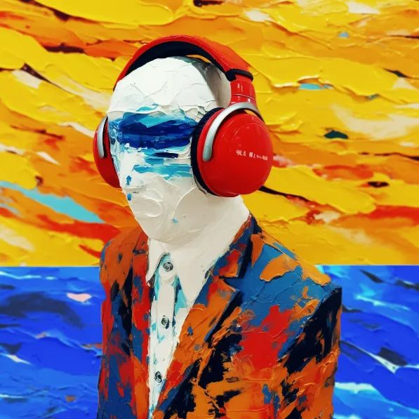
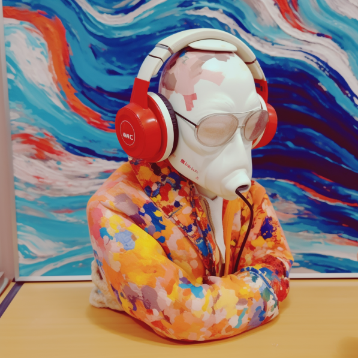
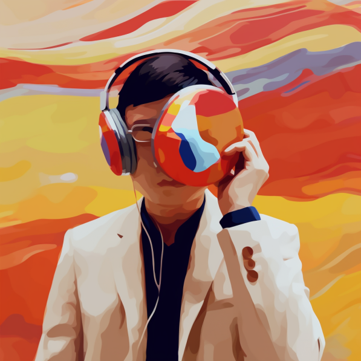
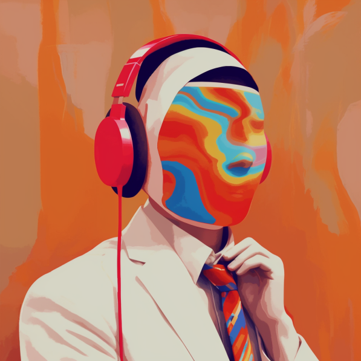
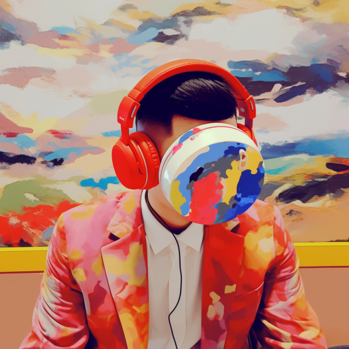
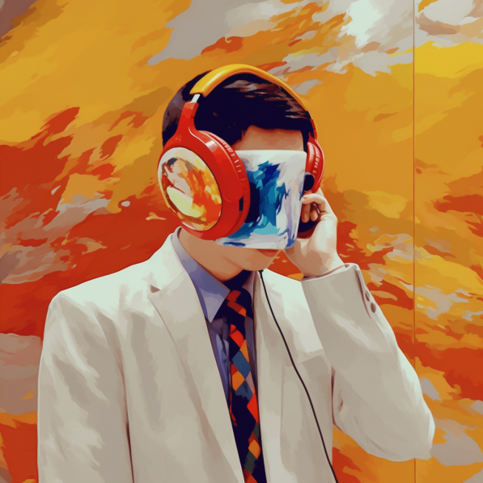

共计 1381 个字， 9 张图

怎么会有人这么离谱，经过我的时候还要问农忙是谁？ …… 难道我在写小说吗，有一个性农的人，名叫忙。我可不是那种写师旷、庖丁、盗跖、胠箧的人。这些篇目是很好。我是想象力稍微有点，但远没有那么雕琢的心。

这周过得有点像那种自然经济时代的农夫：临近过年了，一直在忙。忙各种各样的事，洒扫除尘也要坐、迎来送往也要做、年货总得管够正月里吧、我总得睡觉吧。

一周的效率奇高，得到了很多人的帮助，做的进展约莫等于平日里一个月的进展。虽然是有很多人在帮助我，但这些帮助也不是大风刮来就停在了我院子的车库。平和又安静的搬家公司已经把另外一家都偷了搬到我住房里了，那我等于 我还是自己要把一件件的东西放诸我所需要的秩序。

事情都停在那里等我去做。

我想先睡一觉。

睡了一觉醒来。和杀手聊着聊着，打开共享屏幕来看疾病菌群。

看完之后又睡着了。

醒来觉得没有那么热，于是打开门窗、开起了风扇。寸铁演腰，下不为例。

昨天去参加一个会议，中午有会议组的饭。 I 人战战兢兢跑过去吃饭，以为和别的自助餐没什么两样，自己去夹菜吃就完了呗。虽然选择困难症很难，但是后面会有人也在排队，排队的人会催我。或者，也可以当个学人精，模仿前一个人拿了点什么，我就也拿什么走。

结果昨天去的是一群学生的会议，整个人都恐慌了。怎么每个餐盘前面都有一个学生志愿者在那里给人舀菜啊（？？？）这是在干什么。我要是 E 人属性上线了直接自己拿个勺子从头打到尾，结果还非得人家吧盘子里仅有的一个勺子攒在手里，然后问我“ You want …….? ( 夹了一块肉 ) Is that enough? ”只能 I 人用第二宇宙速度逃逸地离开这个地方。吃完了第一盘，等那些学生志愿者都走了之后，再自己去打下一盘。

年关之前，对个体户经营的店子有一个说法，看谁开得晚。饭店、理发店都是这样。年前多营业一天，周边的店子过了腊八或者过了小年就回去了，往往越到年关的店子越会在临过年的时候。腊月二十五、腊月二十六，日营收多得抵得淡季三五一周也说不定。而且因为最后只有这么几家或者一家店了，所以一边是越来越火爆的门脸、一边是越来越想休息的自己。

我现在的状况里，除了周边那些会慢慢关掉的同行小店以外，其余感受完全一样。在一个极为高产但也紧张的时候，底色是越来越想换环境去休息的自己。说白了，现在没有那么多社交限制了，让我行走不方便的只不过是从新加坡到长沙还没有直飞。但只要我想走，以国内交通网络的发达程度，我现在决定出发，都可以在 18 个小时内吃上长沙的粉。话又转折回来，现在还至少有两个特别的问题需要解决。有一个已经摆烂了，准备去吵一个不影响我心情的架；以及有一个快等到结果了，估且以这里为决速步吧。

前几天帮一个我很喜欢的后摇乐队，也是我以前的年度歌手，整了张专辑封面。

乐队的灵魂人物在朋友圈问有没有人有摄影作品提供，用来做这个月月底专辑的封面。其实这个故事我在朋友圈也写过。打开我的相册夹准备找适合他们风格的，结果第一张就找到了最适合的。往后所有选的都没有这一张贴合他们。

根据这一张，我又写了点提示词喂给 MidJourney 生成一堆图片。灵魂人物的主页是一个教小朋友画画的老师，副业在乐队唱歌。他说终于知道为什么有人会被 AI 吓到了。

给他们一些新鲜感。我把我最近拍的一些图片也拿来生成一些歌曲封面好了。最近正好要把我差不多两周前过博士资格考试之后表达对系里不满的自拍给换下来。

于是又生成了一些来玩。

