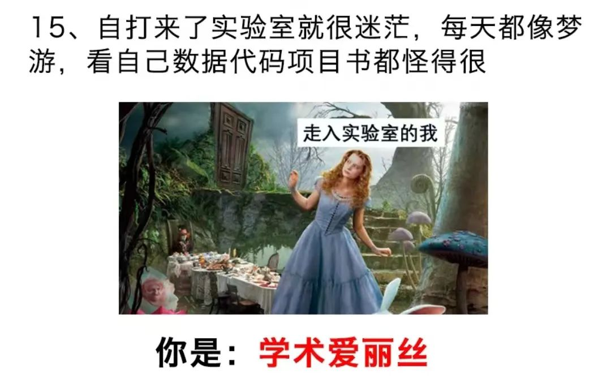

共计 1690 个字， 2 张图

讲话好听的，就说我在这些场合里讲话就像汉译英文名著。讲得不好听的，就直接说我是机翻的英翻中了。其中，上一篇游记这么被说了；然后，最近和朋友出门的时候，我说先别玩了 我得开个会：朋友在我旁边安静地玩而我在开会，我在看到有新伙伴加入时说了一句：“谢谢你进入这个项目”被一路嘲笑。

好像也没什么大问题 Thank you for joining this project. 大意也没有什么毛病，我看起来也挺正常的。可能在正常中文语序中不会这么冗余，谢谢加入，就可以了。上次 ChatGPT 帮我写中文的给一家公司的合作邀请，在结尾写了句“顺祝商祺”用来代英文部分的 Best regards 也是看得我一愣一愣的。

我们以前讲中英文在这些语序中的对应，也许就是一个词向量的事。这个上下文关联的词向量首先在语义或者符号学上进行分割。但是目前的大语言模型看来，似乎通过迁移学习的方式在大量参数空间上已经习得了多少程度接近人类的功能，比如以 GPT-4 为首的，在多个专业中的微调 fine-tune 这样听起来就有点大语言模型 LLM 既有一些知识渊博、覆盖面很广的模型，又有一些知识很专精的比如 PubMedBERT-Large 这样专门针对于生物医学的语料库。准确来说，这些都建立于电子医疗档案的基础上，能规范化采集到一些，同时又有能模糊理解的工具，看起来就是一笔划算的买卖了。

高三的时候我找方向，曾经找到过应用语言学里的文字编码。当时应用主要有两个：一个是对外汉语、一个是语言编码。具体的名字我已经忘了，总之就是如何让中文字符能够以更小的单位长度编码储存在计算机中。比如一个英文字母所占的字符是八位，一个中文汉字所占的字符是十六位。我不知道现在还是不是这样，只是这是当时我调研时留下的粗浅印象。其方向就是如何让中文汉字的占位变少，不再需要那么多位来描述一个汉字。这样就可以大量节约。

现在看起来，事情变得有些新奇了起来。因为语言的密码开始从新奇的通路开始破译，这就相当于从侧面进攻，绕开了一些原本的困难（发掘一些新的困难）

中午在朋友圈里留下了这一段：

> 今早去观摩糖尿病足溃疡清创换药，也是我博士课题的研究对症。可以说受到了极大的震撼 [ 很多震撼性的描述 ][ 不同病人的 ] < 比我之前看任何一张静态的图都爆炸 > 什么是科研落地啊 ( 倒地 我一个从化学口，进入生物医学工程和药学的人，又一次觉得自己做的这些东西 是得真的起点作用吧 ( 如果有一点的话 ..... ) 不起作用的话就跟玩一样，真的要用起来呢 又赫赫喝喝盒盒 (*¯ ㅿ ¯ *;) 你路还怪远的嘞

今早去观摩糖尿病足溃疡清创换药，也是我博士课题的研究对症。可以说受到了极大的震撼

[ 很多震撼性的描述 ][ 不同病人的 ]

< 比我之前看任何一张静态的图都爆炸 >

什么是科研落地啊 ( 倒地

我一个从化学口，进入生物医学工程和药学的人，又一次觉得自己做的这些东西 是得真的起点作用吧 ( 如果有一点的话 ..... ) 不起作用的话就跟玩一样，真的要用起来呢 又赫赫喝喝盒盒 (*¯ ㅿ ¯ *;)

你路还怪远的嘞

确实今天大受震撼。 真就是那种在医用口罩之下我还能够觉得很镇定地，从科学的角度来反省和思考一个问题。 摘下口罩脱了白大褂，离开病区我就转过背坐在茶颜悦色里，一杯接一杯地喝奶茶压惊。

下午想回来干活来着。结果刚打开电脑联上网，跟师姐的聊天记录没有关，直接刷新出来了一张新的病人情况图片。因为早上看过动态过程了，所以现在的理解就不是像以前看的静态图一样空洞，直接有被吓到。下午想干活，也干不专心，又很累，于是就睡了一觉，睡觉也是在乱做梦。

还是得对自己好一点，人就几十年，大不了也就齐彭殇为妄作，活个八百年。大恐怖，还是不要惹上一些太离谱的病症为好，走得很安详都是一门技术活。看到时候盒子里装些什么宝贝（笑）是我的话都不用盒子了，直接放礼花或者对湘江浏阳河里一抛。想去旅游吃大餐

今天明明在朋友圈也说这个看足换药来着，我妈偏偏今天下班买了三十块钱的 鸡爪子 回家。我看到之后直接就是一个头脑发晕的状态。感觉我妈此举居心叵测

我今天又听人说那种外面一万多一个人的这种高招咨询

按道理来说高考招生如果做得好，那确实一万块对人生而言不是负担不起。我也搞了一套思维框架出来，给了我的一些朋友。昨天正好聊了一些开发这种高招软件后端的顾问，一问发现我们思路在这里是大同小异的。

所以收钱只是让这些视野和境界还没达到我们这里的人，因为花了钱，从而更重视我们的意见，自然也就更有效。这样朴素但实在的逻辑，破绽就出在一个商品、或者一项服务的价值和价值量不总是相统一的。他们所在的范畴只是一个相对。掌握了金标准之后再去衡量，这其实我以前也写过一篇文章 叫做我们重视坎 更甚于设置这些坎的意义。我希望经常找我玩的朋友可以尽早不被这种怪圈迷了眼。

