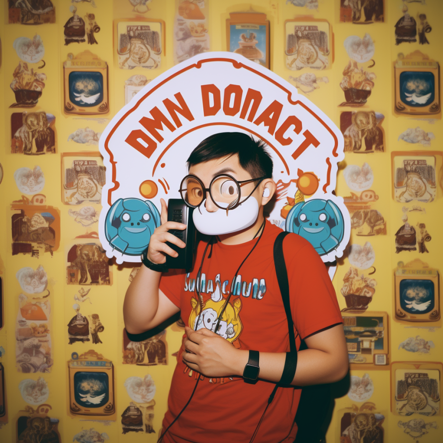
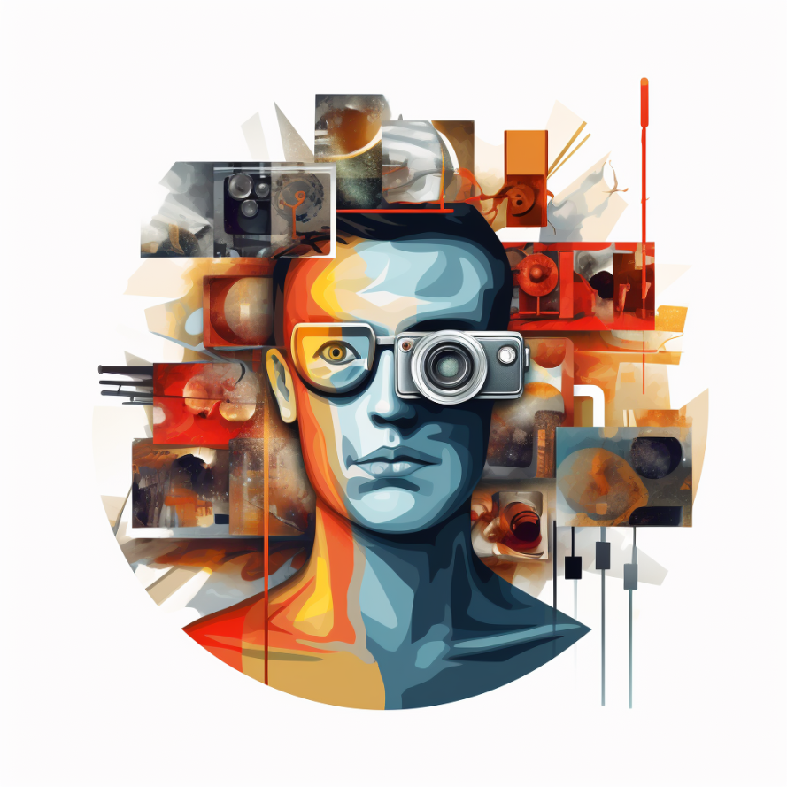
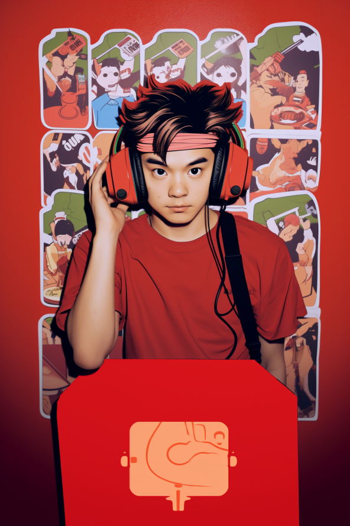
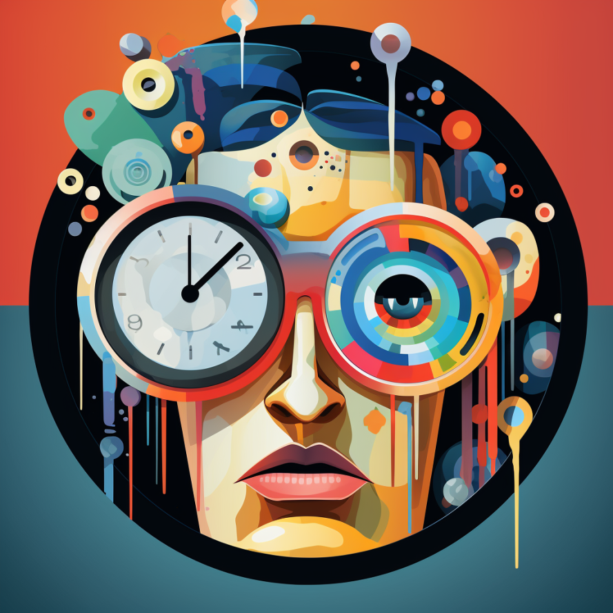

共计 2107 个字， 4 张图

据说这句天津俗语表示的意思是：生意好的时候就不管外观和质量了。萝卜上新得越快，就越没有时间去洗干净上面的泥巴（然后才上市）

收集了不少这样离谱的句子，通常是没有前后文照顾的。没有前后文照顾，意思是在什么时候提出的这种总结陈词。好经被念歪，没有了上下文的约束通常是一个较大的问题。这就不如去看文学色彩的加工，譬如我们说：

“烟鬼相的老板”

明明没说什么词，但好像给人留的空间很人文也很市井。

同样是凝练的话，但是指向空间在这个维度上相左。科学研究即使提出了话，不管是社会科学还是自然科学，也要将其中的内容规定明白。

最近得幸有一些程序要跑，而这些程序会无时不刻返回一些程序是否正在积极往前推进的信号给我，同时速度又不很快。这样的时间是比较休闲的时间，意味着在干活的同时，可以顺便做一点我想做的事情。于是看了两本书，现在第三本快看到一半了。

没看书的时候是写不出来东西的。不吃，就不会拉，除非是宿便。

最近看的最无聊的书可能是《文化失忆》：让历史人物重新扎根，这本书简直就是没劲的无聊透顶的维基百科词条树。既没有系统，也没有文化，行文乏善可陈，罗织一些不知重点的东西随便给你列在这本书上。是前段时间去一个饭局的时候带的这本书，一时间也不知道到底哪边对精神卫生更加友好。

每天看着各类的鬼话横飞。有些即使我觉得这种再鬼不过了的鬼话，不知道为什么也会在原本不是这种鬼话的受众那里得到吸收。极少数情况下，幸存者偏差还会将一部分鬼话的置信度增高（想起了前几天看到一篇统计学的论文： [90% 的科研人没有实质上理解 p<0.01 的真实含义](https://mp.weixin.qq.com/s?__biz=Mzg2MTUyODU2NA==&mid=2247586536&idx=1&sn=f5bd71c0f2161718f2a3ea250f47af4a&scene=21#wechat_redirect)

比如用一些完全超乎自己理解和掌控范围之内的东西来解决甚至指导当下的生活。风水是众所周知的一个讲不清白的地方，但这好在有很多经验知识。经济周期则是一个抽象，似乎很明白，但其实大部分人根本讲的都是牛头马面的词汇。一篇忽悠的经济周期文章可以骗过很多人，即使身边有已经在理工类进发到高学历水平层次的人，在面对不太明白的“经济周期”指示时，还会把切身相关的命运选择放进去，交一些天价的学费。

不同思维方法，有本质差别。倘若觉得什么也不做就是最好的选择，那人又何必长个脑子？

前人工智能时代，人们创造出来的工具大多是对自身气力的增长，譬如轿车跑得比双腿快，盾构机挖得比人的双手勤。到人工智能，开始进行数学逻辑推演的证明，人类为数不多能单枪匹马挑战科学边界的能力也得到了一个思维活跃的助手，所以说人工智能和前一时代的对比，在这是一种智识的增加。

回到牛头马面里来。当我们顺从这一些提出来的词汇，比如“经济周期”而往前行走的时候，我以为：真正弄明白之后选择的放任，和一般顺从的放任、和一般顺从的努力、和真正弄明白之后的努力，甚至我们走向它的对立面反抗，这些意义上都是不同的。反抗与改造，听起来有些摇滚，但事实上是努力的变体异化。我们讲萝卜快了不洗泥，主要问题是在，知不知道萝卜要洗泥、知不知道手上的萝卜有多快、知不知道泥要洗成什么样。其实第一个和第三个问题是同一个问题，这个是原则性问题；第二个问题是特殊问题，是具体分析的。

前几天摘抄了一些网络词句：

> 音乐节，旅游狂欢，购物狂欢，游行一般的旅游，都是冲着一种预先设定的期望来的。每一个人都慕名参加这场大戏，最后才发现自己是演员。但是临时上场的演员们都非常窘迫，总是要看着别人的舞姿摆弄自己的行动，因此呈现出一种戏剧之外的荒谬。每个人似乎都深陷时尚之中，好像活在梦里，越来越让人联想起旧沙俄的贵族圈子，他们完全像真正的西方人那样舞蹈，甚至在交谈的法语中认识自己。他们是国家文化和时尚的核心，却偏偏不是社会的核心，因为外国人说这是沙皇手中的社会。没关系，至少这一刻的快乐可以让我们把十二月党人抛在脑后

> 同感，这两年摇滚的兴起，不是凭空而出的。在淄博这件事上，虽然有些人不听摇滚，但形式上是大差不差的。总的来说，现在这个社会，推动了一些现象的产生。无所谓去哪，在哪，干什么，只要去就行。 我记得小时候我曾经幻想自己以后能在某个音乐节上喝个大醉，认识一些朋友 , 并获得一些启迪，后来真去了音乐节 , 我却只能对着人群发呆，不知道眼前的这些打扮成哪吒和二人转演员疯狂自拍的男男女女，到底在想些什么

同感，这两年摇滚的兴起，不是凭空而出的。在淄博这件事上，虽然有些人不听摇滚，但形式上是大差不差的。总的来说，现在这个社会，推动了一些现象的产生。无所谓去哪，在哪，干什么，只要去就行。

我记得小时候我曾经幻想自己以后能在某个音乐节上喝个大醉，认识一些朋友 , 并获得一些启迪，后来真去了音乐节 , 我却只能对着人群发呆，不知道眼前的这些打扮成哪吒和二人转演员疯狂自拍的男男女女，到底在想些什么

最近没有去听 live

很神奇的是回国一个半月了，竟然一场都没有去听过。没有我想听的乐队来可能是最重要的一个方面，但等寸铁 本能实业 赞诗 画家 沼泽 惘闻 文雀 长沙暴青，感觉还得要等挺长一段时间，我也不报什么指望，甚至都没有在刷秀动。

我们干活，用一种新技术，用一种旧技术。到底谁在真正往前走过去搅局，人只是很渺小的的一环。

浪潮褪去，才知道谁在裸泳。乘浪而上，固然需要弄潮，但你也不知道前人已经冲到了哪里，说不定这是离岸潮、说不定这是个漩涡。有些人一早就待在原地研究规律现在还在研究规律，有些人已经边游泳边整理好了泳衣 呛着水跟着潮流往哪里退又去哪个新小湾。仍然裸体待在原地的几乎将自己活成了一个悲剧，一个劲地捶浪 问为什么不能再往前开一点 点评后来人我们都这么过来的都好好的往前浮了你们怎么不努力点。这片海域上充斥着相互指责。

优势诅咒、萝卜的泥、浪里白条，今天写的所有都归结到了一个问题。

三册柏！
