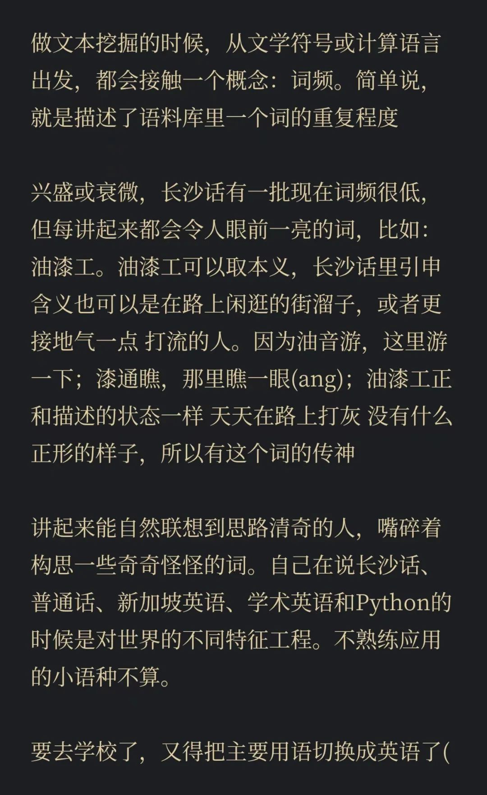

共计 3151 个字， 2 张图

租房的烂问题终于解决了，我说给自己放个假。昨天签完合同，就和老哥去岳麓山转了一圈，走了我很喜欢的岳麓山肾线。这条路的命名来自于走出来的卫星轨迹就好像肾的肾盂部位，因而得名。

今天在做思想实验，当然也和之前写的内容有不少承接。

其中最承的当如是建号最早几篇之一讨论神佛的。

我原说一些人对于宗教的看法就好比一场交易：你去给神佛上供，供得越多、神佛越保佑你。这当然是走捷径。比如发财：以前我本钱两块钱，做生意只能赚四块钱；但是两块钱里面，我拿一块钱去拜佛，剩下的一块钱就可以赚八块钱了。算来算去，我当然愿意花一块钱去赚那溢出的那六块钱香火加持。

这种做法不能说很少，我粗糙估计一下，进庙里的人六成以上抱着这种心思。有时候看表情包看到那个烧叁炷高香的人就搞笑，我追问下去说不定连为什么是“叁”都搞不清。

如果说神佛的作用会因为信仰香火而出现行为倾斜，那也就不存在什么慈航普度了（这里是作的佛教用语 但其实我是指的所有宗教）。因为一旦因为我多烧香，我烧的高香，我一个月只有初一十五来烧香 或每天都来烧香而有不同，我会评价这些人把宗教的教义走得越来越紧缩了。

无事不登三宝殿和顶礼三宝，这里的三宝意思是：佛、法、僧。三清香就和字面联系一样，是其一主气、化而为三清。当然意思还可以有很多，我们很擅长用数字的不同义。

我想说的是，倘若神佛果然无偏见，凭什么会因为信众的祭拜而更加关爱？倘若神佛有偏见，又如何当得上那些无量大德之类林林总总的法号。我对宗教的态度全不是这种以交易的形式展现出来的。以交易的形式展现出来的，虽然是将宗教进行世俗化，但却是腐化宗教的手段之一。一些人很擅长做交易，包括但不限于在宗教。

佛是觉悟了的众生，众生是未觉悟的佛。

如果用交易来看的话，人情社会里人人皆有佛性、皆有慧根，都有缘。

出门找人办事，打个招呼、托人送个礼物、打点一下。这都是一些人情社会的体现。我且不说这样做，对于社会的益处在哪里。前段时间看易中天中华史的明朝卷的时候，也谈到官吏俸禄的问题。其社会根源我们可以进一步探讨，但不是我今天思想实验的重点，前述宗教与交易也只是一个幌子。

今天想讲的是最近跟人争论时候提到的“外国的管理制度比国内更为清廉吗？”这是一个问题。我给出的答案是未见得。

我举一个很简单的例子。国内从初中到高中、从高中到本科、从本科到研究生，我们有中考、高考、研究生入学考试，最后这一者也是大部分我的朋友们经历过或者依然心有不甘的一份。国外怎么对待硕士生入学和博士生入学的呢？申请，考核。申请考核里包含几环，大致都要包含申请人的以下信息：外语成绩（对于大部分中国学生而言）、学业成绩（在校各专业的加权）、科研经历（专利论文会议项目）、以及推荐信。

在申请硕士的时候，这些项目的排序从重要到不重要，也许依次是：学业成绩、外语成绩和科研经历；在申请博士时，这些项目的排序也许是：科研经历、学业成绩和外语成绩。为什么我没有把推荐信放在里面呢？因为有一封强推，或者你当前的老师认识后来的老师，那么前面这三项都只是浮云耳。相当于你现在的老师（或者某一个愿意帮助你的人），认识你将来想去地方的老师，简单邮件问一问：我这有个学生很靠谱 你那还有名额吗 能不能来？能来就去了，没来就不去。比自己琢磨个人简历什么的快多了，因为这是另一个人的信誉背书。

这种做法有它高效之处。比起一个陌生人，我如果是老师的话，我也愿意相信有一个我熟识的人愿意为之推荐和支持的学生。有其优势的地方。我不是说做简历、搞成绩和科研没得用，当然有用，那是你的硬实力。但是，倘若同样两位申请者：一位完全新人，在科研和学业和英语上都不错；一位是我曾经合作者现在的学生，告诉我说这个学生做事你放得心，而且 Ta 来了你这里往后我们合作会更顺畅，因为你认识他、我也熟悉他，我们以后好开展联合项目。我曾经就这类似的问题问过我的老师，得到的答案和朴素人类会得出来的答案一样。

回到我们在这一部分提出的问题“外国的管理制度比国内更为清廉吗？”我想我朋友给我问出来这个问题的时候，虽然有些直白，但我想 Ta 的问题其实可以这样理解：外国也是人情社会吗？对于清廉的这个问题，我的回答是未见得。至于外国是不是人情社会，我想答案是肯定的。

简述完申请考核制的推荐信环节之后，换比在国内的中考、高考、研究生考试，这些是可以讨论的。人才分流有多少人被以什么形式分走了，又以什么方式洄流、或者偷渡。

我当时回问题的时候还蛮不客气的： 你怎么能认为一个凭推荐信入学研究生的国家不是人情社会？ 现在就好比纪晓岚一样，虽然没他骂人那么出名，但是也喜欢把自己骂得有趣的内容记录下来。

国外的人情社会，虽然可以和中国的人情社会安排上相同的名字，但是有着完全不同的内涵。国外的人情社会应当是一种相同圈层之间人们的互助，而国内的人情社会更像是一种交易。这是我的观察，也许以后会变化，当下的认识是如此。

譬如在国外出现了一些普通的违规，这件事情也许本来可大可小，你找一位你认识的朋友在管内帮你申诉。你的朋友和你同一个圈层，你朋友和 Ta 的申诉渠道同圈层。他们可以打通。在国内出现了一些普通违规，要么去撒个泼，要么拖人递东西取消。

言说外国并非人情社会的人，我现在觉得要么不在国外真正接触社会（这样的人一般接触国内的人情社会也只是抽二手烟），要么就还没到人家的圈子带你玩的时候（笑），要么就是在国内看一些无脑吹水的文章（有一些也是真的人在国外的人写的，那就是前两种的变式）

我最近也在看三省六部制的建立：尚书省、中书省、门下省，还有六部分别是吏户礼兵刑工。六部里面看到有一部就叫做刑部，或者还有其他历史时期的称呼：大理寺（唐朝主持司法审判的地方），还有经常在剧里看到的“请三司会审”：那就是刑部、大理寺和都察院。

我们看中国古代的社会，除了传统历史课本里讲的“皇权”与“相权”的斗争之外，可以考虑一下为什么中国古代的社会不能被称之为法制社会、而会说我们是从“人治”向“法制”努力。清朝修撰有《钦定大清律例》、国外也从汉谟拉比法典十二铜表法。何不反诸己，求问脑海中是怎么构建起来法制社会概念和人情社会的概念，又是怎么衡量这二者之间差异的。这个问题提得有点大，也没法在公众号几千上万字里面就写完。

目前我的理解是，我们构建的法制社会，罗翔老师的知识图谱里描述为大陆法系的国家，其完备的方向和国外的完备方式有不同。轻易唱衰我国人情社会与法制差异，又或在国外只看中国这那方便，我和国内朋友和同国外其他国籍朋友聊天的时候会轻易发现各地之间的显著差异。

目下不是我认为哪一者更优势的时候。目下只能说，我在哪种环境中感觉更自在。

可以说我在国内国外两地之间都过得很自在，大抵是因为在两边都能看得到一些社会的矛盾和痛点。深刻程度显然会不同，但是足以让我自己过上自己安逸的生活了。可以说无论是在国内还是在国外，我都因为摸了摸法制和人情的规律而得到了一些便利。

曾经在国外干过一件可以值得我一直纪念到撒手人寰那天也可以很自豪向其他人提及的事情，有朋友听完之后跟我说：那还是国外好啊在国内遇到这样的事情得够呛。在我经事人看起来，这并不是国内国外的问题，当然也不能夸大自己的努力。遇到事情，在国外有国外的方法，也许看起来透明一些但那只是因为你对国外并不熟悉罢了（我没有用有滤镜这个词，因为这属于遮蔽），国内也有国内的方法。方法不同，是根植于一个地域文化范畴内的价值取向，而这种价值是人本的、是社群的、排他的。

我不敢说我在两边分别的认识有多深刻，但是分别和我就某一方讨论，都能获得从另一方讨论时的视角。这是经由我，而对社会进行的不同特征工程。感觉在这一篇内要是像现在这样再羚羊挂角旁逸斜出的话，这篇文章会没个主心骨也没个结束。

言尽于此。油漆工快乐 ~

