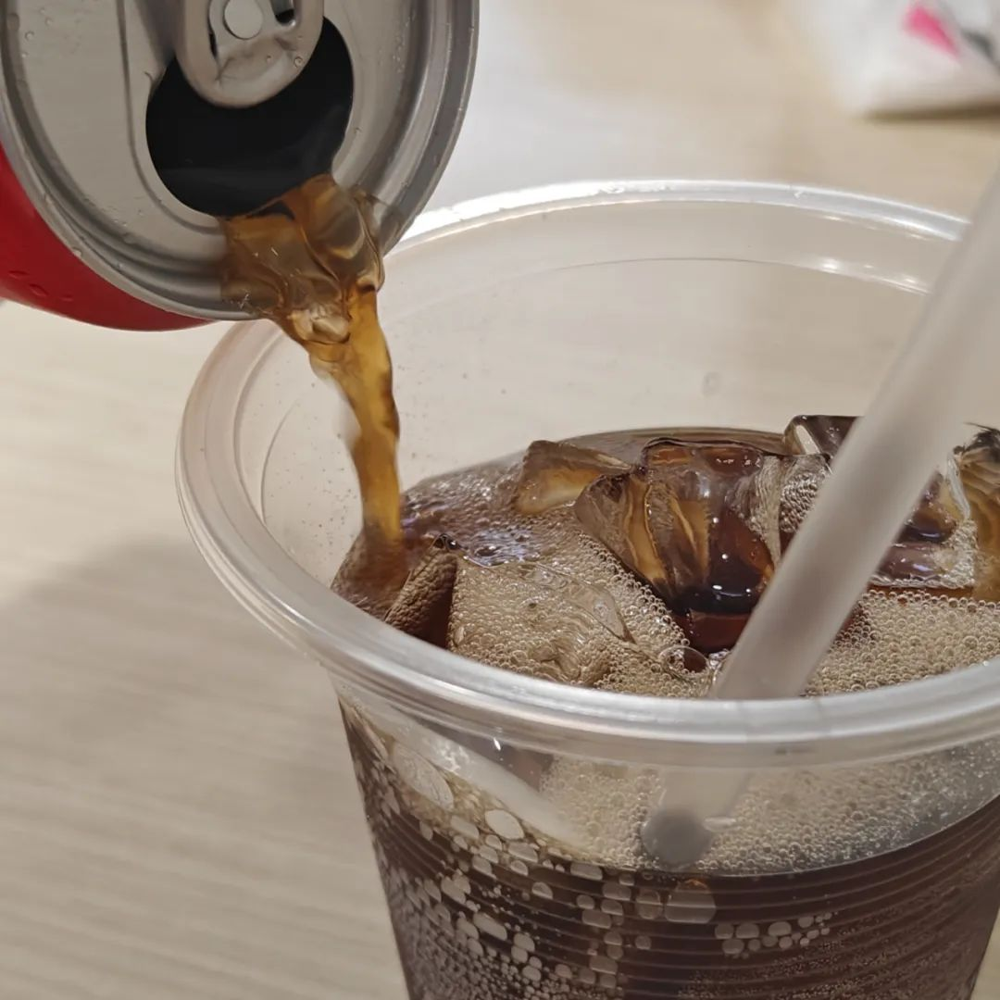
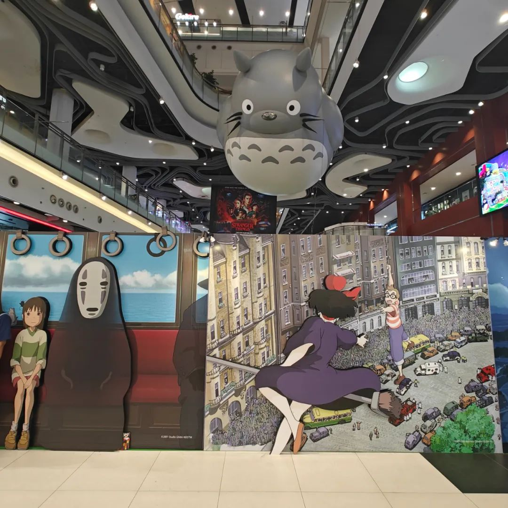

共计 977 个字， 2 张图

这篇就是上一篇的一个替代版，我看GPT来写比我自己来写会不会有什么不一样。我的提示词是： 我正在写一篇微信公众号的推文，请将这篇文章用个性化、天马行空、自由散漫的语气重新写一遍。

虽然是GPT写的，但由于Prompt提示词仍然是我自己写的，所以我把这篇仍然计入了原创，并且标记为第272篇。

以下

图还是续上吧。选了最近拍的两张：吸走可乐的冰块，囚禁在商场里的幻想

