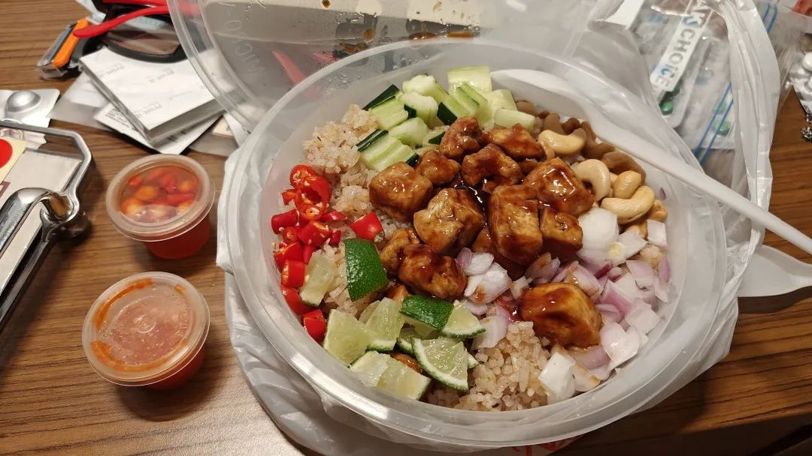
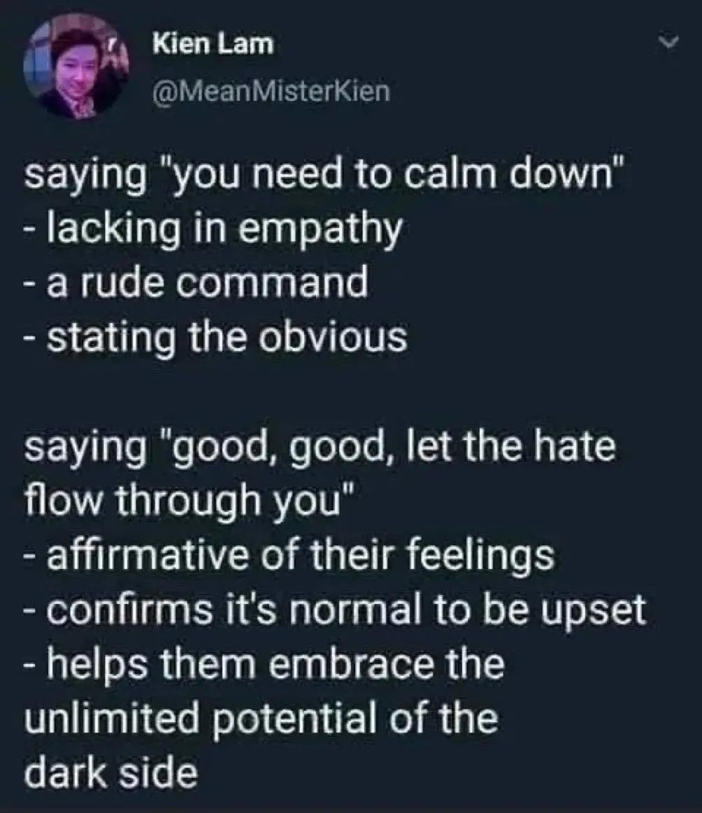
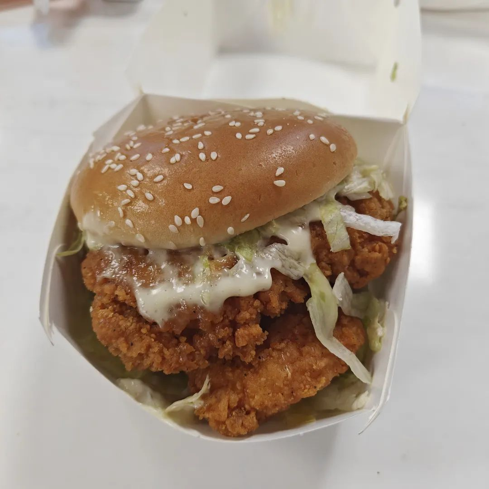

本文是张衔瑜第273篇推文

共计1664个字，3张图

午睡做了一个梦。醒来之后把梦的内容告诉了和这个梦有关的人。

接下来的事，每天都一样：下楼，交通，去实验室。待到末班车的点，决定要跑步过去还是缓缓地走。

越紧张的时候，就会越紧张。

比如干活干到末班车的点还没有干完，只能潦草结束。然后看着就快到站了，跑步过去。不太紧只是有活要干，就可以轻松地洗一下杯子，关心是不是所有的电源都关好了，查询座椅有没有推回原位。

晚上在泰餐店打包带走的饭里有洋葱。我不喜欢洋葱。但如果不吃，就没什么能下咽的了。ข้าวอบนำเลี๊ยบ Kao Ob Nam Liap Jae 从不知道这个到底是什么，吃起来还不错，也没有探究的想法。

下午的梦是有关在西操旁边的小巷子里走来走去的。可能弯弯绕绕的羊肠小道比起敞阔的马路来更适合我。梦到的原因也许是那会儿我有很多很多的选择。

想起以前写过的一篇文章，大抵说的是 [紫菘停水停电停网前后24小时](https://mp.weixin.qq.com/s?__biz=MzUzNjE3NzA3Mg==&mid=2247485397&idx=1&sn=013a8453166d49434fd5da69eeb612d5&scene=21#wechat_redirect) 。回忆滤镜是人为的改造。我更喜欢的是那时候我有很多很多的选择：停电了可以去墙壁上贴得满是厕所瓷砖的小聚会地看别人表演情绪排泄、可以私奔去月球、可以敲隔壁寝室的门敲个没事的人然后不开导航地开共享汽车去吃便宜的咖喱饭、可以在操场上看别人搞不插电然后对着走路摇摆的人指指点点植物大战僵尸云云

晚上写着写着代码，想着程序没死的时候我就来写随笔吧。一方面朋友圈关了，另一方面也有长段的内容想输出。但终于只写了一行，每次想写随笔随缘监控一下的时候，都会传来新的死讯。

为什么我会觉得每天固定的通勤很烦呢？我并不讨厌交通，相反我觉得出行挺快乐的。以前本科时总结过的人生快乐瞬间之一是深夜航班，实在没有到底讨厌交通作为一种工具。厌烦的是生活一成不变。我能背出从住处到实验室的全部地铁站名，那并不代表我对这里的熟悉和热爱，那只是一种知道下一个研磨我耐心的石头在哪里。

戴着强效降噪耳机是因为如果没有人同路的话，接收到的信息都令人呕吐。不细节到听起来人身攻击的描述了，但现在不想听到别人跟我语速太快的说话好像我是那个夜宵摊的炒饭师傅一样一直听到食客在那呱呱呱师傅炒快一点炒快一点啊啊啊再慢我就要饿死啦啊啊啊我只想一锅盖把辣椒粉和炒面都扣在那人头上看看这个奇思妙想的脑子戴过我的锅之后会是怎样

不喜欢有人用套话的语气和我说话，除非我愿意主动上套。保育员的措辞烦人得很。我换一个比方，就好像有人存心天天问东问西，等下圆明园都是我烧的

最近读的书里摘抄了一句话

对于语言，我很快了解到：一个人的语言说得越流利，他言语中的失礼之处在当地人听来就会刺耳

在不懂的人看来，也许我很喜欢做菜，另一个人也很喜欢烹饪。看起来好像挺不错的。那，是不是可以没事介绍一下两人？可是我的做菜理念里是保持食材的原汁原味，鸭有鸭味鱼有鱼味；对方则是自己拿出中药方剂典略，说这一味要配什么，那一味四两三钱。两个人都很有研究，但在基础认知上就分歧开来。

很少听说杂食者会和纯粹素食者走到一起。我本人对素食这一行为颇有微词，素食者是个人，另说。并且痴心妄想把螺蛳粉扔到外太空去当宇宙垃圾。

这也不喜欢，那也讨厌。对于以上，很自然地就会过渡到另一个词：自洽。为什么能自洽呢？那是因为完全没扯谎。

当每天去吃饭竟成为了一种英雄主义时，很明显这个人的生活秩序应当描述为生存。以前拿手柄打求生之路时，背后的人会给你来一针肾上腺素，然后主角就会恢复活力，然后接着冲。他们看起来很强，不一会儿就恢复了。

我现在和上半年的状态又有不同。现已不只是每天赶末班车，现在末班车也会错过。如果觉得已经努力到很难更努力了，那要么是方法的问题，要么就是，走这个路子不通。路子其实很明确，就是环环相扣的砸了又砸。生活不能像程序死了之后就重开一个，这一点很不好。

点了一个麦当劳来吃一次。属于心狠，然后点一个死贵的外卖。外送费挺贵的。花没必要的钱就质疑何必，这是一项简单的价值判断罢。努力也是一样。

每天以为能解决多一个问题，但其实都是昨天问题的延续下，继续在原来问题的树枝上修剪掉又生出来的枝桠。想把一棵三人环抱的橡树连根拔起，可我手上拿的是把勺子。这是现在面对境况的现实描述。

