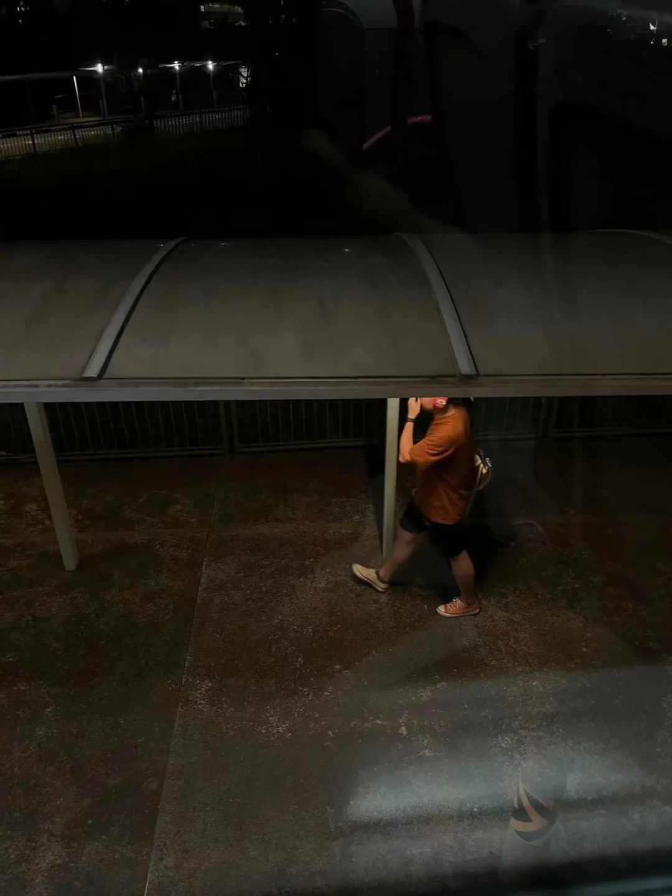
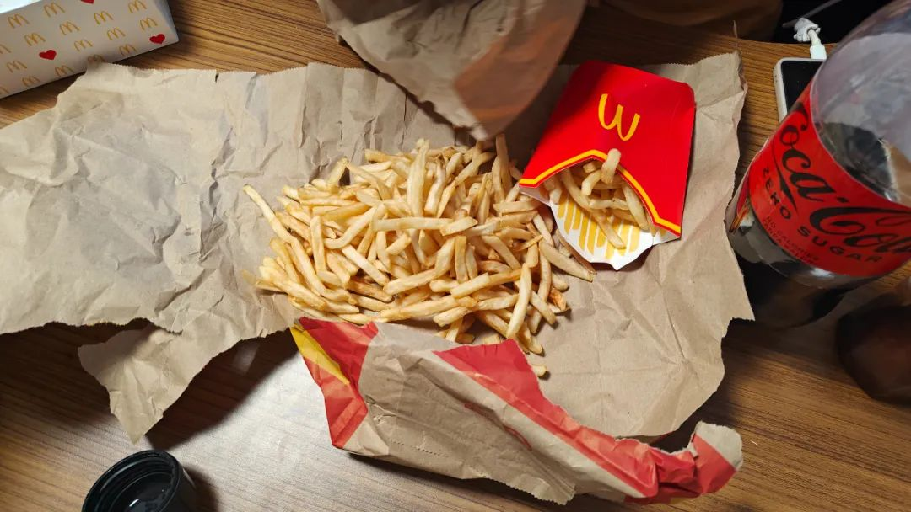
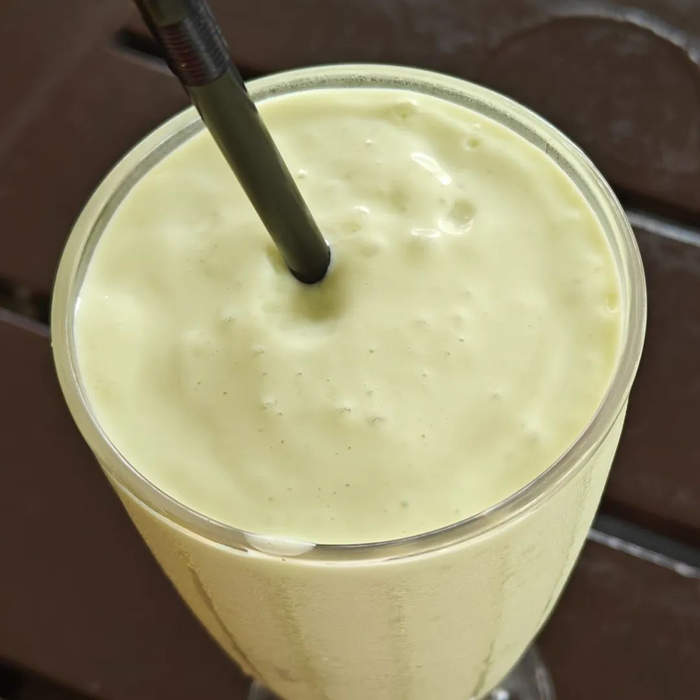

共计 1386 个字， 3 张图

发现线连的时候，耳机效果比蓝牙连接的时候要好不少。好像可以专门解释，不过我就懒得费这个功夫了。

戴着耳机出门，才不会有暴露在人堆当中裸奔的感觉。虽然我坐车的时候不一定人很多，但是早上趁着起床气，都觉得有如置身沙丁鱼罐头里，被各种我不想听到的无效语言裹挟与胁迫。前天看到小论述说汉语讲究的不是形同，而是意合。相比于有时候看网络笑话，说学完德语之后来看英语，觉得很惊讶怎么会有英语这么不严谨的语言。我没学过德语，不置可否。但这种形合的东西感觉放到营销号去又能整出一大堆民族性来。现在不会刻意去听或者留意一些细微的内容，就当注意不到好了。跟我无关的为什么要注意，平等地只想去当医生，对每一个来人说“你有病吧？你有病。”

耳机是我的本体，遮盖了很多声音就很好。戴耳机上电梯，虽然有时候网会断，不过我也不是特别需要听歌。好听的歌只有那么多，我不能每天寸铁演腰，不能每天绯红之王。马上关电梯门，再多站一个人都不好。如果不是有人跟我一起在车上，输入哪怕只是情绪内容也好呢，都不会觉得有如听人用飞快而没有节奏的语气说话那么烦人。

世界是个草台班子。我觉得这话还可以，但不够精妙。

世界应该就是活字印刷，每个人都贡献一点为难别人的方法，当然这个人也包括其他非人的部分，我懒得在这里辨析“相”的问题了因为这个不是重点。活字印刷把各种原来组成一个人所有糟心的方块字又重新组织在了一起，用一张新的纸来书写。这就是又一个人的人生。不同的时代有不同的文字载体，这一个域符号限定下了这一块印刷内容要给到什么模样，但字就那些个，变来变去也都还依然是世界啊分钟啊便器。

大脑和小脑都摇匀了，意识到实力是运气的幻觉。

虽然不开朋友圈了，但是会逛其他的软件比如小红书。小红书的标题里会因为我的地区而出现不少带新加坡国旗、或者那种什么读博的点进来类似于给建议或者给看看之类的。虽然估计是根据我的身份猜出来的，但是碰到这种我都点不感兴趣、减少此类推荐、诱导流量。

一条也看不下去，这不纯纯骗人。

干嘛要在一个网络社交平台上找同温层，我认识的同温层的人还不够多吗，在这找什么存在感。除非有人来私信我，不管怎么说反正有几种情形来问的我的答案都是一致：

要不要退学？不退。

要不要和 xx 分手？分。

反正问我也是在随口敷衍，凭什么一定要借我的口来说出你想说的话。这种业力因果我是一点也不想绑定。每次的答案一样倒是一点心理负担也没有，问的人心理都已经都答案了，除非来做分析的，可能还会唠上两句。

最近 away for something 的次数屈指可数。都能数的出来的：刚过去的这个周末也没离开常规路线、再上一个周末去好朋友那 BBQ 、再上一个周末去看吉卜力 | 优衣库联名、再上一个周末一直在实验室清东西了、再上一个周末在北辰三角洲买了两个冰杯两瓶酒 兑在一起调了两杯喝的去岳阳烧烤大排档上问老板这家有没有牛油。

想吃闸蟹了，不是这种海螃蟹。

