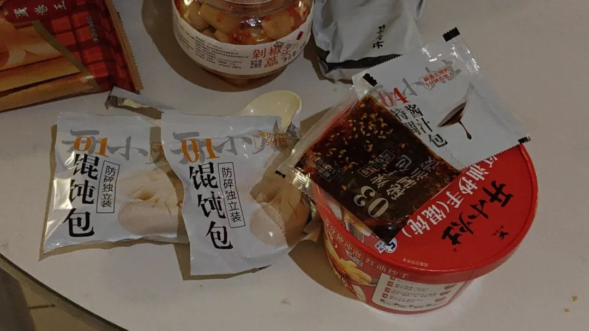
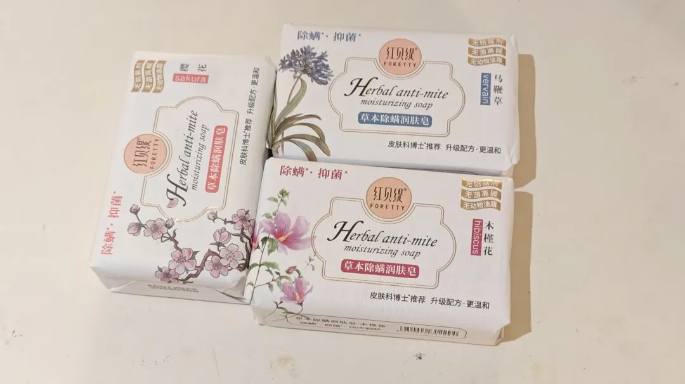
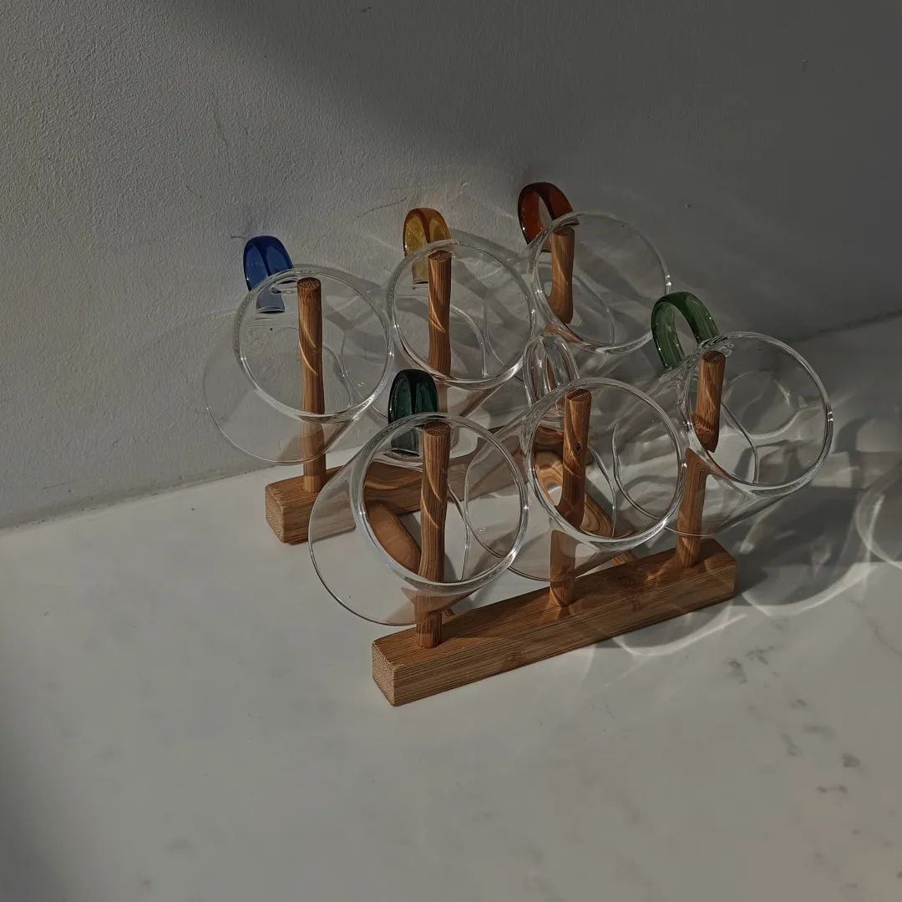
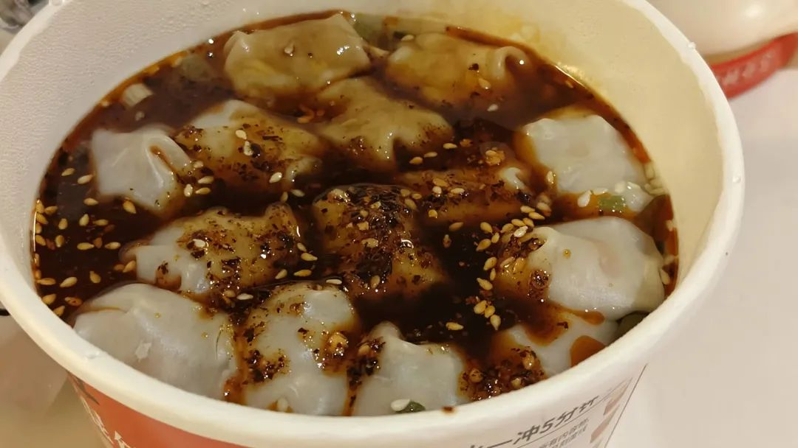

本文是张衔瑜第275篇推文

共计1496个字，4张图

继续跑步，继续末班车。

敲下最后一段改图的代码，虽然没有写好，但是已经知道怎么改了。于是把程序挂着。有时间的时候我会优雅地把所有窗口都关掉，等电脑睡下，再把电源合上。

跑步进电梯。关门，按键下楼。

一个安保在路上。不知道这人能保个什么安。啪嗒啪嗒拖鞋从旁边跑过，天气依然晴好，连马路上的白色柏油条纹也没有让拖鞋湿滑的感觉。

昨天跑末班车的时候穿的是真的鞋子，跑得到坐完了车才把喘气收住。啪嗒啪嗒的拖鞋，跑不快。所以只剩心急了。

心急地看着运到了有两周的开小灶馄饨。很烫。很烫，即使呼了又呼。觉得有一些决策的失误。这样的话早知道还不如点个炸蛋小汉堡然后逛着小商店在那等小汉堡烤出来。

听说只有牛肉的才可以叫汉堡，鸡肉的只能叫三明治。我感觉无所谓，哪个不要拿钱买呢？

橱柜里放了三坨肥皂，前几天说囤货的时候买的一些国货肥皂。虽然不知道是不是真国货，但我显然是会为好听名字买单的那一类人：

木槿花、马鞭草、樱花

用这些花花草草来当香名的肥皂岂不很到位。我见犹夸。前段时间买衣服也是：暖橙、桃粉、奶杏、军绿、香草白、雅法橙、布里斯托蓝，就一个劲地胡说八道吧。我忘了之前是哪个肥皂厂家的老板会直播吃肥皂。反正也是脂肪酸钠，也可以。

脑子里千帆相竟，勺子里扁食不动。还是因为很烫。

无语，而且像老奶奶绣花一样顶个钢针(真)

拍了个照，然后每吃一口都在骂。

一口咬下去，离馅还有两万五千里。

要么馄饨把口腔黏膜烫坏了，味蕾也捕获不了味道。摊手

说话直接，做好。

说话间接，作揖：一般是为了赚钱。

没写公众号的这两周发生了一些事，但是也没来记。比如又去了两次马来西亚柔佛州的新山，只是因为没有也没有遇到新得一定要写下来的内容，所以也不了了之了。

这个杯子是很好看。欢迎大家来找我喝茶，虽然不见得能闲聊，但是可以喝茶。朋友来了必有茶(看人沏茶沏香茶)

吃点薯片。薯片很好，是个主食，又不需要加热。水我可有的是。放了很多水在工位上：金桔柠檬、普洱、雀舌、福鼎白、大麦、苦荞。为什么输入法会联想苦荞沙琪玛，我不太理解，总觉得很黑暗。

并不一定需要一个东西。只觉得如果有的话很好，没有的话也没关系。甚至不一定要吃，只要看到就好了。床头柜上摆了一袋蛋卷，是楼下商店打折的时候买的。尔来二十有一年矣。

寻思着解决一些神秘学的内容。倒不是不相信，只觉得本质上有一些要和原来的想法有要调适的地方。

比如，拿最简单的生辰举例：如果我们认为人的气质命运会随着属相而变化，这种想法本质上带着一些生而具有 其本质是消极的。极端是，即使我什么也不做，也和什么都做是一样，最后都会回归到判词。

红楼梦里有谶语式的表达策略。我也觉得那是一种很高明而且很能让人会心一笑的载体。可换到纯生辰上而言，的确让人很难接受，原来人的经历竟会在事情还没有发生的时候，就可以预见可能的过程和结局。文学作品里获知，那是作者大笔如椽。现实生活里如此，令人会多很多对生命的敬畏和不可欺。

我最近科研的内容就和上述的是同一个精神在不同项目上的特征化。也是找到很多东西，然后循证：试试这个能不能解释、那个能不能解释，然后解释为什么这个解释可以、那个解释不行，在湖里投入石子之后水纹衰减二段地地方收束我的思路。

这样想回来，那所谓神秘就不是前因和后果，而是一些总结下来也许合乎的内容，经过迭代优化和异常数据的冲撞之后保留的一套计算策略。这样想一想就合理了，而且也把原来的方法从原教旨里解放了出来，变得有肌理也有活力，可以拿花生当核桃。

吃到最后几个馄饨，感觉汤没有那么烫了，慢慢地也能尝出味道了。下次肯定不会再买红油抄手的开小灶。听说那个鸡汤馄饨的好吃一点，下次吃了之后再来反馈。
