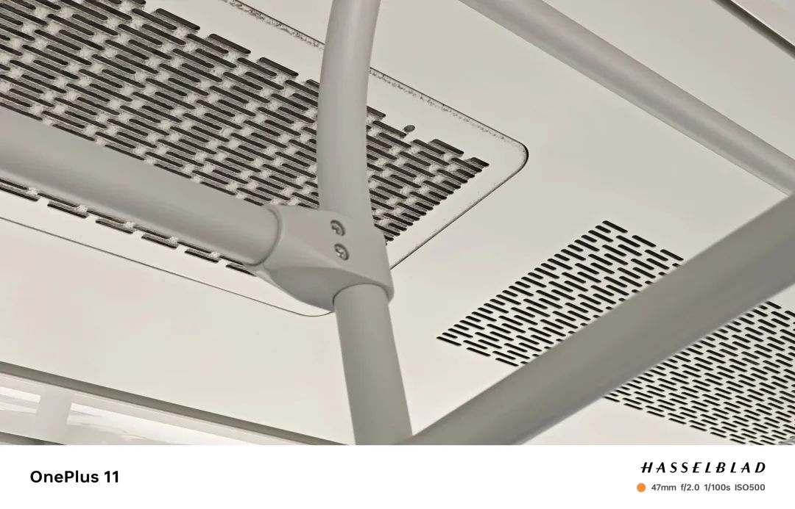
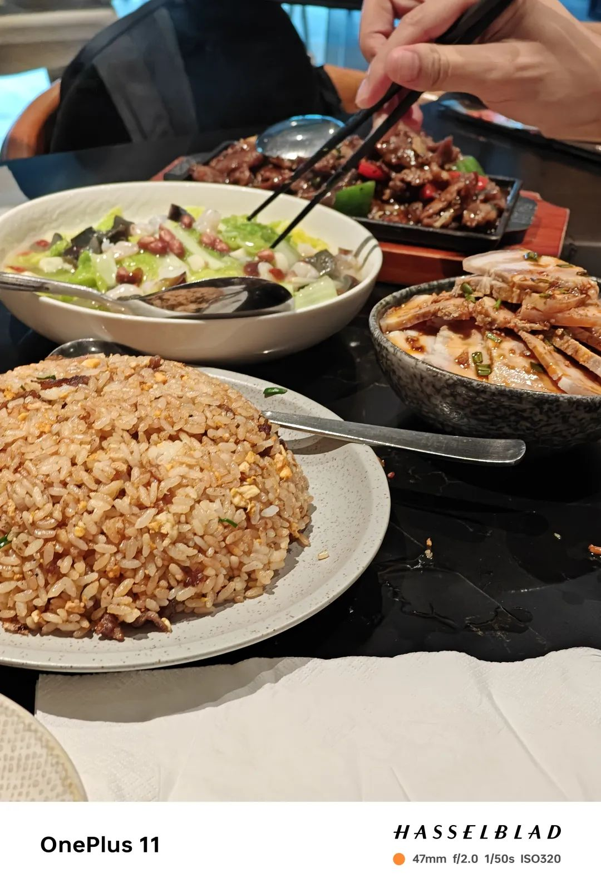
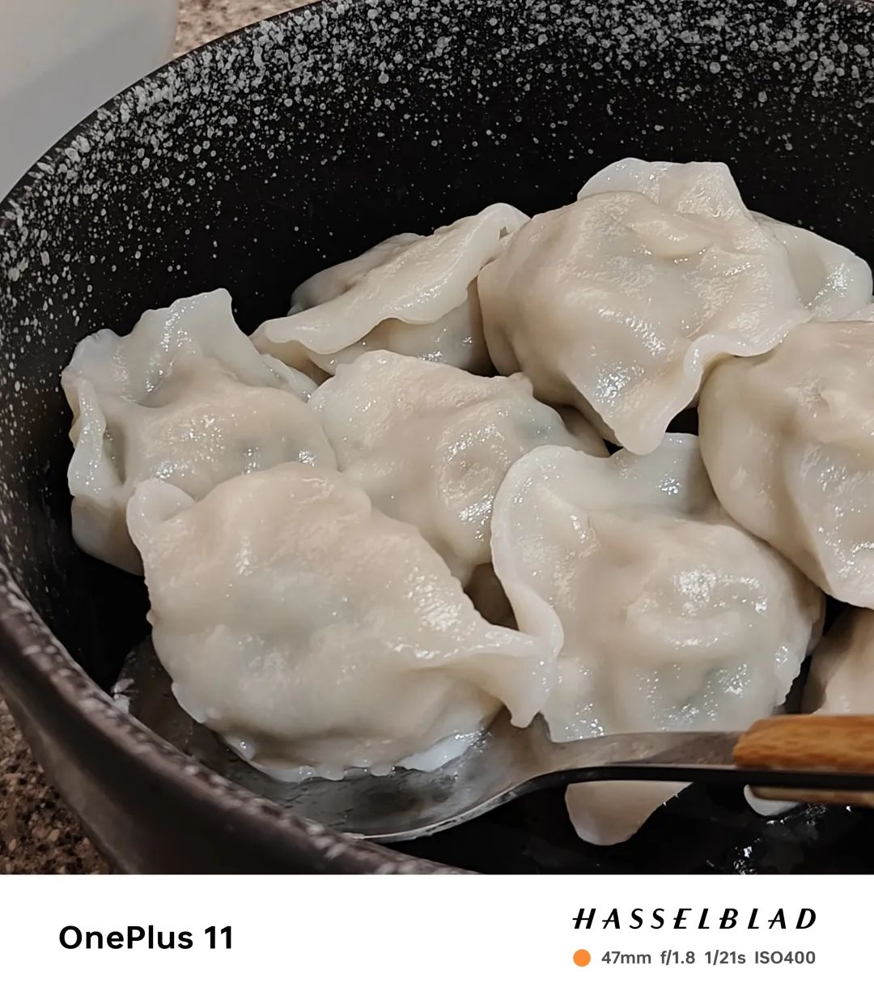
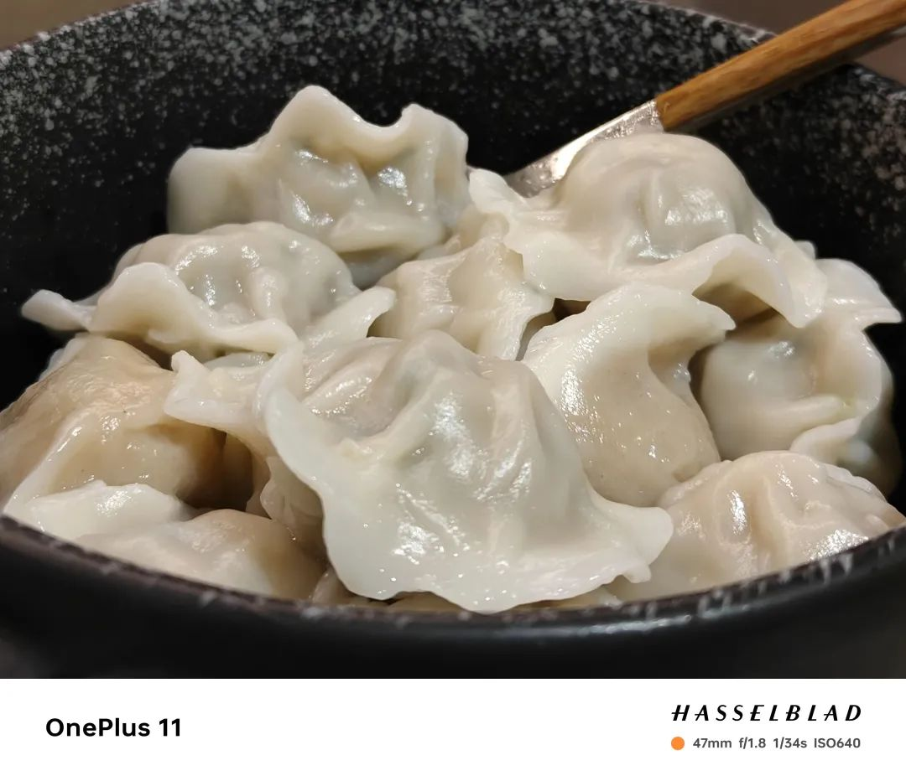
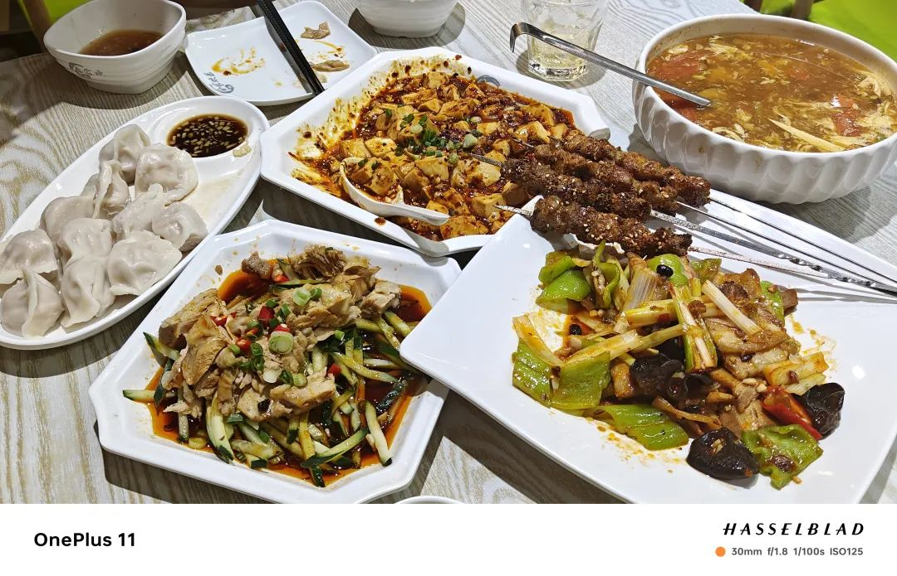
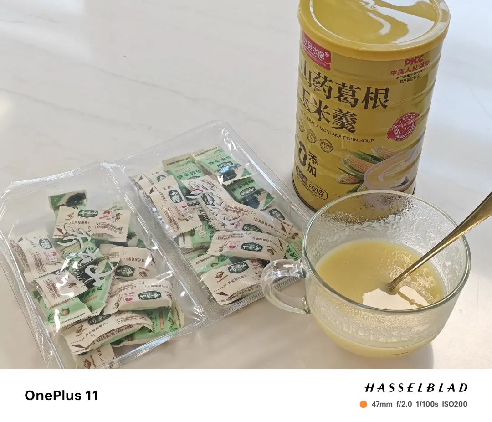
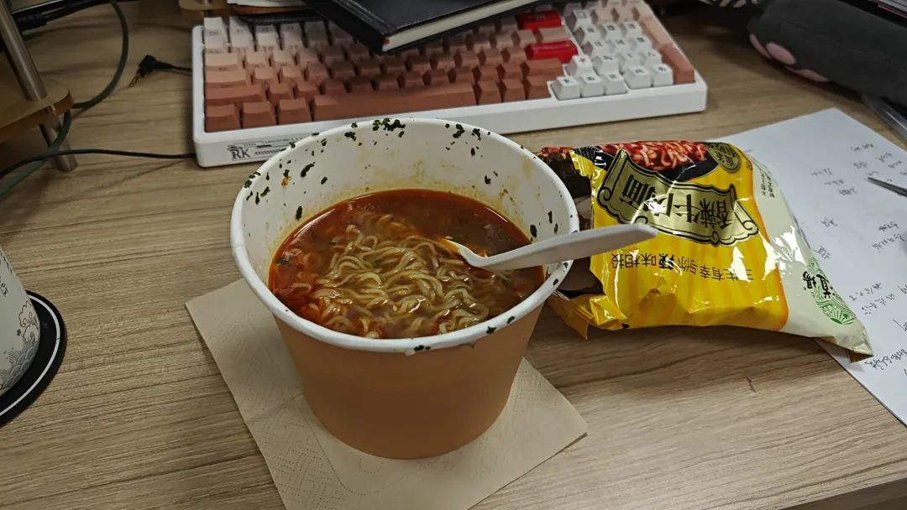

本文是张衔瑜第276篇推文

共计1427个字，7张图

不知道这个口的具体作用是什么。看积灰程度，应该是进风出风、循环净化空气、制冷之类的。

一边的积灰严重，另一边看起来很光亮。好像有些人鼻炎，在夜里辗转：不是这边堵了、就是那边堵了。鼻炎就像个天平，哪边的秤压着了都会降低。

还好我的生活里不存在平衡干活和生活的两难。因为只有连串的难，压到天平的秤座超过称量限度，倾斜倒下，把称量物都免费了。

最近和人对话发现用词影响思维。上周六搞了点娱乐之后，眼镜镜托融化了。热化了。缠了一点生物相容性和抗菌都不错的Parafilm，亲肤是亲肤，但也不舒服。

这两天戴隐形眼镜出门，觉得好些事都不一样。坐在电脑前谈不上多难受，但总归不舒服。于是就到处走。从实验室走到工位，又从工位走到后街卖平价生啤的小店，又从小店走到好朋友的实验室去干扰别人学习。

好朋友走过拐角的时候瞥到我，又折回来：“今天穿隐形有感觉好多一点吗？”还蛮明显的东南亚遣词造句，和隐形搭配的动词用“穿”，实际上就是翻译过来的wear吧。然后“好多一点”、“给多一点”也是一样。这种词又多积累了一个，上次的动词是骑车的“划”

坐在餐桌板旁边等饺子熟。买了两袋：一袋白菜猪肉、一袋韭菜猪肉，都是一斤。饿仇杀整个世界，但一个锅又只能煮十二个。把白菜猪肉的那一锅都扔了。以我二十年吃饺子的经历来看，这个应该是质量堪忧的。另一袋韭菜猪肉好吃的，爱吃，一直吃。

连煮了两天饺子，怎么吃都吃不够，不蘸醋也想吃。于是去吃饺子自助，发现饺子自助被人吃倒闭了。不是换地方了，是歇业了。好可惜。只能又去隔壁换一家店接着吃饺子了。

笑到发财，和人谈松弛感。

什么是松弛感呢？这两三天因为戴隐形已经接连耗去了两三个小时。怎么睡也睡不醒的同时，还得每天接受新输入。

人的特征工程手段看来挺容易被攻击的。我不戴框架眼镜的时候，看人觉得很奇怪。别人说我不带框架眼镜的时候，平常被眼镜挡住的疲惫和对世界的敌意都从眼里轰隆隆流出来了。应该就是不戴眼镜的话看起来呆很多吧也没有那么亲和了。素面输出当如是。

松弛的人应该在实验室调山药葛根玉米等等宝宝辅食、在咖啡店外的马扎上用没喝完的冰美式灭烟、在泰坦尼克号上给乘客们作最后的表演、在饺子自助关了之后去旁边的店里吃到一个饺子自助的量。

很奇怪上周为什么那一篇说馄饨的阅读量会如此高。要知道我之前专门为了写给别人看的茶颜悦色测评是最高的一篇了，阅读量也不过两千七，上一篇竟然过三千了。

虽然不是没有做过什么热点出来，最早大一做过一篇两三万赞的说说、去年还做了一篇十五万浏览的小红书，但我公众号这种胡说八道纯属自己日记只在朋友粉里的也被推给很多人看就奇怪，而且还有人在看。排除机器人之外的话，也许就是想看到活人说话、活人朋友圈罢。

催更我常看的几个号的作者。现在只有拍图的拉里还在接着拍图了。

在传媒工作的朋友说，只是微信会推广一些公众号。也合理，再不推广，流量上都打不赢其他产品了。无论从作者激励还是从听众面来说，都不是没有操作可能性。

终究我只是普通记事，车轱辘话儿来回说。

和前室友夸学长有生活经验，说他完全知道怎么利用现有的环境搞出一个合理的能吃饭的东西出来。我用微波炉煮泡面就是从他那知道的。

煮了一包五谷道场。还没到那种再吃速食就会完蛋住到盒子里去的程度，所以接着吃。

热得有点久，当然也可以是我水放得比较多。毕竟学过原理，微波炉就是加热的水，然后才传热给食材。水也能算食材，我先把预设的名词解释埋到地下。这张不是手机原相机拍的所以没有哈苏戳

明天想煮自热米饭。
