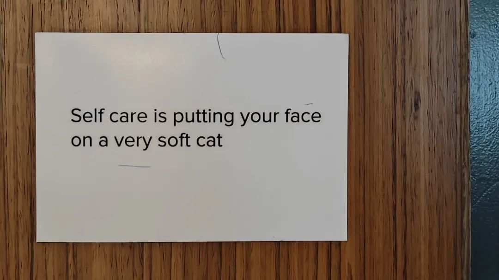
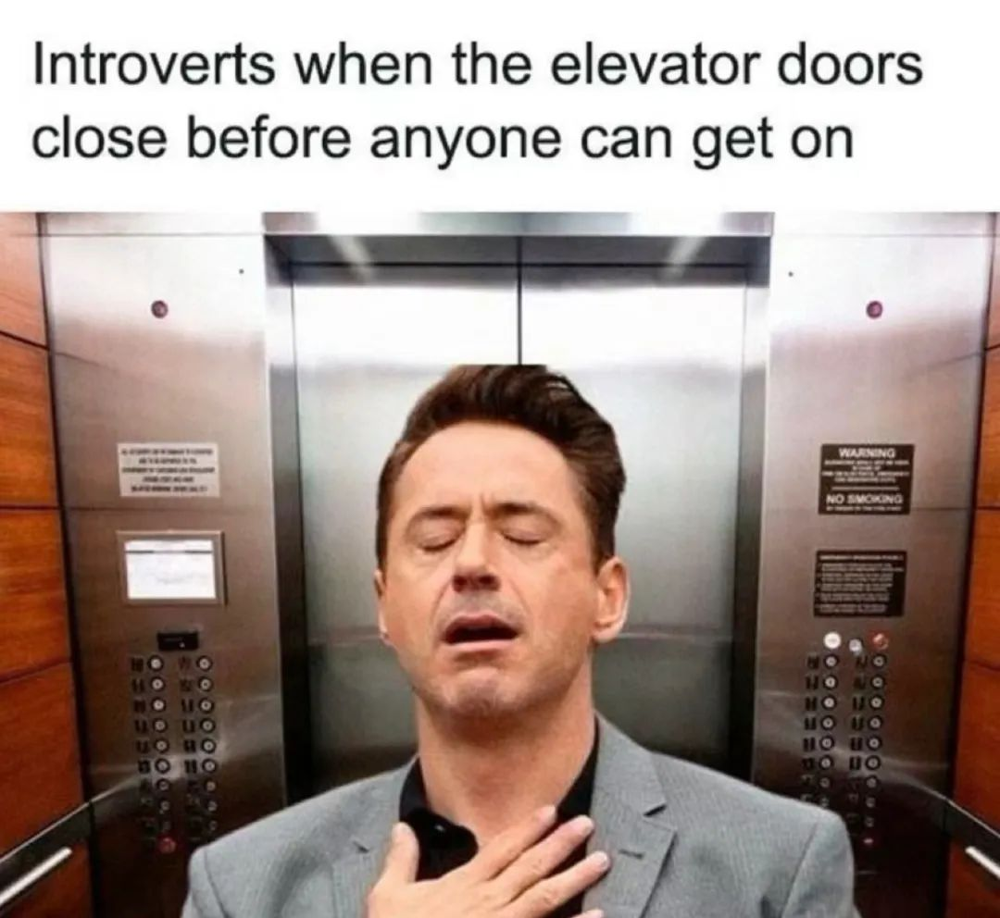

本文是张衔瑜第280篇推文

共计1176个字，2张图

早上去实验室。因为社恐的关系，通常我都在车尾的门前，戴着耳机把降噪开到最好。碰到一个四肢发的老哥，衬衣上的格子只有指甲盖大小，打在腰带外。一个口袋还不够悬到和肾小球等高的地方，看起来很像蒙着眼睛的腊肠狗。

下车的时候，腊肠狗一个歉身，飕飕跑出去。很少见到飕飕跑的人类了，就在几个地方点一点，然后飕飕过去。还好这几个点都戳得很重，如果说是传武轻功，那应该抽象了。

我习惯把没有做完想一会做的事放在微信置顶。现在这样的事越来越多了

有一个好朋友学期开始就说要来找我，结果现在还有一个月就期末了也没见人；有一个好朋友说国服上线了一款良心游戏，建议我没事的时候玩玩游戏放松心情。前几天「重返未来：1999」还没有上线。不知道现在上线没。

可是不管怎么样，也还是很难去玩吧。没问这是不是那种随时可以停下来的单机游戏。如果不是，那可能对我来说并不解压。

很凝重。颜渐汵是我的好朋友，间歇性厌食。也不知道牠说的是不是真的，因为太像了于是我给牠的第三人称描述都是牛字旁。

牠说如果吃饭的话，一定要以最快的速度吃完，意思就是最好一点拖沓都不要有。譬如在同一个档口的一盘饭，两荤一素，拿到桌前，坐下。如果已经鼓起勇气开始吃了，那就继续吃。可如果吃到一半，觉得耳机里的歌不对，于是打开播放器换一个歌单，事情就会变得很糟。

渐汵常常忘记自己有这个烦恼，因为也不是每次都出现。只是每次出现的时候都很要命，因为接下来的吃的，和此前吃的完全不一样。我说那你在新加坡可就完了，一些小糟糕被你这么敏感的体质给指数次幂放大可不得了。牠说对咯。

今天中午吃饭的时候还说起厌食症。彼时我因为太讨厌食堂里排队的人，于是在手机上下了单才去拿。这边人的饭量很小很小，像小鸟胃。本来想点两份放到一个盒子里，于是只买了一个盒子。

眼睛老花的食堂打饭人说已经装了两个盒子了。那我还要一个盒子干嘛？装骨灰吗？所以我说我跟这个地方的关系，属于没有什么缘分。交浅言深是不合理的行为谁都知道。有缘无分就是形容本来无一物但是强行涂些删改。

拿了两个盒子上楼，坐在电脑前看已经进入死水区的科研。尝试把两个盒子里的内容合并到一起。合并项里的一半被我失手到了出来。沙僧打翻了琉璃盏就被罚了下界。要哪天得了条骷髅头链子我就把它拿去当铺当了，然后换一条新的，没有被菜油污染的裤子。因为下午还得进细胞房呢等下细胞房直接孵化新的海南鸡出来。

下楼去校车站。车站有股我之前常吃的穆斯林餐的臭味。我心里一惊，这该不会是颜渐汵描述的那种感觉。当时我已经吃过晚饭，所以是不是脱险也未可知。属于不可得之经验。

等车的时候搜松弛感、慵懒，看了看之前那些汉服改良、新中国风关键词下买的东西，后来又把关键词改成了禅意、练功。这种没有标签只讲版式的穿搭我很喜欢。而且看起来松松垮垮的，就像我不喜欢被人猜到行踪一样地令体态变化也捉摸不定。

