本文是张衔瑜第281篇推文

共计1466个字，14张图

去年买的小礼品袋被束之高阁。少了很多需要送来送去的事，不知道是否等同于一种萎缩。是去年买的、又或从更久远的时候继承下来，已经说不清了。

花一下午在改符号化表达，改得人很疲劳。有些钱活该别人赚，那为什么活该我要受这个苦来找不痛快。当我不知道其他人水平的时候，让我们先假想他们都是抽象的、不具体的、载歌载舞的。我怨声载道。

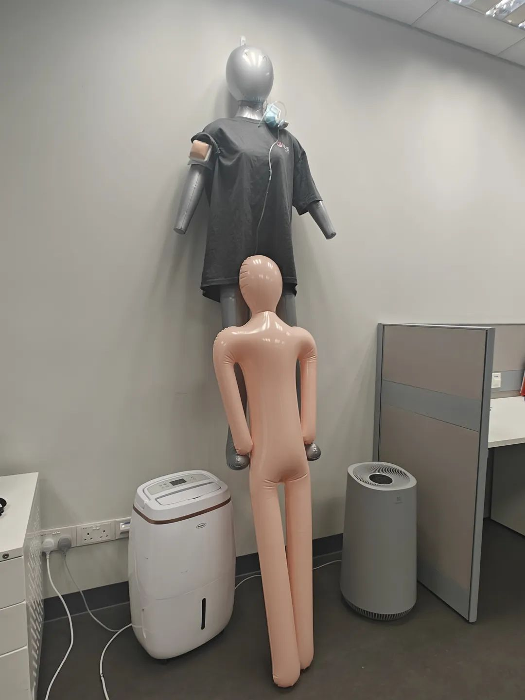

自己蒸的蟹好难吃，我觉得是品质问题。吐水了之后，还有泥在里面。蟹实在是太小了，以至于我只想熄灯就寝。

人瘫在豆袋里，脚扣在椅子上。颜渐汵问要不要下楼来跟华子。我看了下时间，又错过末班车了。

吃完了的韩国饼干桶，用来装了一些杂物：另一条耳机缠带、用来临时封装食物的夹子、备用的相机盖、耳塞棉。没有耳塞棉我几乎睡不着觉。没有眼罩也不行。这两个条件应该是能让我睡个好觉的要求里最容易满足的了。

去马来西亚骑全地形车ATV，穿过丛林、去看一片堰塞湖、去溯溪一条看不明白路的小溪。全地形的意思就是：什么地形都要来试一试。

丛林一眼望去，能看到一些丘陵的势。虽然不多，但比新加坡多出来了些生命力。最近在风水相关看人讨论山的稜线与藏风纳气的关系。虽然这一片也还是泯然众人，但骑车经过，总多了太多与自然接触的机会。严严实实地包裹在城市里可没意思。在办公室约莫是坐牢，尤其在周围在走下坡路的时候。

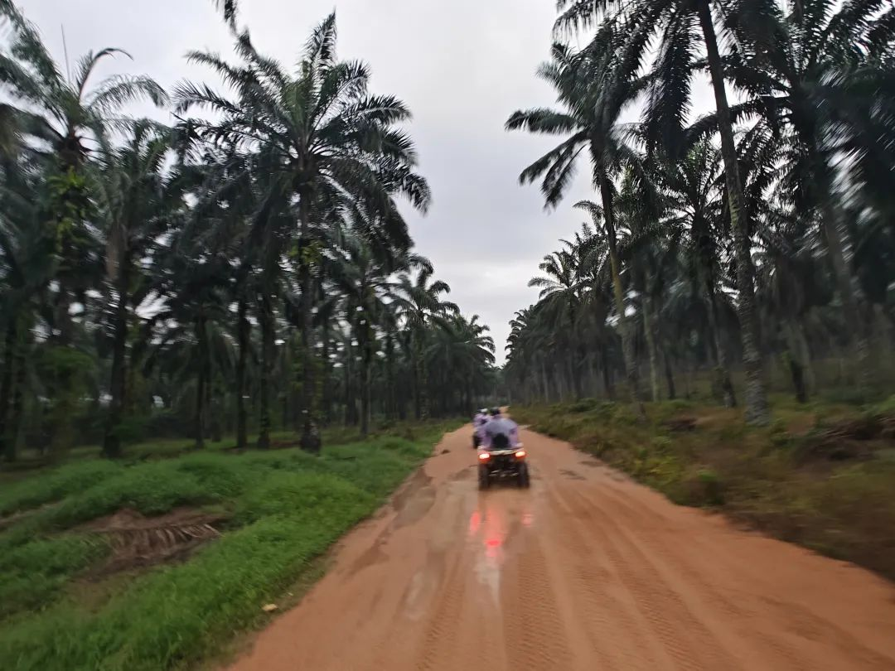

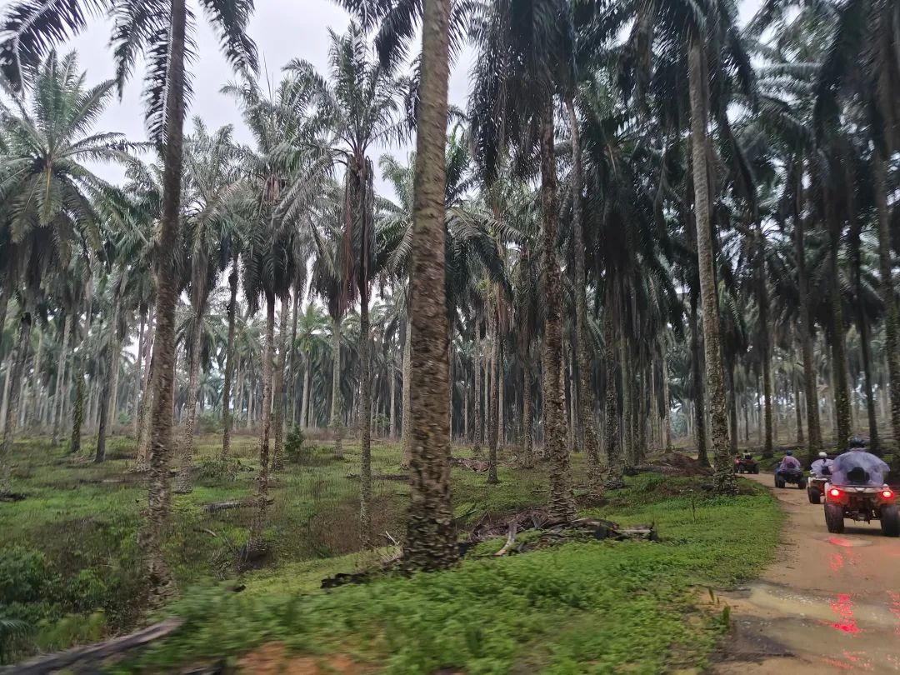

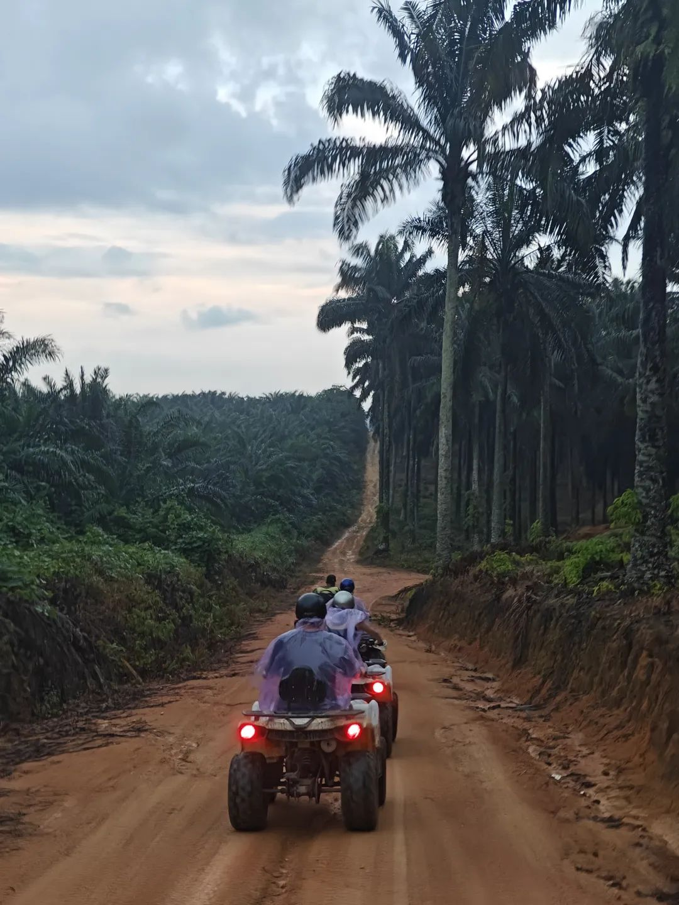

堰塞湖看起来是人工凿出来土方后，蓄积雨水而形成的一片。挖沙的设备还锚定在周围，向导带我们把车停到湖里，问要不要下去拍个照玩一下。

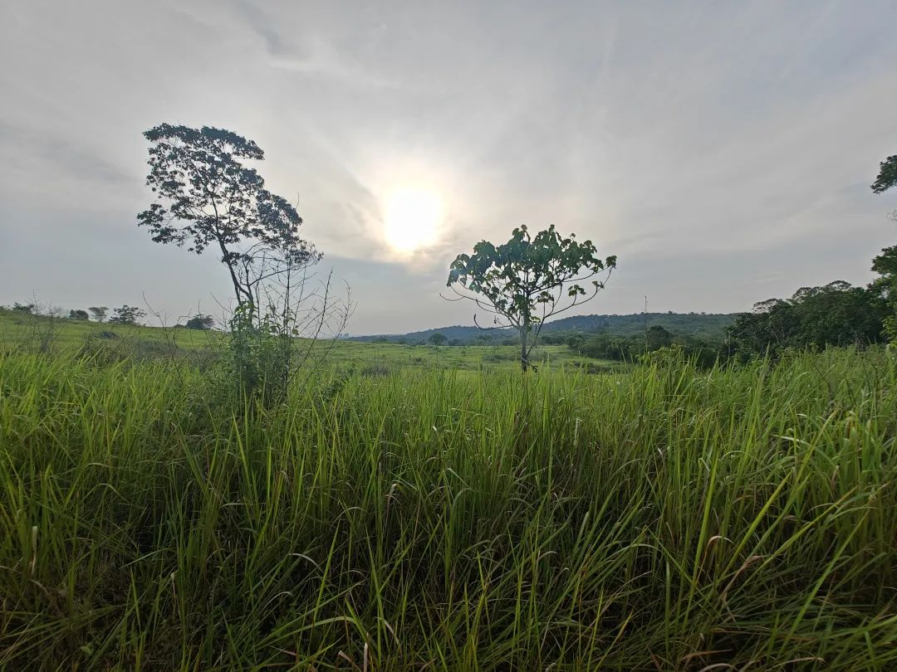

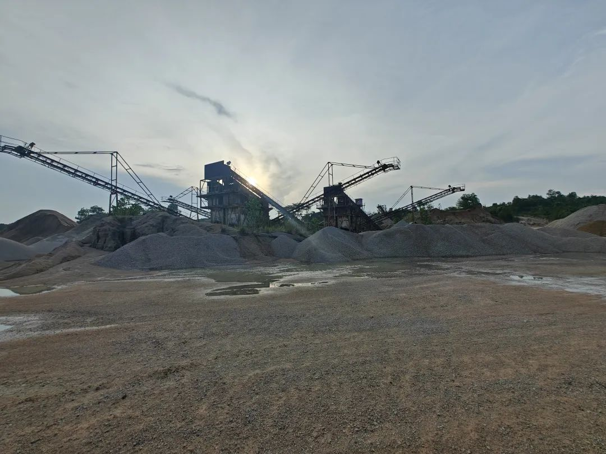

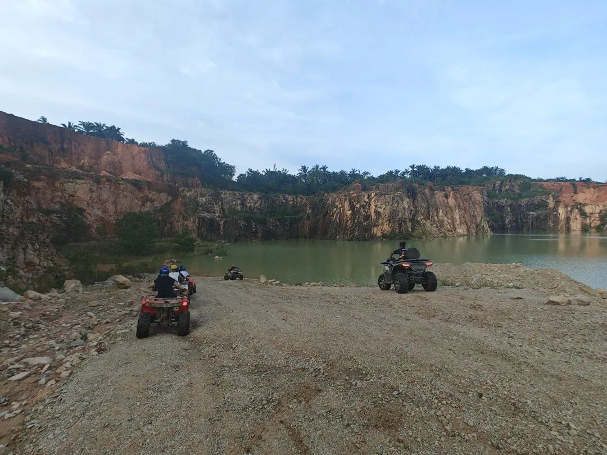

刚下过雨，地上是泥泞。清澈的河流在车驶入的刹那扬起泥尘，浑浊一片。引擎相继熄火，我在树下等待救援。

小蛇缘溪而来，我急忙点起引擎，想借引擎的热度让小蛇不再靠近。向导提着鞋子赤脚踩在小溪里走过来。我把脚继续放在车把上，向导让我别慌张，互为犄角的小蛇不一会儿就逃得不见了踪影。

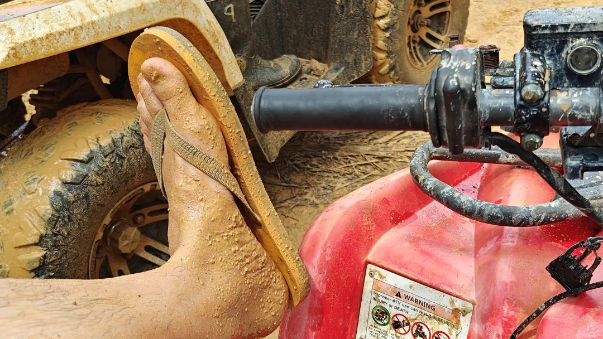

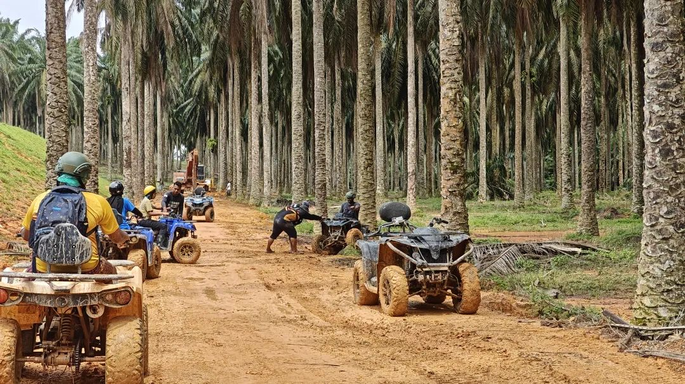

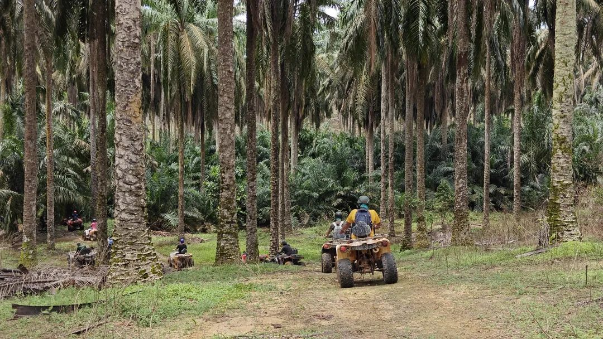

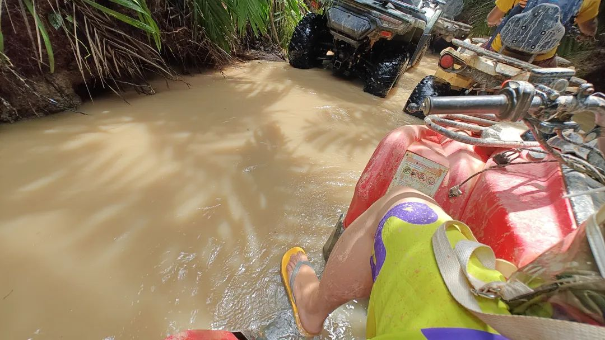

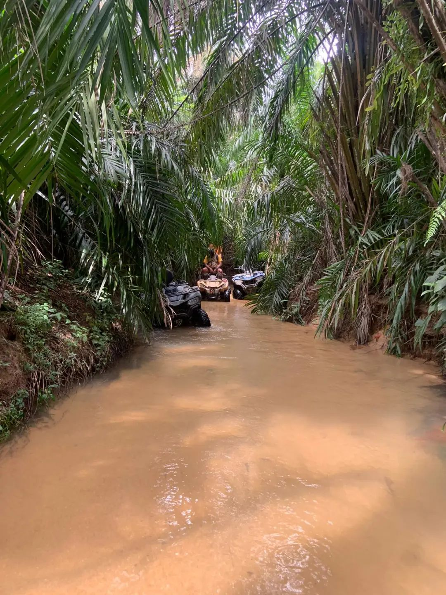

骑车的时候感觉风知我。因为和周围在说话。又不是自言自语，而是有来有回，该说不说。

想其他事情总是有趣。坐在工位上开始叹气，为所有的事而又也并不一定是为了什么事。反者道之动，弱者道之用。不会中文的朋友路过我的工位，用全部平声的调调说“物极必反”，想象一下就好比在说“乌鸡哔翻”，也不知道是从哪里学来的这句话。

前几天和人说，了解和运用不同的术数方法就好比数系的扩充。比如我现在运用的：命——紫微斗数、八字推命和皇极经世；相——阳宅地相、面相、手相；卜——六爻、梅花易数和小六壬。几种方式就好像从原本的世界认知中提炼出来不同的残篇。有的相对定态、有的相对细微，有的在验证特定事情的时候入木三分，有的像大杂烩 易学难精。

符号推动具体事情，特征工程能把这些事件通通带到具体情境中去。这就是为什么东边天阴、西边待雨。

想用符号运用来讲明白一件事，就很累。这就是为什么这周筹备一个仅仅是五到十分钟的PPT，也耗费了我良久时间的原因。

本科的时候，院长来教我们关于如何做学术报告的会议，大概原则是：你所需要准备的时间＝听报告的人数乘报告时长。比如你要讲一个小时，十个人来听，那你就得准备十个小时。对于下周这个报告的时间，即使我对学术报告已然十分熟练，也已经花了超过四倍预计的时间在这上面纠结。疲劳，还有更多的事情要准备。

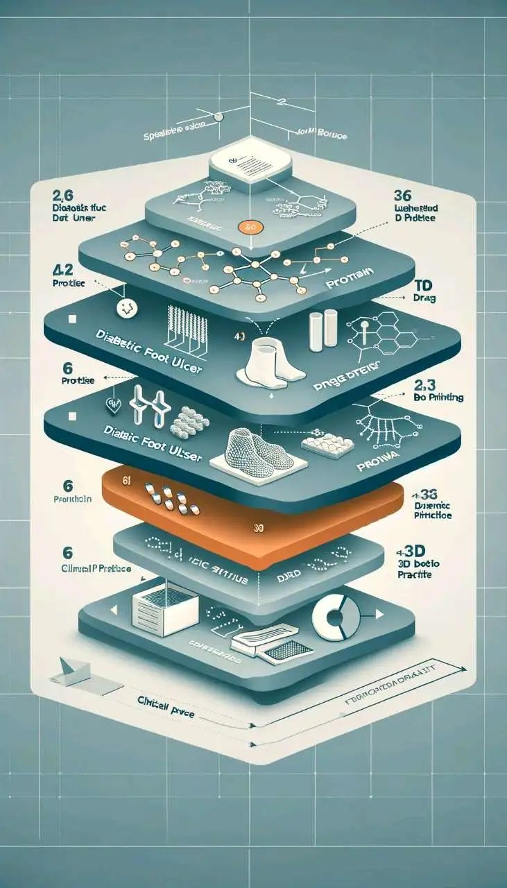

开始觉得事情都差不多。世界还不是个草台班子，在混乱中建立保守而又激进的秩序。

准备了两把扇子。就是那种穿大花袄会用的扇子，展开的时候会听到一声巨响，展开殷红。准备了一个杯子，是故宫文创出的那种会温变的杯子，只要温度一变化，外表就会有像雪落下的银装显现。

准备稳稳地睡觉。

希望吃到好吃的虎皮肘子拌饭。

准备把不友好的声音赶出去。

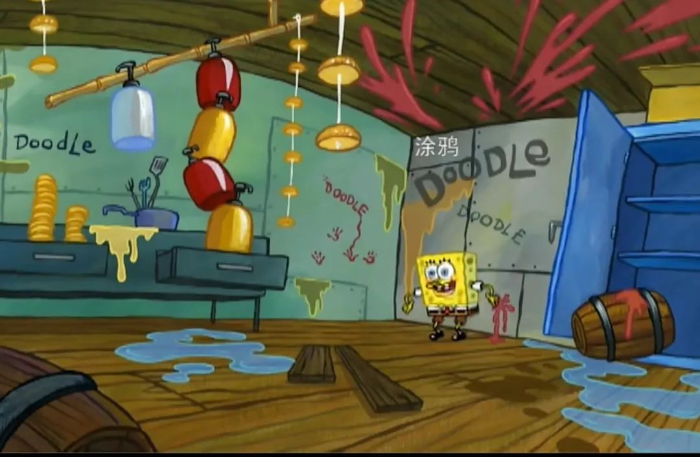
