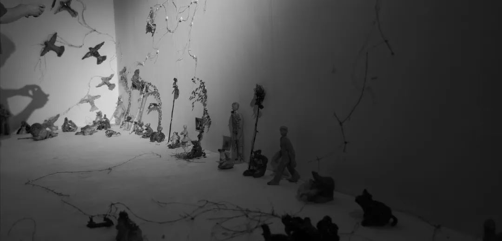

本文是张衔瑜第282篇推文

共计1620个字，1张图

盯鞋是我最近听的一个音乐流派。

好像本来没什么意思，维基百科的解释是因为这些乐团在现场演出时经常站着不动，全神贯注于在地上的效果器，貌似盯着他们的鞋子一样。Shoegaze, 评价摇滚好坏只取决于你当时想把他们说成好的抑或说成坏的。

热带的风逼得我每一寸神经都在内收，不能外放。因为外在的温度过高，所以构成不了令人舒适的温度梯度。

窗底下是通风口。我的窗帘从安装的那一天开始就是拉上的。每天醒来，看到窗帘透过的光，我都在想能不能变凉快一些，这里能不能有一点不同。今早做梦，梦到朋友穿着夹袄加绒的衣服 喊我一起去骑仿赛。朋友拿了张表给我，那上面的笔迹我也认识。打开窗下的通风口，极强的阳光对视杆细胞和视锥细胞一些冲击。今天又是毫无惊喜的夏天。

我问能不能有一段时候，感觉一下失温，就是那种需要活跃自己才能对抗的样子。我的机能已经习惯了。飞马牌汽车渴望行动，不期待停滞。

方才从梦中饿醒，一看表，才凌晨三点。房间里放不下的东西，就放到公共区域分享给别人。经常这么做：一来我并不依赖零食 当我看到它们的时候大部分愉悦已然达成，二来也的确放不下 大宗的买入需要很多人的力量才能消耗。

吃了一块虎皮蛋糕、四分之一罐已经开盖很久的原味可比克、中秋节留到现在的枣泥味月饼、两个小的镶嵌着葡萄干的沙琪玛、一小把三只松鼠的松子、一个食指长款的薄肉脯。几口冰镇的可乐。

可比克已经完全着水。我很不喜欢吃肉脯，所以像美珍香这样的牌子就只会被我一眼扫过去。吃完之后，打了几个喷嚏。过劳的副作用是一些努力避免带到生活里来而又非得依赖生活才能消解的烦恼，最终，导致生活也失衡了去。

看到一个朋友的动态，很久不联系了，以前也说不上是多么熟悉的人。想起当初是因为什么而认识。是一个古怪的朋友。

“liminal space”通常翻作“阈限空间”，指处于日常与非日常、熟悉与陌生边缘的环境，本应繁华却一片冷寂，给人带来强烈却又模糊的心理冲击，让人展开无尽想象与脑补……

比如大雾天的林间开放式缆车，浑黄的阴霾天空吞噬着缆绳入秘境，坐在手脚接触环境的缆车，却好像在固定的轨道里慢慢走向迷惘；

比如在深夜堤岸的走道上，一眼望去，望不到河床、望不到水面。静谧。路灯是沉在地上的，没错，就是那种在路肩上，从地面附近发出的光，只能照亮一小片扇形区域，相邻的灯之间并无照亮区域相交。路面铺着温馨的小石子，没有比自己更高的树木。

比如没有人的水族馆。动物也没有。墨绿渐青，巨大的水幕面前摆放着许多餐桌。光源来自海洋动物，人类像是仿生贻贝。没有贻贝，也没有人类。

比如复古的迪士高舞厅，璀璨的氛围灯给亮黑色反光瓷砖地面投影着网格。不知是干冰还是故意做成的效果雾还流连人们刚刚离去的混合香味。劣质皮凳破角的地方有人修补吗？和洗碗棉相同材质的内容物清晰可见。安全出口的绿色灯光明显但不刺眼。吧台边的铁质栅栏通往平素货物进出的仓储后台，那儿有台备用的混音器。

我知道好些这样的地方。倒不非得多闹鬼多吊诡，只是一些普通的生活场景，倒易之后，就变得让人熟悉而又陌生。好像质疑：我了解我平常熟悉的角落吗？新加坡的食阁，晚上摊贩收摊了之后是谁在进食？

写在我们出探榜单上的地方，有一个是长沙万家丽的九楼和十楼。万家丽本来就是一个透露着土豪与无聊审美的地方。九楼十楼本来是承担大型宴席，但常常因为没有人来而空无一人，与八楼及以下形成强烈反差。人们往往一上九楼就掉头下去，或者去了十一楼和更高。

很多homeless会在这里，不见得真的homeless，更多把这里当作一个角落来和自己相处。高架车辆川流不息，从落地窗看出去是我小时候常玩的地方，我有一百种方式从这儿去我的小学。灯光反差窗边破烂得绰约的靠背长椅，能猜到坐在那的人，心里的喟叹将息未息。

当代电影大师，这是一支乐队的名字。

少见多怪。

夕阳无限好。于是我向夕阳走过去。沿着夕阳的每一颗树上都要扯下来一片叶子，挠叶脉。也不是每一棵树都要扯，是上一片的叶脉摩完了 才扯下一片。

直到彼阳犹晚意，初升晓东西。
