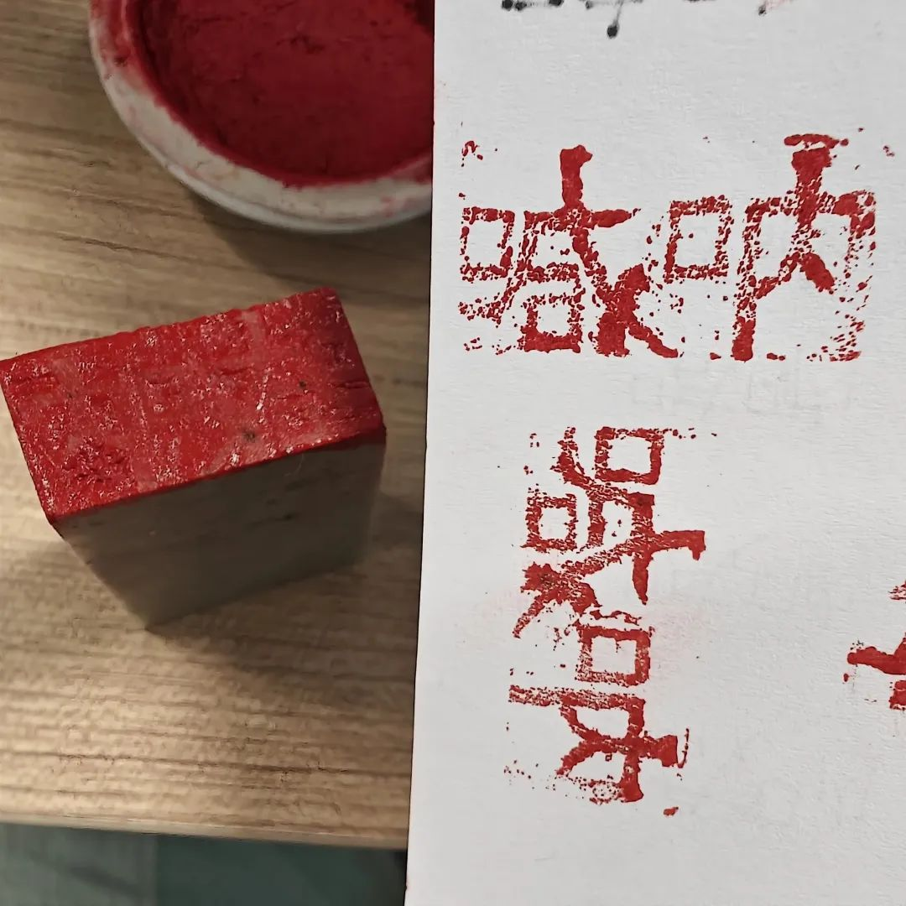
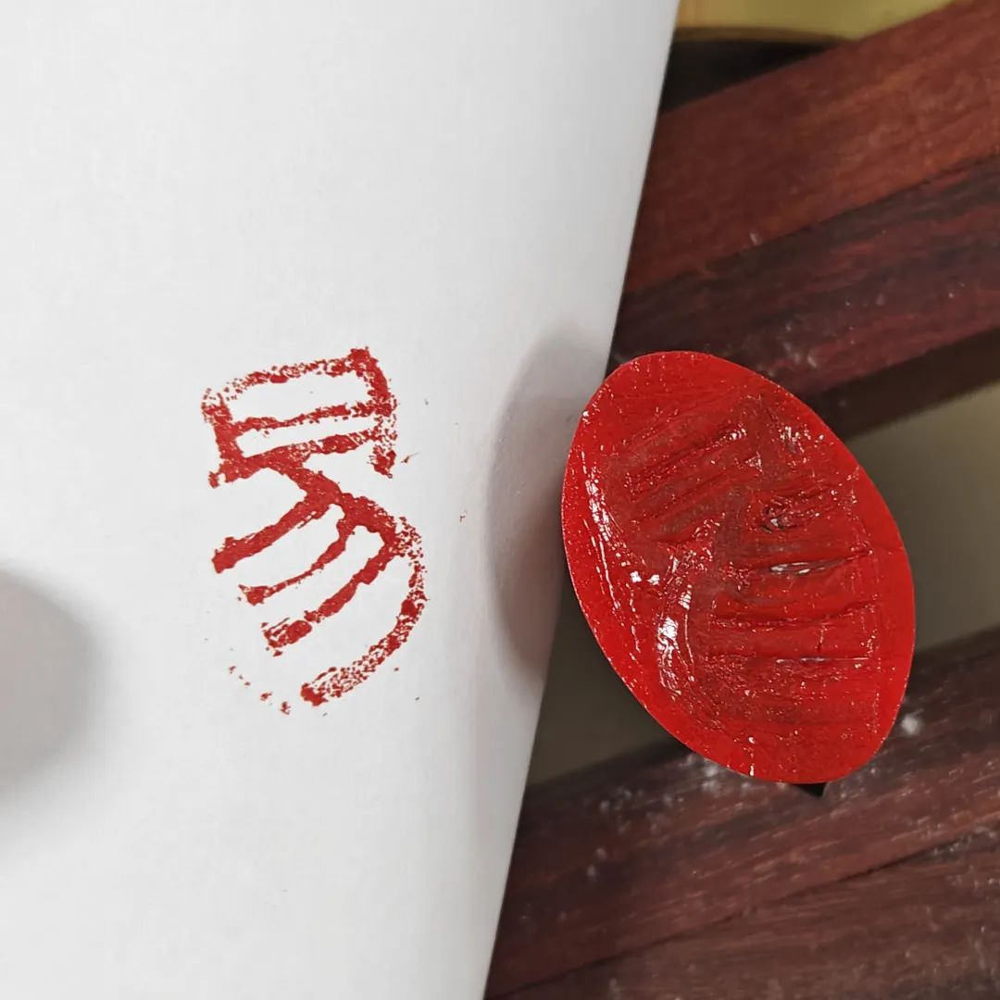
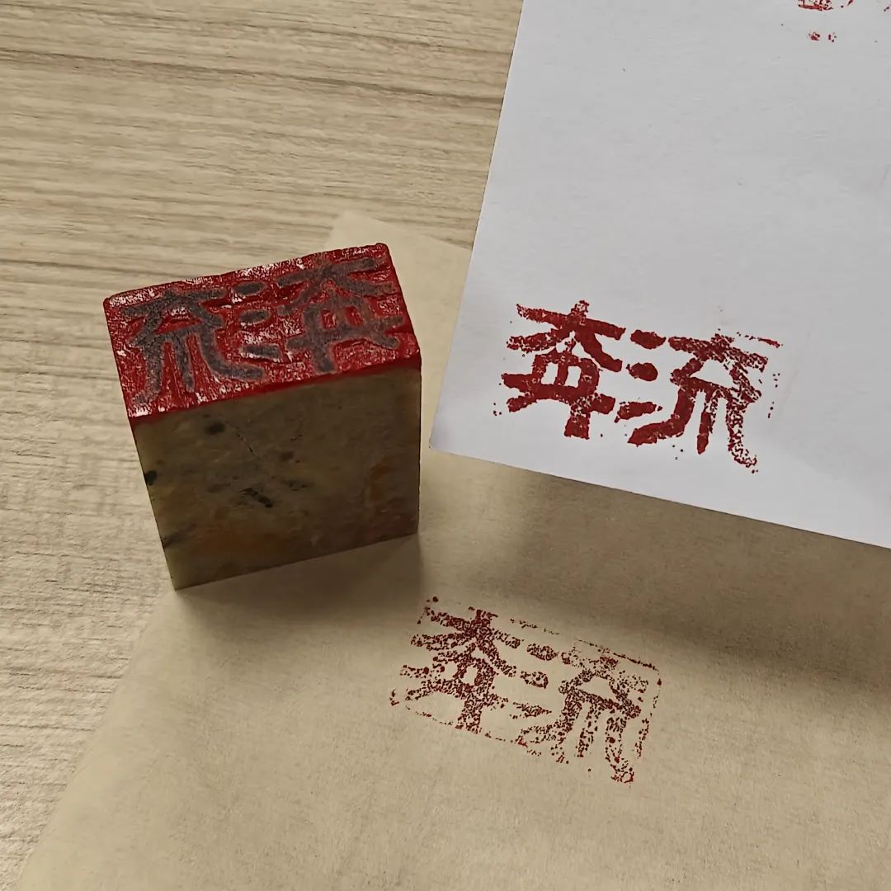
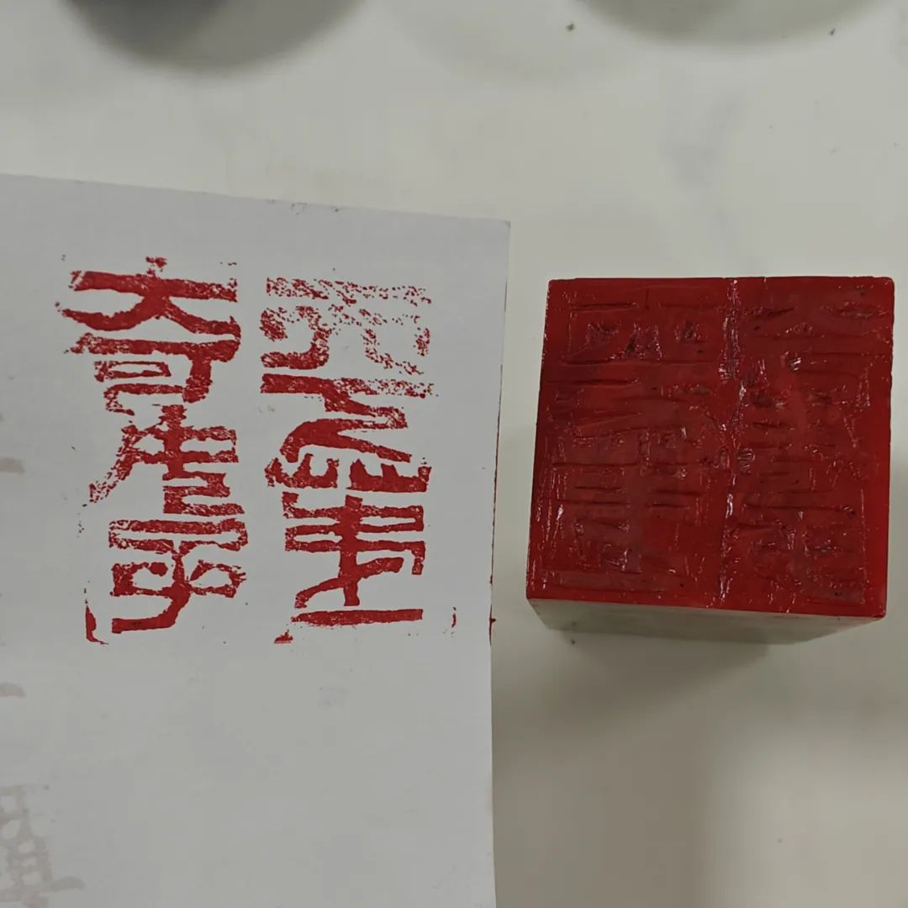
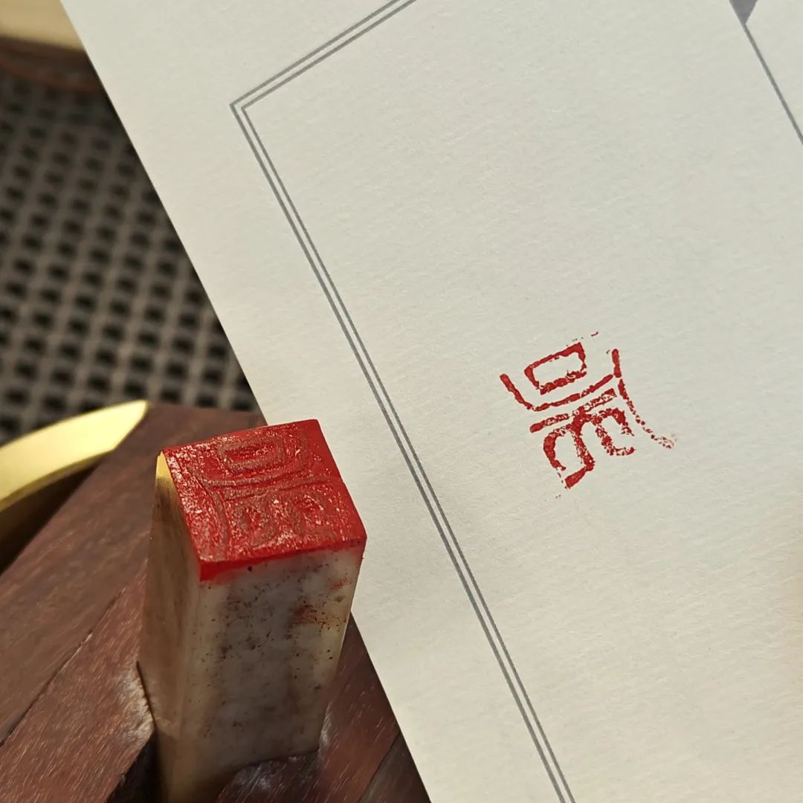
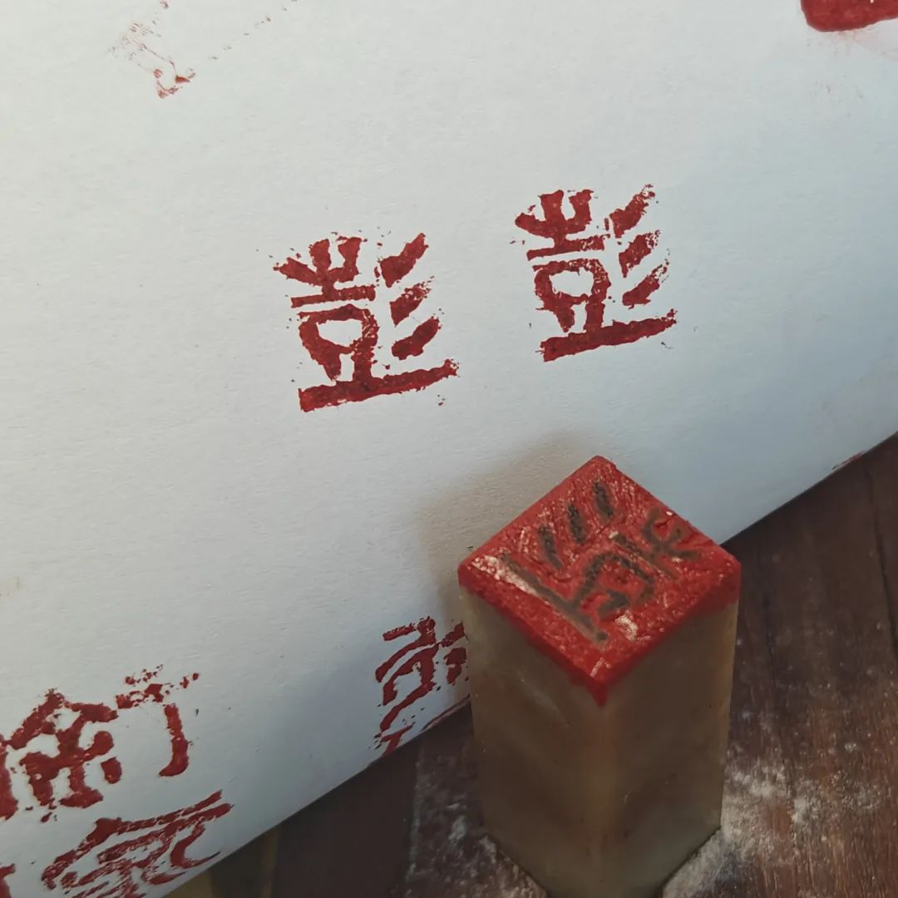
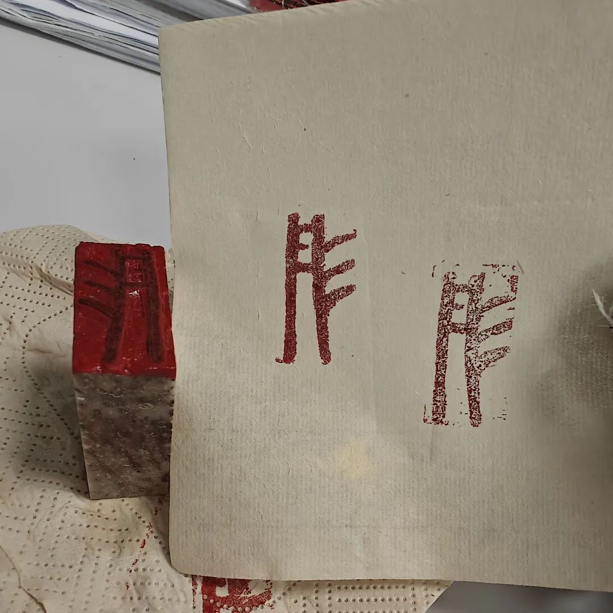

共计 2116 个字， 7 张图

搓坨子很多。我一直不太想把这叫成篆刻，总觉得文绉绉的样子和我吊儿郎当的劲头大相径庭。有朋友也叫雕石头。推敲一下就会发现雕也不太对，虽然有深度 深刻，但印面到纸纸面终于只是一种二维的视觉反演。剩下的所有，都来自于客体的加花，相去搓石头很远。所以我觉得雕也有点牵强，除非哪天我能来雕个龙。

况且，搓坨子又可以谐音“蹉跎”。一旦什么事情被我玩到谐音梗里，就很难放下了。最讨喜的东西就是谐音梗。

很久没写的原因，除了搓石头耗时间，其次就是懒得打字。每天写论文已经让我不想碰实体键盘了，即使这是个胭脂渐变的侧刻知夏轴。手机上打字的离谱在于，蹉跎子搓得中指第二指节起茧，而且大拇指指尖有些塌陷，感觉不得力了。昨天开始有带上指套保护一下。很多事情都像写公众号一样。

今天碰巧和人谈六神取占，我说不管哪种方法定义了什么物品的属性，本质上都有一个绝对偏见和相对偏见。绝对偏见是现在认为这个事物的属性，譬如我们说神位寺庙主金，但庙里诸佛又能分出个木火土金水，这是绝对偏见和相对偏见。

看问题越看越远。老年痴呆的表象之一：对越远的事情记得越清楚，对最近发生的事情却好像没有什么感知。我觉得这不能算作老年痴呆。有没有可能最近没有发生值得记下来的事情，或者很远的事情也只记得那么几件。只是因为一直在重复着回顾那几件事情，所以在记忆里加工，然后变得越来越鲜活。最近发生的事情都没能够经历这个过程，前面还有 Placeholder ，自然也就没法成为能记起来。

这样看起来，也未必见得评判老年痴呆有多合理。自诩的清醒明白和仅仅一种随波逐流的方式来证明能涌到浪花的前端，其中实在也还在拈花一瞬。

前天看说到那伽，心理承受能力一般的就不用去好奇心害死猫了。应当是一种在南传佛教里，在印度教、婆罗门教和佛教经典中都有出现。据说是佛证道的时候帮助撑开一片天的护法神。汉传佛教里把这和龙混同不分，应当说和国学传统文化的释义大相径庭。乍看之下我也被吓到了，不过又感觉没什么问题，毕竟只是一个外化的象。

很困很困。面对每天眼镜往前一探就会碰到的地铁挡板，觉得困得几乎没边。想起一些新吹的好笑言论，于是笑出了声。没想到有人骗术这么高，都能把自己骗得团团转。又或者见识只有那么一点点，一点点 好像一粒芝麻在干净的天空中，群鸟飞过都不见得啄食一点。

太困的时候站在地铁门旁边，地上的时候还好，地下的时候简直要命：深灰而又粗粝的墙面闪过踽踽小灯，如梦幻泡影、如露亦如电。困到比平常走路的步子慢一半。看沙雕笑话里，高速警察说：我们的监控显示，您驾驶的机动车超速一倍。驾驶员：那就 0.5 倍速看。我看我最近就像被拉了倍速。困到头掉。

做完一件事之后感觉需要停一下来恢复能量。手上刚加完培养皿的药，让我们什么也不做，先等一会儿。饿了，想起来应该要去吃一点。让我们先什么也不做，先拿张湿纸巾去把桌子擦一下。可以等很久。论文也没写吧，茶也没多喝。总会想了一下就泄气，完全不需要付出任何努力的回报才行之有效，可是那和彻头彻尾的笨蛋又有什么区别（玩笑）

本命年这一年搞了很多内容。从离开独立音乐和摄影开始，到开始搞玄学：山医命相卜，到开始搓坨子，到开始下围棋。又复习了一遍经络之后，开始给自己行艾灸。先大椎、后太冲、后安眠。昨晚刚刚做完大椎、又做了一会太冲、准备两个脚的太冲做完之后就行安眠来着，结果还没做完一个脚的太冲就睡着了。早上醒来，看到太冲穴上的艾灸盒已经摘下来好好地躺在了地上。

之前也发生过这种事。晚上贴眼贴了之后，明明我没有摘下来，直接睡着了。早上醒来连同眼贴的包装袋和眼贴的湿巾一起放在了床角上。梦游症要是能用在搞科研上就好了，那我天天睡觉。可是每次在实验室睡觉，又从来没见过屏幕上的论文多出来或者改好了几行，也没见代码用一种更具有运行效率的方式来部署。可能，梦游症对此也束手无策。

自己准备了一副方子：良品铺子的新疆大枣，在嘴里劈开、去核，和新会小青柑包裹着的云南普洱一起服用。柑普用 85 ℃的纯净水浸泡。月初运了三箱水到我的新房间里。虽然新加坡的自来水据说是按照饮用水的标准准备的，我也相信，但是管道又并不一定按照饮用水的标准在搭建。看看食阁吧，每次经过楼下的食阁其中之一，那个油麻令光的味道常常令我背过气去。八十岁了闻到这个味道我都能被气醒。

晚上看到公众号的年度回顾。没想到小破号现在也开始来搞这手。说 2023 年一共写了 8.3 万字。就想这得敲多少下键盘， 8.3 万字都快能攒出来一本轻小说了。

好像发展了很多爱好。倒也说不上多精通，但它们的确成为了我生活的一部分。更甚，除了写东西这种很显豁的之外，篆刻现在也成为了我用来说话的一种途径，所说的在每一个笔画的顿挫里。的确有些领会了什么叫做功夫在刀尖。有时候真的感觉用了全身的力气在戳。有时候在想怎么同一个批次里，这个就是受不了一点力。搓它就像在嘴里嚼橡皮。

尝试洗杯子。可有些茶渍还是洗不掉。记性好并不是什么好事。就像背课文。有的人你问一句话的上下文，结果说不出来。非得从第一句背到你问的这一句，才能说得出来。否则就说不出来。下次要买一些柠檬片回来。据说柠檬片洗茶渍咖啡渍都有效果。不知道干柠檬片行不行，还是必须得鲜柠檬片。下次去超市看到哪个买哪个。
